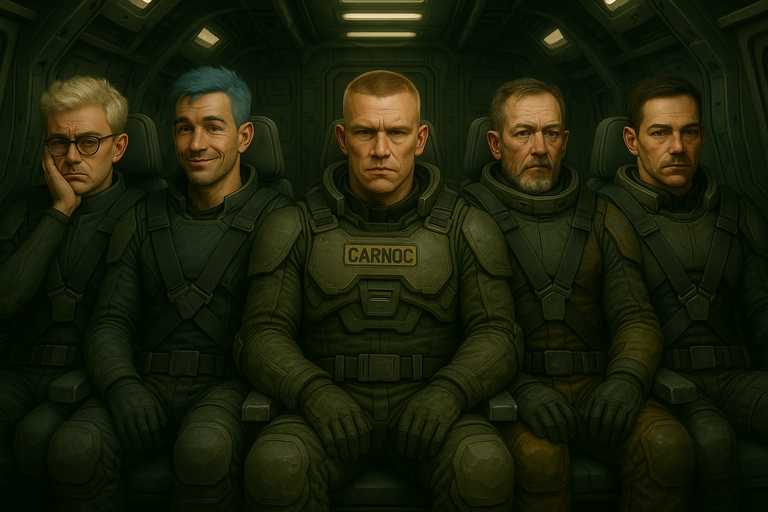

# {{ page.meta.module }}: {{ page.meta.title }}

We're all employed by "The Company".
They're trying to terraform the planet of [Samsa 6](../../../places/samsa-6/index.md), but discovered an alien species known as the [Carcinids (Carcs)](carcinids.md).
The ground team is not responding to communications.
We're going in to investigate.

<!-- more -->



- we're all employed by "The Company"
    - huge conglomerate of corporations
- we have our own reasons to be here
- we get paid but its meager
- will not be retiring any time soon
- paid extra for emergency and hazard
    - can make life more comfortable
- have to pay for air
- we've been in cryo sleep for a long time
    - who knows how long
- trying to terraform a planet
- sent a crew to investigate bio signals
- discovered a species of arthoropods
- 6 months ago communications stopped
- 3 weeks ago we entered the system and found the base unresponsive

<table markdown>
<tr markdown>
<td markdown></td>
<td markdown></td>
<td markdown></td>
</tr>
</table>
/// caption
[Carnoc](carnoc-ashbrow.md), [Dex](dex-miro.md), and [Zeke](zeke-sinclair.md) emerge from sleep pods
///

- we come out of cryo sleep and see a guy named [Moss](moss.md)
    - he carries the aroma of coffee and stale cigarrettes

/// caption
[Moss](moss.md), not the face you want to see coming out of cryo sleep
///

- we vomit from the combination of smells and coming out of cryo sleep
- [Moss](moss.md) gives us stimpacks
    - suggests injecting into our thighs, but necks if we're cool
    - everyone seems to feel better
- We get paid 2 months salary and 1 month of hazard pay
- Our equipment
    - 1 hazard suit
    - 1 SMG with 3 magazines
    - 1 first aid kit
    - 1 stim pack (1 dose per 24 hours)
- Rendezvous with Kaplan at Greta base
- Try to re-establish communications
- We must evacuate [Dr. Edem](dr-edem.md) and synthetic science officer Hintin
    - [Dr. Edem](dr-edem.md) is a xenobiologist
    - Hintin is here to assist with the study of the alien species
- Other personnel include:
    - 2 squads of marines
        - each has roughly 7 members with a captain and an overall sergeant
    - 4 scientists including Hintin
    - support staff, mechanics and engineers
- Found alien species [Carcinids (Carcs)](carcinids.md)
    - [Carcs](carcinids.md) are a little bigger than humans and crab-like
    - we ask about their technology
        - [Moss](moss.md) says they're a primitive civilization
- [Moss](moss.md) will remotely pilot the ship down
- The ship looks like it hasn't been inspected in decades
- [Murderbot](murderbot.md) runs diagnostics on the ship
    - There isn't any maintenance data in the logs

/// caption
[Murderbot](murderbot.md) inspects the ship
///

- An alarm starts going off and [Moss](moss.md) smacks the panel to turn it off
    - [Moss](moss.md): "Don't worry, it's just my daily self care alarm."
- [Murderbot](murderbot.md) walks the ship and evaluates it
    - it's a low cost model but it's operating within normal parameters
- we load up in the transport
- it has space for a personnel carrier but there isn't one
- there's also crew space close to the cockpit
- it's not comfortable but there is seating for 8 + 2 pilots
- we should strap in for atmospheric turbulence

/// caption
[Zeke](zeke-sinclair.md), [Ink](ink.md), [Carnoc](carnoc-ashbrow.md), [Dex](dex-miro.md), and [Murderbot](murderbot.md) strapped in
///

- ship glides down to the planet
- gets rocky when we hit the atmosphere
- transport starts shaking heavily
- alarms start going off
- [Murderbot](murderbot.md) unstraps to check out the alarms
    - turbulence bounces him off the ceiling

/// caption
[Murderbot](murderbot.md) bumps head on ceiling
///

- [Murderbot](murderbot.md) straps into captain's seat
    - jacks into the computer
- [Moss](moss.md) is not a great pilot
    - [Murderbot](murderbot.md) offers to take over
    - [Moss](moss.md) "I just lost control of the ship. What the fuck is going on?"
- [Moss](moss.md) doesn't want to talk to the synth.
    - [Murderbot](murderbot.md) says we'll all be unconscious because of his terrible piloting
- [Murderbot](murderbot.md) lands us safely.
- The doors open and we're hit with humid air
    - feels like a jungle
    - we're used to a controlled environment
- It's nice to be on a planet
- We're near a path to [Greta Base](greta-base.md)
    - we expect lighting but don't see any
    - about 1km away from the base
- [Carnoc](carnoc-ashbrow.md) and [Murderbot](murderbot.md) take point heading towards the base
    - the rest of us follow
- It's raining and it smells like a faint hint of sulphur

/// caption
Aerial view of [Greta Base](greta-base.md)
///

- One of the windows is lit
- [Carnoc](carnoc-ashbrow.md) goes to investigate
    - it's generally disorganized and there are some lewd posters
    - a few areas
        - 12 bunks
        - 5 bunks
        - tidy with a desk
        - 5 bunks and a marijuana plant
        - 1 bunk and weather charts
- We continue to walk the exterior of the base
- approach some garage doors
    - we hear some loud banging inside, but not on the door
    - keeps going but no distinct pattern
- continue surveying around the exterior

/// caption
[Carnoc](carnoc-ashbrow.md) finds a body wearing military fatigues
///

- [Murderbot](murderbot.md) rolls the body over and inspect it
    - he's split nearly in half
    - tries to hold it together while he examines it
    - several of the internal organs are missing
    - there are small cuts like papercuts all over the skin
    - he has dog tags with PFC Olsen
    - there's a keycard in his pocket
    - no idea how long he's been dead
- we see human tracks from the body to the garage doors
- [Carnoc](carnoc-ashbrow.md) grabs one of the dog tags
- we continue around to the front airlock
    - deep tread tracks lead to the door

/// caption
[Greta Base](greta-base.md) front door
///

- the airlock has room for 2 at a time
    - it's locked
- [Carnoc](carnoc-ashbrow.md) and [Murderbot](murderbot.md) use PFC Olsen's keycard to unlock the door
    - go down a small hallway
- everyone else enters
- the floors are muddy
- we see storage lockers in the hallway
    - they're pretty beat up

/// caption
Mess Hall
///

- opens up into a larger space, probably the mess hall (3)
    - we see a banner "Happy Birthday Olsen"
    - water leaking from the ceiling
    - dirty dishes and cups everywhere
    - bullet casings and bullet holes in the walls
    - blood spatters
    - claw marks
- we inspect a table, flipped over to use as a barricade
    - there's a headless corpse behind it
    - also in fatigues
    - hole in her neck
    - dog tags with LT Corporal Xavier

/// caption
[Murderbot](murderbot.md) declares cause of LT Corporal Xavier's death

"loss of head"
///

- small kitchenette with a bunch of cabinets
- also lockers, but they don't contain anything useful
- we hear the same banging sound from the garage again
- we decide to go past the crew quarters because it looked safe
- as we go to exit the room, LT Corporal Xavier's head rolls across the floor
- we open up the crew habitat area
    - banging sound is louder
- written on the wall "Comms off"
- areas for showers, toilets, and bunks
    - it doesn't smell great in here
- each bunk has a footlocker
- barracks has a list of essential personnel
    - matches what we expected from Moss
- inspect the tidy room
    - was Kaplan's room
    - picture of him, his partner, and children
    - planetary survey with resources and mineral deposits
    - desk drawer is locked
    - Ink opens the drawer, finds a revolver with 12 bullets, and takes it
    - tracking device
- more personal items
    - gaming console
    - the auctioneer by Joan Sampson
    - anime body pillow
- [Dr. Edem](dr-edem.md)'s quarters
    - charts showing a storm system approaching
- sealed envelope with Olsen's name on it
    - [Carnoc](carnoc-ashbrow.md) opens it
    - "Thanks for always listening. Hopefully they'll let me leave after this one." - [Dr. Edem](dr-edem.md)
- we open the foot lockers
    - 2 frag grenades
        - [Carnoc](carnoc-ashbrow.md) takes them
    - butterfly knife
        - Ink takes it
    - jump humpers porno mag
    - journal detailing relationship between HM3 Brookman and Ivonovik
- we pass a door marked "Armory" with a chain link gate
    - it had a blast door but it's been ripped off
    - there's a pile of melted metal in the middle of the room
    - doesn't seem like someone tried very hard to secure it
    - we can probably just lift it
- we continue to the garage
    - door is closed
    - still hear banging
    - it's another airlock, the garage is "outside"
    - [Carnoc](carnoc-ashbrow.md) and [Murderbot](murderbot.md) use Olsen's keycard
- in the garage
    - an APC on one side
    - other side is a giant hole in the ground
    - lots of tools
    - barrels of fuel for APC
    - generator which is not running
    - banging is coming from behind the APC

/// caption
Garage interior with a giant hole in the ground
///

- [Carnoc](carnoc-ashbrow.md) watches the banging
- [Murderbot](murderbot.md) investigates the hole
    - it's about 6 feet deep
    - some water at the base
    - a person wearing fatigues is in there digging with their hands
        - there's a shovel next them but they aren't using it
        - they have a bandolier of grenades

/// caption
Man digging in the hole
///

- [Murderbot](murderbot.md) talks to them but they don't hear us
- [Zeke](zeke-sinclair.md) takes a look at the digger

/// caption
[Zeke](zeke-sinclair.md) throws a clump of dirt to get the digger's attention
///

- the digger's body shakes
    - something erupts from his chest and splits him in two

/// caption
[Carcinid](carcinids.md) erupts from digging man
///

/// caption
[Zeke](zeke-sinclair.md) screams
///
