# {{ page.meta.module }}: {{ page.meta.title }}

The crew deal with a horrifying creature which erupted from a strangely behaving host body.
They find a number of bodies which look starved and scarred with papercuts.
Can they survive and figure out what's causing this infection?

<!-- more -->



## Escaping the Garage

- [Ink](ink.md) experiences an adrenaline rush when the alien shows up.
- [Ink](ink.md) tries to open the ATV's passenger door
- we see a man in a mechanic's outfit and a tinfoil hat banging on the ATV
    - he's holding a frag grenade in one hand and has already pulled the pin

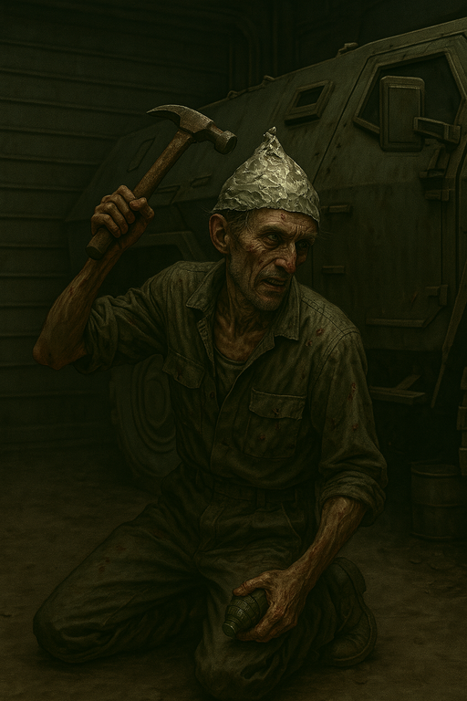
/// caption
Man with tinfoil hat and armed grenade
///

- [Zeke](zeke-sinclair.md) backs away

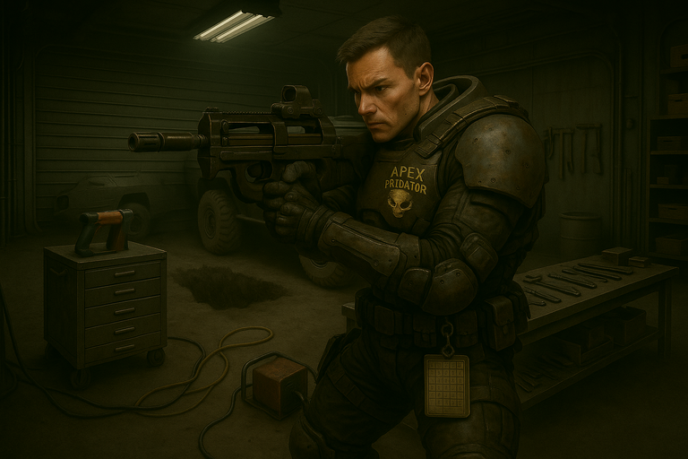
/// caption
[Murderbot](murderbot.md) fires at the creature
///

- [Murderbot](murderbot.md) shoots at the creature
    - unloads a whole SMG
    - bullets impact on its carapace but don't seem to do much

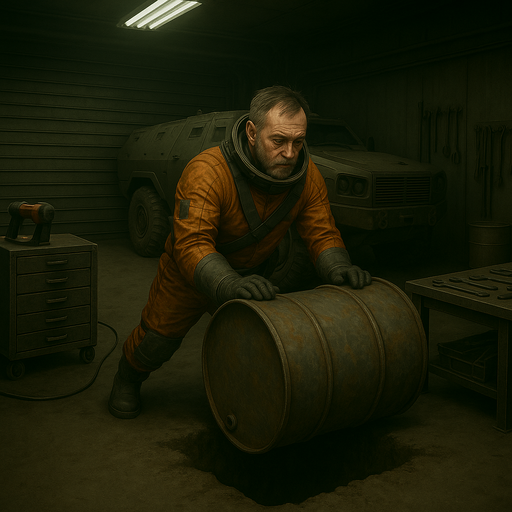
/// caption
[Dex](dex-miro.md) rolls a fuel barrel into the hole
///

- [Dex](dex-miro.md) uncaps one of the fuel barrels, pushes it over and rolls it into the hole
    - it hits the opposite side of the hole and lands on the creature
- [Carnoc](carnoc-ashbrow.md) grabs the fallen power line, pulls some slack, and tosses it to [Murderbot](murderbot.md)
    - [Murderbot](murderbot.md) grabs the line and they both pull
- [Murderbot](murderbot.md): It's illogical for us to think we can kill this creature
    - "We must leave this room at once"

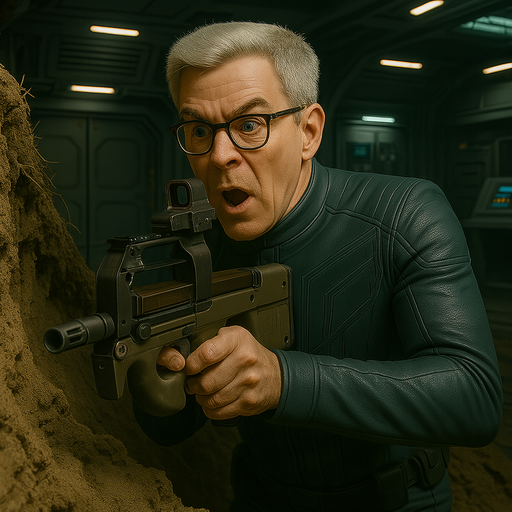
/// caption
[Zeke](zeke-sinclair.md) about to fire SMG at the creature
///

- [Zeke](zeke-sinclair.md) tries to use his SMG but drops it after firing the clip and doesn't go back for it
- creature swings one of its claws at [Dex](dex-miro.md) - `15` damage
    - [Dex](dex-miro.md) is winded (disadvantage) until he catches his breath

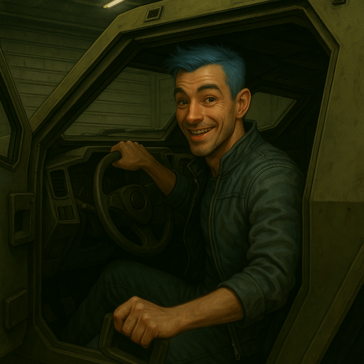
/// caption
[Ink](ink.md) in the APC driver's seat
///

- [Ink](ink.md) finds the keys and starts the APC
    - the mechanic banging on the side starts to panic

- APC specifications
    - vacuum-rated
    - grenade launcher
    - machine gun
    - light mortar
    - communications console

- [Murderbot](murderbot.md) grabs [Dex](dex-miro.md) and throws him in the back of the APC
    - [Dex](dex-miro.md) catches his breath
    - [Murderbot](murderbot.md) goes after the machine gun turret
- [Zeke](zeke-sinclair.md) climbs into the APC
- [Carnoc](carnoc-ashbrow.md) climbs into the APC and closes the door

- creature makes a dent in the side of the APC

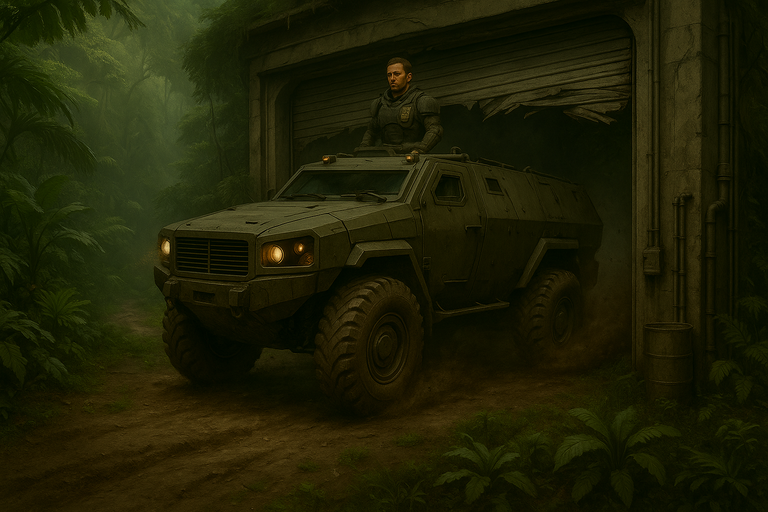
/// caption
APC smashes out of the [Greta Base](greta-base.md) garage
///

- [Ink](ink.md) drives at the door and the APC crashes through

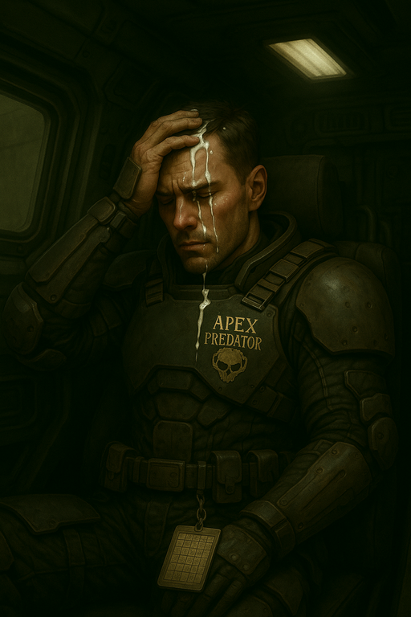
/// caption
A wounded [Murderbot](murderbot.md), inside the APC
///

- [Murderbot](murderbot.md) doesn't duck in time
    - gets sliced by the garage door shards
    - white fluid starts shooting out
    - [Zeke](zeke-sinclair.md) helps [Murderbot](murderbot.md) stitch himself up
- [Dex](dex-miro.md) aims the mortar at the hole in the garage
    - it lands on the opposite side of the garage and destroys another part of the base

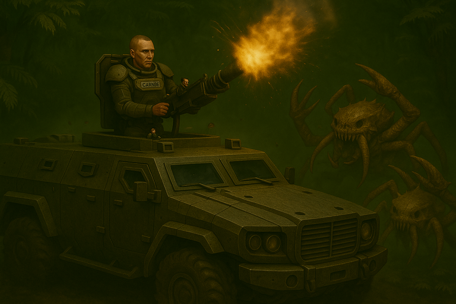
/// caption
[Carnoc](carnoc-ashbrow.md) fires the APC mortar at the creature in the [Greta Base](greta-base.md) garage
///

- [Carnoc](carnoc-ashbrow.md) pushes [Dex](dex-miro.md) aside and fires a mortar
    - hits the alien
    - the grenades from the digger's belt go off
    - the foil hat's grenade goes off
    - the fuel ignites
    - flames everywhere
- [Dex](dex-miro.md) blew up (5)

## Exploring Greta Base

- [Ink](ink.md) drives around the other side of [Greta Base](greta-base.md)
- we go in through the airlock
- storage lockers have dents and claw marks
    - 1 hazard suit
    - 2 pulse rifle magazines
    - 1 rosary
- [Zeke](zeke-sinclair.md), [Carnoc](carnoc-ashbrow.md), and [Murderbot](murderbot.md) go to (4)
    - lots of shelves stocked with food

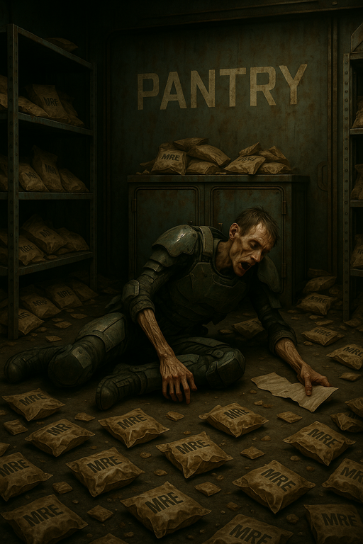
/// caption
2nd LT Lange's body in [Greta Base](greta-base.md) Pantry
///

- body with cuts all over
    - tags say 2nd LT Lange
    - may have died of starvation
- next room (5) was probably cold storage
    - glass is cracked
    - body inside wearing fatigues
        - can't tell if they died from the explosion or other causes
    - near the body, there is a metal case
    - fire is spreading

### Cold Storage - Metal Case

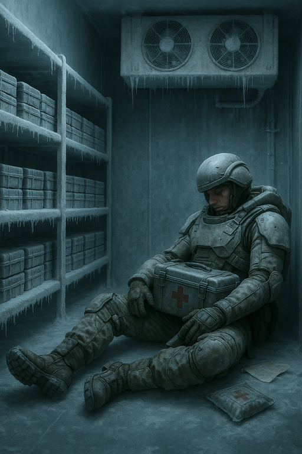
/// caption
Lance Corporal Resnick's body in [Greta Base](greta-base.md) Cold Storage
///

- [Carnoc](carnoc-ashbrow.md) runs into the cold storage room (5)
    - grabs dog tags from the body, Lance Corporal Resnick
    - grabs metal case
    - slips on some liquid
        - acid begins to eat away at [Carnoc](carnoc-ashbrow.md)'s armor
- [Ink](ink.md) and [Dex](dex-miro.md) go to (9)
    - looks like primary communications station
    - marine slumped over controls
    - [Ink](ink.md) and [Dex](dex-miro.md) enter

### Communications - Org Chart

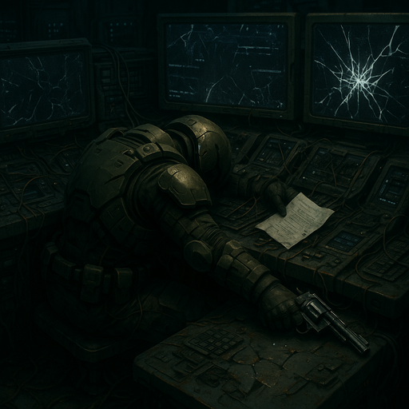
/// caption
2nd LT Kaplan's body in [Greta Base](greta-base.md) Communications
///

- inspect the marine's body
    - revolver in one hand
    - paper cuts on face and hand
    - hole in his head from revolver blast
    - [Ink](ink.md) takes paper from marine's other hand
        - org chart of ground team shows `23` people
    - tags show 2nd LT Kaplan

### Observation Analysis Lab - Logbook

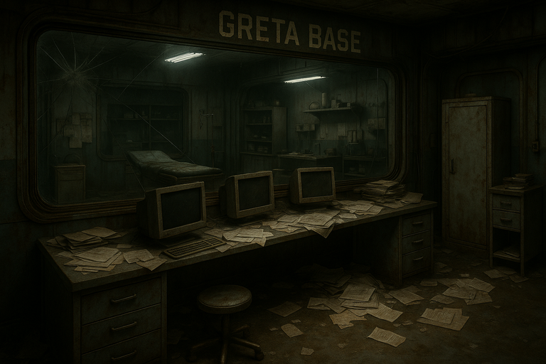
/// caption
[Greta Base](greta-base.md) Observation Analysis Lab
///

- [Ink](ink.md) and [Dex](dex-miro.md) go to (8)
    - observation analysis lab
    - computer terminals are powered down
    - operating area has been destroyed
        - remanants of equipment are smashed and fused together with alien webbing
    - [Dex](dex-miro.md) looks at log book with notes from Dr. Edem
        - discovery of the crab song (krebsleider)
        - something to do with replication
        - keep it for later
- [Dex](dex-miro.md) reads logbook
    - [Dr. Edem](dr-edem.md) grudgingly admits Tintin was reponsible for some discoveries
    - of course, only [Dr. Edem](dr-edem.md) could produce the overall theory

## On the road to Terraforming Base

- we climb back into the APC
    - drive towards the terraforming station

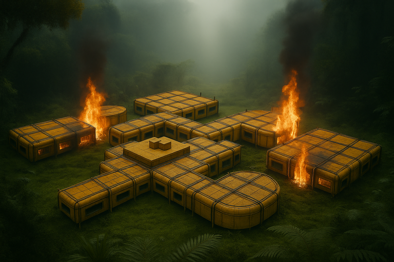
/// caption
[Greta Base](greta-base.md) in flames
///

- road is a bit washed out from the rain
    - road is unpaved and there are some trees down
- driving for 20 minutes
- we crest a hill and see some red lights in the distance
- something slams into the side of the APC

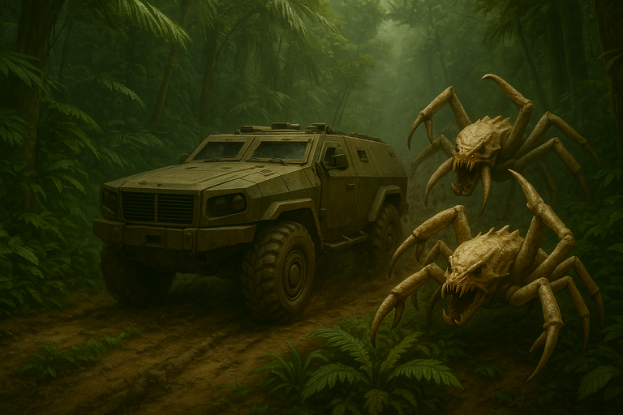
/// caption
[Carcs](carcinids.md) attack the APC
///

- 2 [Carcs](carcinids.md) are trying to batter their way in
    - they put another dent in the side
- [Ink](ink.md) speeds up
    - puts some distance between us and the [Carcs](carcinids.md)
- [Carnoc](carnoc-ashbrow.md) shoots the mortar
    - between the rain the slick road, the mortars keep missing the [Carcs](carcinids.md)
    - in the light of the blast, we see there's about 10 of them now
    - [Carnoc](carnoc-ashbrow.md): "I'm out, floor it!"
- [Ink](ink.md) keeps driving
    - emerges into a clearing

/// caption
Aerial view of [Terraforming Base](terraforming-base.md)
///

- terraforming station is on a dam
    - trail comes up along the side of the river to a door into the base

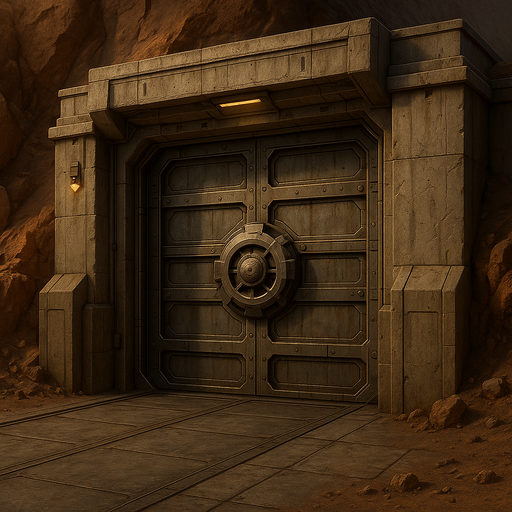
/// caption
[Terraforming Base](terraforming-base.md) vehicle door
///

- vehicle door is closed
    - human sized door is next to it
    - both look more armored than at [Greta Base](greta-base.md)

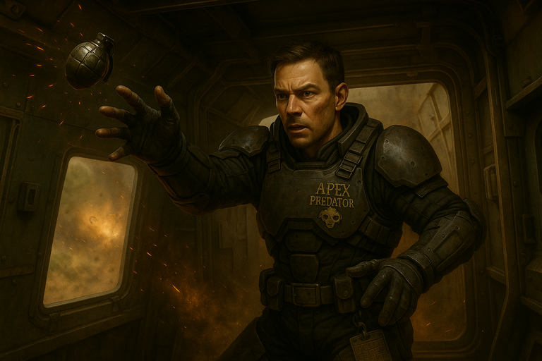
/// caption
[Murderbot](murderbot.md) throws a grag grenade out the back of the APC
///

- [Murderbot](murderbot.md) throws a frag grenade just in front of the [Carcs](carcinids.md)
    - opens the back door
    - drops a grenade out the back
    - closes the door
    - grenade puts another dent in the APC's armor and damages one of the tires

## Arriving at Terraforming Base

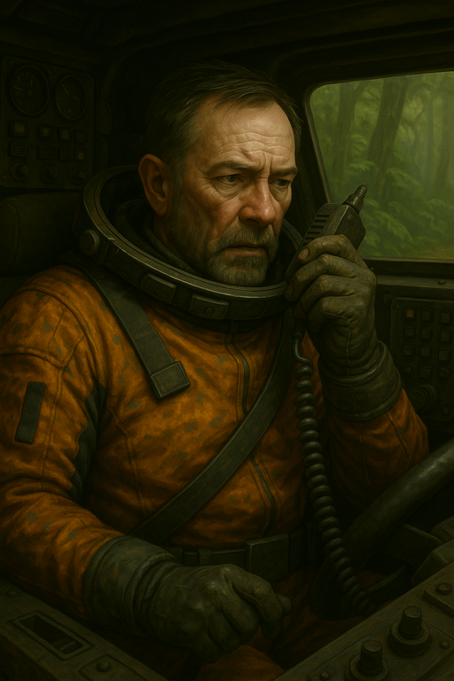
/// caption
[Dex](dex-miro.md) radios the [Terraforming Base](terraforming-base.md)
///

- as we approach, [Dex](dex-miro.md) tries to raise the base on comms
    - [Dex](dex-miro.md): "Can you open the garage for us"
    - base: "Are any of you infected?"
    - [Dex](dex-miro.md): "Infected?"
    - [Zeke](zeke-sinclair.md): "No!"
    - [Dex](dex-miro.md): "No"
    - base: "No weapons allowed"
    - [Dex](dex-miro.md): "Ok, just close the garage as soon as we're inside"

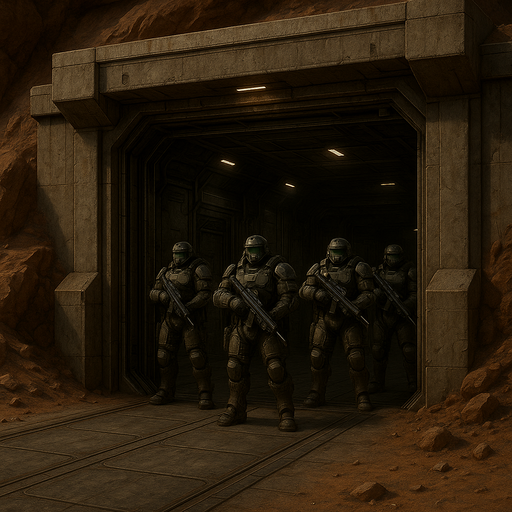
/// caption
Marines guard the [Terraforming Base](terraforming-base.md) vehicle door
///

- [Ink](ink.md) pulls up to the door
- we pull in and the doors close

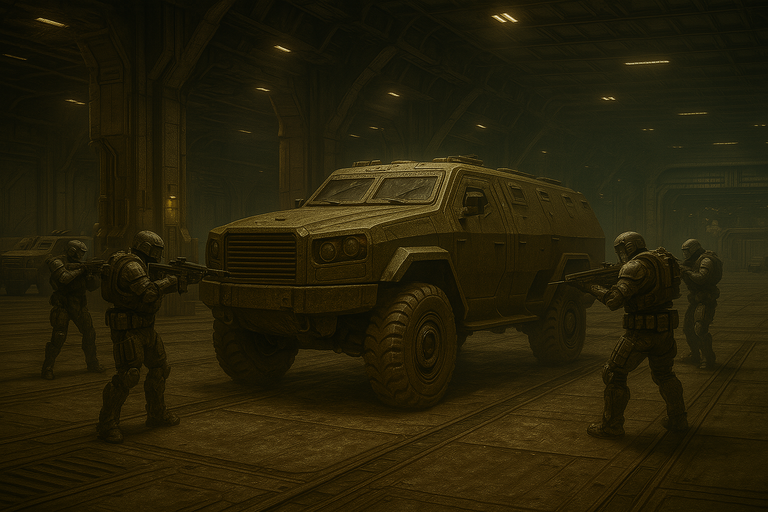
/// caption
Marines surround the APC
///

- marine: "Exit the vehicle. No weapons, or we'll mow you down."
- we leave our weapons in the APC and exit

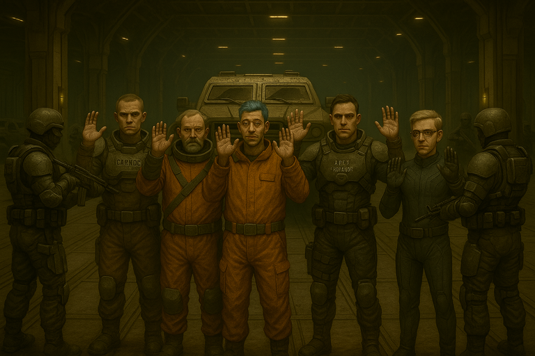
/// caption
Crew submits to an inspection
///

- marine: "Doc, check them for infection."
- Doc takes a glance at us and says "No signs of infection."
- marine: "Get your weapons and gear and come talk to me."

## Meeting the Leaders

/// caption
[Sergeant Valdez](valdez.md)
///

/// caption
[Dr. Edem](dr-edem.md)
///

/// caption
[HM3 Brookman](brookman.md)
///

- we talk to 3 leaders
    - female marine is [Sergeant Valdez](valdez.md)
        - promoted to commander due to losses
    - Doc is [Dr. Edem](dr-edem.md)
    - [Brookman](brookman.md) is the platoon medic
        - says we need to get out of here
        - others seem to disagree
- 9 people total
- our dropship can carry 14
- [Ink](ink.md) asks about Hinton
    - [Dr. Edem](dr-edem.md): we don't know what happened to Hinton
    - [Sergeant Valdez](valdez.md): Hinton and Jenson went to check on the reactor
    - if the reactor stops working, the dam will fail and the [Carcs](carcinids.md) will get us
- [Carnoc](carnoc-ashbrow.md) asks about how to detect infection
    - look for papercuts all over
    - after that, body seems to disconnect from the mind
    - odd manual labor behaviors such as digging
- [Zeke](zeke-sinclair.md) asks how the infection happens
    - [Dr. Edem](dr-edem.md): From a sound
    - [Zeke](zeke-sinclair.md): That's bad
    - [Dr. Edem](dr-edem.md): Yes, but I'm working on a cure
- [Dr. Edem](dr-edem.md) wants us to obtain their notes from the research clean room, one floor down
    - [Sergeant Valdez](valdez.md) declared the area off limits
- [Carnoc](carnoc-ashbrow.md) shows Lange's tags to [Sergeant Valdez](valdez.md)
    - [Sergeant Valdez](valdez.md): "That was our pilot..."
    - [Sergeant Valdez](valdez.md): "We're never getting off this rock."
- we ask about other vehicles
    - there are 3 ATVs, one is broken
    - each has a machine gun mount
- if we get the communications tower back up, we could fly our drop ship over
    - tower is on the opposite side of the dam
    - about 1/4 mile
    - [Sergeant Valdez](valdez.md) says no one would make it there
    - [Carcs](carcinids.md) can swim and we've seen them in the water by the dam
- people look tired but hopeful
    - sandbags to reinforce walls
    - armor stockpiles
- [Carnoc](carnoc-ashbrow.md) asks for spare battle dress
    - [Sergeant Valdez](valdez.md) will loan one if we check on Hinton and Jenson
- [Sergeant Valdez](valdez.md) agrees to loan us some military support
    - [Sergeant Yang](yang.md) is a grizzled veteran
    - [Corporal Novikov](novikov.md) is overly excited after sitting in the base doing nothing

/// caption
[Sergeant Yang](yang.md)
///

/// caption
[Corporal Novikov](novikov.md)
///

- [Sergeant Valdez](valdez.md) will have engineer Sobol fix up the APC
    - was working on the busted ATV, but APC has more capacity
- a planetologist Dr. Kawaguchi approaches
    - willing to help us recover [Dr. Edem](dr-edem.md)'s research
- we open the metal case from [Greta Base](greta-base.md)
    - lets out a small hiss of frosty vapor
    - 25 liters of liquid with medical symbols
    - chemo-theraputic agents used to treat extreme radiation
    - [Dr. Edem](dr-edem.md) says this will be helpful for curing the [Carc](carcinids.md) infection
    - could also help with radiation from the reactor
        - note: synths also suffer from radiation

## What's Next?

1. Go to the reactor to find out what happened to Hinton and Jenson
    - if the reactor stops working, the dam will fail and the [Carcs](carcinids.md) will get us
2. Take Dr. Kawaguchi to identify and recover [Dr. Edem](dr-edem.md)'s research
    - essential to continue work on curing the infection
3. Restore communications so we can all get out of here
    - 1/4 mile trip across the dam on 2 ATVs, with [Carcs](carcinids.md) in the water
