# {{ page.meta.module }}: {{ page.meta.title }}

The crew review the [Org Chart](samsa-6-org-chart.md) and recall how many were killed by the [Carcs](carcinids.md).
They attempt to repair the reactor and rescue marines inside, but are interrupted by a [Carc](carcinids.md).
[Zeke](zeke-sinclair.md), [Carnoc](carnoc-ashbrow.md), and [Dex](dex-miro.md) escort [Dr. Edem](dr-edem.md) to the lab to recover their research.
[Dr. Edem](dr-edem.md) describes their research on the [Carc](carcinids.md).
[Carnoc](carnoc-ashbrow.md) and [Valdez](valdez.md) have a heated argument over how to evacuate.
[Ink](ink.md) and [Murderbot](murderbot.md) investigate a horrifying organic tunnel, finding some acidic gas and the body of another marine.

<!-- more -->



## Reactor

### Rappelling Down

- we need to rappel down
- everyone puts on hazard suits
- [Valdez](valdez.md) offers us pulse rifles
    - [Dex](dex-miro.md) says he hasn't used one before
    - [Novikov](novikov.md) gives him a quick crash course
- there are 2 ropes down the elevator shaft
    - each rope can support up to 4 people
    - it's pretty dark
- [Yang](yang.md) grabs a rope and rappels down
    - we follow
- we descend with lights, looking around
- halfway down, we pass a hatch
    - [Ink](ink.md): "Where does that go?"
    - [Yang](yang.md): "Dam spillway"
- we continue to the bottom
- radiation level has increased

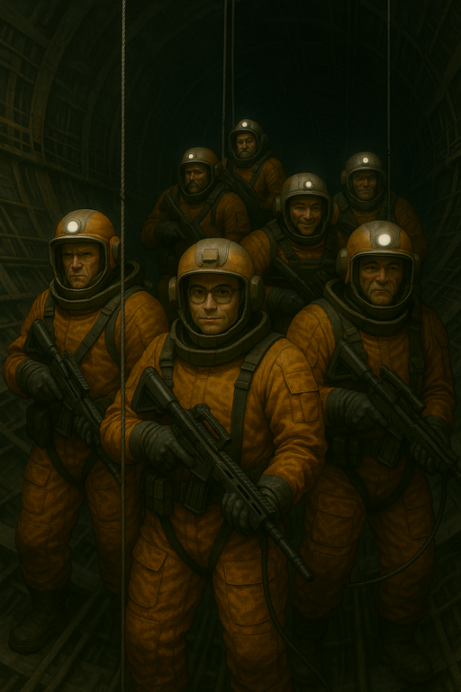
/// caption
Crew rappels down, accompanied by[Yang](yang.md) and [Novikov](novikov.md)
///

### Entering

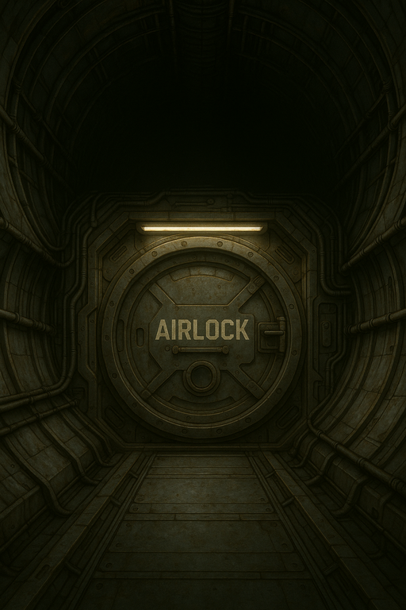
/// caption
Outside reactor door
///

- we see an industrial airlock
    - [Novikov](novikov.md) is excited but can't figure out how to enter
    - [Murderbot](murderbot.md) opens a panel and finds a manual wheel, which he uses to open it
- inside we see a cylindrical room with water at the bottom
    - bridge to a center area
    - giant turbine is partially submerged

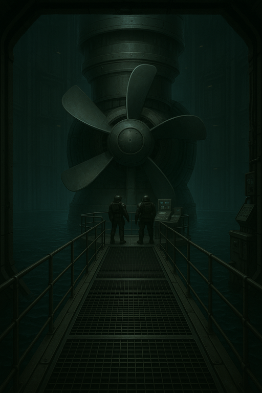
/// caption
Marines in reactor room
///

- 2 marines already in the center
    - one of them has a GPMG
    - they shout "We gotta get out of here! There are [Carcs](carcinids.md) everywhere!"

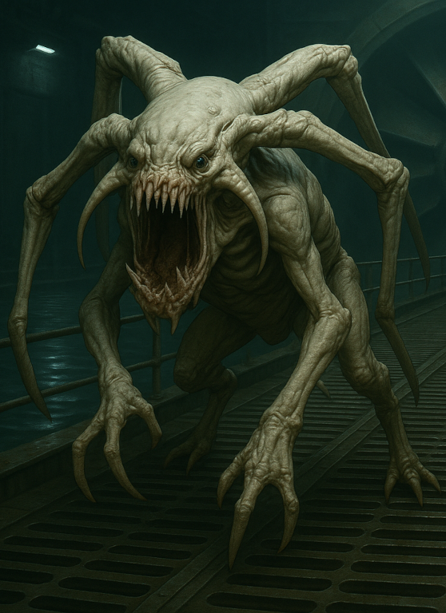
/// caption
A [Carc](carcinids.md) climbs out of the water onto the bridge
///

### Reactor Confrontation

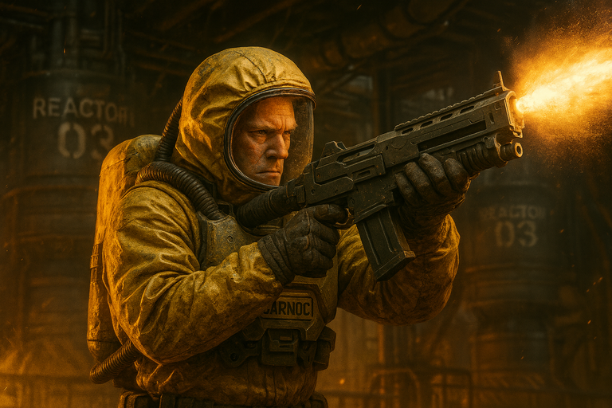
/// caption
[Carnoc](carnoc-ashbrow.md) shoots at the [Carc](carcinids.md)
///

- the [Carc](carcinids.md) dodges and the bullets strike the controls
- [Novikov](novikov.md) starts shooting at the [Carc](carcinids.md)
    - the [Carc](carcinids.md) crouches down and bullets ricochet off its carapace
    - several hit and kill Weaver
    - [Yang](yang.md): "What the fuck, [Novikov](novikov.md)?"
- Franco fires back
    - GPMG rounds hit the [Carc](carcinids.md)'s carapace but don't seem to do anything

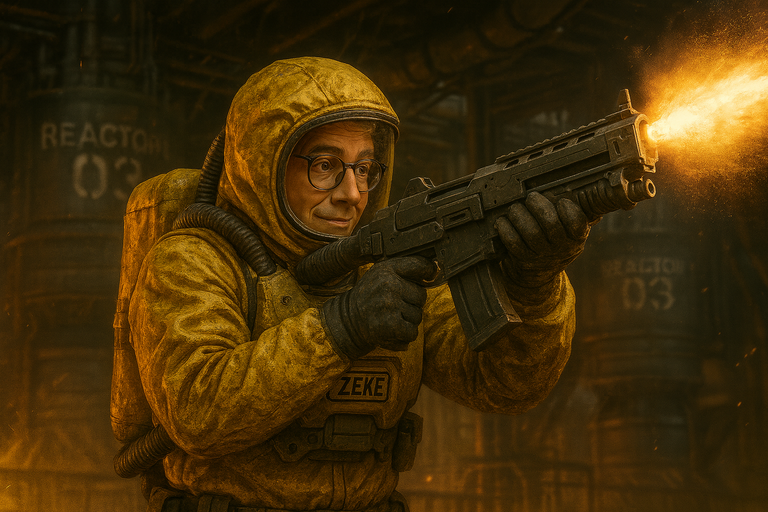
/// caption
[Zeke](zeke-sinclair.md) fires at the [Carc](carcinids.md), but his gun jams
///

- the [Carc](carcinids.md) runs towards us at the door
- [Carnoc](carnoc-ashbrow.md) takes another shot at the [Carc](carcinids.md)
    - bullets ricochet and hits Franco in the neck
    - Franco falls to the ground
- [Yang](yang.md): "Bullets don't do shit!"
    - [Yang](yang.md) tosses a grenade at the [Carc](carcinids.md)
    - [Novikov](novikov.md) throws one too
    - [Yang](yang.md): "Close the door!"
- [Murderbot](murderbot.md) closes the door
- we hear two thumps from the grenade explosions

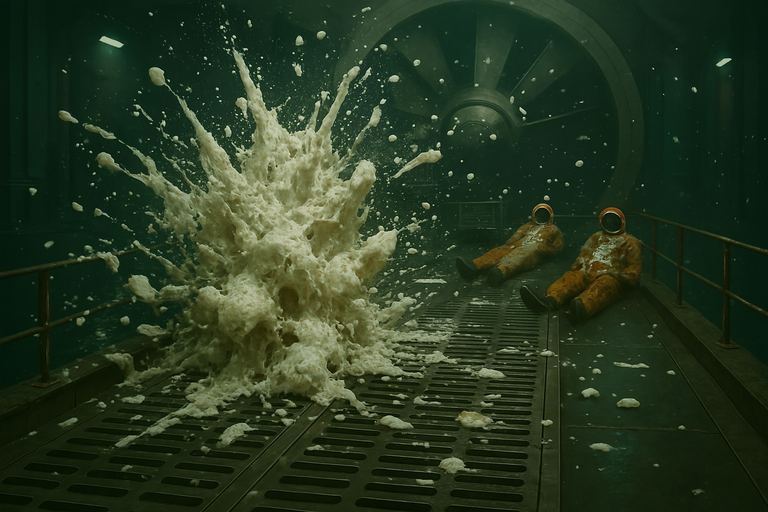
/// caption
[Carc](carcinids.md) exploding from 2 grenades
///

- [Yang](yang.md): "Get that door open so we can try to save Weaver and Franco!"
    - [Novikov](novikov.md) shoves [Murderbot](murderbot.md) out of the way
    - [Novikov](novikov.md) opens the door
- the [Carc](carcinids.md) is in multiple pieces on the bridge
    - there's minor damage to the bridge nearby, but it's sturdy enough to cross

### Reactor Aftermath

- [Yang](yang.md) is able to speak to Franco before he dies
    - Hinton started all of this
    - He damaged the reactor controls (before [Carnoc](carnoc-ashbrow.md))
    - took Jenson and escaped through a tunnel in the water
    - killed Glockner in the spillway
- Franco is dead by the time the crew approaches

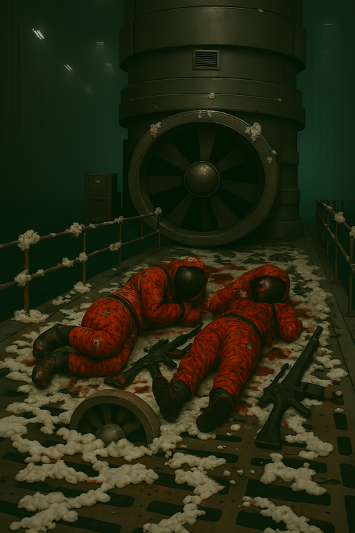
/// caption
Bodies of Franco and Weaver in the reactor room
///

- [Yang](yang.md) and [Novikov](novikov.md) talk near the bodies
    - [Novikov](novikov.md) feels guilty about killing Weaver
    - [Yang](yang.md): "Don't worry about it, kid. It happens, friendly fire happens."
- [Yang](yang.md) and [Novikov](novikov.md) are leaving
    - their mission was to rescue Franco and Weaver, and that's FUBAR
- [Murderbot](murderbot.md) inspects the controls
    - determines the reactor can't be fixed from here
- [Zeke](zeke-sinclair.md) checks the [Carc](carcinids.md)'s remains
    - carapace is thick and woven like kevlar
    - stops most bullets, but explosions can penetrate it
- [Ink](ink.md) doesn't think there is any pathology risk from the dead [Carc](carcinids.md)

### Ink Finds a Sphincter

- [Ink](ink.md) jumps into the water
    - there's a gash which has been filled with organic material
    - looks like a sphincter

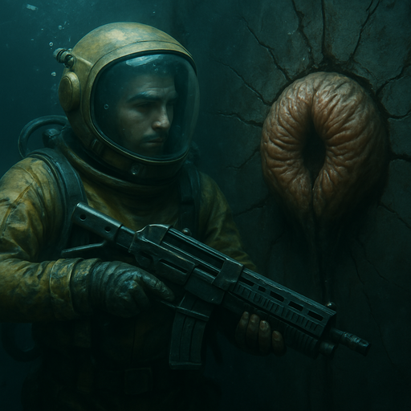
/// caption
[Ink](ink.md) inspects the sphincter
///

- [Ink](ink.md) pokes it with his pulse rifle
- water pressure pushes [Ink](ink.md) through
    - seems like an organic tunnel
- [Murderbot](murderbot.md) follows
    - touches sphincter with a pen knife and it opens immediately
- [Carnoc](carnoc-ashbrow.md) checks the door underwater and it's open
    - doesn't seem like anyone went up the stairs
- [Carnoc](carnoc-ashbrow.md), [Zeke](zeke-sinclair.md), and [Dex](dex-miro.md) wait for [Ink](ink.md) and [Murderbot](murderbot.md)
    - they lose contact on comms after a few minutes
    - after 20 minutes, the reactor room lights turn off
    - red emergency lights turn on

## Return to Base

- [Carnoc](carnoc-ashbrow.md) inspects the stairwell leading to the spillway
    - it doesn't look like anyone went this way
    - [Carnoc](carnoc-ashbrow.md) and [Dex](dex-miro.md) decide not to go through the spillway
- [Zeke](zeke-sinclair.md), [Carnoc](carnoc-ashbrow.md), and [Dex](dex-miro.md) go back up the rope
- [Valdez](valdez.md) is upset about the marines dying
- [Brookman](brookman.md) is irritated and says he's going to the communications tower
- [Valdez](valdez.md) can't spare any marines to help
- [Dr. Edem](dr-edem.md) pressures us to recover their research
    - we agree

## Lab

### Entryway

- elevator down to the lab is broken
    - `20m` down the ladder there's a door
- on the way down, [Carnoc](carnoc-ashbrow.md) asks [Dr. Edem](dr-edem.md) about the sphincter
    - [Carnoc](carnoc-ashbrow.md): "Now that we're out of earshot of the rest of the marines, do you know about these sphincters?"
    - [Dr. Edem](dr-edem.md): "I imagine it's Alien in nature."
    - [Carnoc](carnoc-ashbrow.md): "Why was Valdez freaking out?"
    - [Dr. Edem](dr-edem.md): "I imagine tactically having another access point to defend would probably make her anxious."
    - [Dr. Edem](dr-edem.md): "Already enough to worry about with carcs trying to break in through the front door."
    - [Dr. Edem](dr-edem.md): "Then you have to watch your… heh! Your ass."
    - [Dr. Edem](dr-edem.md) giggles
- [Carnoc](carnoc-ashbrow.md) opens the door
    - hallway is lit only by emergency lighting
    - it's very quiet since all systems are offline

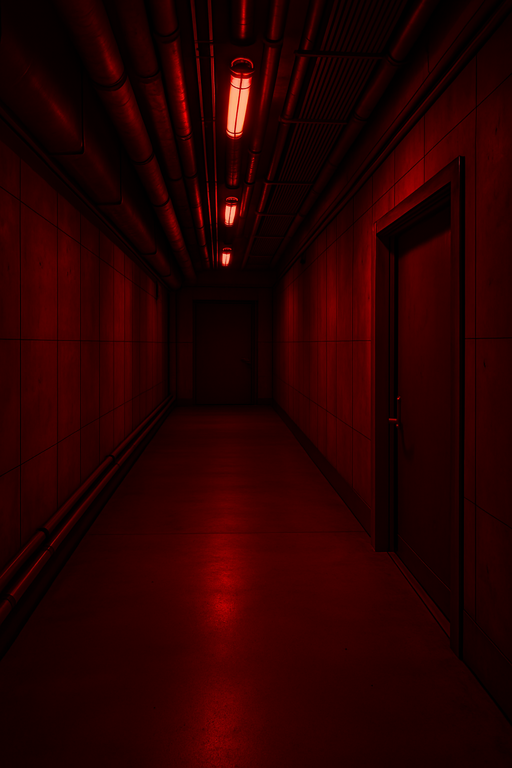
/// caption
Hallway leading to [Dr. Edem](dr-edem.md)'s lab
///

- [Carnoc](carnoc-ashbrow.md) steps into the hallway
    - they hear something scratching and tapping on the first door on the right
- [Carnoc](carnoc-ashbrow.md) asks if anyone down here might be infected
    - [Dr. Edem](dr-edem.md): "[Dr. Ziegler](dr-ziegler.md) might still be down here in the lab."
    - [Dr. Edem](dr-edem.md): "[Dr. Ziegler](dr-ziegler.md) already made an attempt to retrieve the data."
    - [Dr. Edem](dr-edem.md): "I haven't seen him for a few hours."
- [Dr. Edem](dr-edem.md) keeps talking as we walk down the hallway
    - [Dr. Edem](dr-edem.md): "We were trying to analyze the [Carcs](carcinids.md)' DNA sequence, with assistance from Hinton."
    - [Carnoc](carnoc-ashbrow.md): "Were they analyzing any live specimens?"
    - [Dr. Edem](dr-edem.md): "We actually had some larvae at the other base, at [Greta Base](greta-base.md)."
    - [Dr. Edem](dr-edem.md): "We didn't have any full-sized specimens, at least not ones that were fully intact."
- [Dr. Edem](dr-edem.md) tries to open the door with her keycard
    - doesn't work since the power is off
- [Dex](dex-miro.md) finds an access panel by the door
    - there doesn't seem to be anything wrong with it, it's just not powered
- [Dex](dex-miro.md) pries the door open with the spanner
    - it opens but makes a screeching noise

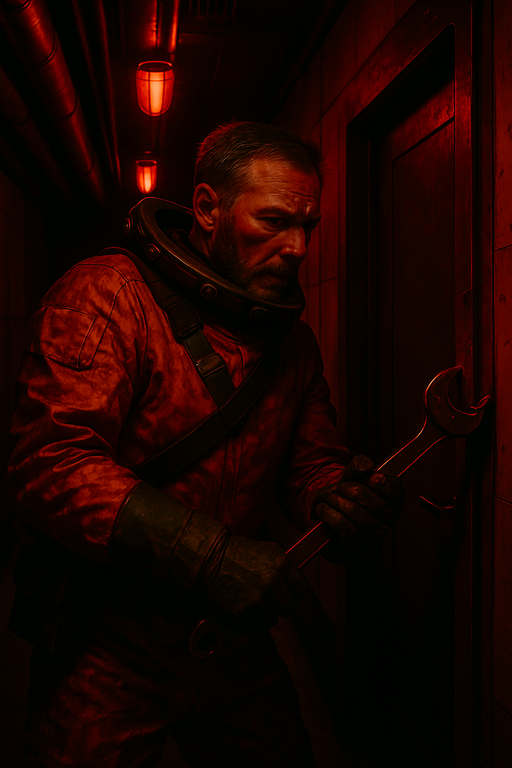
/// caption
[Dex](dex-miro.md) pries the door open with his spanner
///

- tapping on the door by the hallway entrance intensifies to pounding
    - the door starts denting outward

### Office

- [Dex](dex-miro.md) and [Carnoc](carnoc-ashbrow.md) try to close the door
    - door closes but does not make a good seal

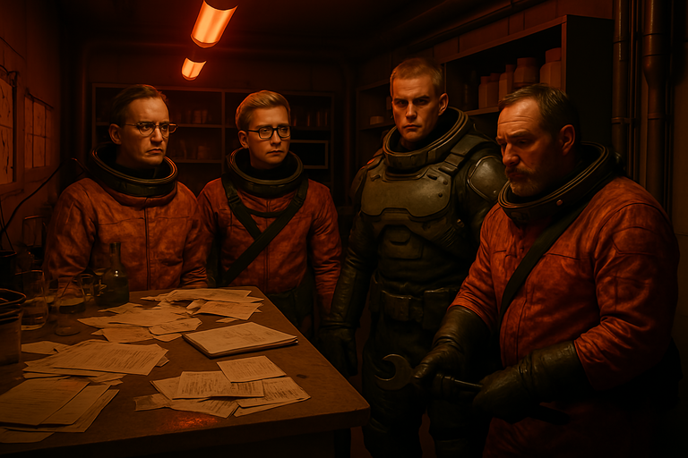
/// caption
[Dr. Edem](dr-edem.md)'s office, with papers everywhere
///

- room has equipment and paperwork everywhere
    - [Dr. Edem](dr-edem.md): "Pay no mind to the mess... just a genius at work, you know."
- [Carnoc](carnoc-ashbrow.md) pries open the the door and we go through
- we hear a wrenching noise like metal is being torn apart
    - [Dr. Edem](dr-edem.md): "Oh my, what do you think that was?"
    - [Carnoc](carnoc-ashbrow.md): "It's a [Carc](carcinids.md), we gotta hurry."

### Buffer Room

- on the opposite side of the next room, there is a glass wall

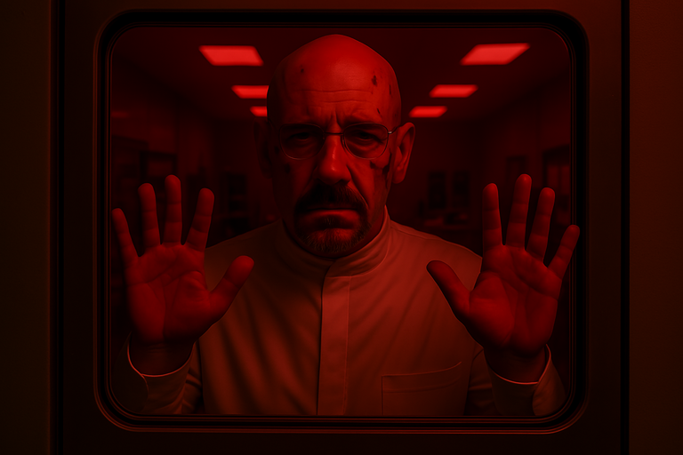
/// caption
[Dr. Ziegler](dr-ziegler.md), in the **Clean Room**
///

- a bald man with glasses and a goatee is on the other side
    - he's got little paper cuts all over him
    - he puts his hand on the glass and wheezes: "Leave me here!"
- [Dr. Edem](dr-edem.md): "Oh my, [Ziegler](dr-ziegler.md)! Did you... did you get my research?"
- [Dr. Edem](dr-edem.md) points at the door on the far side of the **Clean Room**
    - [Dr. Edem](dr-edem.md): "My research is through that door. We only need to get through here."
    - [Carnoc](carnoc-ashbrow.md): "Can infected humans infect other humans, or can only carcs infect, humans?"
    - [Dr. Edem](dr-edem.md): "That hasn't been known to happen."
    - [Carnoc](carnoc-ashbrow.md): "Do you think we can safely get past him? Will he, uh, try to stop us?"
    - [Dr. Edem](dr-edem.md): "[Ziegler](dr-ziegler.md), will you try to stop us if we try to bypass you?"
    - [Dr. Edem](dr-edem.md): "Oh my, he sounds terrible."
- [Carnoc](carnoc-ashbrow.md) opens the airlock to the **Clean Room**
    - this takes less effort than the previous doors
    - [Dr. Edem](dr-edem.md) seems uncomfortable with not following the typical procedures of entering the **Clean Room**
    - [Carnoc](carnoc-ashbrow.md): "The power's off, there's nothing to decontaminate us anyway, right?"

### Clean Room

- [Carnoc](carnoc-ashbrow.md) pries open the door to the last room
- a large dent forms in the door to the **Office**

### Cryo Vault

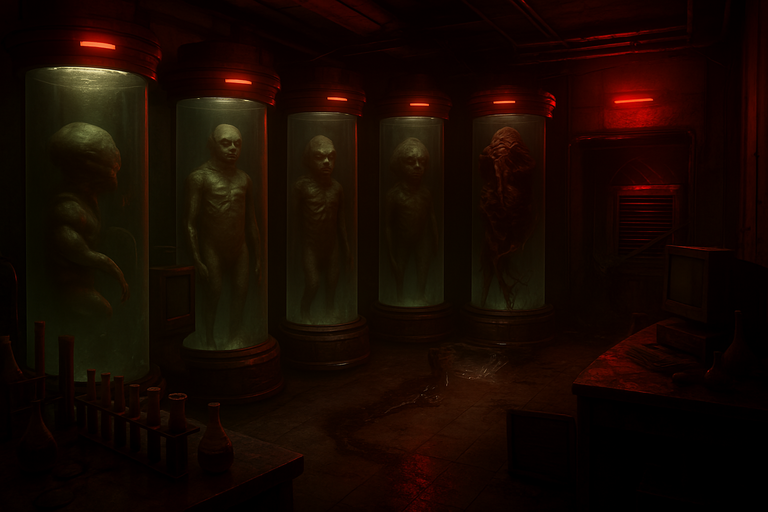
/// caption
6 large glass cylinders in the **Cryo Vault**
///

- there are 6 large glass cylinders
    - each holds a developing Clark larva.
    - one of the cylinders is broken
    - a trail of fluid leads to the vent, which has been forced open

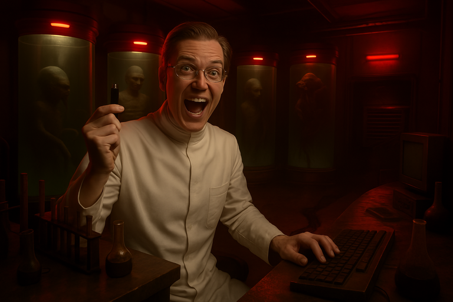
/// caption
[Dr. Edem](dr-edem.md) finds their research
///

- [Dr. Edem](dr-edem.md) grabs a data stick and pockets it
    - [Dr. Edem](dr-edem.md): "Alright, I have my research"
    - [Zeke](zeke-sinclair.md): "What is your research about?"

- [Carnoc](carnoc-ashbrow.md): "What was in the broken cylinder?"
    - [Dr. Edem](dr-edem.md): "[Carc](carcinids.md) larva."
    - [Carnoc](carnoc-ashbrow.md): "How long do Kirk larva take to develop into a fully grown carcass?"
    - [Dr. Edem](dr-edem.md): "Oh, they're quite fast. I believe [Ziegler](dr-ziegler.md)'s going through the transition as we speak."
    - [Dex](dex-miro.md): "Wow, that's cold."
    - [Dr. Edem](dr-edem.md): "[Ziegler](dr-ziegler.md), I'm sorry it had to be this way."

- [Dr. Ziegler](dr-ziegler.md) is on the ground and convulsing
    - [Carnoc](carnoc-ashbrow.md) takes aim with his SMG to end his misery
    - [Carnoc](carnoc-ashbrow.md) empties the magazine

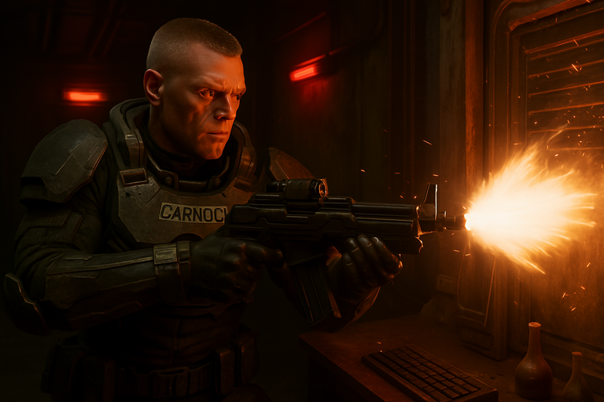
/// caption
[Carnoc](carnoc-ashbrow.md) ends [Dr. Ziegler](dr-ziegler.md)'s misery
///

### Lab Confrontation

- the [Carc](carcinids.md) busts into the **Buffer Room**
- [Carnoc](carnoc-ashbrow.md) tosses a grenade
    - [Zeke](zeke-sinclair.md) closes the door
    - [Carnoc](carnoc-ashbrow.md): "Frag out!"

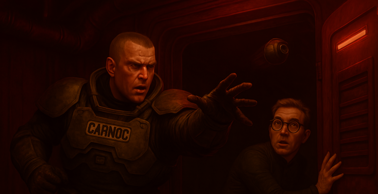
/// caption
[Carnoc](carnoc-ashbrow.md) throws a grenade, with [Zeke](zeke-sinclair.md) ready to close the door
///

- they hear the explosion
- the [Carc](carcinids.md) pounds on the door
- meanwhile, [Dex](dex-miro.md) pushes a table under the vent and tries to climb in

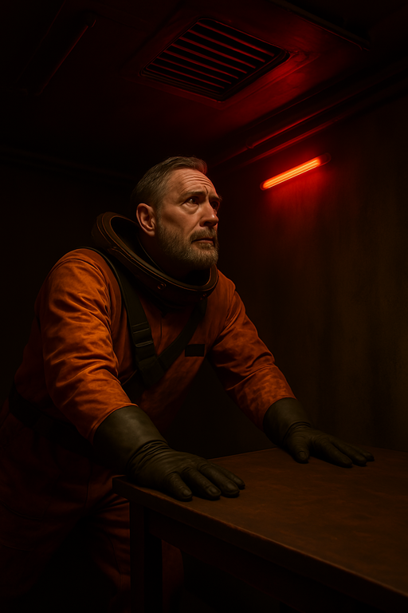
/// caption
[Dex](dex-miro.md) pushes a table under the vent
///

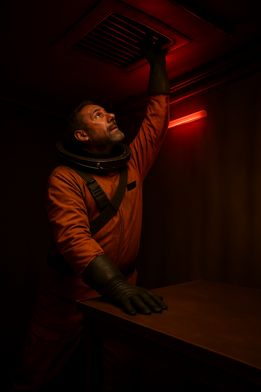
/// caption
[Dex](dex-miro.md) tries to climb into the vent
///

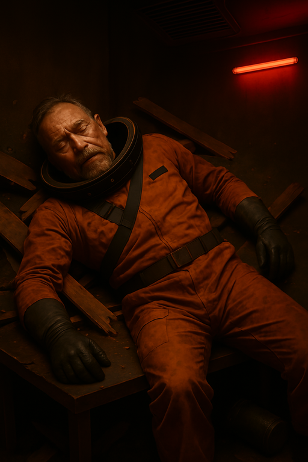
/// caption
[Dex](dex-miro.md) falls, smashing the table
///

- [Carnoc](carnoc-ashbrow.md) lifts [Zeke](zeke-sinclair.md) up to the vent
    - [Carnoc](carnoc-ashbrow.md) pushes [Zeke](zeke-sinclair.md) upwards
    - [Zeke](zeke-sinclair.md) wasn't ready for it and falls
    - [Zeke](zeke-sinclair.md) lands on top of [Dex](dex-miro.md)
    - [Dr. Edem](dr-edem.md) giggles

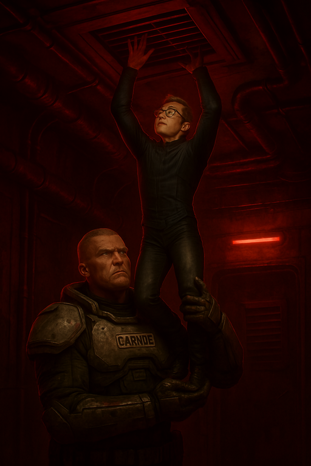
/// caption
[Carnoc](carnoc-ashbrow.md) lifts [Zeke](zeke-sinclair.md) up to the vent
///

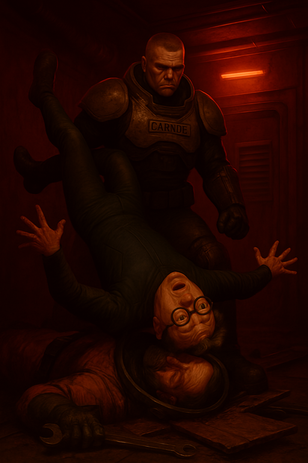
/// caption
[Zeke](zeke-sinclair.md) falls on [Dex](dex-miro.md)
///

- the [Carc](carcinids.md) bursts through the door into the **Cryo Vault**

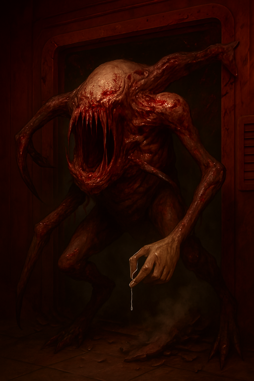
/// caption
The wounded [Carc](carcinids.md) enters the **Cryo Vault**
///

- [Zeke](zeke-sinclair.md) looks around for chemicals
    - finds some hydroflouric acid
    - starts filling up a glove with acid
    - [Dex](dex-miro.md) grabs 2 vials from the same tray

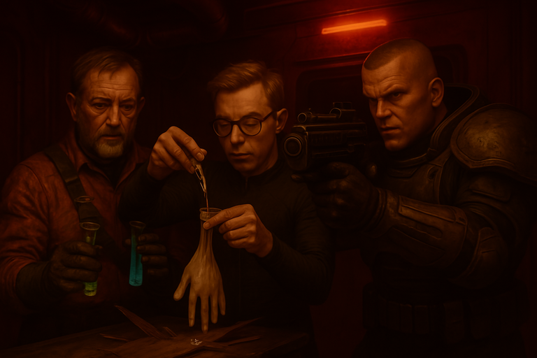
/// caption
[Zeke](zeke-sinclair.md) fills a glove with acid, [Dex](dex-miro.md) grabs a couple vials
///

- [Dr. Edem](dr-edem.md) objects to how they are handling the chemicals
    - [Dr. Edem](dr-edem.md): "You should be wearing PPE!"
    - [Dr. Edem](dr-edem.md): "That's unsafe, what you're doing, handling it that way!"
    - [Dr. Edem](dr-edem.md): "That's not proper lab procedure!"
- [Dex](dex-miro.md) flings 2 vials of acid at the [Carc](carcinids.md)
    - acid seeps into the grenade wounds and the [Carc](carcinids.md) shrivels up
- [Carnoc](carnoc-ashbrow.md): "Well that was effective"
    - [Dr. Edem](dr-edem.md): "Indeed"

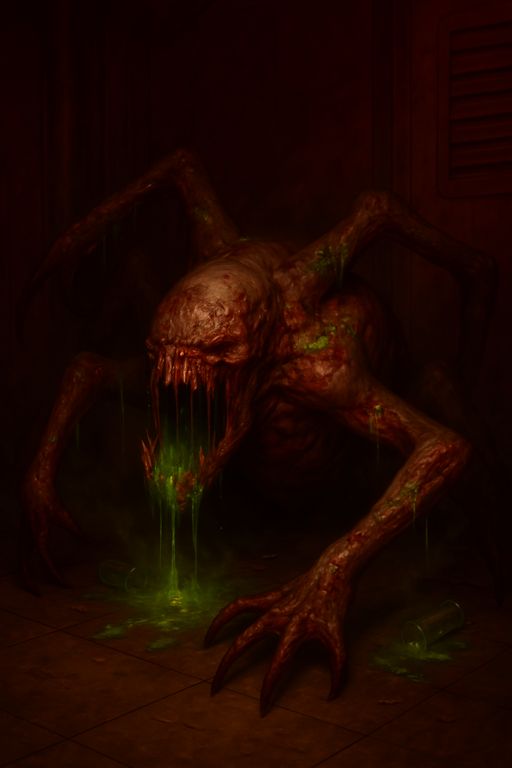
/// caption
[Carc](carcinids.md), killed by grenades and acid in the **Cryo Vault**
///

### Lab Aftermath

- [Zeke](zeke-sinclair.md) makes 3 acid glove balloons
- we inspect [Dr. Ziegler](dr-ziegler.md)'s body
    - killing him stopped the [Carc](carcinids.md) from fully developing
- we climb back up the ladder

## Dr. Edem Describes Research

- [Zeke](zeke-sinclair.md) asks [Dr. Edem](dr-edem.md) about their research
- [Dr. Edem](dr-edem.md): "The company wanted the [Carcs](carcinids.md)' DNA."
- [Dr. Edem](dr-edem.md): "We were doing some gene sequencing and splicing, figuring out how much it would align with human DNA."
- [Zeke](zeke-sinclair.md): "Hmm. And what did you learn?"
- [Dr. Edem](dr-edem.md): "That they're effectively a sentient cancer."
- [Dr. Edem](dr-edem.md): "We call them [Carcs](carcinids.md) because of this concept. Carcinization. The idea that everything is slowly evolving into crab-like forms."
- [Dr. Edem](dr-edem.md): "We see it everywhere. Nature never stops trying. Even here, millions of light years from home, nature is still trying."
- [Dr. Edem](dr-edem.md): "The [Carcs](carcinids.md) are what we would have been. The inheritors of the universe."
- [Zeke](zeke-sinclair.md): "Interesting"

## A Tough Choice

- [Brookman](brookman.md) tried to drive to the tower on an ATV
    - [Brookman](brookman.md) and Ivanovic were attacked by 2 [Carcs](carcinids.md) and killed
    - there's one ATV left
- Sobol finished fixing APC
    - water rose high enough that we can't drive the APC out of the garage anymore
- [Carnoc](carnoc-ashbrow.md) talks to Valdez
    - [Carnoc](carnoc-ashbrow.md): "I want to go down and evacuate out through the sphincter."
    - [Valdez](valdez.md): "Are you kidding me? There could be a suicide mission."
    - [Carnoc](carnoc-ashbrow.md): "Do you have a better idea?"
    - [Valdez](valdez.md): "We stay here, we fight, we see if we live."
    - [Carnoc](carnoc-ashbrow.md): "How's that going for the rest of your team?"
    - [Valdez](valdez.md): "Listen here corporal, if you weren't helping us out I would kick your ass right now!"
    - [Valdez](valdez.md): "We don't have time to be fighting amongst ourselves, let alone, dying up here."
- [Valdez](valdez.md) lists their supplies:
    - `7` pulse rifles with `43` mags
    - `30` frag grenades
    - `1` flamethrower with two tanks of fuel
    - `4` GPMGs with `30` mags
- [Carnoc](carnoc-ashbrow.md) tries to [Valdez](valdez.md) to evacuate through the sphincter tunnel
    - [Carnoc](carnoc-ashbrow.md): "I don't think we can hold of all the [Carcs](carcinids.md) with that amount of weaponry"
    - [Valdez](valdez.md): "I think you're probably right."
    - [Valdez](valdez.md): "Do you think it's really gonna be that much safer going through that tunnel?"
    - [Carnoc](carnoc-ashbrow.md): "We can sit around here and wait for the [Carcs](carcinids.md) to break in, or we could go."
- [Valdez](valdez.md) asks remaining marines to vote
    - everyone but [Novikov](novikov.md) votes to try escaping through the sphincter tunnel

## The Tunnel

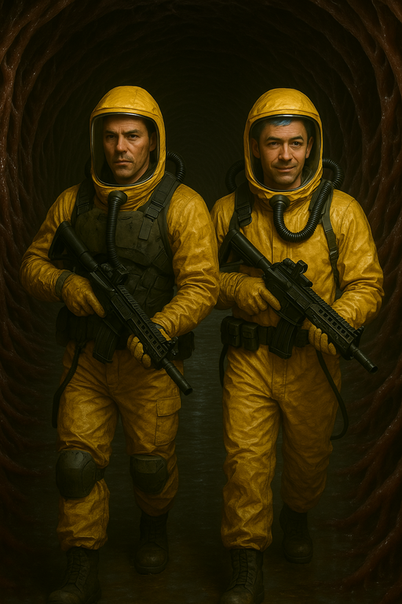
/// caption
[Ink](ink.md) and [Murderbot](murderbot.md) walk down the tunnel
///

- the tunnel gets wider and looks more like a throat
- `200m` later it ends in a **T** with a new tunnel
    - new tunnel is bisected by a river of black liquid
- [Ink](ink.md) and [Murderbot](murderbot.md) go left
    - walls are pockmarked with small chambers
    - chambers are filled with human body parts grafted to the walls
    - hands move
    - faces without eyes or mouths contract and make pained expressions
- after `100m`, the tunnel ends with a grate in the ceiling
    - grate wraps around to go slightly down the wall
    - a cloud of gas sits above the grate
        - it's thick and doesn't seem to move
- [Murderbot](murderbot.md) lifts [Ink](ink.md) up
    - [Ink](ink.md) starts to push the grate aside
    - [Ink](ink.md)'s fingers touch the gas cloud
    - as he pushes the grate, a humanoid corpse falls down
    - body says Qadir
    - it has papercuts from the infection and looks partially dissolved in acid

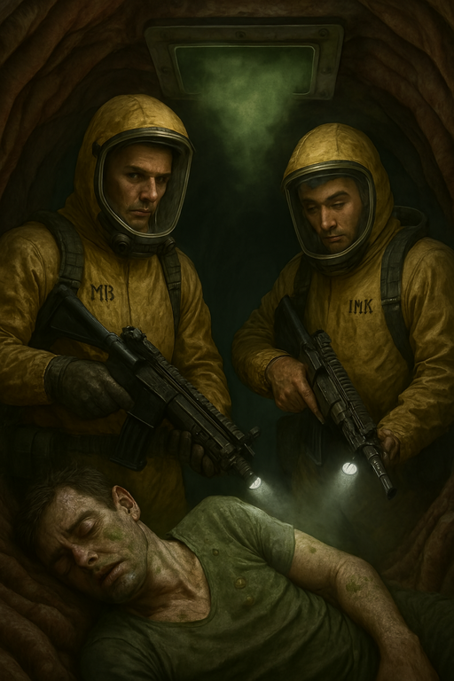
/// caption
Corporal Qadir's body falls out of the grate onto [Murderbot](murderbot.md) and [Ink](ink.md)
///

- where [Ink](ink.md)'s glove touched the gas, it begins to dissolve
    - [Ink](ink.md) removes his glove and tries to tie off the sleeve
