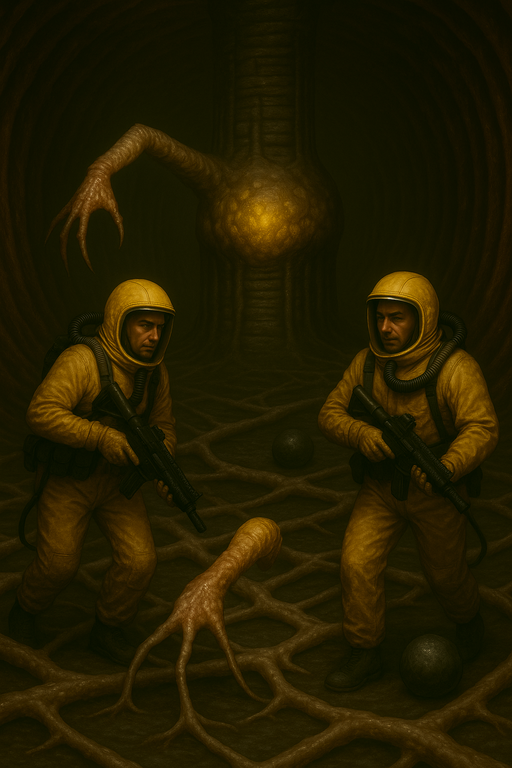
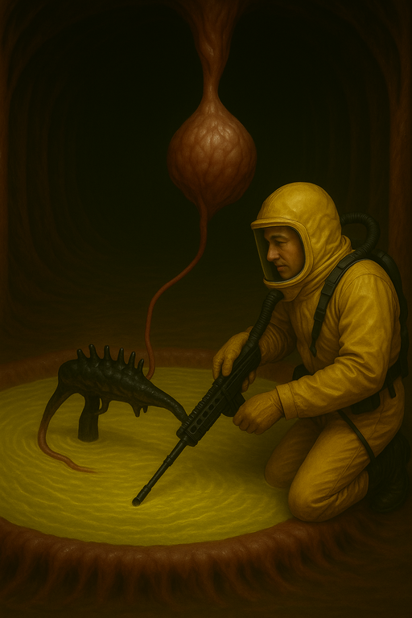
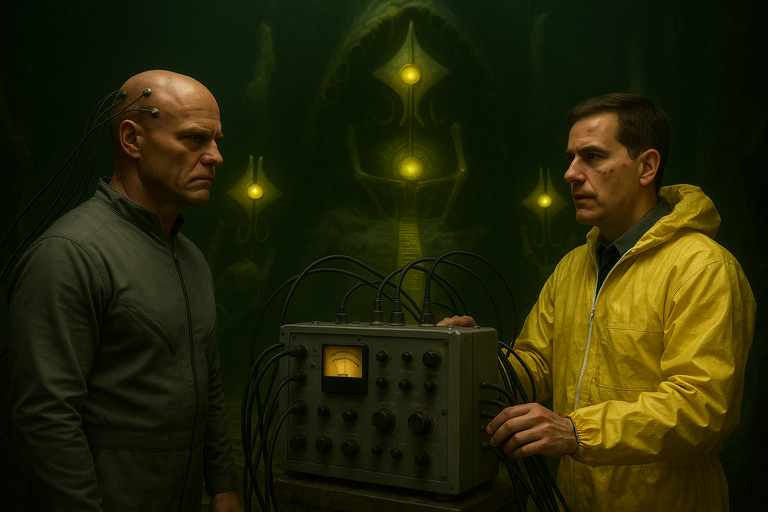
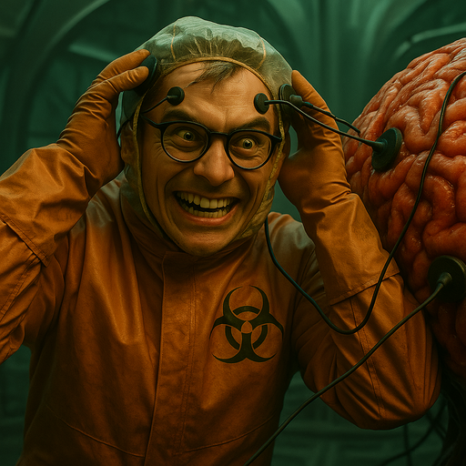
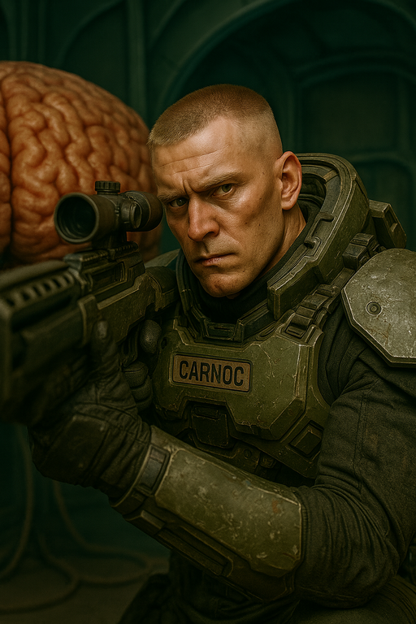
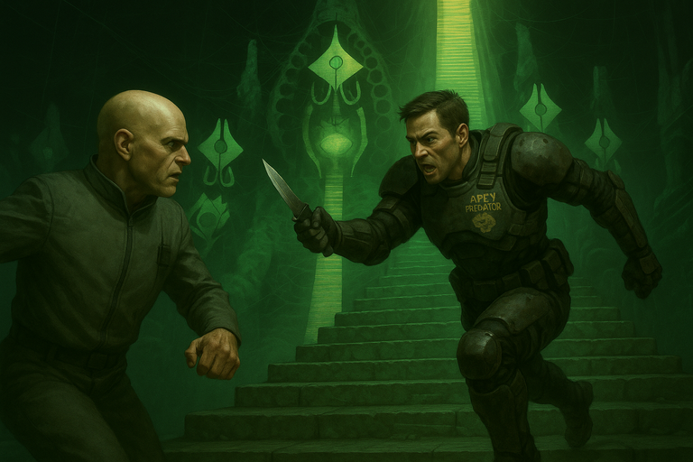
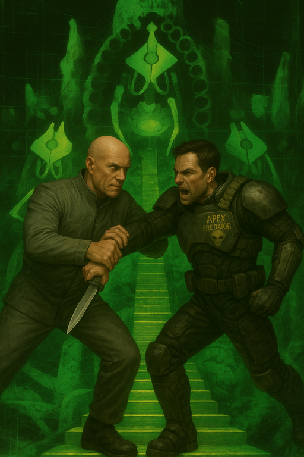
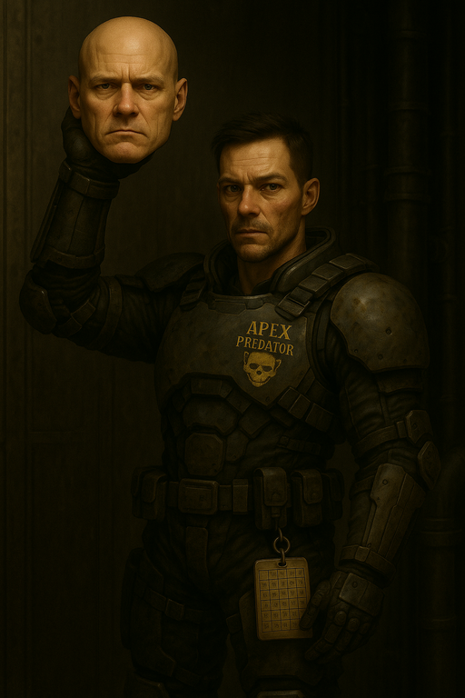
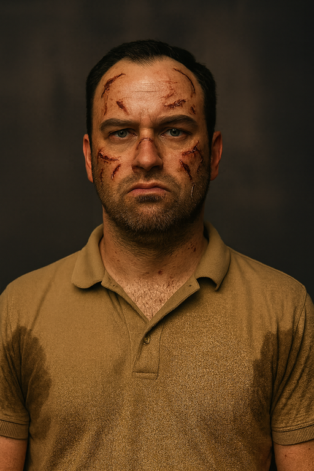

# {{ page.meta.module }}: {{ page.meta.title }}

All of the survivors try to escape by traveling through the sphincter.
[Ink](ink.md) finds and uses a peculiar but effective alien weapon.
[Hinton](hinton.md) attemps to use the [Carcs](carcinids.md) for galactic domination.
[Zeke](zeke-sinclair.md) fights an uphill battle of intelligence and will against [Hinton](hinton.md) and ends up in a coma.
[Murderbot](murderbot.md), [Carnoc](carnoc-ashbrow.md), and [Novikov](novikov.md) defeat [Hinton](hinton.md) and escape with his head, at the cost of [Murderbot](murderbot.md)'s life.
Everyone is infected by the [Carcs](carcinids.md), including [Moss](moss.md) remotely, but [Dr. Edem](dr-edem.md) is eventually able to cure them all.
The crew receive their payment and wonder whether it's worth the price they paid.

<!-- more -->



## The Survivors

- everyone else goes gathers supples
    - take all the explosives since they're the most effective
- all survivors enter into the sphincter
- water is slowly coming into the tunnel, there's only about an inch
- shortly after entering the tunnel, groups are able to contact each other on comms

## Exploring

### An Alien Arm

- [Ink](ink.md) and [Murderbot](murderbot.md) don't think there's anything more to do with the grate
- They try to navigate through the metallic web in the other branch of the tunnel

/// caption
Pushing through the metallic web in the tunnel
///

- The webbed tunnel opens into a large cylindrical chamber
    - warty polyp in the center
    - protruding from the polyp is a 3 meter long [carc](carcinids.md)-like limb
    - there are 2 metallic nodules embedded in the floor
        - one is a bit more recessed
    - fleshy, calcified tendrils as thick as your forearm criss-cross the room

/// caption
Room with alien arm and 2 metallic nodules in the floor
///

- [Ink](ink.md) and [Murderbot](murderbot.md) look for footprints
    - difficult to recognize anything with the organic floor and many marks on it
    - the marks could be from [Carcs](carcinids.md) walking
        - they continue up the wall
    - [Ink](ink.md) finds a tight seam that looks very difficult to pry open
- Studying the walls, [Murderbot](murderbot.md) notices slight movement
    - like something moving under the skin
- [Ink](ink.md) and [Murderbot](murderbot.md) describe the room to [Dr. Edem](dr-edem.md)
    - [Dr. Edem](dr-edem.md) recommends manipulating the arm to touch various objects
- [Ink](ink.md) moves the arm to touch one of the metallic nodules
    - electricity arcs between the arc and the nodule as it approaches
    - the arm snaps into place
    - a wall opens up (not the place with the seam)
    - a passage behind it angles upwards
- other group arrives at the metallic webbing
    - ask scout group for confirmation and then push through
    - [Ink](ink.md) and [Murderbot](murderbot.md) wait 10 minutes for them to arrive in the room
- [Ink](ink.md) moves the arm to the other metallic nodule
    - open door shuts
    - door opens at the seam to an adjacent room with a pool of liquid in the center

### Finding a Peculiar Weapon

- rifle-sized tube connected by umbilical cord to a sac with fleshy straps coming off it
    - top of the tube has fleshy finger length spines growing out of it

/// caption
[Ink](ink.md) finds a peculiar alien weapon
///

- [Dr. Edem](dr-edem.md) is fascinated by this
    - [Dr. Edem](dr-edem.md): "I don't think it's a [Carc](carcinids.md) itself, it might be one of their creations."
    - [Murderbot](murderbot.md): "They can create things?"
    - [Dr. Edem](dr-edem.md): "They are, in my estimation, a higher form of evolution than we are"
- [Ink](ink.md) asks [Dr. Edem](dr-edem.md) how to extract the artifact
    - [Ink](ink.md) dips his pulse rifle into the liquid
    - it doesn't react
    - [Dr. Edem](dr-edem.md) collects a sample of the liquid
- [Ink](ink.md) goes in the water and starts flailing around
    - marines do not appreciate the joke
- [Ink](ink.md) pushes the sac and it feels soft like it has liquid inside
    - [Ink](ink.md) takes the sac and puts it on his back
    - tube is attached to the sac
- [Dr. Edem](dr-edem.md) examines the fleshy tendrils in the main room

### Valdez Makes a Plan

- [Ink](ink.md) moves the arm back to the first nodule
- locator shows [Hinton](hinton.md) is nearby
    - gets even closer and we go up the passage
- [Valdez](valdez.md) doesn't appreciate the complete lack of a plan
    - she's freaking out about all of the weird alien shit
    - wants to leave the civies behind with a couple marines to guard
    - [Yang](yang.md) and Pedro stay behind to guard the civies [Edem](dr-edem.md), Sobol, and Kawaguchi
- [Valdez](valdez.md), Tanaka, and Novikov accompany us further up the passage
    - after `100m` it opens up into a cavernous area
    - 3 starcases, each of which has a [Carc](carcinids.md) noble (4 stories tall)
    - [Carc](carcinids.md) nobles appear to be wrapped in webbing
    - hundreds of [Carcs](carcinids.md) around the chamber

## Carc Noble Chamber

### Hinton and the Machine

- [Hinton](hinton.md) is working on a machine
    - [Carcs](carcinids.md) nearby aren't bothering them
        - they seem to be standing guard
    - [Dr. Jenson](jenson.md) is near [Hinton](hinton.md), who is not wearing a hazard suit
        - [Jenson](jenson.md) is assisting [Hinton](hinton.md), but reserved

/// caption
[Hinton](hinton.md), connected to a neurological scanner, and [Dr. Jenson](jenson.md)
///

- [Zeke](zeke-sinclair.md) recognizes the machine as similar to a neurological scanner
    - cables extend to [Carc](carcinids.md) nobles' heads, connected to their exposed brains
- [Ink](ink.md) cycles through comms channels trying to contact [Jenson](jenson.md)
    - [Valdez](valdez.md) assists by detailing which channels they use
    - no response from [Jenson](jenson.md)
    - [Ink](ink.md) retreats to the tunnel to yell louder
    - [Murderbot](murderbot.md) watches [Jenson](jenson.md) discreetly put on his helmet and lets [Ink](ink.md) know
- [Ink](ink.md) informs [Dr. Edem](dr-edem.md) about this room
    - [Yang](yang.md): "[Edem](dr-edem.md), get back here!"
    - [Jenson](jenson.md)'s background is geology, so [Edem](dr-edem.md) isn't sure why he's here
- [Carnoc](carnoc-ashbrow.md) looks at [Hinton](hinton.md) and [Jenson](jenson.md) through binoculars
    - [Jenson](jenson.md) has papercut scars and appears to be infected
    - [Hinton](hinton.md) doesn't look infected
        - [Edem](dr-edem.md) thinks that it's not possible for synths to be infected
- [Murderbot](murderbot.md) looks through binoculars and notices [Hinton](hinton.md) has a pulse rifle
- [Zeke](zeke-sinclair.md) looks at the machinery through binoculars
    - notices some text on the monitor
    - [Hinton](hinton.md) appears to be trying to download his psyche to the [Carc](carcinids.md) brain
    - [Dr. Edem](dr-edem.md) speculates on why he might want to do this
        - controlling the [Carcs](carcinids.md)?
        - understanding what it's like to be a [Carc](carcinids.md)
    - [Edem](dr-edem.md) mentions [Hinton](hinton.md) was studying [Carc](carcinids.md) languages

### Contacting Jenson

- [Carnoc](carnoc-ashbrow.md) aims at [Hinton](hinton.md) in case things go south
- [Valdez](valdez.md) tries to talk to [Jenson](jenson.md)
    - [Jenson](jenson.md): (whispering) "I can't really talk"
    - [Valdez](valdez.md): "We need to know what [Hinton](hinton.md) is doing"
    - [Valdez](valdez.md): "We're trying to get you out of there"
    - [Valdez](valdez.md): "If we can get you and [Hinton](hinton.md) out of there, we can get off this rock with our lives"
    - [Valdez](valdez.md): "Can you lure [Hinton](hinton.md) away from this area, because all those [Carcs](carcinids.md) could be bad news for us?"
- [Jenson](jenson.md) talks to [Hinton](hinton.md) off comms and then summarizes to the crew:
    - "[Hinton](hinton.md)'s not going to leave."
    - "He plans to download himself into the [Carc](carcinids.md) and rule over this.. what he calls superior species."
    - "He's almost done, too."
- [Zeke](zeke-sinclair.md): What is his intention with these [CARCs](carcinids.md), other than to rule?
    - [Zeke](zeke-sinclair.md): Does he want to attack?
    - [Jenson](jenson.md): His plan is to eliminate the other [Carc](carcinids.md) nobles and be the sole noble living.
    - [Jenson](jenson.md): Then from there... he would like to enslave all other races.
- [Carnoc](carnoc-ashbrow.md): "Say I shoot his head off..."
    - [Carnoc](carnoc-ashbrow.md): "Most of his conscience will be in that machine, and we can bring the machine back."
    - [Murderbot](murderbot.md): "But how is it controlling the [Carcs](carcinids.md)?"

### Carc Communication

- [Zeke](zeke-sinclair.md): "Why aren't the [Carcs](carcinids.md) attacking you right now?"
    - [Jenson](jenson.md): "He's been able to speak with them"
    - "He can emit the proper noises, it's not human"
    - "I couldn't do it, and I don't know what he's saying"
- [Murderbot](murderbot.md) asks [Jenson](jenson.md) to get some recordings of [Carc](carcinids.md) language
    - While [Hinton](hinton.md)'s back is turned, [Jenson](jenson.md) is able to transfer files to [Murderbot](murderbot.md)
    - [Hinton](hinton.md) doesn't seem to notice
    - [Murderbot](murderbot.md) thinks he can speak [Carc](carcinids.md) now
- [Murderbot](murderbot.md) wants to try talking to the [Carcs](carcinids.md) over [Jenson](jenson.md)'s radio
    - [Jenson](jenson.md) thinks this is a dumb idea
    - [Jenson](jenson.md) stands by a [Carc](carcinids.md) and [Murderbot](murderbot.md) tries to talk to it
    - [Murderbot](murderbot.md): "That being in front of you is intending to do you harm."
    - [Murderbot](murderbot.md): "Do not allow it to complete its task."
    - no reaction from the [Carc](carcinids.md)
    - either it's not loud enough or [Murderbot](murderbot.md) isn't making the right sounds
- [Jenson](jenson.md) says [Hinton](hinton.md)'s transfer is 90% complete

### Disconnecting the Noble

- we climb over to the [Carc](carcinids.md) noble and start disconnecting electrodes
    - [Jenson](jenson.md): "That's it, you stopped the download. It's interrupted."
    - we hear some screeching
    - [Murderbot](murderbot.md) interprets: "Something must have interrupted the connection."
    - [Hinton](hinton.md) blames the [Carcs](carcinids.md)
    - [Jenson](jenson.md) climbs up, which takes 10 minutes
- [Jenson](jenson.md): "Oh thank god. Let's get the fuck out of here."
    - [Murderbot](murderbot.md): "We gotta take out [Hinton](hinton.md)."
    - [Edem](dr-edem.md): "We're on quite an adventure..."
- Jensen refuses to go back and tell [Hinton](hinton.md) that he can't fix it
    - [Jenson](jenson.md) heads towards the exit
- [Zeke](zeke-sinclair.md) puts on the electrodes

/// caption
[Zeke](zeke-sinclair.md) connects himself to the electrodes removed from the [Carc](carcinids.md) noble
///

- [Zeke](zeke-sinclair.md) starts convulsing
    - [Dex](dex-miro.md) pulls the electrodes off
    - [Zeke](zeke-sinclair.md) stops convulsing but he's comatose

### Confuse-a-Carc

- we hear loud screeching from below
    - [Murderbot](murderbot.md) says [Hinton](hinton.md) commanded the [Carcs](carcinids.md) to see what's going on
    - [Carnoc](carnoc-ashbrow.md) notices the [Carcs](carcinids.md) moving
- [Carnoc](carnoc-ashbrow.md) tells the marines to follow [Jenson](jenson.md)
- [Carnoc](carnoc-ashbrow.md) stays to try to shoot [Hinton](hinton.md)
- [Murderbot](murderbot.md) remains to talk to the [Carcs](carcinids.md)
- [Carnoc](carnoc-ashbrow.md) tries to shoot [Hinton](hinton.md)
    - bullet hits a climbing [Carc](carcinids.md), who clatters to the floor

/// caption
[Carnoc](carnoc-ashbrow.md) takes a shot at [Hinton](hinton.md) with his pulse rifle
///

- [Hinton](hinton.md): (to [Carcs](carcinids.md)) "Intruders! Kill them!"
    - [Murderbot](murderbot.md): "No! Kill him!"
- the [Carcs](carcinids.md) seem confused
- [Hinton](hinton.md) grabs his pulse rifle
    - [Hinton](hinton.md): (to [Carcs](carcinids.md)) "They've already killed one of our own"
    - [Hinton](hinton.md) shoots at [Murderbot](murderbot.md) and hits him
        - [Murderbot](murderbot.md) gets a lethal injury
        - milky white fluid spurting out
- [Murderbot](murderbot.md): "He is the impostor"
- [Carcs](carcinids.md) are still confused
- [Carnoc](carnoc-ashbrow.md) shoots at [Hinton](hinton.md) again
    - hits [Hinton](hinton.md) and knocks him down
- [Ink](ink.md) runs back to patch up [Murderbot](murderbot.md)
- [Dex](dex-miro.md) keeps carrying [Zeke](zeke-sinclair.md) with a marine's assistance
    - slow going
- [Hinton](hinton.md) shoots [Carnoc](carnoc-ashbrow.md) and hits him
    - [Hinton](hinton.md): "What are you doing? They've already killed one of you!"
- [Carcs](carcinids.md) move towards us slowly

### Confronting Hinton

- [Carnoc](carnoc-ashbrow.md) shoots at [Hinton](hinton.md) again
    - hits a [Carc](carcinids.md) and kills it
- [Carnoc](carnoc-ashbrow.md) suggests someone toss his grenade at [Hinton](hinton.md)
    - [Ink](ink.md) considers it and decides not to
- [Ink](ink.md) unloads his whole pulse rifle clip at [Hinton](hinton.md)
    - grazes off some [Carcs](carcinids.md), angering them
    - doesn't hit [Hinton](hinton.md)
- [Murderbot](murderbot.md): "We must take down the impostor known as [Hinton](hinton.md)"
    - "He was trying to take over a noble and kill the others"
    - "You don't want to be enslaved"
- [Carcs](carcinids.md) begin fighting each other
- Novikov decides to throw a grenade at [Hinton](hinton.md)
    - [Valdez](valdez.md): "What the fuck, Novikov?"
    - the grenade lands at [Hinton](hinton.md)'s feet and explodes
    - sends shrapnel into the machine
    - [Hinton](hinton.md)'s hair is set on fire but he doesn't look wounded
- Tanaka keeps helping [Dex](dex-miro.md) carry [Zeke](zeke-sinclair.md)
- [Valdez](valdez.md) tries to convince Novikov to leave
- [Hinton](hinton.md) unloads his pulse rifle at Novikov
    - [Hinton](hinton.md) shrieks and [Murderbot](murderbot.md) identifies it as the infection signal
    - papercuts appear on everyone
- [Murderbot](murderbot.md) scales down the hill to [Hinton](hinton.md) quickly
    - slips and falls down near [Hinton](hinton.md)

/// caption
[Murderbot](murderbot.md) charges at [Hinton](hinton.md)
///

- [Murderbot](murderbot.md) tries to overpower [Hinton](hinton.md) and shut him down
    - [Hinton](hinton.md) grabs [Murderbot](murderbot.md)'s arm and breaks it

/// caption
[Hinton](hinton.md) breaks [Murderbot](murderbot.md)'s arm
///

- [Carnoc](carnoc-ashbrow.md) shoots at [Hinton](hinton.md)
    - [Hinton](hinton.md) steps back from [Murderbot](murderbot.md)
    - [Carnoc](carnoc-ashbrow.md)'s bullet hits [Hinton](hinton.md) in the neck
    - [Hinton](hinton.md)'s head falls to the ground, his mouth agape

/// caption
[Murderbot](murderbot.md) grabs [Hinton](hinton.md)'s head
///

## Escape

### Firing the Alien Weapon

- [Ink](ink.md) tries to use the gun sac
    - pulls one of the finger appendages back and it cracks and breaks
    - sac collapses a bit and liquid shoots out
    - liquid lances through multiple [Carcs](carcinids.md), cutting them in half
- [Murderbot](murderbot.md): "This is what happens if you don't listen to me"

### Getting A-Head but Falling

- [Murderbot](murderbot.md) tries to throw [Hinton](hinton.md)'s head near [Ink](ink.md) and [Carnoc](carnoc-ashbrow.md)
    - [Ink](ink.md) catches it
    - a [Carc](carcinids.md) rips [Murderbot](murderbot.md) in half and stomps on his head
- [Carcs](carcinids.md) begin to harmonize their screeching
    - [Carnoc](carnoc-ashbrow.md) and [Ink](ink.md) feel the noble under them begin to shift
- [Dex](dex-miro.md) and Tanaka stumble a bit carrying [Zeke](zeke-sinclair.md)
- [Dr. Edem](dr-edem.md): "This is all quite fascinating. Shouldn't we wait to see what happens?"
    - we remind [Dr. Edem](dr-edem.md) that we're all infected and they need to cure us
    - [Dr. Edem](dr-edem.md) agrees to leave
- [Carnoc](carnoc-ashbrow.md) uses a stimpack and then runs
- [Ink](ink.md) slips but [Carnoc](carnoc-ashbrow.md) is able to stabilize him
- On the way out, [Ink](ink.md) loses the backpack
- we flee down the tunnel
    - walls begin to pulse
    - looks like something is moving under the surface
    - feels like everything is vibrating
- [Dex](dex-miro.md) moves the arm to close off the door

### It's a Ship?

- we reach the hallway with the human appendages
    - seems like the hallway is filling with gas
- we turn into the main tunnel
    - water is now up to our ankles
    - hear a loud cracking noise like a mountain has collapsed
    - tunnel behind us is sucked up into the atmosphere
    - everything settles
- [Dex](dex-miro.md) looks out where the tunnel used to be, and it's open sky
    - like he's looking out the side of the mountain
    - don't see anything above
- return to the terraforming base
    - don't see any sign of the [Carcs](carcinids.md)

### Communications Tower

- we cross the bridge to the communications tower
    - find a dead [Carc](carcinids.md) hooked up to a broadcasting system
    - collect it for later analysis
- check outside and find Underhill's body
    - with a Wilbur Mark II anti-material rifle
    - dead synth dog nearby
- return to the ship

## On the Ship

- [Moss](moss.md) greets us at the airlock
    - we show [Moss](moss.md) [Hinton](hinton.md)'s head and introduce [Dr. Edem](dr-edem.md)
    - give [Moss](moss.md) the tags of the bodies we identified

### Moss is Infected Too

- [Moss](moss.md) is covered in papercuts too
    - must have been infected by the [Carc](carcinids.md) wired up at the communications console

/// caption
[Moss](moss.md) has the [Carc](carcinids.md) infection
///

### Curing the Infection

- [Dr. Edem](dr-edem.md) tries to synthesize a cure
    - is eventually able to cure everyone on board

### Review

- we review [Hinton](hinton.md)'s files
    - he hooked the [Carc](carcinids.md) up to broadcast the infection signal
    - discovered the tunnel and found the [Carc](carcinids.md) nobles
    - made his plans to take over the [Carcs](carcinids.md)
- [Moss](moss.md) wires our payment
    - 2 months salary + 1 month hazard pay (at 1.5x)
    - each month, paid
        - `500` per trained skill
        - `1000` per expert skill
        - `2000` per master skill
- cost to heal wounds
    - `18K` to heal wound
    - `100K` to cure [Zeke](zeke-sinclair.md)'s coma
