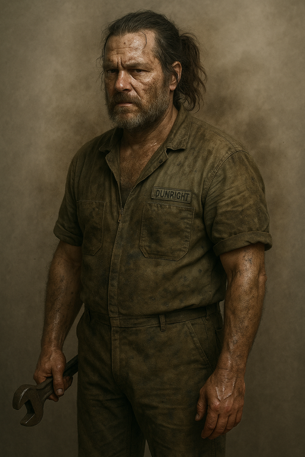

# {{ page.meta.module }}: {{ page.meta.title }}

The crew wakes up from cryo sleep and are verified as cured from the [Carc](carcinids.md) infection by [Dr. Edem](dr-edem.md).
**The Company** runs [Zeke](zeke-sinclair.md) through cognitive defragmentation and he wakes up from his coma.
A smoking man from **The Company** briefs the crew on a new undercover mission to take out the leaders of a group distributing [Sycorax](sycorax.md).
**The Company** surprisingly offers `10K` of equipment to each member of the crew.
[Phoenix](phoenix-dunright.md), a captured inside man, briefs the crew and takes them to [Prospero's Dream](prosperos-dream.md).

<!-- more -->



## Waking Up

- we wake up from cryo sleep
    - [Dex](dex-miro.md) and [Ink](ink.md) have cryo sickness for a week
        - disadvantage on everything
        - can be cured by a stimpack
- [Dex](dex-miro.md), [Carnoc](carnoc-ashbrow.md), and [Ink](ink.md) come out of cryo sleep
    - [Moss](moss.md) and [Dr. Edem](dr-edem.md) aren't around
    - we notice the engines are quiet
- someone went through our stuff and removed [Hinton](hinton.md)'s logic core
- we get changed and make some coffee to recover
- company rep enters
- we've been quarantined for awhile
    - tested for an additional month
    - [Dr. Edem](dr-edem.md) verified the cure worked
- the company quarantined [Zeke](zeke-sinclair.md) and monitored him closely
- a company rep has individual meetings with each of us
    - thanks us for our work

The crew writes a few songs to remember their missing on [Samsa 6](../../../places/samsa-6/index.md)

- [Ballad of Samsa 6](ballad-of-samsa-six.mp3)
- [Murderbot's Rap](murderbots-rap.mp3)

## Zeke Recovers

- company runs [Zeke](zeke-sinclair.md) through a cognitive defragmentation
    - 24 hours of treatment
    - disadvantage on intelligence checks, sanity saves, and fear saves for `4` weeks

/// caption
[Zeke](zeke-sinclair.md) undergoes cognitive defragmentation
///

- company rep check the contract that [Zeke](zeke-sinclair.md) signed
    - medical plan did not cover cognitive defragmentation
    - [Zeke](zeke-sinclair.md) owes `20k`
- the company has another mission ready for us
    - could help with medical expenses

## A New Murderbot

- we meet a new [Murderbot V2](murderbot-v2.md) who looks the same as the old one
    - has no memories of the last mission

/// caption
[Murderbot V2](murderbot-v2.md) is uncannily familiar
///

## Mission Briefing

- we're allowed off our ship
    - the ship we're docked with is brighter and clean
    - even the air quality seems higher
    - it's pretty impressive
    - it's rare for us to be allowed into such a nice place

- we enter an office
    - man in there is smoking
    - there's a lot of smoke in the air
    - manilla folder on the table

/// caption
Company rep briefs us on our next mission
///

- Straightmeyer group found pirates are running illegal drugs out of an unknown space base
    - found a freighter with a group of Teamsters
    - highly addictive substance generated on a space station named [Prospero's Dream](prosperos-dream.md)
    - drug is [Sycorax](sycorax.md)
- no one has ever been able to find [Prospero's Dream](prosperos-dream.md)
    - need a specific frequency and data to transmit to get to the base
- mission goals
    - find the base
    - ingratiate yourself with the leaders there
    - assassinate the leaders or find a way to get assassins onboard
- they think we'll have a better chance if we're not in top condition
    - wounded, stressed, worn down, injured
- [Ink](ink.md) reaches for the manilla folder
    - rep says we need to negotiate contracts first
- [Zeke](zeke-sinclair.md) negotiates his contract
    - `20k` debt nullified
    - company will cover any injuries incurred in this new mission
    - normal pay received (4 months of hazard pay)
- they're sending a Teamster who knows the frequency
    - can get us onto [Prospero's Dream](prosperos-dream.md) without getting caught
    - we may want to eliminate him
        - he's the only one who knows we're working for the company
- company tells [Murderbot V2](murderbot-v2.md) to follow [Carnoc](carnoc-ashbrow.md)'s orders

## Gearing Up

- inventory requirements
    - `2` large items
    - `4` mediums items
    - `8` small items
    - can give up a larger slot to get `2` of the next smaller slot

- company will provide up to `10k` of equipment

- [Dex](dex-miro.md) picks equipment
    - `1500` auto med (x5)
    - `75` first aid kit
    - `200` patch kit (x3)
    - `8000` med scanner
    - `225` left

- [Carnoc](carnoc-ashbrow.md) keeps the Wilbur Mark II anti-material rifle

/// caption
[Carnoc](carnoc-ashbrow.md) is thrilled to keep the Wilbur Mark II anti-material rifle
///

## Meeting Phoenix

- we meet the Teamster contact [Phoenix Dunright](phoenix-dunright.md)
    - looks like a mechanic
    - skin is oily and grimy
    - long, greasy hair tied into a ponytail

/// caption
The crew meets [Phoenix Dunright](phoenix-dunright.md)
///

- [Phoenix](phoenix-dunright.md) punches in coordinates to the rough location
    - we'll need another week after we wake up from cryo sleep
    - [Phoenix](phoenix-dunright.md) enters Cryo sleep first
    - we climb in

## Recovering From Cryo Sleep

- we wake up from cryo sleep 30 min before the [Phoenix](phoenix-dunright.md)
    - everyone has cryo sickness

/// caption
[Zeke](zeke-sinclair.md) has cryo sickness
///

- [Zeke](zeke-sinclair.md) had dreams of being [Hinton](hinton.md) while in cryo sleep
        - recovered from cognitive defragmentation

- [Murderbot](murderbot-v2.md): "Do you want me to murder him?"
    - [Carnoc](carnoc-ashbrow.md): "No, murder will come later"

- [Phoenix](phoenix-dunright.md) wakes up
    - also suffering from cryo sickness

/// caption
[Phoenix](phoenix-dunright.md) has cryo sickness
///

## Phoenix Briefs the Crew

- spend the week getting to know [Phoenix](phoenix-dunright.md)
    - wants to play parcheesi or blackjack
    - seems like a nice guy
    - fixes a few issues on the ship
    - [Phoenix](phoenix-dunright.md): "This is why I left the company a few years ago."
    - [Phoenix](phoenix-dunright.md): "All of us are expendable"
    - [Phoenix](phoenix-dunright.md): "Just little cogs in the wheel man"

- [Carnoc](carnoc-ashbrow.md): "Why are you working fo the company again?"
    - [Phoenix](phoenix-dunright.md): "Because they threatened to murder me..."
    - [Phoenix](phoenix-dunright.md): "They used advanced 'interrogation methods' on me."
    - [Phoenix](phoenix-dunright.md): "I'm not even sure my mates are alive or not."
    - [Phoenix](phoenix-dunright.md): "They quickly separated us when they caught us."

- [Carnoc](carnoc-ashbrow.md): "What are you gonna do after the mission?"
    - [Phoenix](phoenix-dunright.md): "Once I get you to [Prospero's Dream](prosperos-dream.md), I'm saying adios, guys."
    - [Phoenix](phoenix-dunright.md): "I'm back to living the dream."
    - [Carnoc](carnoc-ashbrow.md): "You're not gonna rescue the rest of your crew?"
    - [Phoenix](phoenix-dunright.md): "I mean, I love those guys."
    - [Phoenix](phoenix-dunright.md): "But I know if they were in my position, they would not try and go back and rescue the rest of them."
    - [Phoenix](phoenix-dunright.md): "The Teamsters Union on [Prospero's Dream](prosperos-dream.md), they might have some other ideas. Teamsters Local 32819."
    - [Phoenix](phoenix-dunright.md): "We don't have any cool slogans or anything, but, there's a calendar they put out every year that has jokes in it. I like that calendar."
    - [Phoenix](phoenix-dunright.md): "I', just gonna go back to running [Sycorax](sycorax.md). It's the life, man."

- [Phoenix](phoenix-dunright.md): "Try not to be too shocked when you start seeing everybody on [Prospero's Dream](prosperos-dream.md)."
    - [Carnoc](carnoc-ashbrow.md): Why is that?
    - [Phoenix](phoenix-dunright.md): "When you're working for the company they highly dissuade people from getting any kind of cyber modification."
    - [Phoenix](phoenix-dunright.md): "[Prospero's Dream](prosperos-dream.md) is ... pro everything the company prohibits."
    - [Phoenix](phoenix-dunright.md): "Cyber mods everywhere. You're gonna see people with camera eyeballs and jet packs built into their backs."
    - [Ink](ink.md): "Cool!"
    - [Phoenix](phoenix-dunright.md): "All kinds of shit."
    - [Carnoc](carnoc-ashbrow.md): "Do you have any cyber mods?"
    - [Phoenix](phoenix-dunright.md): "No. I was saving up for some, though."
    - [Phoenix](phoenix-dunright.md): "Do I look like my only cyber mod would be greasy? Like greasy skin, greasy hair?"
    - [Murderbot](murderbot-v2.md): "That's so funny, ha ha!"
    - [Phoenix](phoenix-dunright.md): "You better tell your bot to start acting normal."
    - [Phoenix](phoenix-dunright.md): "People pick up that there's an Android, they're gonna start to wonder."
    - [Phoenix](phoenix-dunright.md): "You're gonna think that everybody on this place is an Android with how much cyber modification there is."
    - [Phoenix](phoenix-dunright.md): "But he'll give away that you guys are with the company if he's not playing it cool."

- [Phoenix](phoenix-dunright.md) programs the exact coordinates
    - a week passes
    - [Phoenix](phoenix-dunright.md) sends the transmission

## Preparing Backgrounds

- we prepare our story
    - we're fed up with the company, much like [Phoenix](phoenix-dunright.md)
    - we're supposed to be doing a mission but we're ignoring it
    - company destroyed [Phoenix](phoenix-dunright.md)'s ship
    - we picked him up from an escape pod

- [Ink](ink.md) opens the manilla folder
    - it has our contracts, but that's pretty much it
    - [Ink](ink.md): "Um, [Murderbot](murderbot-v2.md)..."
    - [Carnoc](carnoc-ashbrow.md): "You should probably hide our contracts."
    - [Ink](ink.md): "[Murderbot](murderbot-v2.md), eat them!"
    - [Dex](dex-miro.md): "Maybe with some ketchup?"
    - [Ink](ink.md): "That's right."

/// caption
[Murderbot](murderbot-v2.md) eats the contracts
///

## Arrival

- approach [Prospero's Dream](prosperos-dream.md)
    - it's huge
    - estimate population of 1 million
    - ships going in and out

/// caption
Exterior of [Prospero's Dream](prosperos-dream.md)
///

- [Phoenix](phoenix-dunright.md) briefs us
    - thorough decontamination on arrival
        - hosed down
        - "It will be rough, but don't take it personally. They do it to everybody."
    - will search the ship for biological or chemical threats
    - manifest altered to match
    - will not be able to bring heavy armaments
        - no heavy rifle

- our ship flies into the hangar bay
    - it re-pressurizes
    - we're able to disembark
    - a Q team approaches the ship
    - they describe exactly what [Phoenix](phoenix-dunright.md) mentioned
    - suggest leaving personal belongings behind

## Decontamination

- we submit to decontamination
    - it's not a pleasant process
    - spray us with sticky foam
    - scrub with rough bristles
    - it's a little painful

/// caption
Crew submits to decontamination
///

## Paying for Air

- team describes how we pay for air
    - we receive O2 cred sticks
        - ask how much to transfer, `10` credits/day
        - [Ink](ink.md) does `30` days for `300` credits
        - everyone else does the same
    - if we're caught with it empty, we go to DopTown (de-oxygenated people town)
        - we don't want to go there

- if we want to store forbidden items we can get a locker
    - it's keyed to your fingerprints
    - "Don't lose your fingerprints"

- do not enter unauthorized areas, particularly the choke
    - it's in DopTown, you don't want to go there
