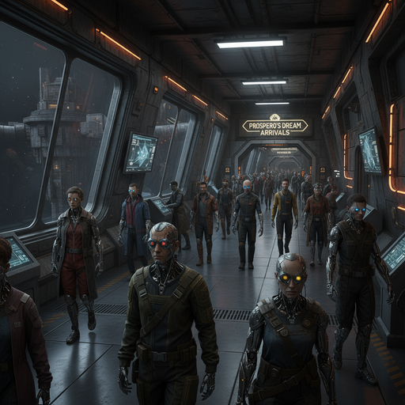
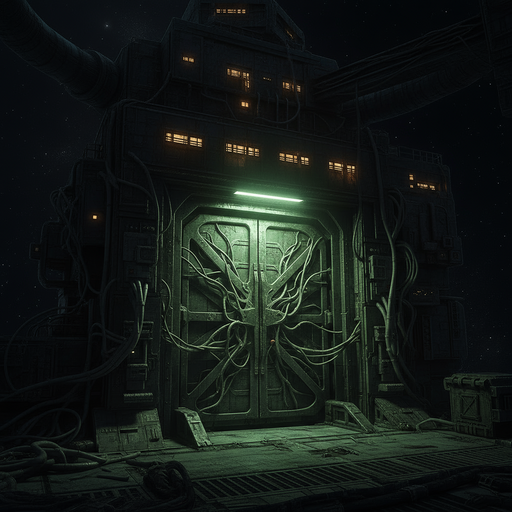
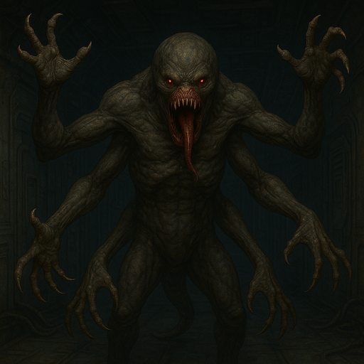
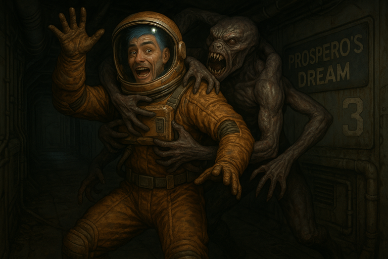
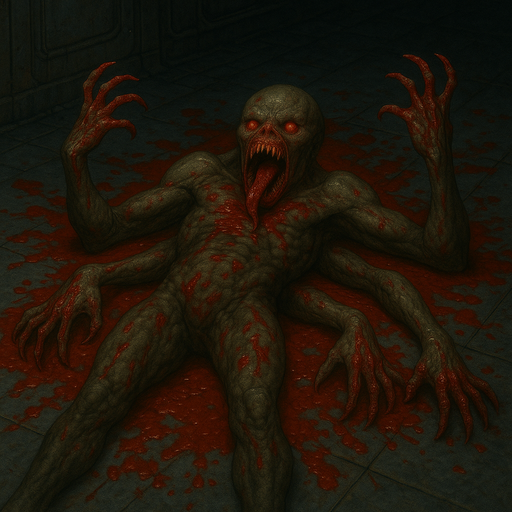
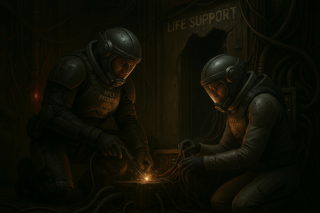

# {{ page.meta.module }}: {{ page.meta.title }}

The crew explore [Prospero's Dream](prosperos-dream.md) during some much needed R&R.
[Ink](ink.md) and [Murderbot](murderbot-v2.md) accept a mission to find [Imogene Kane](imogene-kane.md) in [DOPTown](doptown.md).
[Zeke](zeke-sinclair.md) promises to save the people in [DOPTown](doptown.md), who are barely surviving on minimal O~2~.
They take us directly to [Imogene](imogene-kane.md), who gives us directions to the air processing plant.
On their way, the crew is ambushed by a group of spearmen, another group of children, and a mysterious creature.
[Zeke](zeke-sinclair.md) and [Murderbot](murderbot-v2.md) repair the air processing plant, earning [Imogene](imogene-kane.md)'s trust.

<!-- more -->



## Exploring the Station

- we notice many augmented people on the station

/// caption
People on [Prospero's Dream](prosperos-dream.md) have extensive mods
///

- smells a bit like sweat mixed with alcohol
    - feels like there is a party going on nearby
- [Phoenix](phoenix-dunright.md) thanks us and starts walking away
- [Ink](ink.md) tails [Phoenix](phoenix-dunright.md) for about 3 hours
    - passes by (4) [Icebox](icebox.md)
        - "Need a new body? Get re-sleeved or enjoy our slickware."

/// caption
[Icebox](icebox.md) has new bodies for sale
///

- (2) bunch of bars
    - most popular place is [Stellar Burn](stellar-burn.md)
    - as [Phoenix](phoenix-dunright.md) walks by, the lights go out
    - hear the sound of a heartbeat and labored breathing
- at (5) [Phoenix](phoenix-dunright.md) approaches a residential doorway
    - door opens and he visibly sighs
- [Prospero's Dream](prosperos-dream.md) is an X class station
- we take shore leave for `48` days
    - costs `4800` credits `+480` for the air `5280`
- bartender's name is [Jury Semenov](jury-semenov.md), who goes by [Sem](jury-semenov.md)
    - upper level is quiet, for private conversations
    - lover level is [The Ecstasy](the-ecstasy.md), run by [Indayl](indayl.md)
        - has an eye mod and an impossibly long tongue

/// caption
[Indayl](indayl.md), proprietor of [The Ecstasy](the-ecstasy.md)
///

- [Zeke](zeke-sinclair.md) tries to get some [Sycorax](sycorax.md)
    - it's the good stuff, so it costs `1K`
- the Farm is kind of a holy site
    - Solarian church
    - leader is [Ukko-Ukka](ukko-ukka.md)
    - worships a sun deity

/// caption
[Ukko-Ukka](ukko-ukka.md), leader of the Solarian Church
///

- the [Chop Shop](chop-shop.md) is the best place to go for cyberware mods
    - ask for [Babushka](babushka.md)
- we ask [Sem](jury-semenov.md) about some places to look for work
- Tempest company - mercenary work
    - doesn't pay well, 10% kickback required
- [Canyon Heavy.Market](canyon-heavy-market.md)
    - zero-g LAN party
    - computers floating in space with people hacking away
    - owner is [Ingus](ingus.md)
    - customers are called **Council Cowboys**

/// caption
[Canyon Heavy.Market](canyon-heavy-market.md) looks like a zero-g LAN party
///

/// caption
[Ingus](ingus.md), owner of [Canyon Heavy.Market](canyon-heavy-market.png)
///

- court
    - head justice is [Brunhilda](brunhilda.md)

/// caption
[Brunhilda](brunhilda.md), head justice
///

- [Golyanovo Il Bratva](bratva.md)
    - intelligence arm of station leaders
    - run by [Yandy](yandy.md)
    - tempest is often hired by [Bratva](bratva.md)
- [Dex](dex-miro.md) works at a bar
    - tries to overhear some rumors
        - crackdown from the company has strained relationship between Teamster's union and [Bratva](bratva.md)
    - local union is `32819L`
    - [Ingus](ingus.md) pays really well but you need to gain his trust
- [Ink](ink.md) and [Murderbot](murderbot-v2.md) try to win some games at [Canyon Heavy.Market](canyon-heavy-market.md)
    - other players seem like they're speaking another language
    - seems like the games are about stealing others' information
- areas (9) and (10) are [DopTown](doptown.md)
    - entrance to the choke
    - resistance has been brewing
        - leader's name is [Imogene Kane](imogene-kane.md)

## DOPTown

### Traveling to DOPTown

- [Ink](ink.md) and [Murderbot](murderbot-v2.md) are offered a mission to contact [Imogene Kane](imogene-kane.md)
- [Ink](ink.md) is able to get an empty cred stick for `100`
    - [Murderbot](murderbot-v2.md) gets one for `200`
- we see a guy with 6 tempest company guards around him
    - hired from the Tempest Company for `1K`/guard/day
- we gear up in hazard suits and get O~2~ tanks
    - go down the turbolift to [DopTown](doptown.md)

/// caption
Entrance to [DopTown](doptown.md)
///

- [DopTown](doptown.md) is big, could fit a ship
    - when doors open, there is a rush of air
    - some heavily armored guards pointed away from the gate into [DopTown](doptown.md)
    - some people try to breathe in the rush of air
- [Zeke](zeke-sinclair.md) starts talking to people about how he could bring oxygen into [DopTown](doptown.md)
    - if only [Zeke](zeke-sinclair.md) had the funding for his machine
    - rumors spread like wildfire
    - guard thinks [Zeke](zeke-sinclair.md)'s going to get torn apart when he can't make the oxygen
- people seem really desperate down here
    - there are dead bodies around
    - but not decomposing due to lack of oxygen
- guard hands us passes to get out of [DopTown](doptown.md)
    - warns us not to lose them
- guy with the 6 guards is in a market area
    - people are bidding on services
    - pays people to cut off their own fingers
    - gives them O~2~ tanks
- [Zeke](zeke-sinclair.md): "It's a great place down here guys"
- we visit the slums of [DopTown](doptown.md)
- people have moving flesh on their necks that looks like fish gills
    - "Wait, are you that scientist?"
    - seems like streets have cleared out

### Meeting Imogene Kane

- 5 heavily armed guards approach us
    - "Heard you wanted to speak with [Imogene Kane](imogene-kane.md)"
    - "We're here to take you to her. Follow us"

/// caption
[Imogene Kane](imogene-kane.md)
///

- [Imogene](imogene-kane.md): "So you're the scientist that can fix the air"
    - [Zeke](zeke-sinclair.md): "If only I had my equipment, the theory is sound"
    - [Imogene](imogene-kane.md): "I have equipment. There's a broken life support tower not far from here."
    - [Imogene](imogene-kane.md) pulls out a map.
    - [Imogene](imogene-kane.md): "It's a 4 hour walk from here"
    - [Zeke](zeke-sinclair.md): "What equipment is there?"
    - [Imogene](imogene-kane.md): "I have repair team that recently left..."
    - [Imogene](imogene-kane.md): "They had all the tools that were necessary to fix it."
    - [Imogene](imogene-kane.md): "They say there's a monster in the life support system."
    - add more from transcript
- [Murderbot](murderbot-v2.md) places a tracker in [Imogene](imogene-kane.md)'s pocket
- [Imogene](imogene-kane.md) doesn't seem to struggle to breathe like the others
    - [Imogene](imogene-kane.md) pulls down her scarf and has gills
    - [Ink](ink.md): "How did you get those?"
    - [Imogene](imogene-kane.md): "There's a doctor down here, he's a geneticist named Dr. Benkali"
    - [Imogene](imogene-kane.md): "It doesn't work for everybody, that's why we still need to fix the air."
- [Imogene](imogene-kane.md): "I don't believe in monsters, so hopefully there's nothing to be afraid of."
    - "Hopefully those guys were just assholes and they're taking their time or something."
- we head towards the life support system
    - an hour out of [DopTown](doptown.md)
    - slums have mostly disappeared
    - some bodies, but hardly any living people

### Ambushed by Spears

- around a corner, we see a group of 3 wielding spears
    - 2 more behind us
    - spear wielder: "You got oxygen?"
    - [Murderbot](murderbot-v2.md): "Leave us alone, we're trying to get you all the oxygen you can breathe!"
    - spear: "How are you gonna do that?"
    - [Murderbot](murderbot-v2.md): "We're trying to fix the regulator!"
    - spear: "Yeah, we just ran into some guys. Two, that said they were doing that."
    - [Murderbot](murderbot-v2.md): "And what'd you do to them?"
    - spear: "Well, that's one of them over there"
    - you see a guy who clearly has been pierced by spears.
    - [Murderbot](murderbot-v2.md): "What'd you do that for?"
    - spear: "Because they didn't want to give us their O2 tanks."
    - [Murderbot](murderbot-v2.md): "But he was trying to save your lives!"
    - [Murderbot](murderbot-v2.md): "You are either gonna be riddled with bullet holes, or you let us through and help you."
    - we intimidate them with our pulse rifles
    - as soon as one of them breaks, uh, the rest easily fold and run off
- another hour passes

### Ambushed by Children

- see a child laying face down on the ground
    - hear crying but child isn't moving
    - hear scuffling off to the side
    - child on the ground: "Kill me"
    - gets up and runs at us
    - [Murderbot](murderbot-v2.md) tries to hit it with the butt of the rifle
        - caves in its forehead
    - another leaps down on him
- 8 more children come out of the darkness
    - [Ink](ink.md) fires a clip and takes out 4 of them
- [Dex](dex-miro.md) tries to pry the one off [Murderbot](murderbot-v2.md)
    - gets the child free but the arms are still wrapped around [Murderbot](murderbot-v2.md)'s neck
    - child screams "Kill Me!"
    - [Dex](dex-miro.md) snaps its neck, but is haunted by the experience
    - the arms fall to the ground
- [Carnoc](carnoc-ashbrow.md) shoots at the other 4
    - killed them but emptied the magazine
    - [Murderbot](murderbot-v2.md) and [Carnoc](carnoc-ashbrow.md) swap magazines

## The Processing Plant

### Approaching the Plant

- we approach a building aglow with light
    - in front is a massive cracked door
    - many wires cross the door like veins
    - building is 2-3 stories tall
    - walking around it would take 5-10 minutes

/// caption
Door to the Processing Plant
///

- walk around and look for another way in
    - find a small entrance marked `EST-03`
    - Environmental Scrubbing Tower
    - hole gouged in the side of the building
    - big enough for a person to squeeze through
- [Ink](ink.md) volunteers [Murderbot](murderbot-v2.md) to go through first
    - have to take off hazard suits to squeeze through
        - put them back on afterwards
        - while changing, our lungs strain to get any air at all
        - lungs are burning, feel like we're drowning
- no light inside the building
    - we turn on flashlights
    - machinery is running, but barely
- arrive at control rooms
    - terminal banks are powered down
    - rusty, crumbling staircase up nearby
    - we go one at a time and it groans under our weight
- find a door labeled **Processing Plant**
    - pry it open
- enter neighboring room
    - find `3` bloodless corpses
    - stash of pulse rifle ammo
    - `3` tanks with a total of `19` hours of O~2~

### Ambushed by a Creature

- [Ink](ink.md) takes a look at the corpses
    - 4 puncture wounds on their necks
    - [Murderbot](murderbot-v2.md) scans the room

/// caption
A creature leaps out of the darkness
///

/// caption
The creature grabs [Ink](ink.md)
///

- something comes down from the ceiling at [Ink](ink.md)
    - it has 6 arms
    - it grabs [Ink](ink.md) and tries to drag him up the wall
- [Murderbot](murderbot-v2.md) grabs onto the thing and yanks it down off the wall
    - [Carnoc](carnoc-ashbrow.md) shoots it
    - it screams in an oddly human way
    - starts bleeding profusely from its chest
- [Ink](ink.md) pulls out his SMG and shoots it
    - shoots another hole in its chest
- [Zeke](zeke-sinclair.md) fires at it, more holes in its chest
- [Dex](dex-miro.md) attacks it with his spanner
    - sickening crunch as the spanner lodges in its head

/// caption
Dead creature on the floor of the processing plant
///

- [Dex](dex-miro.md) and [Zeke](zeke-sinclair.md) take a closer look at the thing
    - looks like it was once human
    - topmost arms seem most normal but are higher than usual
    - extra arms below have both wires and tendons
    - another set of arms near hips
    - jaw disjointed so that it's much larger
        - has 4 long fangs
    - [Dex](dex-miro.md) uses a med scanner
        - most of the DNA is human
        - some kind of cancer has altered the creature
        - has redundant organs, lungs, heart, etc.

### Repairing the Plant

- in the next room we find the processing plant
    - [Zeke](zeke-sinclair.md) and [Murderbot](murderbot-v2.md) work on it

/// caption
[Zeke](zeke-sinclair.md) and [Murderbot](murderbot-v2.md) fix the processing plant
///

- we can feel the air flowing
    - [Zeke](zeke-sinclair.md) takes his helmet off and takes a deep breath
    - there's plenty of oxygen but it starts to smell a bit off

## Debrief with Imogene

- at the edge of the slums, the 5 guards approach us
    - they take us to a safe house
- [Imogene](imogene-kane.md) shows up a few hours later
    - [Imogene](imogene-kane.md): "Goddammit, you did it!"
    - "I could see the children. They can breathe again"
- "Was there a monster?"
    - [Ink](ink.md) shows the head
    - [Imogene](imogene-kane.md): "Holy shit, what the fuck is that?"
    - [Murderbot](murderbot-v2.md): "We don't know. We thought you might know."
    - [Carnoc](carnoc-ashbrow.md): "We're new here."
    - [Imogene](imogene-kane.md): "I don't know what the hell that thing is. Uh, I've never seen anything like that."
    - "That's what destroyed the air filters? The Life Support Tower?"
    - [Ink](ink.md): "Not sure about that, but it might have kept it from getting fixed."
    - [Ink](ink.md): "We're worried there's more foul play going on here, and we think you should protect it."
- [Ink](ink.md): "What do you know about the people running this base?"
    - [Imogene](imogene-kane.md): "Oh, the [Bratva](bratva.md)? They're not terrible. They're just mostly greedy"
    - "The people sent down here into Dop Town... It's really just a matter of money. It's not malicious."
    - "There are a few in Tempest Company that take joy in harming people, and seeing our suffering, but for the most part, it's just a matter of financial distribution. You know, they want to be rich."
    - "We can't pay, they put us down here. If we've got O~2~ for free, they don't have anything on us anymore."
- we ask about the hacker bounty
    - [Imogene](imogene-kane.md)'s forces have carried out some attacks
- [Ink](ink.md) asks if she knows anything about the [Sycorax](sycorax.md) trade?
    - [Imogene](imogene-kane.md): "I'll tell you everything I know..."
