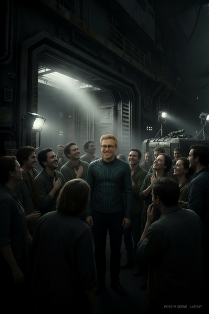
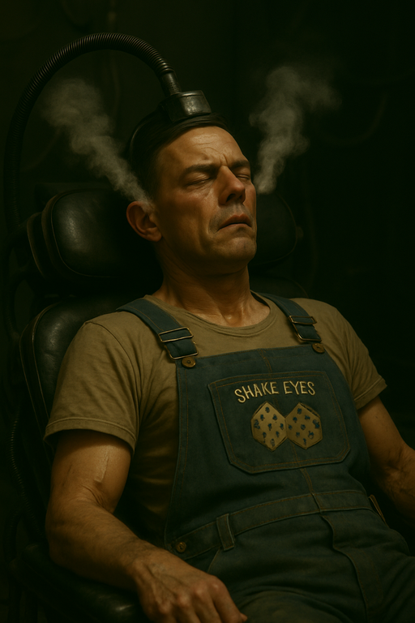

# {{ page.meta.module }}: {{ page.meta.title }}

[Imogene](imogene-kane.md) tells the crew everything she knows about [Sycorax](sycorax.md) distribution.
[Ukko-Ukka](ukko-ukka.md) of the Solarian Church makes the drug, and [DopTown](doptown.md) is somehow involved in the process.
[Yandy](yandy.md), leader of [Golyanovo Il Bratva](bratva.md), is in charge of the whole operation.
[Imogene](imogene-kane.md) cuts off her own finger as proof that we found her.
The crew is "escorted" by armed guards to see [Yandy](yandy.md) and [Ingus](ingus.md).
[Yandy](yandy.md) offers us a job to attract and destroy some **The Company** higher-ups.
We look at available [sleeves](icebox.md#sleeves), but they're too expensive.
The crew considers how to spend [Yandy](yandy.md)'s `100K` advance on [slickware](icebox.md#slickware) and [cyberware](chop-shop.md#cyberware).
[Murderbot](murderbot-v2.md) goes into surgery first but starts having a reaction.
The [Babushka](babushka.md) diagnoses [Murderbot](murderbot-v2.md) and finds that he already had mods secretly installed by **The Company**.

<!-- more -->



## Imogene Explains Sycorax

- [Imogene](imogene-kane.md) explains what she knows about [Sycorax](sycorax.md)
    - [Imogene](imogene-kane.md): I've been working with [Ukko-Ukka](ukko-ukka.md)
    - [Imogene](imogene-kane.md): They lead the Solarian Church and have been making [Sycorax](sycorax.md) for [Yandy](yandy.md)
    - [Yandy](yandy.md) uses the Teamster's Union to distribute [Sycorax](sycorax.md)
    - [Ukko-Ukka](ukko-ukka.md) had been helping with food and oxygen around [DopTown](doptown.md)
    - now that the oxygen is fixed, they can spend more time on [Sycorax](sycorax.md)
    - They come down to the choke, they might be harvesting something down there
- The choke is a 20 story cliff above a mostly abandoned city
    - I don't think you should go there.

- [Ink](ink.md) asks about the plan to save people in [DopTown](doptown.md)
    - find a set of tunnels leading to the [Icebox](icebox.md)
    - [DopTown](doptown.md) residents would download themselves into sleeves
    - there are stories about people going a bit crazy if they stay in both their original body and the new sleeve

- [Dex](dex-miro.md): Does [Ukko-Ukka](ukko-ukka.md) make [Sycorax](sycorax.md) for distribution outside [Prospero's Dream](/places/prosperos-dream/index.md)?
    - I don't think [Ukko-Ukka](ukko-ukka.md) really has an interest in distributing it, but [Yandy](yandy.md) has something on everyone...

## Imogene Sends Proof

- [Ink](ink.md): [Ingus](ingus.md) sent us down here to locate you
    - [Imogene](imogene-kane.md): Well, that means I made a name for myself enough that [Yandy](yandy.md)'s probably trying to figure out where I am and how to kill me
    - [Zeke](zeke-sinclair.md): Don't worry, we're not going to
    - [Imogene](imogene-kane.md): I wouldn't blame you if you did, but you can tell them that you guys fixed this thing and we're done
    - [Imogene](imogene-kane.md) pulls off her glove, pulls out a knife, cuts off her trigger finger, hands it to you, and them stems the bleeding
    - [Zeke](zeke-sinclair.md): Thanks, lady...
    - [Imogene](imogene-kane.md) goes a bit pale: "They'll know I'm done fighting"
    - [Ink](ink.md) hands the finger to [Murderbot](murderbot-v2.md)

## Zeke's Followers

- we head back to the elevate up out of [DopTown](doptown.md)
    - [DopTown](doptown.md) residents are cheering for [Zeke](zeke-sinclair.md), trying to touch him, and breathing on him as a sign of respect
    - "It's [Zeke](zeke-sinclair.md), He saved us all!"

/// caption
[DopTown](doptown.md) residents cheering for [Zeke](zeke-sinclair.md)
///

- Colonel Antonio: "Don't go getting in your heads that you're worth any more that because he saved you and put oxygen in your lungs"
    - "You guys still live down here. You're not getting out."
    - [Zeke](zeke-sinclair.md): "[Zeke](zeke-sinclair.md) will fix that, too."
    - Cheers go up: "[Zeke](zeke-sinclair.md)! [Zeke](zeke-sinclair.md)! [Zeke](zeke-sinclair.md)! [Zeke](zeke-sinclair.md)!"
    - Colonel Antonio glares at [Zeke](zeke-sinclair.md): "Don't go riling them up and give them hope. There's no hope down here."
    - [Zeke](zeke-sinclair.md): "Never mind, Colonel."
    - Colonel Antonio: "You cannot get back into the dream without a pass."

- we wait 30 minutes for the elevator
    - cheesy electronic music plays on the way up

## Meeting Yandy

- elevator opens to a group of 13 heavily armed guards
    - one holds up a wristwatch which displays a hologram of [Zeke](zeke-sinclair.md)'s face
    - "You're coming with us, [Yandy](yandy.md) wants to talk"
    - they escort us into [Canyon Heavy.Market](canyon-heavy-market.md)
    - we go through a door into a server room with more serious inhabitants
    - through yet another door is [Ingus](ingus.md)'s office
    - it's cramped
    - [Yandy](yandy.md) is sitting in here
    - [Ingus](ingus.md): Yup, that's them

/// caption
[Yandy](yandy.md), leader of [Golyanovo Il Bratva](bratva.md)
///

- [Yandy](yandy.md) pays us `10K` for finding [Imogene](imogene-kane.md)
    - [Murderbot](murderbot-v2.md) spits the finger at her
    - [Ingus](ingus.md) checks the genes
    - [Yandy](yandy.md): "I owe you quite a bit more"
    - [Yandy](yandy.md): "[Ingus](ingus.md), give them another half mil"
    - [Ink](ink.md): "I think we could retire"

## Another Job

- [Yandy](yandy.md): "Before you do that, I have another job for you"
    - [Phoenix](phoenix-dunright.md) quickly "volunteered" that we were working for the company
    - [Yandy](yandy.md) thinks **The Company** wants to take over the [Sycorax](sycorax.md) trade
    - they're using us to extend their market share

- [Murderbot](murderbot-v2.md): What's your proposal?
    - [Yandy](yandy.md): "I think burning trash is appropriate"
    - "You'll carry a briefcase, go on the ship, and leave the briefcase behind."
    - "I'd like you to try to attract some attention."
    - "I'll give you a sufficiently attractive thing such that you might get a CEO or some higher-up in The Company."
    - [Murderbot](murderbot-v2.md): "In return for this?"
    - [Yandy](yandy.md): "2 million credits"
    - [Murderbot](murderbot-v2.md): "Each?"
    - [Yandy](yandy.md): "Hmm, well that's a hard bargain... A million each."
    - [Yandy](yandy.md) offers up to `100K` each in modifications up front
    - [Ingus](ingus.md) will have another job for us when we get back.
        - It will be a separate payment, and we're not required to accept.

- [Zeke](zeke-sinclair.md): "I'd like your assurances that the oxygen in [DopTown](doptown.md) will stay on."
    - [Yandy](yandy.md): "The oxygen will stay on, I don't need to make anybody suffer down there."

- [Yandy](yandy.md) sighs: "If you'd like a day to talk amongst yourselves, go to Heaven."
    - [Ingus](ingus.md) makes sure there are no listening devices there

## Considering Mods

- We stop by [Icebox](icebox.md) to look at available sleeves

- crew spends awhile studying available mods:
    - [Slickware](icebox.md#slickware) at [Icebox](icebox.md)
    - [Cyberware](chop-shop.md#cyberware) at [Chop Shop](chop-shop.md)

## Murderbot's Mod Install

- [Murderbot](murderbot-v2.md) gets Cyberware and Slickware installed
    - [Ink](ink.md) watches [Murderbot](murderbot-v2.md) starts twitching

/// caption
[Murderbot](murderbot-v2.md)'s surgery does not go well
///

- tech screams at the other one "That's an android in there? What did you do that for? Why'd you plug that in?"
    - "Unplug them, we gotta get them to the [Babushka](babushka.md)"

/// caption
[Babushka](babushka.md), owner of the [Chop Shop](chop-shop.md)
///

- [Babushka](babushka.md) takes [Murderbot](murderbot-v2.md) in the back
    - there are several rooms with blood everywhere
    - this place is not sanitary

- [Murderbot](murderbot-v2.md) already had mods installed by **The Company**, which caused him to exceed limits.
    - Panic Button
    - OGRE
    - Holo Pet

## Epilogue: Zeke's Song

The crew hear of a song celebrating [Zeke](zeke-sinclair.md) fixing the air processing plant in [DopTown](doptown.md).

- [The Man We Call Zeke](TheManWeCallZeke.mp3)
