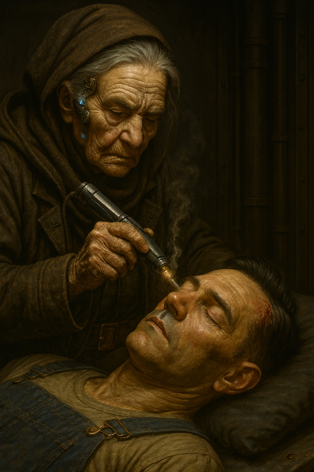
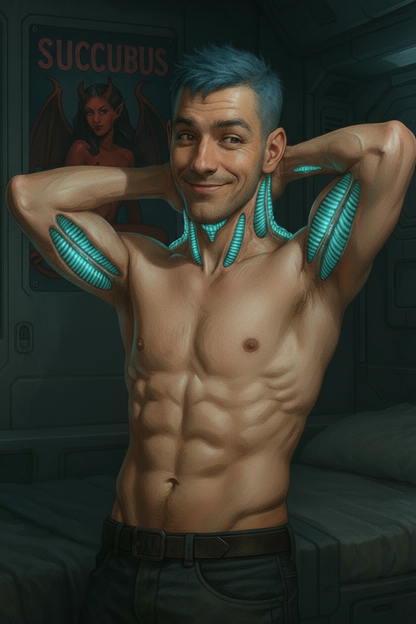
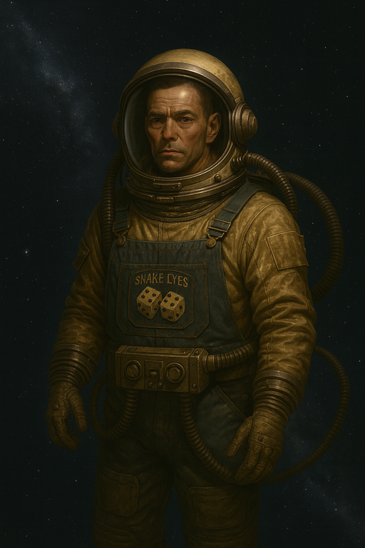
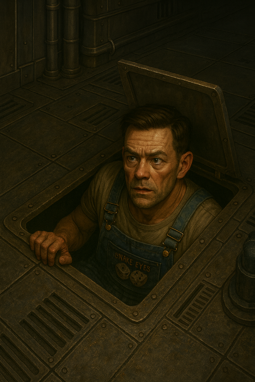
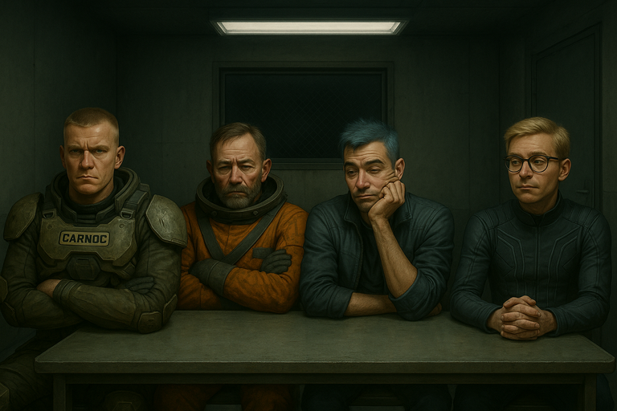
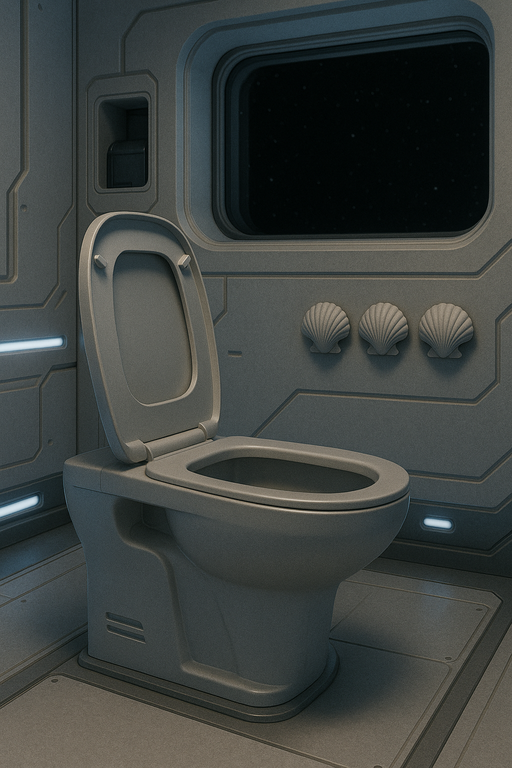
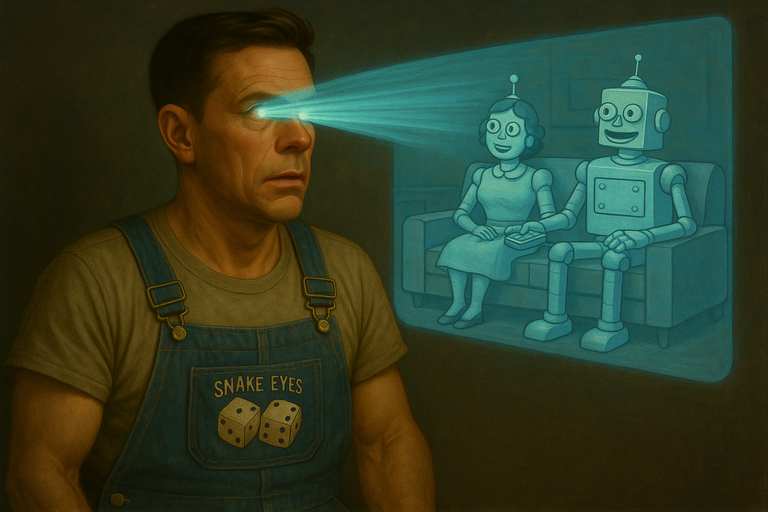
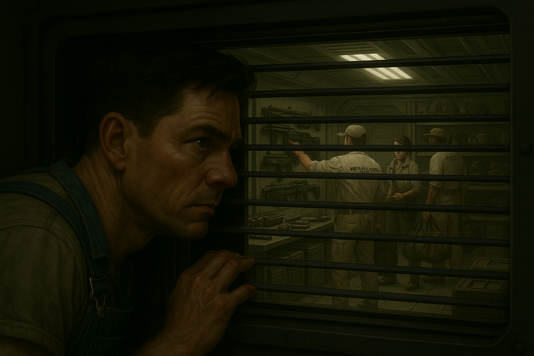
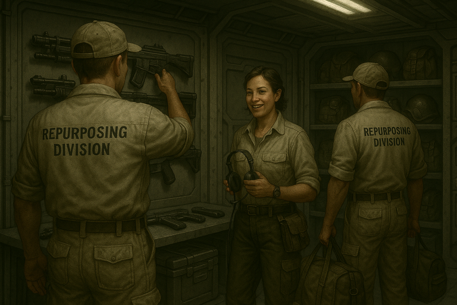

# {{ page.meta.module }}: {{ page.meta.title }}

[Babushka](babushka.md) finishes repairing [Murderbot](murderbot-v2.md) after his mod overload.
[Murderbot](murderbot-v2.md) learns that he has a panic button which is now controlled by [Carnoc](carnoc-ashbrow.md).
The rest of the crew get mods installed mostly uneventfully, except that [Ink](ink.md) grows some new vents.
We learn how some of the crew relaxed over the last month via sex, exercise, painting, and talking.
The crew return to **The Company** ship, coming up with a cover story for [Yandy](yandy.md)'s plan.
[Murderbot](murderbot-v2.md) hides out in the ship to avoid having their black box read.
The [Smoking Man](smoking-man.md) reviews the data stick and keeps the crew in holding while waiting for the CEO to arrive.
[Ink](ink.md) hides the case, which the crew believes is a nuclear weapon, behind a toilet on the company ship.
[Murderbot](murderbot-v2.md) spies on a **Repurposing Division** crew removing the crew's items from their ship.
The Company CEO asks about [Sycorax](sycorax.md) production and offers another mission to obtain some **Solarian Fruit** for analysis.
[Ink](ink.md) starts blabbing the truth, and [Smoking Man](smoking-man.md) reveals the drugs did their job.

<!-- more -->



## Rebooting [Murderbot](murderbot-v2.md)

- [Carnoc](carnoc-ashbrow.md) asks about the panic button
    - [Babushka](babushka.md) investigates
    - anyone directly threatening **The Company** would trigger it
    - [Carnoc](carnoc-ashbrow.md) comes up with an unsafe word phrase
    - [Babushka](babushka.md) rewrites the code
- we remove the Pilot Skillslick from [Murderbot](murderbot-v2.md) to fix his overclock

/// caption
[Babushka](babushka.md) repairs [Murderbot](murderbot-v2.md)
///

- [Babushka](babushka.md) says through [DopTown](doptown.md) into the sink there's a graveyard where we could harvest old cyberware
- [Murderbot](murderbot-v2.md) boots up
- [Carnoc](carnoc-ashbrow.md): "Did you know you have a panic button?"
    - [Murderbot](murderbot-v2.md): "A panic button? What is that?"
    - [Carnoc](carnoc-ashbrow.md):  "Um… it can cause you to detonate."
    - [Murderbot](murderbot-v2.md): "That is insane. Why would I have a panic button?"
    - [Carnoc](carnoc-ashbrow.md):  "It looks like the company wanted you to spy on us."
    - [Murderbot](murderbot-v2.md): "I have no such directive from the company. Is the panic button now gone?"
    - [Carnoc](carnoc-ashbrow.md): "No, it's still there."
    - [Murderbot](murderbot-v2.md): "What will cause this panic button to go?"
    - [Carnoc](carnoc-ashbrow.md): "It used to be people around you talking negative things about the company, like planning or plotting against the company."
    - [Dex](dex-miro.md): "I'm honestly surprised we hadn't set it off already by accident."
    - [Murderbot](murderbot-v2.md): "There is still a panic button inside me. Is this correct? What will trigger this panic button?"
    - [Carnoc](carnoc-ashbrow.md): "Me saying a word. Or your death."
    - [Murderbot](murderbot-v2.md): "What is this word? Well, please write it down, so that I may know to avoid it."
    - [Carnoc](carnoc-ashbrow.md): "No, only I can say it. It has to be my voice."
    - [Murderbot](murderbot-v2.md): "Well, yes, but it is your voice, so don't say it. Just write it down."
    - [Carnoc](carnoc-ashbrow.md): "I won't say it, or write it down. I don't anticipate needing it."
    - [Murderbot](murderbot-v2.md): "I hope not! But as of now, there is no word that is programmed to trigger the panic button, is that correct?"
    - [Carnoc](carnoc-ashbrow.md): "No, there is. I just didn't tell anyone what it was."
    - [Carnoc](carnoc-ashbrow.md): "Murderbot, you can feel safe. You don't need to be concerned about this. That's an order."
    - [Murderbot](murderbot-v2.md): "Order received."

## Installing Mods

- [Ink](ink.md) gets some cyberware installed
    - semi-organic vents form on [Ink](ink.md)'s neck and underarms
    - adds slickware
    - gains stress equal to the number of slots

/// caption
[Ink](ink.md) shows off his new vents
///

- [Zeke](zeke-sinclair.md) gets cloakskin cyberware installed
    - no issues

- [Carnoc](carnoc-ashbrow.md) gets cyberware installed
    - gets slickware installed with no issues

- [Dex](dex-miro.md) gets cyberware installed
    - adds slickware
    - gains stress equal to the number of slots

## Reducing Stress

- [Ink](ink.md) reduces `8` stress by having consensual sex
- [Dex](dex-miro.md) paints and it takes awhile but he eventually relaxes, reducing `8` stress
- [Carnoc](carnoc-ashbrow.md) works out and it takes a couple days but he reduces `6` stress
- [Zeke](zeke-sinclair.md) spends time with his followers and reduces `2` stress

/// caption
[Dex](dex-miro.md) relaxes by painting
///

## Returning to The Company

- we head back to see **The Company**
    - a case is mysteriously on our ship
    - get into cryo sleep
    - [Murderbot](murderbot-v2.md) monitors the autopilot and crew
- [Murderbot](murderbot-v2.md) sits next to [Carnoc](carnoc-ashbrow.md)'s sleep pod
- [Murderbot](murderbot-v2.md) wishes he could pilot himself
    - is taunted by the computer
- a few months pass
- a week before rendezvous, [Murderbot](murderbot-v2.md) takes us out of cryo sleep
    - [Carnoc](carnoc-ashbrow.md), [Ink](ink.md), and [Zeke](zeke-sinclair.md) have cryo sickness

## Inspecting the Case

- we take a closer look at the case
    - it has a note and a data stick
    - says we're likely to be interrogated
- we inspect data stick
    - contains trade routes starting from a fake location
    - trade manifests have signatures of company ships
    - details of [Sycorax](sycorax.md) production
    - high-level communications from within **The Company**
        - middle and upper management
        - shows they are involved in trading [Sycorax](sycorax.md)
    - we're not sure how much of it is true
- [Ink](ink.md) and [Zeke](zeke-sinclair.md) try to find a way to scan the briefcase
    - [Ink](ink.md) is able to reconfigure external scanners to point inside the ship
    - spend some time scanning the case
    - it's radioactive but can't identify the source material
    - there are electronic components inside

## Cover Story

- we try to figure out what to do about [Murderbot](murderbot-v2.md)'s black box

/// caption
Float in space in a vacsuit
///

/// caption
Drop off on [Samsa 6](/places/samsa-6/index.md), the former [Carc](carcinids.md) planet
///

/// caption
Hide on the ship
///

- [Murderbot](murderbot-v2.md) decides to stay on the ship
- we discuss our cover story
    - [Murderbot](murderbot-v2.md) hacked into [Bratva](bratva.md) and obtained these records
    - [Bratva](bratva.md) found [Murderbot](murderbot-v2.md) and we weren't able to free him
    - need a high-level company representative to review the information
    - we can give the company access to [Bratva](bratva.md)

## Docking with Company Ship

- initiate docking procedures with a company ship
    - it's a troop transport, 10 times larger than us
    - same ship as before
    - a few other ships nearby, but this is the largest
- company asks us for the ship manifest
    - this includes crew, and we leave [Murderbot](murderbot-v2.md) off the list
    - airlock opens, no one is there to greet us
    - we enter a decontamination room
    - crew decontaminates and puts on company uniforms
    - [Ink](ink.md) tries to arrange uniform to hide his vents

## Debriefed by Smoking Man

- we're greeted by the smoking man
    - tell him we completed the mission
    - we're escorted to a debriefing (interrogation) room

/// caption
Crew detained in an interrogation room
///

- he reviews the data stick
    - he seems a bit nervous
    - "Did you review this information?"
    - [Zeke](zeke-sinclair.md): "We plugged it in, we have no idea if it's accurate."
    - "This goes up pretty high. Why don't you guys wait here?"
    - "It's gonna be a while. I need to verify some of this stuff."
    - "You're gonna have to be held here. There'll be a guard at the door, but he can escort you to the bathrooms and stuff, bring food, drink."
    - "You're gonna have to be sequestered here for at least half a day. But if this all turns out to be true, this is good news guys. We're all moving up in the world."
- [Ink](ink.md) goes to use the restroom
    - hides the case behind a toilet

/// caption
[Ink](ink.md) hides the case behind this toilet. Do you know how to use the 3 seashells?
///

- an hour later they bring us refreshments
    - bland food and drink
    - we long for the food on [Prospero's Dream](/places/prosperos-dream/index.md)

## Murderbot Watches the Ship

- meanwhile, on the ship
- [Murderbot](murderbot-v2.md) is keeping himself busy

/// caption
[Murderbot](murderbot-v2.md) watches a show to pass the time
///

- [Murderbot](murderbot-v2.md) hears footsteps from 3 people
    - random smalltalk
    - sounds like they're picking things up and packing them away

## Smoking Man Takes Credit

- hours pass
- [smoking man](smoking-man.md) returns
    - [Smoking Man](smoking-man.md): "This is really exciting"
    - "It's been run up the chain all the way to the CEO. He's coming to review this data."
    - "I feel pretty good about this, based on what I've seen in here. That all those people will be fired. And that we can move up."
    - "I really do think we're in line for maybe more than one promotion. Your pay may increase 20 or 30%. That's exciting."
    - "When he gets here and reviews the data he's probably gonna have some questions. Just be relaxed, calm, and professional."
    - "He's gonna be pretty excited about what we found."
    - He emphasizes the we. He's definitely gonna take credit for this.

## Meeting the CEO

- 2-3 more hours pass
    - we've waited about 12 hours total now
- [Ink](ink.md) uses Tattletale to listen in as CEO arrives
    - they question if the information is correct
    - they're excited to learn more about [Sycorax](sycorax.md) production
    - the corruption allegations could open up spots for promotion
    - this CEO is only head of a particular syndicate, so even they could be promoted
- CEO walks in
    - CEO: "[Devin](smoking-man.md) here transmitted all of this data to me."
    - CEO: "Tell me about your mission. Tell me how it went."
    - [Zeke](zeke-sinclair.md): "We lost a good friend."
    - CEO: "Your Android? You made friends with the android?"
    - [Zeke](zeke-sinclair.md): "Yes. Of course we did."
    - CEO: "That's a bit bizarre."
    - [Zeke](zeke-sinclair.md): "He felt human to us."
    - CEO: "Well, unfortunately, that was company property, so that's gonna come out of your salaries."
- CEO discusses [Sycorax](sycorax.md) production
    - [Ink](ink.md): "I think we could go a little bit deeper out there, Prospero's, and maybe even take out the head honcho. If you want us to go back undercover."
    - CEO: "Well, we have the formula, but it does allude to a specific ingredient that is hard to come by. Is this Solarian fruit on the station?"
    - [Dex](dex-miro.md): "We didn't spend much time talking to [Ukko-Ukka](ukko-ukka.md). we know the Solarian Church is involved in farming something, and they're the ones manufacturing [Sycorax](sycorax.md).
    - CEO: "What we really need is to get a sample of that Solarian fruit. We can then do a chemical remake of it... make a synthetic version. That's what I need you to go back for."
    - CEO: "It wouldn't hurt if you also destroyed all the evidence so that we didn't have competitors."
    - CEO: "So… Yes, there's a mission following this. I'm willing to offer you 10 months of hazard pay."

## Repurposing Company Assets

- meanwhile, [Murderbot](murderbot-v2.md) is keeping watch on the ship

/// caption
[Murderbot](murderbot-v2.md) spies on intruders
///

/// caption
Repurposing Division collects company items
///

- 3 members of the repurposing division are each packing things into a large bin
    - [Murderbot](murderbot-v2.md) notices everything they're packing is company materials on loan
    - including the Wilbur Mark II
    - [Murderbot](murderbot-v2.md) sends us a warning that [Ink](ink.md) picks up on his Looky-loo

## The Truth Comes Out

- continuing discussion with the CEO
    - [Ink](ink.md): "our [Murderbot](murderbot-v2.md)'s hidden on the ship. It's not destroyed."
    - [Ink](ink.md) continues to say incriminating things without realizing it
    - [Devin](smoking-man.md): "Boy, that sodium pentothal really works wonders, doesn't it?"

<video controls>
<source src="../../../../2025-10-01/ink-truths.mp4" type="video/mp4">
</video>
