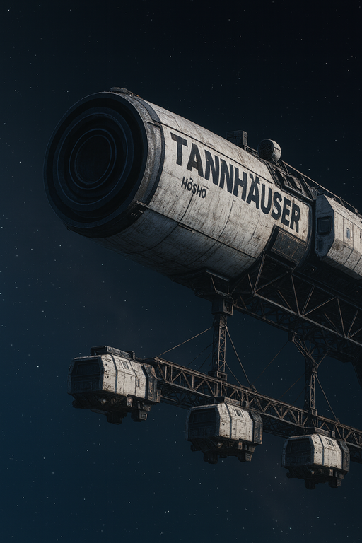
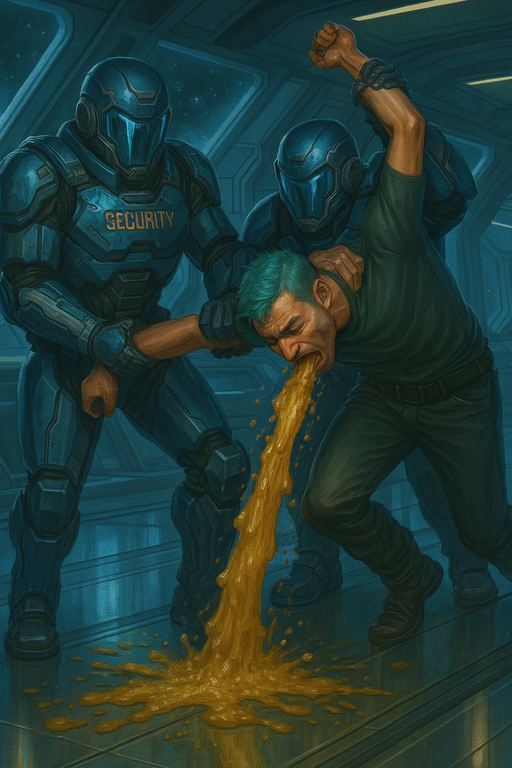
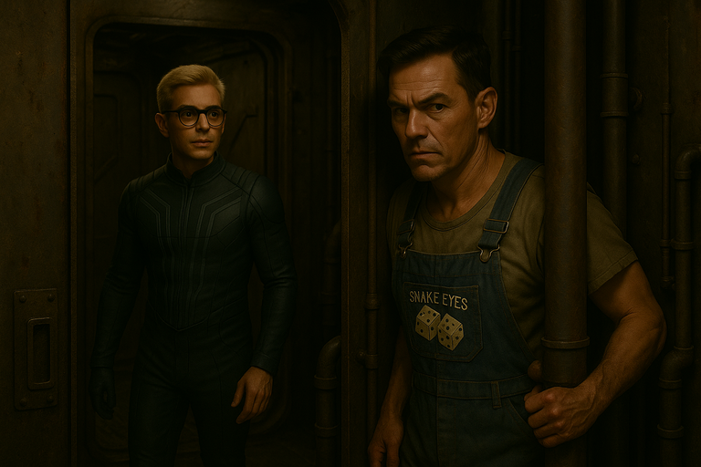
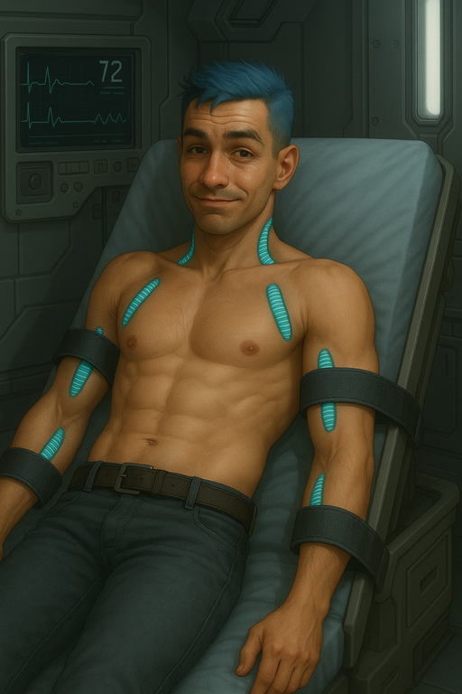
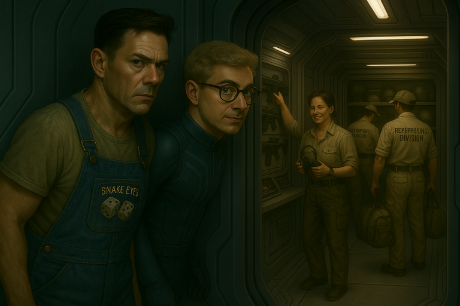
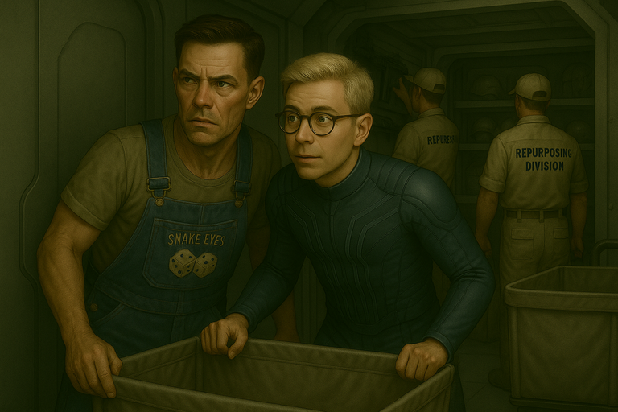
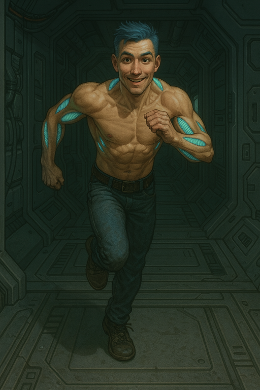
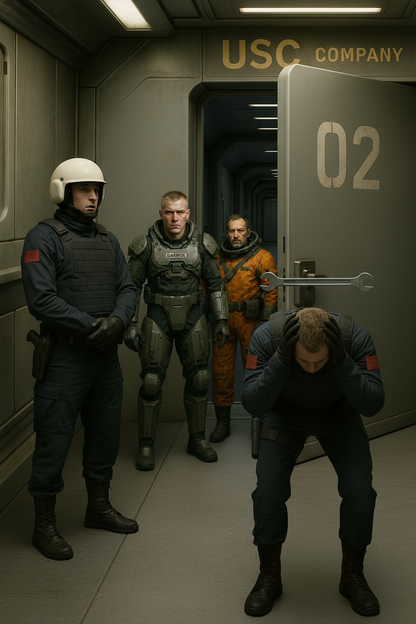
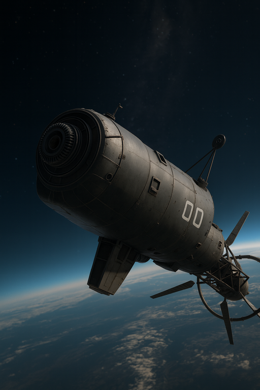

# {{ page.meta.module }}: {{ page.meta.title }}

The CEO is holding the crew in an interrogation room on a company ship.
[Ink](ink.md) continues telling some awkward truths, then gets into his childhood trauma.
[Ink](ink.md) eventually makes himself sick and is taken to the **Med Bay**.
[Zeke](zeke-sinclair.md) cloaks and escapes to find [Murderbot](murderbot-v2.md), who hacks the computer to prepare for a later escape.
[Murderbot](murderbot-v2.md) lives up to his name when dealing with the 3 **Repurposing Division** workers.
[Ink](ink.md) bites a nurse with his modded fangs to escape from the **Med Bay**.
[Zeke](zeke-sinclair.md) and [Murderbot](murderbot-v2.md) use non-lethal force to take out a couple guards, freeing [Dex](dex-miro.md) and [Carnoc](carnoc-ashbrow.md).
On the way back to their ship, the crew is surprised when the gravity shuts off.
Since their ship wasn't refueled, the crew escapes in a **Raider** class ship just in time for the company ship to explode.

<!-- more -->



## Ink Keeps Talking

- [Ink](ink.md) just keeps talking
    - takes off his shirt and shows everyone the cyberware vents
    - says we were supposed to kill the CEO
- Devin and the CEO leave the room to discuss
- [Ink](ink.md) keeps eating the food
    - starts talking about childhood trauma
    - [Ink](ink.md) makes himself sick

/// caption
[Ink](ink.md) makes himself sick and vomits
///

- guards enter the room
    - grab [Ink](ink.md) and take him away
    - [Ink](ink.md) yells as the guards carry him

## Zeke Finds Murderbot

- [Zeke](zeke-sinclair.md) turns invisible as the guards come in
    - exits the interrogation room behind the guards
    - goes back to our ship

<video controls>
<source src="../../../../2025-10-07/zeke-cloaks.mp4" type="video/mp4">
</video>

/// caption
[Zeke](zeke-sinclair.md) uses his cloak
///

- [Zeke](zeke-sinclair.md) waits until the **Repurposing Division** is done
    - they finish packing things up and take out the bins
- [Zeke](zeke-sinclair.md) enters the ship and yells for [Murderbot](murderbot-v2.md)

/// caption
[Zeke](zeke-sinclair.md) finds [Murderbot](murderbot-v2.md)
///

- [Zeke](zeke-sinclair.md) tells [Murderbot](murderbot-v2.md) that **The Company** knows everything
    - [Zeke](zeke-sinclair.md) says we should rescue the others
    - "[Carnoc](carnoc-ashbrow.md) is in the brig. You have to save [Carnoc](carnoc-ashbrow.md)!"
- [Zeke](zeke-sinclair.md) and [Murderbot](murderbot-v2.md) talk about how to get away on the ship
    - [Murderbot](murderbot-v2.md) suggests following the **Repurposing Division** to recover the weapons
    - will need to open the launch bay doors to fly out
- [Murderbot](murderbot-v2.md) tries to hack the launch bay doors
    - [Murderbot](murderbot-v2.md) convinces the computer to lock everyone else out
    - Computer: "You're the only one that can open my bay doors."

<video controls>
<source src="../../../../2025-10-07/murderbot-hacks-the-computer.mp4" type="video/mp4">
</video>

/// caption
[Murderbot](murderbot-v2.md) hacks the computer
///

## Dex and Carnoc use Auto Meds

- [Dex](dex-miro.md) gives [Carnoc](carnoc-ashbrow.md) one of his Auto Meds
    - [Carnoc](carnoc-ashbrow.md) feels better after a few minutes
    - Tries to drink more of the apple juice and [Dex](dex-miro.md) slaps it away
- [Dex](dex-miro.md) and [Carnoc](carnoc-ashbrow.md) discuss how to get out of the interrogation room
    - [Carnoc](carnoc-ashbrow.md) mentions his **Huntershot**
    - They decide not to try overpowering the guards because they don't want to kill them

## Ink Restrained in Med Bay

- [Ink](ink.md) is in the **Med Bay**
    - Doctors think he's suicidal because of the vomiting and ranting about trauma
    - [Ink](ink.md) is loosely restrained

/// caption
Ink in restraints on a **Med Bay** bed
///

- [Ink](ink.md) listens in on the CEO using his **Tattletale**
    - might offer us a mission to double cross [Yandy](yandy.md)
    - would have to eliminate us afterwards
- [Ink](ink.md) starts working on his restraints with a **spife**

## Murderbot Murders Repurposing Division

- [Zeke](zeke-sinclair.md) and [Murderbot](murderbot-v2.md) are tracking the **Repurposing Division**
    - take a moment to plan their attack on the 3 workers

/// caption
[Zeke](zeke-sinclair.md) and [Murderbot](murderbot-v2.md) observe and plan their attack on the **Repurposing Division** workers
///

- [Zeke](zeke-sinclair.md) and [Murderbot](murderbot-v2.md) walk up quickly but quietly
- [Zeke](zeke-sinclair.md) attacks the front one with the spanner
    - worker starts screaming "Ow!"
- [Murderbot](murderbot-v2.md) attacks the rear one with a pen knife
    - stabs him repeatedly in the neck and chest
- remaining one freaks out and lunges for a weapon in the bins
    - [Zeke](zeke-sinclair.md) dives at his legs (still cloaked)
    - [Zeke](zeke-sinclair.md) trips the guy, but awkwardly so they land on top of [Zeke](zeke-sinclair.md)
    - [Zeke](zeke-sinclair.md) loses his cloak and the spanner slides under the bins
- [Murderbot](murderbot-v2.md) picks up a pulse rifle out of the bin
    - [Murderbot](murderbot-v2.md): "Everybody freeze!"
    - the 2 remaining workers obey, and let [Zeke](zeke-sinclair.md) up
- worker: "What's wrong with that [Murderbot](murderbot-v2.md)'s command module?"
    - [Murderbot](murderbot-v2.md): "What command module?"
    - worker: "One that's installed in every one of your kind. You're not supposed to be doing this."
    - [Murderbot](murderbot-v2.md): "Not in me. You shut your mouth before I riddle you full of bullets. Did you not just see what I did to that guy?"
    - worker: "You're gonna get reported for this. They'll probably dismantle you."
- [Zeke](zeke-sinclair.md) duct tapes the **Repurposing Division** workers
- [Murderbot](murderbot-v2.md) whacks the 2 remaining workers with the spanner
    - he hits them way too hard
    - they're probably dead
- [Murderbot](murderbot-v2.md) puts the bodies in a janitor's closet
    - they try to clean up the bloody mess

## Ink Escapes

- [Ink](ink.md) cuts through one of his restraints
    - gets out of the restraints
- drugs haven't quite worn off yet
    - [Ink](ink.md) gets up and stands in the center of the room
    - talks in the CEO's voice
    - keeps muttering about childhood trauma
- doctors and nurses suggest that [Ink](ink.md) lays back down
    - [Ink](ink.md) complies
    - nurses replace the straps
    - nurse asks for the sharp object that he used to cut the restraints
- [Ink](ink.md) motions for the nurse to lean in: "Can I tell you a secret?"
    - [Ink](ink.md) bites her in the neck with his fangs
    - nurse passes out
- [Ink](ink.md) leaves the med bay
    - behind him, doctor yells: "Oh my god!"

/// caption
[Ink](ink.md) runs down the corridor away from the **Med Bay**
///

## Freeing Dex and Carnoc

- [Zeke](zeke-sinclair.md) and [Murderbot](murderbot-v2.md) have one bin with some weapons
- [Murderbot](murderbot-v2.md) prepares to hack to raise an alarm to free [Dex](dex-miro.md) and [Carnoc](carnoc-ashbrow.md)
    - discovers there is already an alarm sounding from the med bay
- [Zeke](zeke-sinclair.md) cloaks and approaches the guards
    - [Zeke](zeke-sinclair.md) tries to grab a keycard and use it to open the door
    - waits patiently until one of the guards fidgets and turns
    - unlocks the door using the card
- [Dex](dex-miro.md) runs over to the door to listen to what's going on
    - the door opens, the guards look very surprised

/// caption
[Dex](dex-miro.md) and [Carnoc](carnoc-ashbrow.md) watch a floating spanner whack one of the guards
///

- [Zeke](zeke-sinclair.md) whacks the guard
    - he's surprised but not really injured
    - [Dex](dex-miro.md) tackles him, but isn't really able to restrain his gun
- [Carnoc](carnoc-ashbrow.md) tackles the other one
- cloaked [Zeke](zeke-sinclair.md) tries to help [Dex](dex-miro.md)
- [Murderbot](murderbot-v2.md) walks around the corner
    - tells guards to stop resisting or he'll shoot
    - guards ignore him
- [Murderbot](murderbot-v2.md) knocks out the guard [Dex](dex-miro.md) was struggling with
- [Murderbot](murderbot-v2.md) transmits to [Ink](ink.md) that everyone else is free
    - we're all headed to the ship

## Zero G

- suddenly the gravity turns off

<video controls>
<source src="../../../../2025-10-07/zero-g-crew.mp4" type="video/mp4">
</video>

/// caption
Crew are surprised when gravity turns off
///

- [Dex](dex-miro.md): "[Murderbot](murderbot-v2.md), did you do that?"
    - [Murderbot](murderbot-v2.md): "No"
    - [Murderbot](murderbot-v2.md) tries to get access to the computer
    - we guess this is to try to stop our escape
- [Murderbot](murderbot-v2.md) is spinning in the hallway
    - [Dex](dex-miro.md) finds the zero G handholds and shows [Murderbot](murderbot-v2.md) how to use them
- [Zeke](zeke-sinclair.md) uses duct tape to get traction
- [Dex](dex-miro.md) is able to carry the weapons along

<video controls>
<source src="../../../../2025-10-07/zero-g-ink.mp4" type="video/mp4">
</video>

/// caption
[Ink](ink.md) handles zero-G gracefully
///

## Back to the Ship

- we all arrive at the ship
- [Murderbot](murderbot-v2.md) locks the doors behind us
- our ship hasn't been refueled
- there's another smaller ship nearby that's fueled
    - we go aboard the **Raider**

## Fly Away

<video controls>
<source src="../../../../2025-10-07/fly-away-from-company-ship.mp4" type="video/mp4">
</video>

/// caption
[Murderbot](murderbot-v2.md) pilots away just before the ship we left explodes
///

- [Murderbot](murderbot-v2.md) feels an odd sensation
    - the ship shudders and shakes
    - navigational controls have been disrupted
    - radiation levels are high
    - shaking and alarms subside after a minute
- out the window, we see the ship the CEO was on is obliterated
    - some of the nearby ships are also damaged
- [Dex](dex-miro.md) wonders how much **The Company** knows about us
    - deep space communications are generally fairly limited
    - but they could have sent written messages

## New Raider Ship

The new **Raider** ship has:

- 8 cryo pods
- escape pods which are called "Coffin Landers"

/// caption
The crew's new ship is a bit of a downgrade
///
