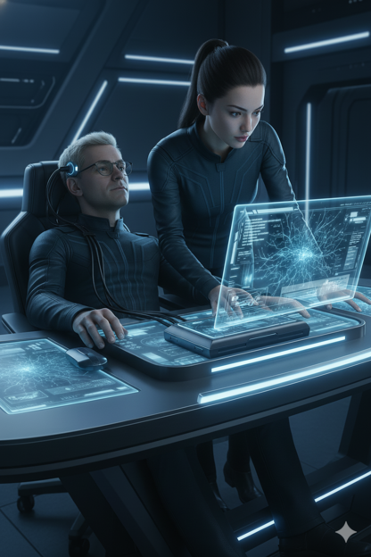
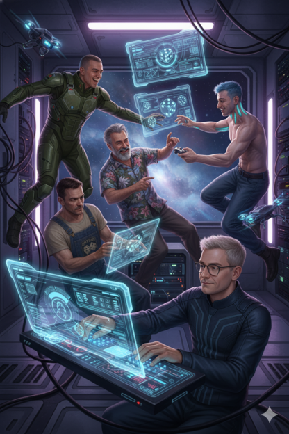
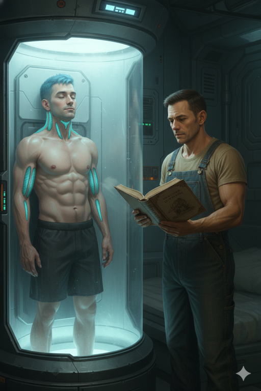
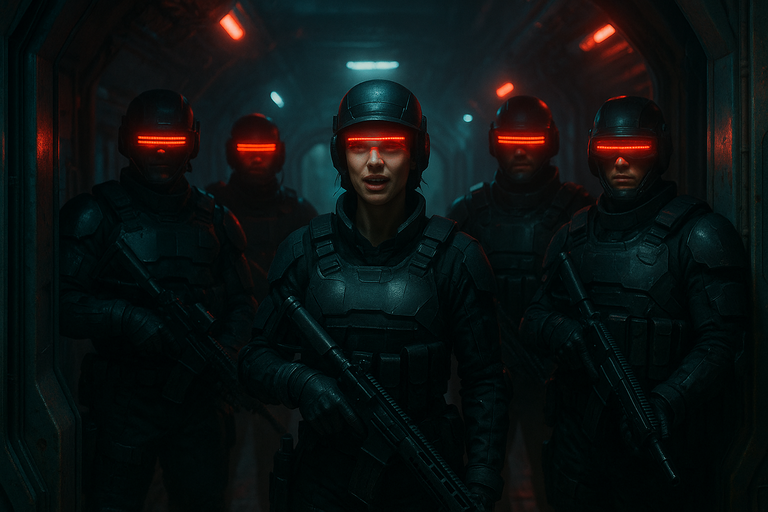

# {{ page.meta.module }}: {{ page.meta.title }}

The crew returns to [Prospero's Dream](/places/prosperos-dream/index.md) and are debriefed by [Yandy](yandy.md).
[Ingus](ingus.md) proposes a mission to retrieve an economic model from rogue androids which pays 350 million credits.
An engineer [Loshi](loshi.md) upgrades the crew's **Raider** with an experimental engine.
After waiting a couple months for the engine modifications, the crew travels to the android station.
A small fleet of troop ships guards the station, known as [The Deep](the-deep.md).
The crew docks with the lead ship, the **Zhuangzi**, and its commander [Rachael](rachael-kilroy.md) briefs us on the androids.
No one is allowed in or out of [The Deep](the-deep.md) since the android infiltrators are able to mimic humans.

<!-- more -->



## Returning to Prospero's Dream

- crew decides to plot a course for [Prospero's Dream](/places/prosperos-dream/index.md)
    - it takes a few months
    - we all enter cryo sleep
- crew wakes up from cryo sleep a week before
    - [Dex](dex-miro.md) and [Ink](ink.md) have cryo sickness
    - have time to recover
- when we approach [Prospero's Dream](/places/prosperos-dream/index.md), they hail us
    - ask for callsign and manifest
    - callsign: Snake Eyes
    - they ask us for clarification since we're in a different ship
    - [Ink](ink.md) says to tell [Yandy](yandy.md) that we took out the garbage
    - a day passes
- we get clearance to dock at [Prospero's Dream](/places/prosperos-dream/index.md)
    - greeted by a couple of heavily armed guards
    - we're escorted to a room and undergo a sanitization process
    - guards want to escort us to [Yandy](yandy.md)
- meet with [Ingus](ingus.md) and [Yandy](yandy.md) in canyonheavy.market
    - smells like cheetos and mountain dew
    - [Yandy](yandy.md) asks if we succeeded in our mission
    - [Yandy](yandy.md) is surprised we made it back, says we're resourceful
    - Implies that the detonation was timed well because it was triggered by one of us, but doesn't say who

<video controls>
<source src="../../../../2025-10-28/murderbot-downloads.mp4" type="video/mp4">
</video>

/// caption
[Murderbot](murderbot-v2.md) downloads mission records for [Yandy](yandy.md)
///

- [Yandy](yandy.md) asks how much she agreed to pay us
    - 1 million each
    - [Yandy](yandy.md) nods to [Ingus](ingus.md) and says we'll find the money in our accounts
    - reminds us that the accounts are from [Prospero's Dream](/places/prosperos-dream/index.md) and might looks suspicious to **The Company**

## Ingus's Mission

- [Ink](ink.md) asks about our follow-up mission
    - [Yandy](yandy.md) leaves us with [Ingus](ingus.md) for the details
- [Ingus](ingus.md) describes a signal from an old android facility in a different galaxy
    - it's a few jumps away
    - Android developed a predictive model of economies, we need to retrieve it
    - pays 350 million credits
    - need to run a blockade to get there
    - would take about a year of real time

<video controls>
<source src="../../../../2025-10-28/ingus-snacks-asks-for-economic-model.mp4" type="video/mp4">
</video>

/// caption
[Ingus](ingus.md) snacks disturbingly and wants the economic model
///

- [Ink](ink.md) asks about how to stealth our ship for the blockade
    - [Ingus](ingus.md) tells us to see [Loshi](loshi.md) on the docks

## Crew Upgrades

- [Zeke](zeke-sinclair.md) pays `$50K` to back up his brain

/// caption
[Zeke](zeke-sinclair.md) backs up his brain
///

- [Ink](ink.md) installs Espernetic Feedback Loop

## Loshi Upgrades the Raider

- [Ink](ink.md) goes to the Docking Bays to see [Loshi](loshi.md)
    - noticeably colder as we approach
    - [Loshi](loshi.md)'s office has a view of the repair bays
    - his assistant says he's out doing repairs
    - we see him outside in an exoskeleton
    - assistant messages him
    - we wait a few minutes for him to arrive

/// caption
[Loshi](loshi.md) lights up a cigarette
///

- [Loshi](loshi.md) lights up a cigarette as he approaches
    - [Ink](ink.md) explains how we want to try to run the blockade
    - asks if there's anything we can install on our ship to help
    - [Loshi](loshi.md) might have some experimental stuff
    - [Loshi](loshi.md) agrees the **Snake Eyes** is a piece of junk
    - might have an experimental engine for us
        - could make us the fastest ship
        - could blow us up
        - would cost `$100m`
        - [Loshi](loshi.md) would buy the ship, install the engine, and sell it back to us if we succeed
        - it will take a couple months
        - seems excited about installing the engine
    - [Loshi](loshi.md) also paints flames on the ship
- [Loshi](loshi.md) sends us paperwork a few days later
    - we sell him the raider
    - when we return, we can buy the ship with engine for `$100m`
    - we'll pay `$50k` per jump

- crew takes shore leave
    - [Carnoc](carnoc-ashbrow.md) feels the most rested
    - we party for a few months while waiting for the ship to be fixed up

/// caption
The crew relaxes while waiting for the ship modifications
///

- [Loshi](loshi.md) tells us the ship is ready
    - explains how to use the engine
    - can travel normally with no risk
    - using overdrive uses less fuel and jumps further
        - can burn jump fuel during normal navigation
    - [Loshi](loshi.md) installs dedicated reactor to improve reliability for `$450k`
        - we pay `$90K` each

## Flying to the Android Station

- will take us 2 jumps to get to Androids
    - months pass on the way
    - we take a jump, refuel, and take another

/// caption
[Murderbot](murderbot-v2.md) passes the time reading to [Ink](ink.md)
///

/// caption
[Murderbot](murderbot-v2.md) cleans [Carnoc](carnoc-ashbrow.md)'s cryo pod
///

- [Murderbot](murderbot-v2.md) wakes us up a week away from the android facility
    - [Zeke](zeke-sinclair.md) and [Carnoc](carnoc-ashbrow.md) have cryo sickness
- a few days out we receive an automated comms warning
    - "You're entering into restricted space"
    - as we approach, sensors notice a significant ship presence
    - 3 troops ships with crews of 100 or more
        - they have guns
        - we shouldn't fight them
- station in the center is the size of [Prospero's Dream](/places/prosperos-dream/index.md)
    - large object floating near the station is a thruster
- we're hailed by the troop ship **Zhuangzi**
    - we transmit the official company callsign, not **Snake Eyes**
    - we're 2 days from the station, 1 day from the ship
- crew approaches the troop ship
    - begin docking procedures
    - match speed with the troop ship
    - no sanitization process required

## Meeting the Commander

- greeted at the docking door by 4 heavily armed people in black
    - 3 are heavily armored with red visors flashing back and forth
    - woman in the front, commander [Rachael Kilroy](rachael-kilroy.md)
    - asks if we're the next troubleshooting team

/// caption
Armed guards, led by [Rachael Kilroy](rachael-kilroy.md), greet the crew at the docking door
///

- [Rachael](rachael-kilroy.md) escorts us through the ship
    - there are quite a few military personnel wearing black
- we arrive at the debriefing room
    - shows a 3D image of the android facility
- [Rachael](rachael-kilroy.md) removes her helmet
    - blond hair, early 40s, small scars from shrapnel wounds, deep serious eyes
    - she's on her third tour here at [The Deep](the-deep.md)
    - commanding officer of the troubleshooters

/// caption
[Rachael Kilroy](rachael-kilroy.md) tells the crew about [The Deep](the-deep.md) and its android inhabitants
///

## Deep Briefing

- [The Deep](the-deep.md) went offline a few years ago
    - crew killed, androids took over
    - likely as a result of an AI named "Monarch"
    - want to recover the facility with minimal damage
    - every team sent in has not returned, or were not themselves when they returned
    - facility can print androids that mimic the people they replace, called Infiltrators
    - now have a strict policy of no one going in or out
    - returning teams are under high scrutiny to determine whether they are androids
    - there are rumors of artifacts attracting all sorts of archaeologists, mostly treasure hunters
    - will shoot down any ship coming or leaving
    - don't want the Infiltrators to escape and run amok elsewhere
    - androids on [The Deep](the-deep.md) are evolving
    - it's becoming harder to tell who is human
- [Rachael](rachael-kilroy.md) is one of the few who has been to [The Deep](the-deep.md) and made it out alive
    - concerned that the androids escaping could take over the universe
