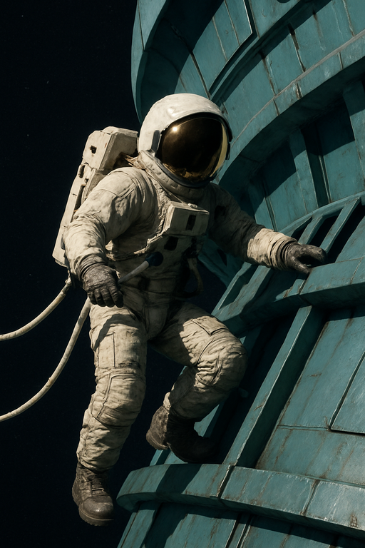
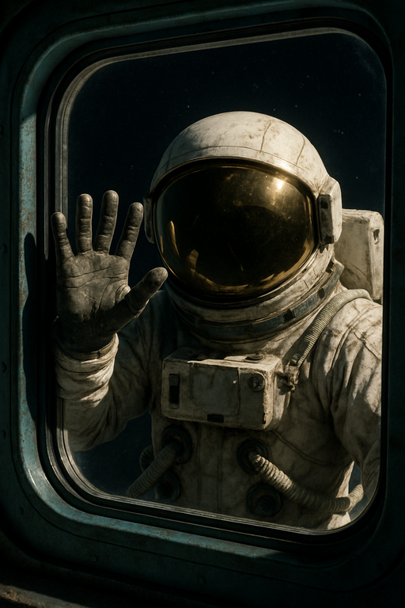

# {{ page.meta.module }}: {{ page.meta.title }}

TODO Intro

<!-- more -->



- [Rachael Kilroy](rachael-kilroy.md) has seen the androids make duplicates of humans
- her team is the troubleshooters
- [Rachael](rachael-kilroy.md) asks us what level of clearance we've been given
    - [Ink](ink.md) replies low clearance
- [Rachael](rachael-kilroy.md) gives us some mission details
    - install encrypted radio transmitters
        - at locations
            - 2 EDEN
            - 3.1 Maintenance Zone
            - 4 Human Emulation Labs
            - 6 Support & Engineering
        - understand day to day movements of androids
        - can monitor things if the mission fails
    - scout a secure location on floor 3
        - use as a forward operating base
        - hold it for 1-5 hours waiting for backup
        - make radio contact
    - download a database from AI core on floor 5
- [Rachael](rachael-kilroy.md) shows us a detailed map
    - it's taken many lives to get this information
- [Rachael](rachael-kilroy.md) has a cybernetic diagnostic scanner
    - size of a large backpack
    - can tell if someone is an android
- could stop by [The Bell](the-bell.md) (station's detached engine) on the way
    - couple humans are living there
- some people disappeared on the station 6 months ago
- ask about disposition of androids
    - security will just try to shoot us
    - not sure of motivations of more human looking androids
- [Rachael](rachael-kilroy.md) can provide EMP grenades
    - bad for androids
    - also bad for [Murderbot](murderbot-v2.md)
    - probably not great for our mods either
    - can carry 4 each
- we detach from the [Zhuangzi](zhuangzi.md)
- fly towards [The Bell](the-bell.md)
- guy in a vac suit leaves [The Bell](the-bell.md) and heads towards our ship
    - teamsters are impressed
    - face appears on our window
    - points at us
    - points at [The Bell](the-bell.md)
    - holds up a hand and flashes 5 fingers a few times
    - moves us into position to dock with the bell

/// caption
A visitor approaches the ship
///

/// caption
A visitor at the window
///

- hear a metal clanging 30 minutes later
- welcome to [The Bell](the-bell.md)
    - he opens our door
    - named [Arkady Volnichi](arkady-volnichi.md)
    - "You have shitty ship, I have access"
    - wearing a patch which reads **Verified Human**
    - tells us to come have some soup

/// caption
[Arkady](arkady-volnichi.md) welcomes the crew to [The Bell](the-bell.md)
///

- [Ink](ink.md) asks about station
- [Arkady](arkady-volnichi.md) really wants us to come have some soup
- there are 2 others on board
    - [Noriko](noriko.md)
    - Ghost eater
- [Murderbot](murderbot-v2.md) scans [Arkady](arkady-volnichi.md)
    - looks a bit sweaty during the scan
    - "See, no problem. [Arkady](arkady-volnichi.md) is verified human."
- [Dex](dex-miro.md) and [Ink](ink.md) go with [Arkady](arkady-volnichi.md)
    - go down short tunnel to another airlock
    - [Arkady](arkady-volnichi.md) closes airlock behind us
    - room is illuminated by candles
    - [Arkady](arkady-volnichi.md): "This is the [Asheron](the-deep.md), thruster for the cybernetic facility"
    - passages
        - lost and found
        - chapel
        - his room
- [Arkady](arkady-volnichi.md) brings back potato soup
    - [Dex](dex-miro.md) tries it
    - it's very bland
    - may not contain potato
- they are able to get food from some divers
- [Arkady](arkady-volnichi.md) will pay 1000 credits for each android core
    - was there when the android revolt happened
    - doesn't like androids
- [Dex](dex-miro.md) mentions we're going to the deep to set up some surveillance
- [Ink](ink.md) asks if [Arkady](arkady-volnichi.md) wants to come along to the deep
    - [Arkady](arkady-volnichi.md) sweats a bunch and then declines
- [Ink](ink.md) asks where the androids might store their economic model
    - [Arkady](arkady-volnichi.md) doesn't know
    - there are many interesting things on the station
    - floor 4 - lab for testing artifacts
    - floor 3 - tool shed
        - worker found some stuff and was going to hide it
- [Ink](ink.md) and [Dex](dex-miro.md) go to the lost and found
    - tons of vac suits, ammo, SMGs
    - no EMPs or cybernetic diagnostic scanners
- [Dex](dex-miro.md) goes to inspect the chapel
    - small but tall room
    - more floating candles
    - ceiling has a whale skeleton
    - cross but with extra arms
    - man kneels in prayer
        - we assume it's Ghost Eater
    - another exit on opposite side
    - dim green light
- [Dex](dex-miro.md) floats over and opens the airlock
    - praying man does not react
    - giant green space on the other side
    - tiny shrines mixed in with plans
- smiling human greets us
    - "Hi, I'm [Noriko](noriko.md)"
    - "I'm setting a welcoming site of the minotaur"
    - "Have you not heard of his greatness?"
- [Ink](ink.md) asks about the minotaur
    - "It's the monarch's greatest artifact"
    - "He can cure any and all illness"
    - located in a maze on floor 2
    - monarch is keeping the minotaur caged in the maze
    - "I have looked upon his beauty, it is grand"
    - she hasn't been to the station in 10 years
    - [Ink](ink.md) convinces her to come along with us to see the minotaur
    - gathers some food to take with her
