# {{ page.meta.module }}: {{ page.meta.title }}

The crew attempts to fight a terrifying creature in the corridor while it methodically eviscerates the troubleshooters.
Once wounded, the creature escapes.
[Ink](ink.md) attempts to salvage some crystals from one of the android troubleshooters.
The stress of cutting up what appears to be a human is too much for [Ink](ink.md), and he takes off after the creature in a rage.
[Carnoc](carnoc-ashbrow.md) and [Dex](dex-miro.md) are able to follow using their strength or zero-g training, while the rest of the crew fall behind.
The creature wraps [Ink](ink.md) in webbing and pulls him into the next room.
As [Carnoc](carnoc-ashbrow.md) and [Dex](dex-miro.md) pursue, the creature sets a trap and cuts off [Carnoc](carnoc-ashbrow.md)'s toes.
[Dex](dex-miro.md) sacrifices his vibechete to finish off the creature.
The crew find, analyze, and take a strange silver lance with copper cabling.
They recover 12 memory cores from the creature and its android victims.
Back in the corridor, [Zeke](zeke-sinclair.md) performs an autopsy on a troubleshooter.
Except for a small android "brain" device, it's indistinguishable from a human, even when using a scanner.

<!-- more -->



## Fighting the Creature

- begin in the Spike Corridor (59B)
- troubleshooters are surprised by the creature
    - one of the four shut down when their consciousnesses merged temporarily
    - start firing with their SMGs
    - when they hit, white milky substance comes out of the creature
- we're still tied together, with our weapons behind us
- [Ink](ink.md) cuts the line tying us
    - pushes forward to grab the package of weapons
    - throws the weapons back to the group

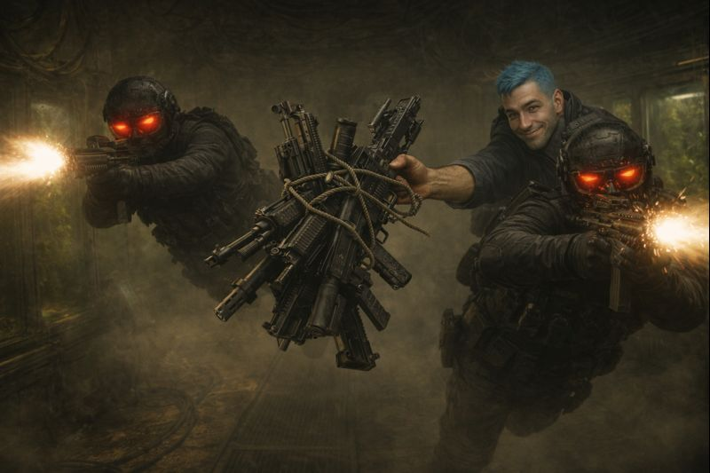
/// caption
[Ink](ink.md) grabs and distributes our weapons
///

- troubleshooters seem like the consider us less of a threat than the creature
    - seem to have a shared understanding that we'll deal with it first
- [Dex](dex-miro.md) grabs the ball of weapons
    - hands them off to the others
        - [Carnoc](carnoc-ashbrow.md) first
    - [Dex](dex-miro.md) sees [Zeke](zeke-sinclair.md) and pushes a weapon down the hallway to him

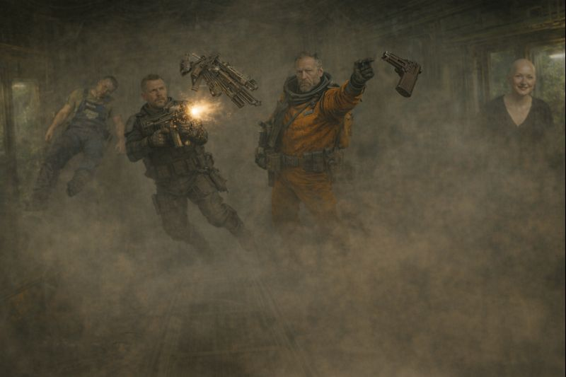
/// caption
[Carnoc](carnoc-ashbrow.md) and [Dex](dex-miro.md) collect their weapons
///

/// caption
[Zeke](zeke-sinclair.md) grabs his weapon
///

- [Carnoc](carnoc-ashbrow.md) fires his SMG at the creature
    - wounds it in the ribs
- creature crawls smoothly and quickly to the 2 closest troubleshooters
    - one of the troubleshooters gets his arm and head sliced off
        - we see blood, not milky white
- troubleshooter: "Frank, noooo!"
    - troubleshooters continue firing, but much more wildly
- [Dex](dex-miro.md) fires wildly, damaging both the creature and a troubleshooter
- [Zeke](zeke-sinclair.md) tries to revive [Murderbot](murderbot-v2.md)
    - pushes a rubber grommet aside by his left ear

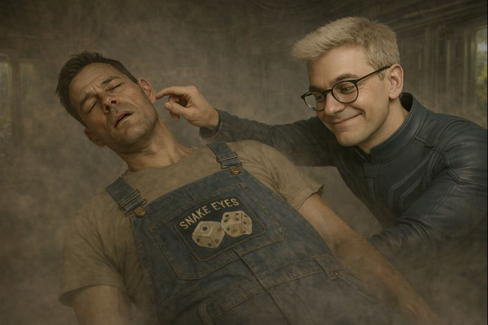
/// caption
[Zeke](zeke-sinclair.md) revives [Murderbot](murderbot-v2.md)
///

- [Murderbot](murderbot-v2.md) expands his consciousness to contact the troubleshooters
    - can sense their surface thoughts and fear of the creature
- [Murderbot](murderbot-v2.md) pushes a troubleshooter towards the creature
    - uses momentum to push himself to the entrance
    - grabs [Carnoc](carnoc-ashbrow.md) on the way
- [Carnoc](carnoc-ashbrow.md) shoots at the creature
    - two of its eyes are watching [Carnoc](carnoc-ashbrow.md)

/// caption
[Carnoc](carnoc-ashbrow.md) fires while [Murderbot](murderbot-v2.md) pulls him back
///

- creature slices up the unconscious troubleshooter
    - slices off the arm of the next troubleshooter
        - [Carnoc](carnoc-ashbrow.md) panics from all of the blood
            - becomes jumpy
            - everyone else gets 2 stress

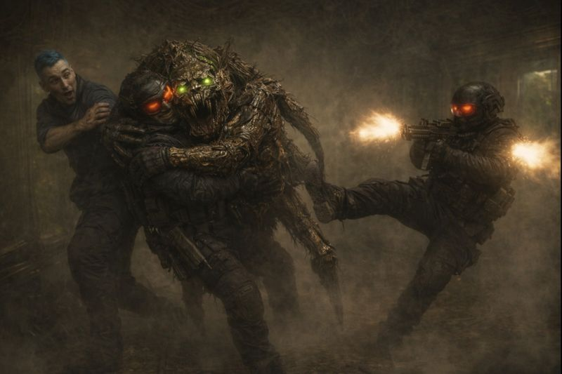
/// caption
The creature eviscerates a troubleshooter
///

- [Dex](dex-miro.md) grabs [Noriko](noriko.md) and pushes her towards the entrance
    - kicks off the side of the hallway
        - grabs [Zeke](zeke-sinclair.md) and drifts towards the door
- [Ink](ink.md) tosses a grenade towards the creature and last active troubleshooter
    - accidentally pushes the troubleshooter towards the blast

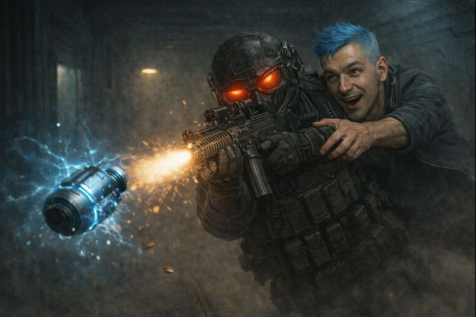
/// caption
[Ink](ink.md) tosses an EMP grenade at the creature
///

- creature and troubleshooter starts shaking
    - troubleshooter stops and seems unconscious
    - 2 of the creature's 6 scythes stop working

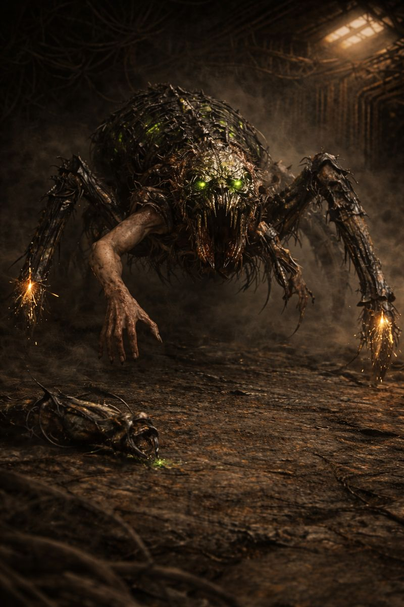
/// caption
2 of the creature's 6 scythe arms stop working
///

- [Carnoc](carnoc-ashbrow.md) fires his SMG
    - hits the creature with a few rounds, but his gun jams
- creature slices up the last two living troubleshooters
- [Ink](ink.md) fires his combat shotgun
    - burns through an entire clip
    - damages one of its legs
- [Dex](dex-miro.md) tries to fire at the creature
    - accidentally loses his grip and tosses it towards the creature

/// caption
While firing, [Dex](dex-miro.md) loses his grip and his gun floats towards the creature
///

- [Carnoc](carnoc-ashbrow.md) tries to fix his jammed weapon

## Wounding the Creature

- [Zeke](zeke-sinclair.md) empties a clip from his pulse rifle
    - bullets ricochet down he hall
    - a few hit the creature

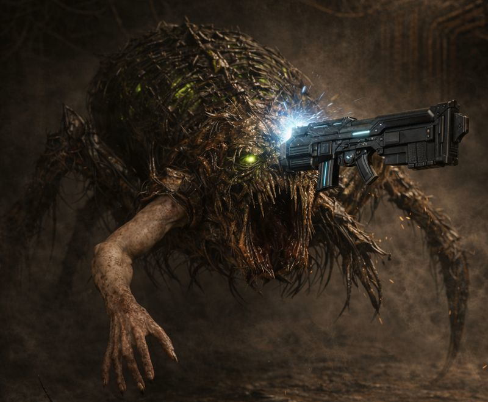
/// caption
[Zeke](zeke-sinclair.md)'s pulse rifle (shots?) hit the creature
///

- the creature retreats
    - uses legs and scything arms to move away quickly
    - shoots a steel wire down the hall

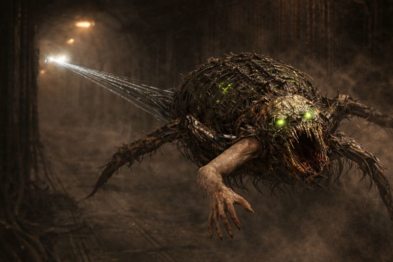
/// caption
The creature shoots a steel wire down the hall and retreats
///

/// caption
[Murderbot](murderbot-v2.md) uses a stimpack to heal from his failed Espernetic Feedback Loop
///

- we search the bodies
    - armor is useless
    - collect their SMGs

## Ink's Pursuit

- [Ink](ink.md) starts prying crystals off the body parts
    - working on the body parts is too much for him
    - grabs his shotgun and heads down the side tunnel after the creature
- [Ink](ink.md) enters room 60A
    - massive cylinders
    - walls smeared with filth
    - large chunks of dried algae
    - pulls himself along a steel cable until he reaches an intersection with other steel webs

/// caption
[Ink](ink.md) grabs his shotgun and takes off
///

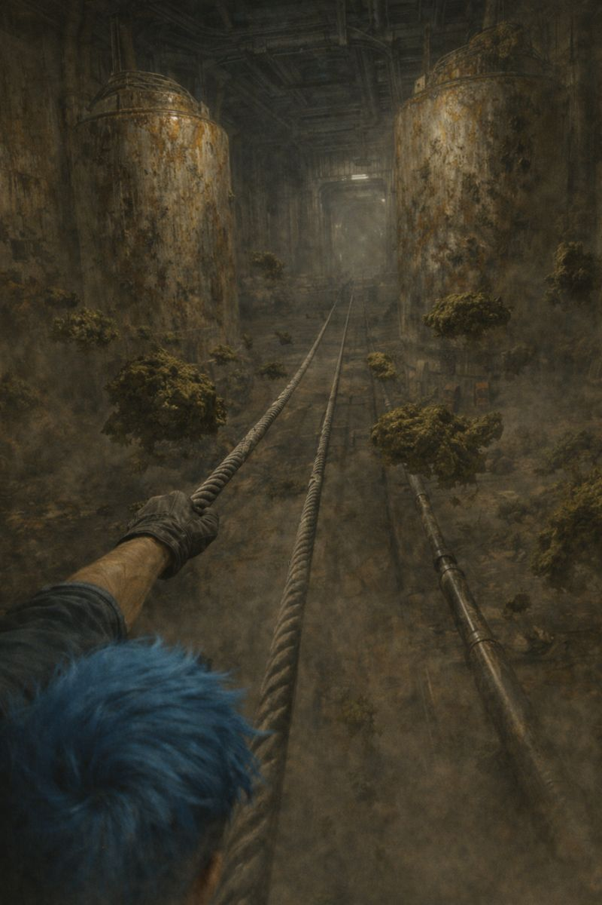
/// caption
[Ink](ink.md) pulls himself expertly along steel cables
///

- [Ink](ink.md) thinks the creature would have gone as far away as possible
    - goes into the next room
- complex patterns of steel webbing form tunnels and a central chamber
    - all sorts of bodies floating in here
    - creature waits in the middle of the web

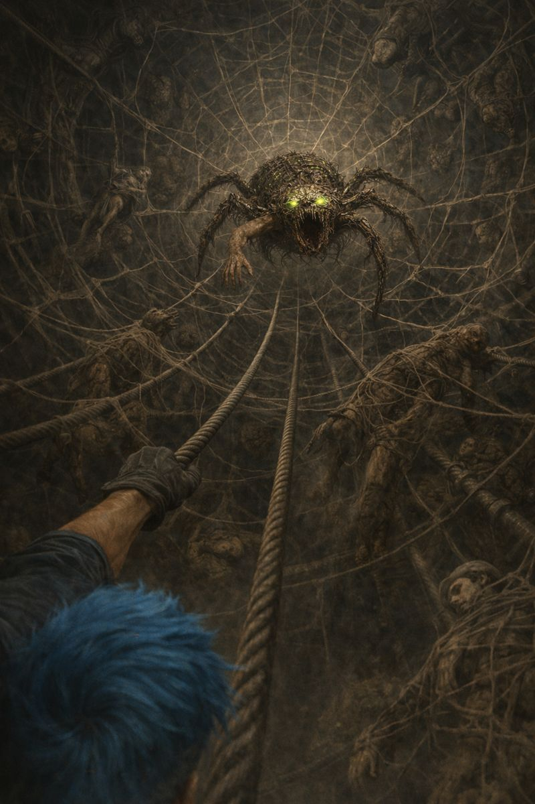
/// caption
[Ink](ink.md) finds the creature in its web
///

- [Dex](dex-miro.md) looks in the door and calls after [Ink](ink.md)
    - [Ink](ink.md) doesn't respond of course
    - [Dex](dex-miro.md) helps [Carnoc](carnoc-ashbrow.md) get to the webbing
    - [Carnoc](carnoc-ashbrow.md) keeps up with [Dex](dex-miro.md)
- [Zeke](zeke-sinclair.md) and [Murderbot](murderbot-v2.md) stay behind

## Rescuing Ink

- [Dex](dex-miro.md) and [Carnoc](carnoc-ashbrow.md) approach
- creature hurls a web at [Ink](ink.md)
    - he's entangled by the web
    - coarse wire wraps around his skin
- [Carnoc](carnoc-ashbrow.md) shoots at the creature
    - his SMG jams

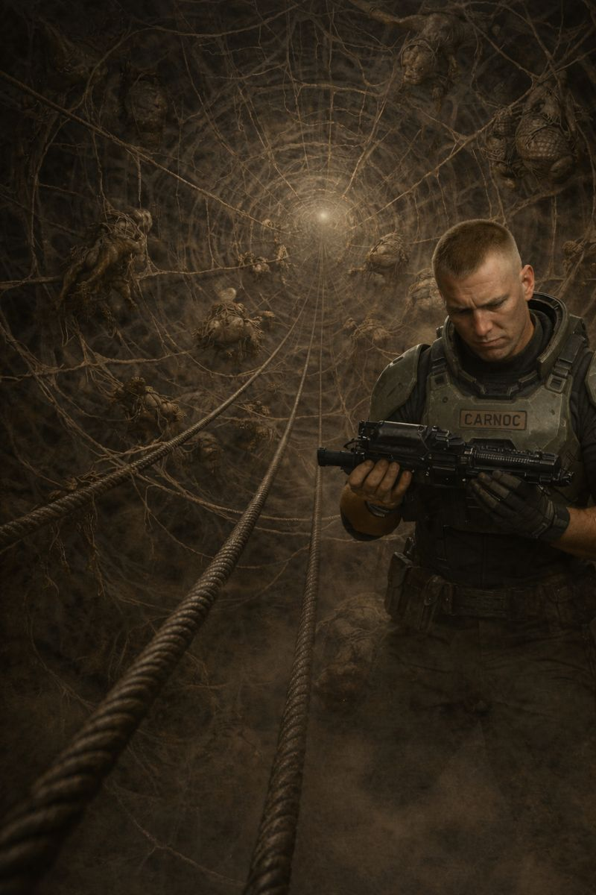
/// caption
[Carnoc](carnoc-ashbrow.md) shoots at the creature, but his SMG jams again
///

- [Dex](dex-miro.md) shoots at the creature
    - scores some hits
- [Ink](ink.md) uses Espernetic Feedback Loop
    - focuses hard, but all that happens is a little smoke comes out of his ears

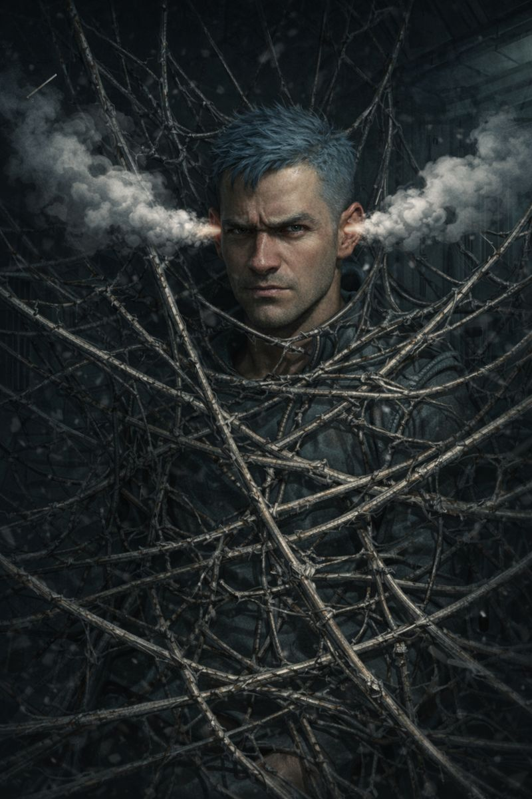
/// caption
[Ink](ink.md) triggers Espernetic Feedback Loop, but only lets some smoke out
///

/// caption
The creature drags [Ink](ink.md) away through a door
///

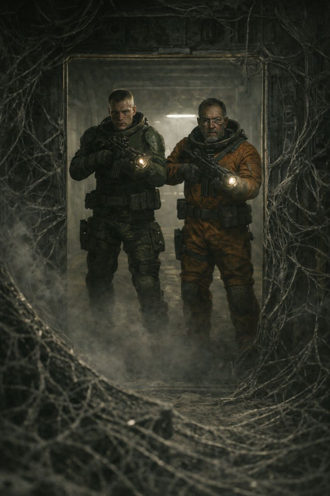
/// caption
[Carnoc](carnoc-ashbrow.md) and [Dex](dex-miro.md) approach the door to follow
///

- creature sets a trap
    - cuts off the front of [Carnoc](carnoc-ashbrow.md)'s boot
    - loses 3 toes
    - [Carnoc](carnoc-ashbrow.md) uses a stimpack

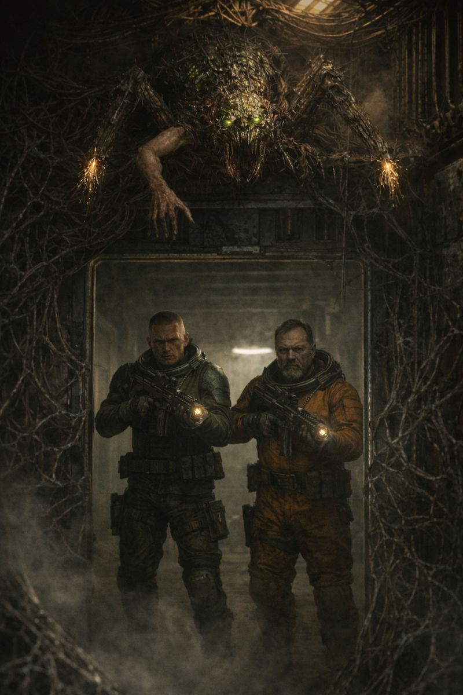
/// caption
The creature ambushes them, slicing off [Carnoc](carnoc-ashbrow.md)'s toes
///

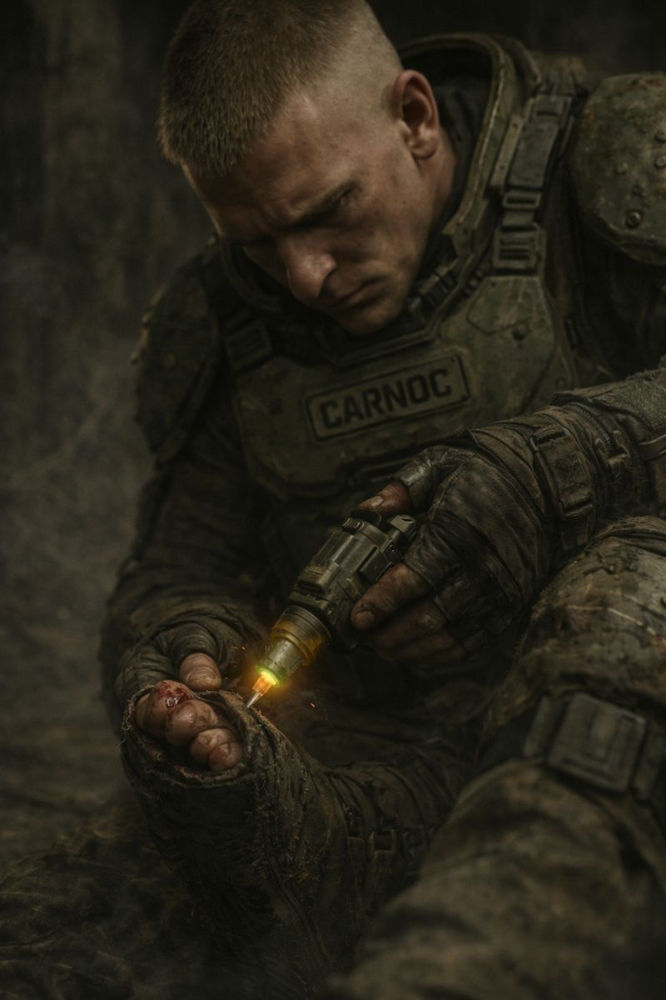
/// caption
[Carnoc](carnoc-ashbrow.md) uses a stimpack to stop the bleeding
///

- [Dex](dex-miro.md) jabs the creature with his vibechete
    - it's dead, but the vibechete is permanently lodged in the creature

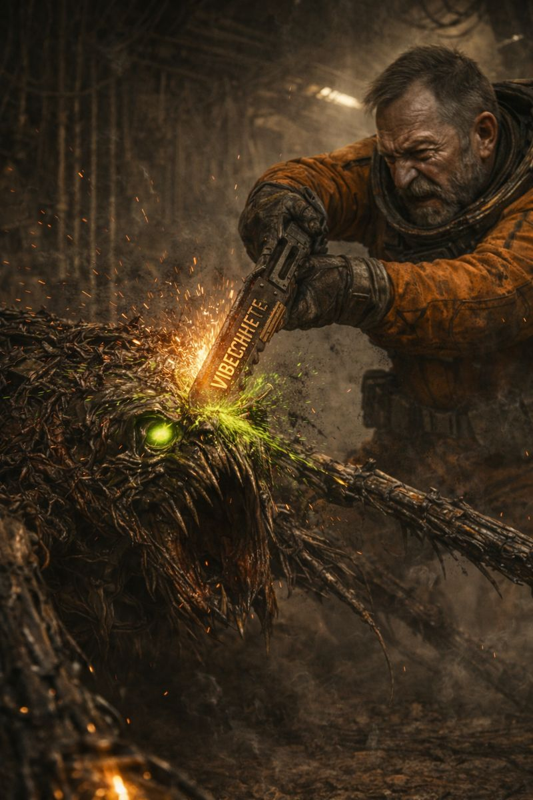
/// caption
[Dex](dex-miro.md) wedges his vibechete deep into the creature's head, killing it
///

## Aftermath

- [Dex](dex-miro.md) and [Carnoc](carnoc-ashbrow.md) help [Ink](ink.md) out of the webbing
- [Carnoc](carnoc-ashbrow.md), [Ink](ink.md), and [Dex](dex-miro.md) explore the room `60B`
    - see a silver lance with copper cabling off the back
    - we take it with us

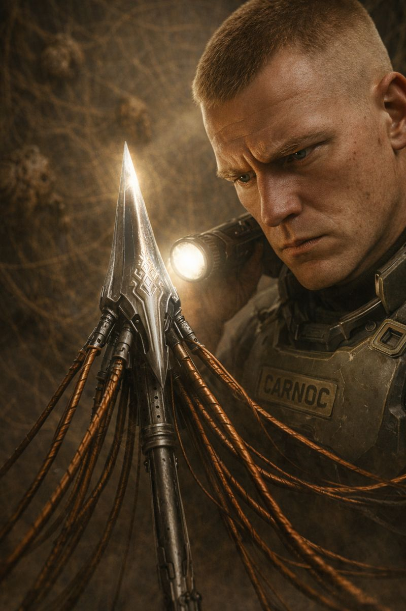
/// caption
[Carnoc](carnoc-ashbrow.md) takes the silver lance
///

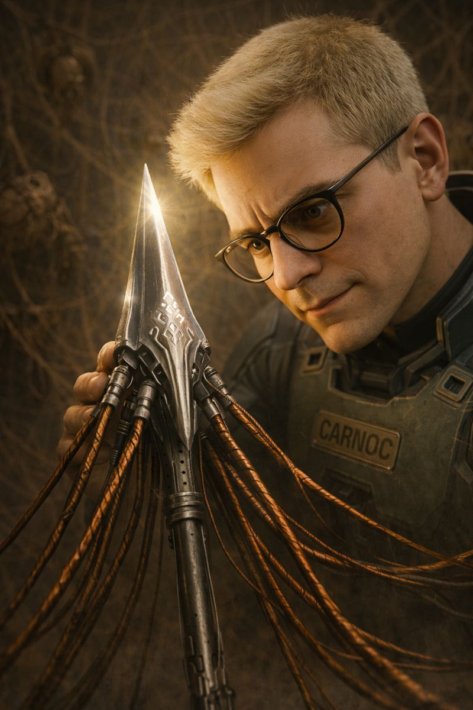
/// caption
[Zeke](zeke-sinclair.md) inspects the silver lance
///

- [Zeke](zeke-sinclair.md) studies the creature
    - composed of different human body parts
    - manufactured from same substance
    - creature was assembled
    - mostly android parts
    - steel webbing is an internal mechanical device
- [Dex](dex-miro.md) sticks a purple crystal to it
    - [Murderbot](murderbot-v2.md) can't sense anything
    - we remove the crystal
- we remove the logic core to take back to [Arkady](arkady-volnichi.md)

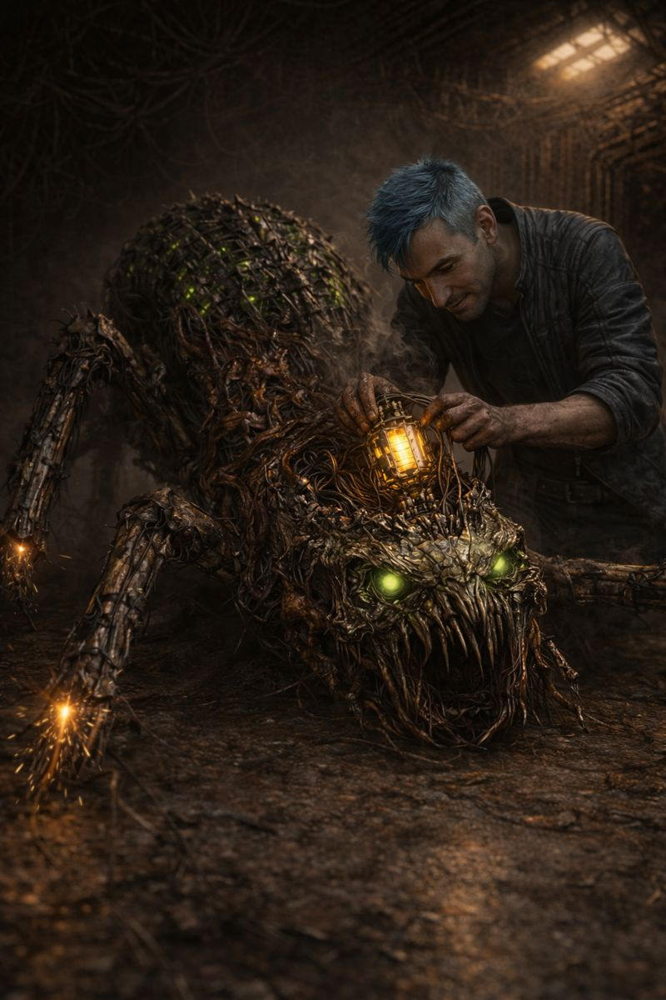
/// caption
[Ink](ink.md) extracts the creature's logic core
///

- other bodies in the room seem to be the creature's victims
    - mostly androids
    - the creature seems to have removed their fluid to sustain itself
    - we recover 11 logic cores from the bodies

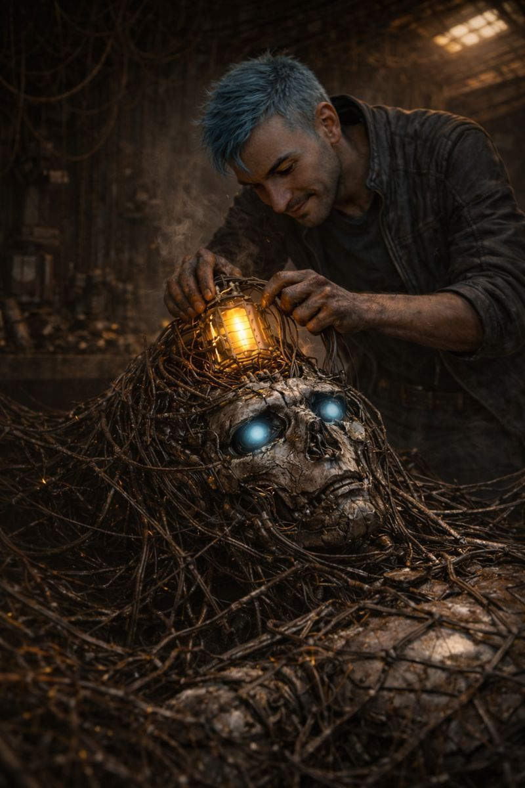
/// caption
[Ink](ink.md) extracts the logic core from one of the creature's android victims
///

- crew discusses the troubleshooters
    - crystals stuck to them
    - they didn't even know they were androids
- we go back to check the bodies
    - takes an hour round trip
    - no obvious way to extract the logic core

## A Troubling Autopsy

- [Zeke](zeke-sinclair.md) performs an autopsy on a troubleshooter
    - it seems like a replica of a human
    - finds a small piece of metal unlike any other logic core
    - we think it could be anywhere in the body
    - advanced technology to interface with a human body

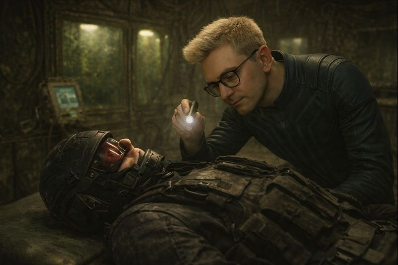
/// caption
[Zeke](zeke-sinclair.md) performs an autopsy on a troubleshooter
///

- detector tells us the tiny device is an android part
    - doesn't identify the rest of the body as an android
