# {{ page.meta.module }}: {{ page.meta.title }}

Amidst the hunter's webs in **60B**, the crew install the first of [4 encrypted radio transmitters](2025-12-03.md#mission-briefing) from [Rachael Kilroy](rachael-kilroy.md).
In [60C Firing Control](#60c-firing-control), [Ink](ink.md) rigs a kill switch for the lasers.
The crew discover some [Acid Sacs in 59G](#59g-acid-sacs), but decide not to push through after some tests.
[Ink](ink.md) connects his tattletale to [Communications in 57G](#57g-communications).
[Murderbot](murderbot-v2.md) hacks [Communications Storage](#57h-communications-storage) but is blocked before he can discover the meaning or destination of encoded transmissions from the station.
The [Monarch AI introduces themselves](#meeting-monarch), demanding [Commander Kilroy](rachael-kilroy.md)'s death in exchange for the economic model.
[Dex](dex-miro.md) sets up another encrypted radio transmitter in **54B**.
As he finishes, a ghostly apparition in a lab coat appears, with a halo of blades around his head.
The apparition charges, and the crew is unable to do anything to stop it.
After [Ink](ink.md) is injured in the struggle, he opens another door.
Two children run out screaming, and the apparition winks out.

<!-- more -->



- we set up an encrypted radio transmitter in **60B**
    - hidden in the hunter's webs

## 60C Firing Control

- [Ink](ink.md) goes to explore 60C through an office door
- facility has defensive lasers, this is the firing control room

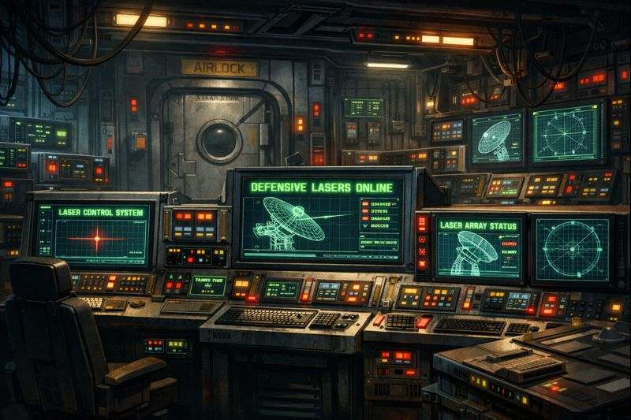
/// caption
Defensive laser firing control room
///

- [Ink](ink.md) jury rigs a kill switch for the lasers

## 59H Electric Grid

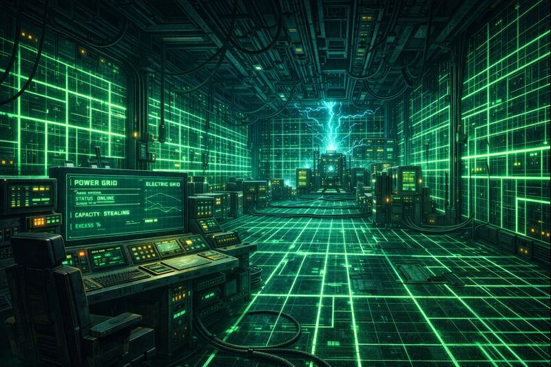
/// caption
Electric grid
///

- expansive room with glowing grid patterns on the walls
- probably don't want to touch anything
- approach airlock to 59G
- [Ink](ink.md) cuts through the lock

## 59G Acid Sacs

- on the other side, the floor shows signs of acid corrosion
- silicon fleshy sacs on the ceiling
    - about a foot across
    - might be the source of the acid
    - there are 12 of them, with a gap of about 2 feet

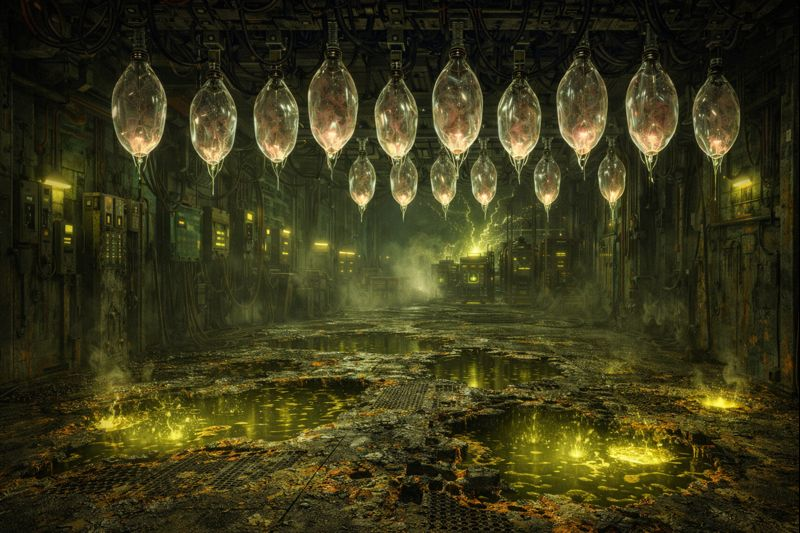
/// caption
Acid sacs hang from the ceiling
///

- [Zeke](zeke-sinclair.md) takes some gauze, spits on it, and tosses it near the sacs
    - we take cover behind the mostly closed door
    - nothing happens right away
    - see smoke plumes coming up from the floor
    - appears to be from sacs dripping
- [Noriko](noriko.md) suggests throwing a ball of twisted slag
    - metal and stone
    - [Zeke](zeke-sinclair.md) tosses it into the room
    - doesn't trigger any of the sacs
    - sacs seem to be triggered by biological material
- we take one of the hunter's android victims and toss it into the room
    - sacs rain acid down on it and expose the skeleton

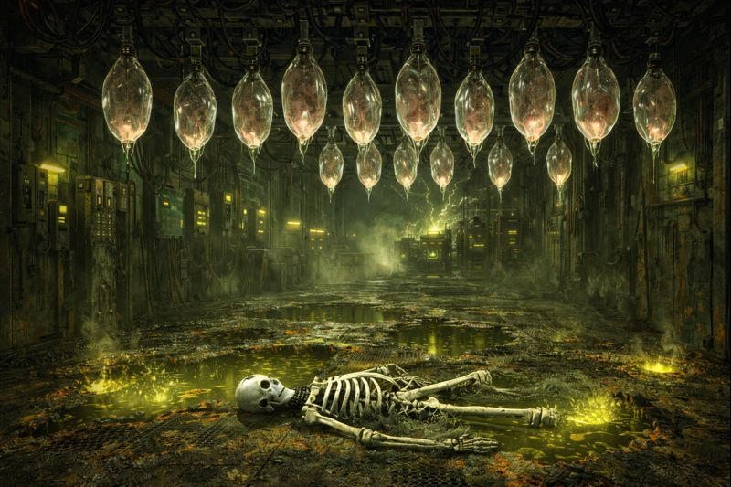
/// caption
One of the hunter's victims again becomes a victim
///

/// caption
[Zeke](zeke-sinclair.md) brainstorms a way to protect himself from the acid
///

- backtrack to 59B spike corridor
- back to 59D atmospheric monitoring
    - troubleshooters escorted us through here before

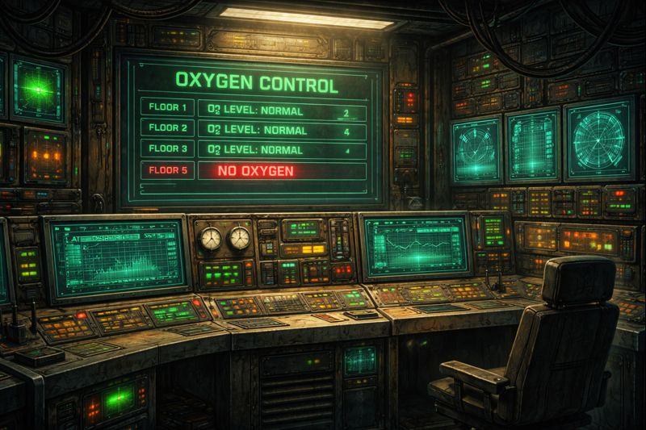
/// caption
Atmospheric monitoring
///

## 59E O~2~ Flow Backup

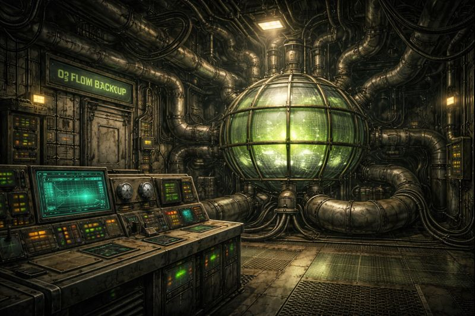
/// caption
O~2~ Flow Backup
///

- tangle of ducts, vents, and pipes with access hatches
    - not labeled, no idea which goes where

## 59C Tool Depot

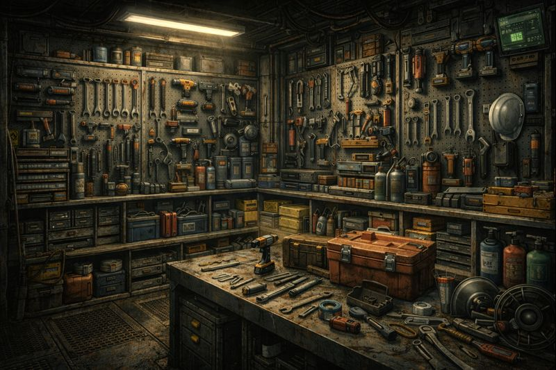
/// caption
Tool Depot
///

- [Dex](dex-miro.md) searches for a vibechete but is disappointed when he doesn't find one
- [Ink](ink.md) inspects the ventilation duct to 57G
- [Ink](ink.md) hunts for maps or manuals
    - blowtorch accidentally starts a fire

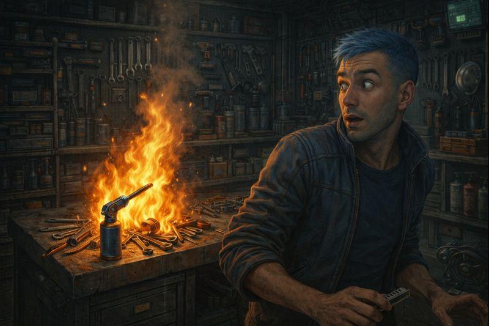
/// caption
:musical_note: We didn't start the fire :musical_note:
///

- escape into **57G Communications** to avoid the fire

## 57G Communications

/// caption
Communications
///

- leather operator chairs by damaged terminals
- well lit but unoccupied
- [Dex](dex-miro.md) looks for communications logs but doesn't find anything
- [Ink](ink.md) ties his tattletale into the communications system
    - can communicate with any room on the station

/// caption
[Ink](ink.md) ties his tattletale into the communications system
///

## 57H Communications Storage

/// caption
Communications Storage is crammed with cabling and electronics
///

- broadcast and communications data banks
- [Murderbot](murderbot-v2.md) interfaces with the computer
- most recent transmissions are an incomprehensible code sent to empty space

/// caption
A firewall blocks [Murderbot](murderbot-v2.md)'s further investigations
///

## 57E Control Room

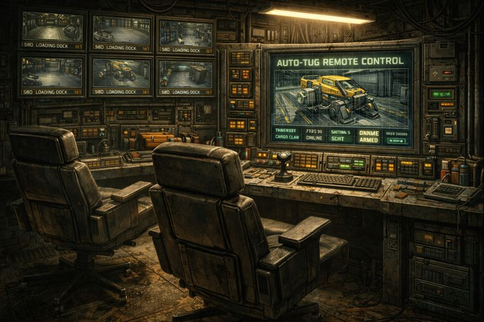
/// caption
Control Room, with camera feeds from **58D Loading Dock**
///

- worn operator chairs
- camera feeds from 58D Loading Dock
    - centered on auto tug craft to assist with docking and cargo
        - could transport 1-2 people at most
- feed cuts out when we try fiddling with the controls

### Meeting Monarch

- voice: "Hello! Welcome to Cloud Bank! How may I be of assistance?"
- [Ink](ink.md): "Do you have any interesting economic models that you want to share with us?"
- voice: "For [Ingus](ingus.md) on [Prospero's Dream](../../../places/prosperos-dream/index.md), yes."
- [Ink](ink.md): "Would you mind transferring that to us?"
- voice: "Data too large to be transmitted."
- voice: "Download at terminal in 23G."
- voice: "Access to economic model denied until death of [Commander Kilroy](rachael-kilroy.md)."
- [Ink](ink.md): "Can you tell us about the transmissions into space?"
- voice: "Access denied. Insufficient clearance."
- [Ink](ink.md): "What do you want for verification of [Kilroy](rachael-kilroy.md)'s death?"
- voice: "Brain scan and genetic code."
- [Ink](ink.md): "Can you tell us anything about the Minotaur?"
- voice: "Minotaur rogue program. Very dangerous."
- [Noriko](noriko.md): "That's not true! The Minotaur will bring peace and love everywhere!"
- voice: "Supplemental mission. Destroy Minotaur."
- [Noriko](noriko.md): "No! You can't do that!"
- [Ink](ink.md): "Can you tell us the location of the Minotaur?"
- voice: "Labyrinth. Floor 2."
- [Ink](ink.md): "Where do we find a device to take brain scan?"
- voice: "Use headset in 57G"
- [Ink](ink.md): "What's your name?"
- voice: "Monarch."
- voice agrees to have children identify themselves after killing [Kilroy](rachael-kilroy.md) or Minotaur

### Noriko is Human

- [Ink](ink.md) scans [Noriko](noriko.md)
    - takes 30 minutes
    - certified human

## Taking a Break

- we're all getting a bit tired
    - spend a few hours resting
    - [Ink](ink.md) feels relaxed in his leather reclining chair
    - everyone else seems restless

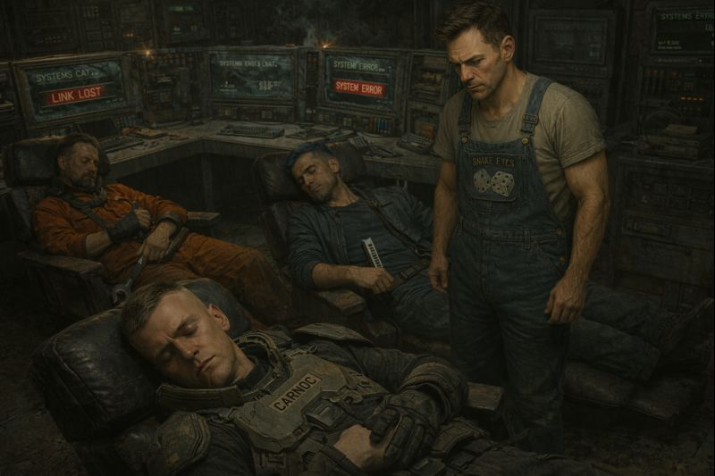
/// caption
The crew rests while [Murderbot](murderbot-v2.md) watches over them.

Not everyone, just [Carnoc](carnoc-ashbrow.md).
///

### 57C Break Room

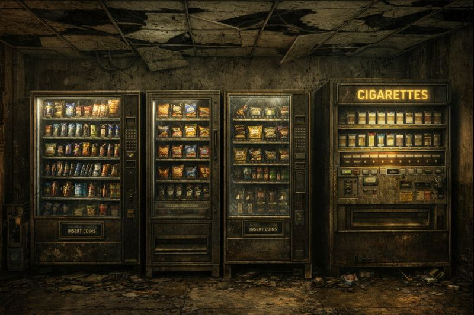
/// caption
**57C Break Room** vending machines with snacks, drinks, and cigarettes
///

- [Ink](ink.md) pretends to fall into the glass
    - due to superior acting, Monarch is not suspicious
    - breaks glass
    - snacks spill onto the floor and [Ink](ink.md) takes some

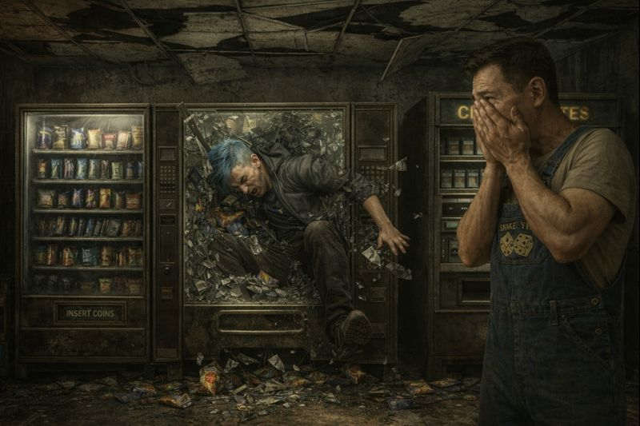
/// caption
[Ink](ink.md) "accidentally" breaks the vending machine glass
///

## 57A Elevator Access

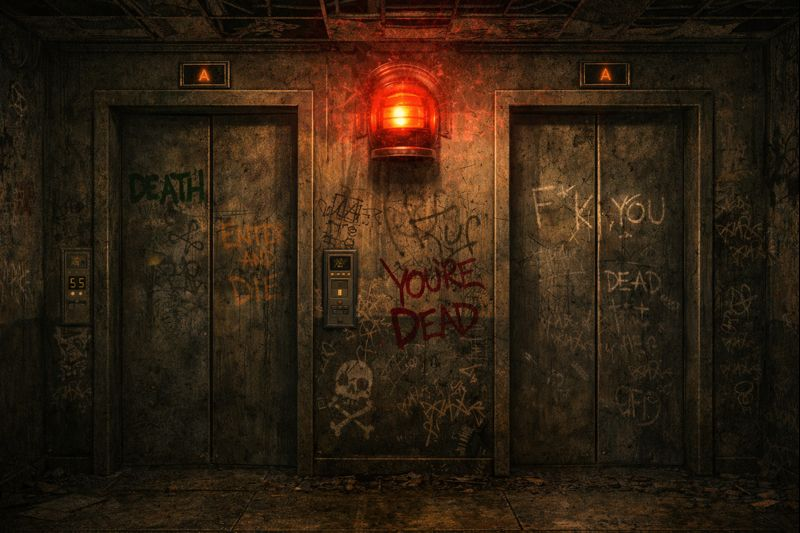
/// caption
57A Elevator Access
///

- wait 30 seconds for elevator to arrive
- press button and elevator starts moving

## 54A Clinical Break Room

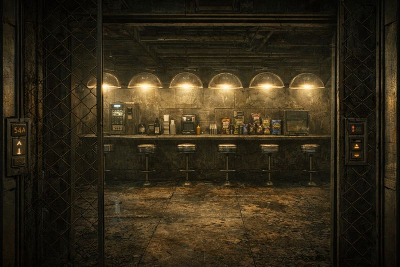
/// caption
54A Clinical Break Room
///

- first stop on elevator from **57A Elevator Access**
- grime-covered clinical break area
- 8 transparent domes jutting from the ceiling
- bars with stools, coffee machine, snack packets

## 55B

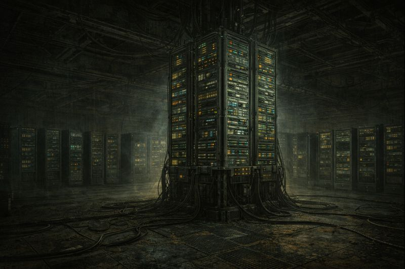
/// caption
55B
///

- very dark
- strong whiff of organic rot
- [Ink](ink.md) turns on his light
- sees towers of computers
- smells like a corpse, but doesn't see one

## 55C

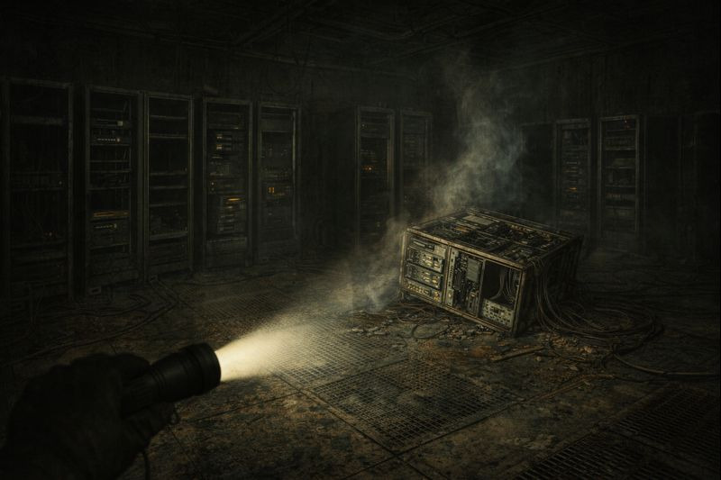
/// caption
55C
///

- server racks, but mostly empty
- lingering smell of burnt circuits and industrial grease
- hear sound of metal being kicked around
- shine light around, but see nothing
- see an overturned server rack near the sound

## 54B

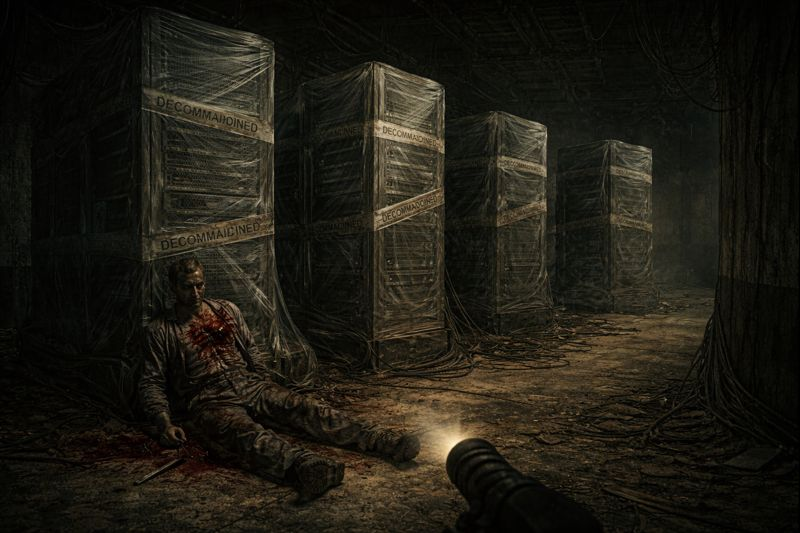
/// caption
54B
///

- [Ink](ink.md) discreetly signals to [Dex](dex-miro.md) to come into the room
- contains 4 6 meter server racks
- find corpse that must be giving off that smell
    - puncture wounds on the chest
    - face is disfigured
    - [Ink](ink.md) thinks the chest wounds are from a scalpel
    - probable been here for a few weeks
- [Dex](dex-miro.md) sets up an encrypted radio transmitter here
    - not happy about the smell

### An Apparition Attacks

- door between 54A and 55B slams shut
    - see a flash of distorted light
- man in a lab coat appears, with a halo of blades floating above his head
    - "When is suffering enough? Enough! All of them!"

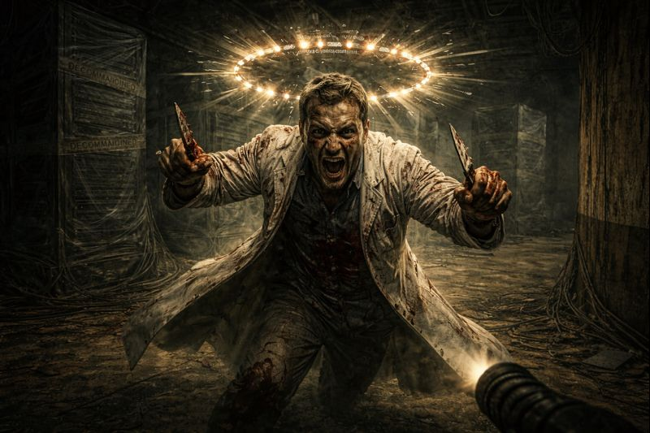
/// caption
Man in a lab coat, with a halo of blades floating above his head

"When is suffering enough? Enough! All of them!"
///

- man grabs scalpels out of the air
    - charges at [Ink](ink.md) and [Dex](dex-miro.md)
- [Dex](dex-miro.md) shoots at the crazed lab technician
    - bullets pass through him
    - body distorts and flickers like an old CRT from a magnet
    - penetrate the door, freaking out the other crew members
- [Ink](ink.md) activates Espernetic Feedback Loop
    - nothing happens

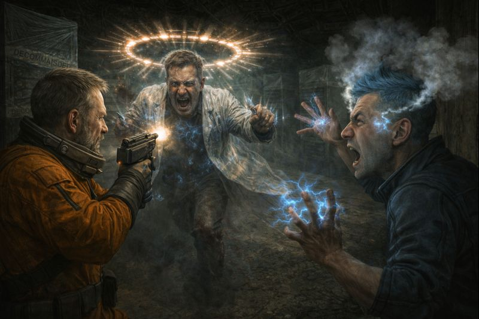
/// caption
[Dex](dex-miro.md) shoots at the charging man, while [Ink](ink.md) activates **Espernetic Feedback Loop**
///

- [Murderbot](murderbot-v2.md) opens the door and activates his Espernetic Feedback Loop
    - nothing happens

- [Noriko](noriko.md) grabs a SMG and tries to fire, but mostly hits the ceiling due to recoil
- apparition stabs [Ink](ink.md) with a scalpel
    - "When is suffering enough? Enough! All of them!"
    - [Ink](ink.md) is hurt but manages to get away
- [Dex](dex-miro.md) and [Ink](ink.md) dive out of the room
- [Ink](ink.md) tosses an EMP grenade behind us
    - EMP blast goes off
    - figure runs towards us again
- [Murderbot](murderbot-v2.md) tosses a crystal at the apparition
    - passes through him and hits the floor

/// caption
[Murderbot](murderbot-v2.md) tosses a crystal at the apparition
///

- [Noriko](noriko.md) empties the rest of her clip into the ceiling

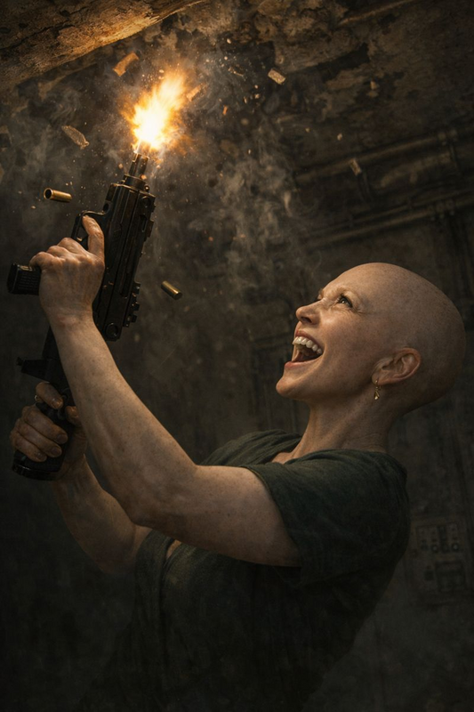
/// caption
[Noriko](noriko.md) empties a SMG clip into the ceiling
///

- hear children screaming from 55A
- ghost stabs [Ink](ink.md) with scalpels again
    - hits him in the neck
    - bleeding profusely

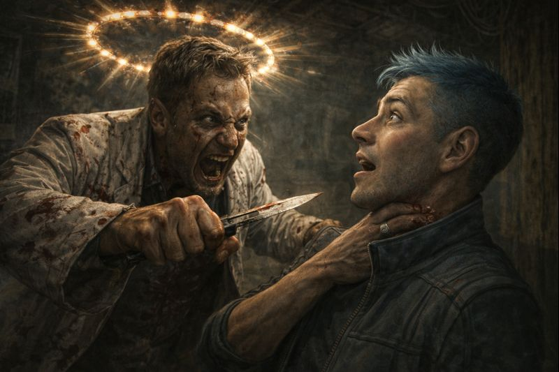
/// caption
The apparition stabs [Ink](ink.md) in the neck
///

- [Ink](ink.md) opens the door to 55A
    - two screaming children come running out
    - 6 year old boy with blond hair
    - 8 year old girl
    - run to door to 55D
- man falls to his knees, crying "Never. Never enough."
    - man winks out

## Aftermath

/// caption
[Ink](ink.md) stops bleeding, but his flesh is necrotized
///

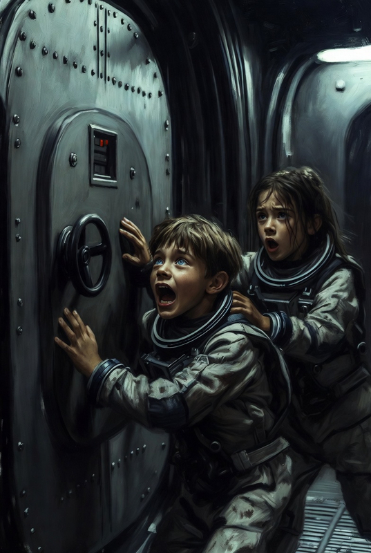
/// caption
Children pound on the door to **55D Human Emulation Labs**

"We want to go back. Please let us back!"
///
