# {{ page.meta.module }}: {{ page.meta.title }}

TODO Intro

<!-- more -->



- the children have `3` marbles
- Ink asks for one marble to open the door for the children
- As Ink cuts the lock and opens the door, the children cheer
- Ink gets a black marble from the children
    - doesn't know what it's made of

## 55D Human Emulation Labs

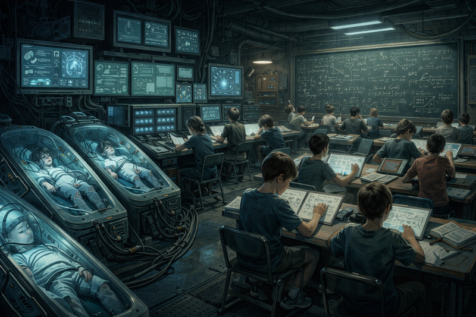
/// caption
Children in dust-coated VR chambers and at workbenches
///

- data dancing across oceans of screens
- 8 camera-studded sensor domes with opaque visors
- ring of 20 dust-coated children
    - thick cables sprouting from the base of their skulls
- 20 workbenches with children behind each
- screens display complex engineering problems
    - using their hands to work with tools
- 20 glass spheres floating in 0g
    - opaque due to layers of mathematical writing from the inside
- facsimile of a middle class family lounge
    - child sitting with 2 adults
    - pretending to eat food
    - next door, arrays of biometric sensors
- the 2 children join the dust-coated children, plugging themselves in
- Murderbot starts scanning one of the children
- in the lounge, one of the adults starts screaming
    - picks up a fork and stabs the other adult
    - the child in the lounge starts crying

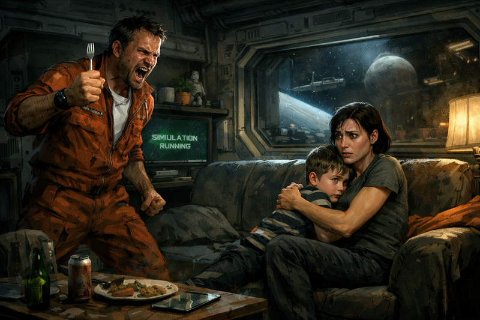
/// caption
Adult in lounge simulation area angrily grabs a fork
///

- an android (without a human face) approaches the lounge
    - puts the SMG up to the crying child's head and pulls the trigger
    - android picks up the child's body and carries it out to the elevator
- Dex tries looking at one of the camera-studded sensor domes
    - children are playing a death match game to try to hack each other
    - as they are defeated, the droids take them away
    - droids bring new children to join the game again

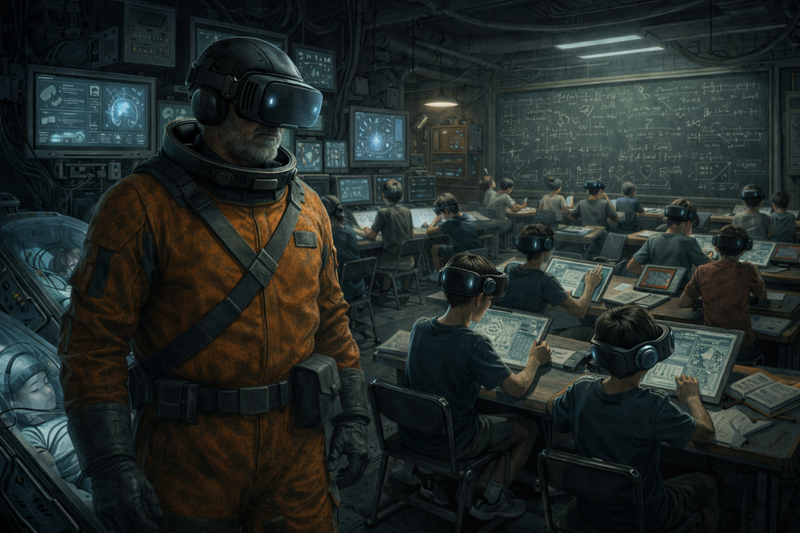
/// caption
[Dex](dex-miro.md) uses a VR system to observe the death match game
///

- Ink looks at 55A where the children were hiding
    - set up a small play area

## 55B/C Sample Analysis

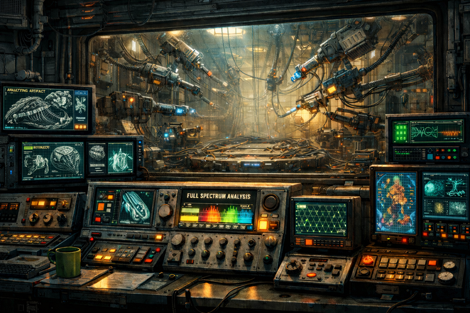
/// caption
55B/C are filled with sensory and analytical equipment
///

- banks of screens used for spectrum analysis
- endless sensory and analytical equipment
- Zeke spends an hour analyzing the black marble
    - made of indestructible material
- spends `3` hours analyzing the silver lance
    - in 0g, points towards previously unknown location
- spend `2` hours analyzing the purple crystals
    - grow on pseudo-flesh
    - form a connected hive mind

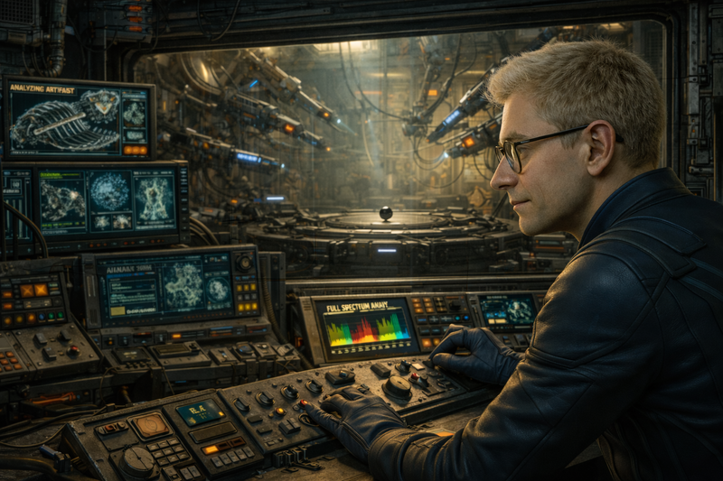
/// caption
[Zeke](zeke-sinclair.md) analyzes artifacts the crew found earlier
///

## 23D Farewell From HEL

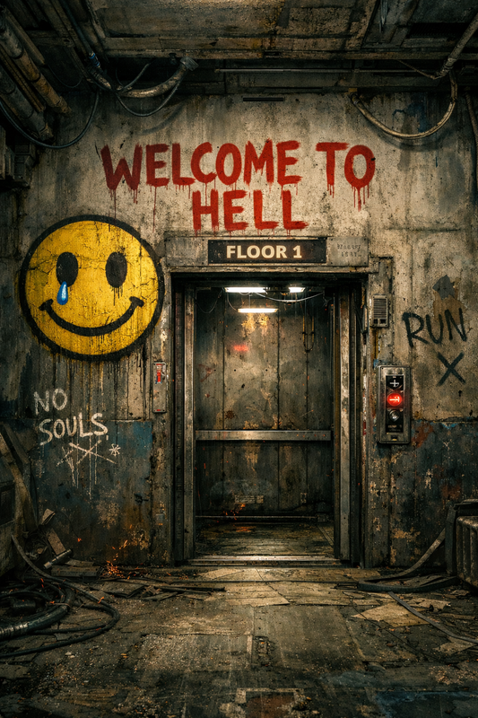
/// caption
Welcome to (or Farewell From) HEL
///

- step out of the elevator
- behind us, we see "Welcome to HEL" with graffiti
- go down the hallway and turn right

## 23B Office Campsites

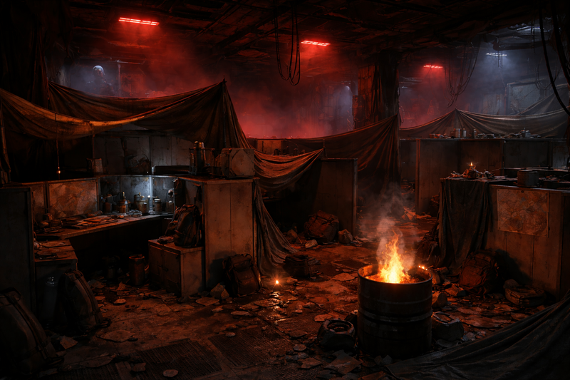
/// caption
23B Abandoned Campsites in an Office
///

- many cubicles in this room
- red emergency lighting
- furniture shifted around to make some protected areas
- lean-to forts and strung up tarps
- looks like someone has been camping here
- Ink rummages around and finds a frag grenade
- possibly divers had been hiding out here
- locked door to 23C

## 23C Escape Pod Launch Bay

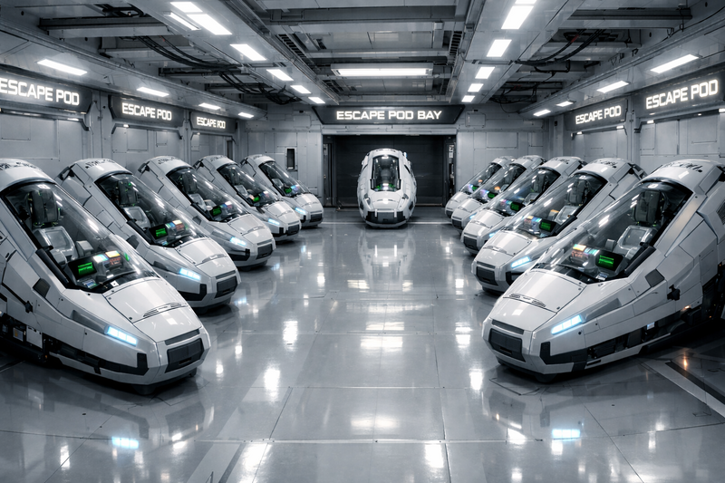
/// caption
23C Escape Pod Launch Bay
///

- 11 escape pods which can hold 3 people each
    - air, water, and food for 3 days
    - cryo pods for extended durations
- very clean in here
    - probably no one came through

## 23A Security Checkpoint

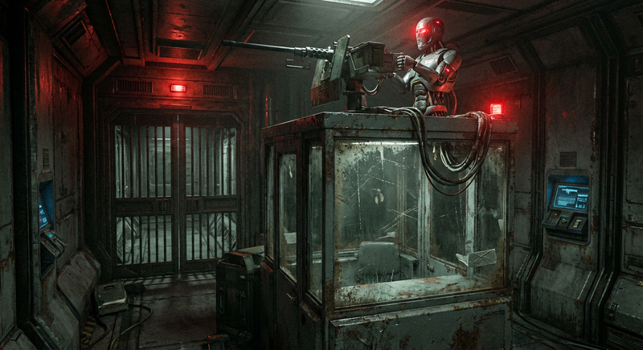
/// caption
23A Security Checkpoint
///

- barred gates block passage
- series of weapon detectors
- bulletproof glass box in the center
    - 360 degree machine gun swivel turret on top
    - security android operates the gun, facing away from us
- bullet scarring and scorch marks in the corridor

## 23G Employee Rec Center

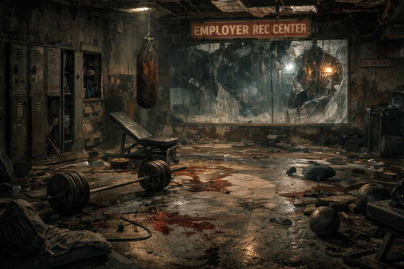
/// caption
23G Employee Rec Center
///

- scattered gym equipment
- shattered mirrors
- smells like rust
- check lockers
- find unconscious person in heavily patched vac suit
    - Murderbot starts scanning
    - wakes up
    - named Hank

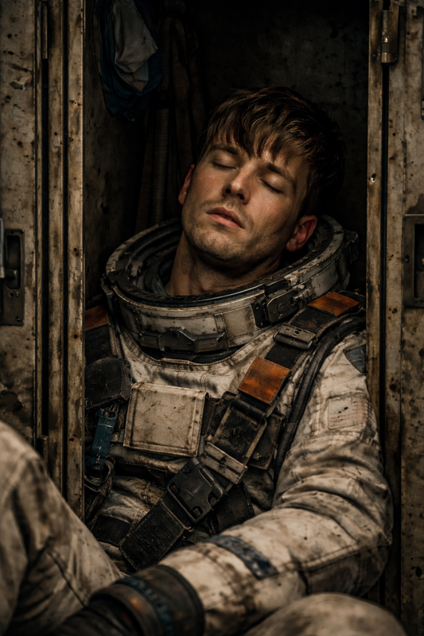
/// caption
Hank, found unconscious in a storage locker
///

- Hank and his partner Jim were divers
    - found something
    - Hank hid it
    - Jim knocked Hank out and went looking for it

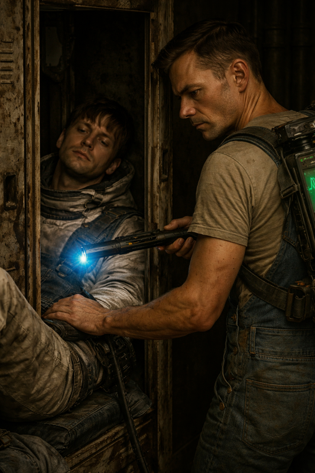
/// caption
[Murderbot](murderbot-v2.md) scans Hank
///

- Hank protests the scan
    - Murderbot insists it's medically necessary
    - eventually finds Hank is an Android
- Hank and Jim came from a mining colony
    - left to escape some unpaid debts
    - Hank offers to give us an artifact if we get him off the station

## 23F Storage Room

- smashed chairs
- broken shelves
- tangle of destroyed boxes
- on the wall, crude cabling and tape
    - label reads access
    - looks like you could put your eyes up to it

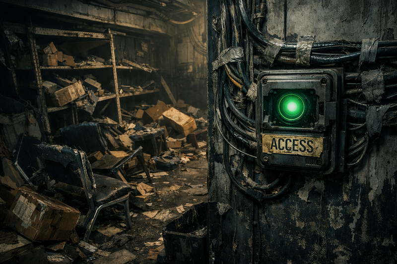
/// caption
23F Storage Room with **Access** eye scanner
///

- Ink asks Hank to scan his eyes
    - Hank offers to do it for food
    - puts his face up
    - flash of light
    - reaches out "I'll take those chips now"
- Zeke inspects the scanner
    - can't make any sense out of it

## 23E Damaged Security Checkpoint

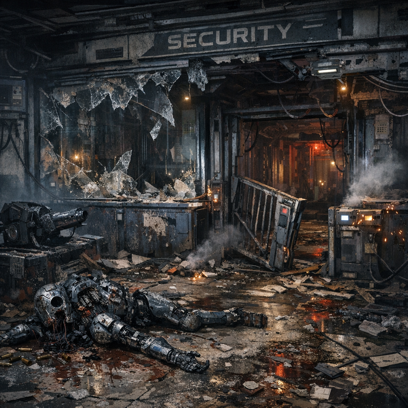
/// caption
23E Damaged Security Checkpoint
///

- looks similar to the **23A Security Checkpoint**, but in worse shape
- Hank doesn't think he's ever been this way
- Zeke pushes hard on the door
    - it moves eventually, but he lets out a loud fart while pushing

## 22B Reception Area

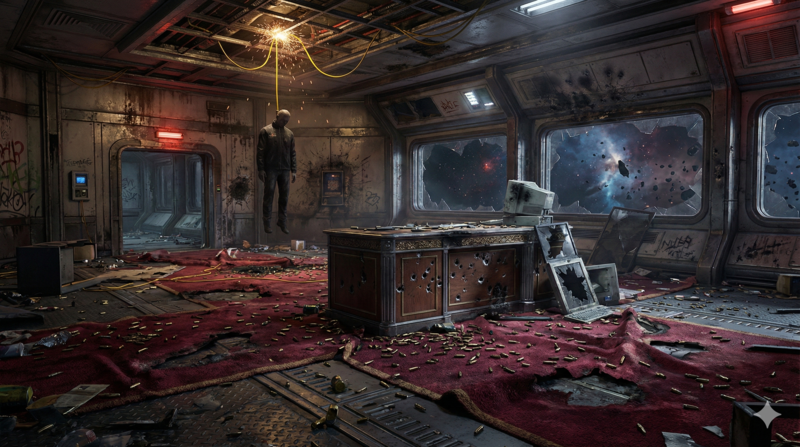
/// caption
22B Reception Area
///

- wide open space
- filthy, but once luxurious
- carpet is really nice, but burned in places
- scattered bullet casings
- desk riddled with bullet casings
    - Carnoc things the casings are from a high-end modified pulse rifle
- broken terminal
- corpse, swinging from rafters, hung by electrical extension cord
    - uniform looks kind of similar to the HEL uniforms, but similar
- on the wall, written "One Way Out"
- Murderbot starts scanning the corpse
    - Hank wonders what he's doing
    - scanner dings
    - Hank asks how long he's been dead
    - Murderbot: "5 hours"
    - Murderbot cuts him down "out of respect"
        - lets him thump down hard
    - removes the logic core
    - stitches him back up
    - keeps the logic core
    - Murderbot: "cause of death: rope"
- Hank says the artifact is down the hall to the left

## 22C Elevator Access

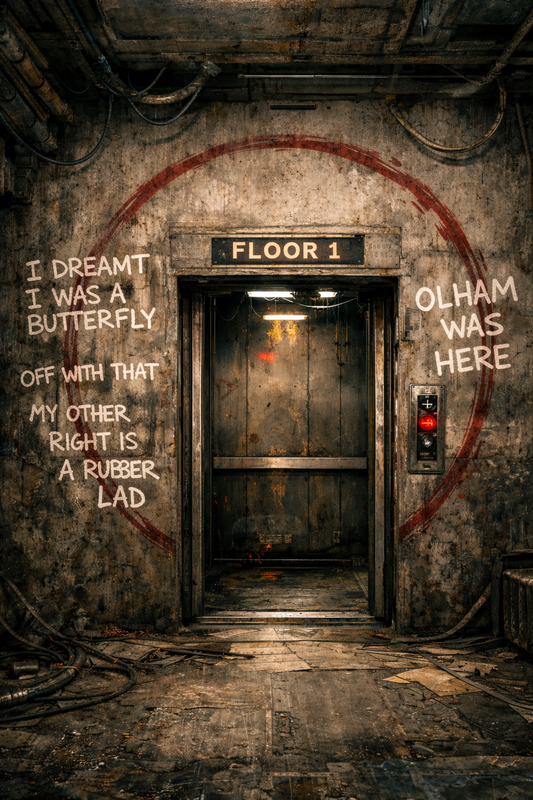
/// caption
22C Elevator Access
///

- graffiti around the elevator
    - "I dreamt I was a butterfly"
    - "Fuck off with that shit"
    - "My other ride is a rubber lad"
    - off to the side: "Olham was here"
    - circling all of this: "Please, could you stop the noise."
- take the elevator
- loud shrieking sound

## 25A Corporate Luxury Hotel Lobby

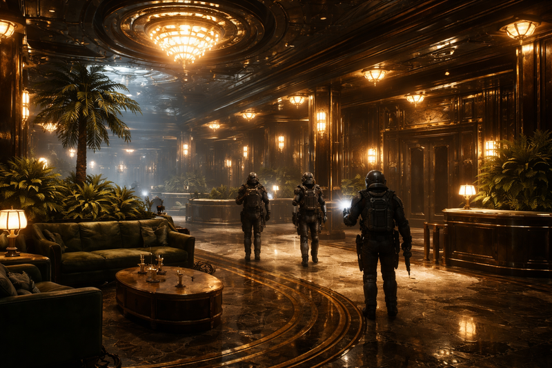
/// caption
25A Corporate Luxury Hotel Lobby

The nicest room we've seen
///

- fake plant in the room
- there is gravity
- exits
    - airlock south
    - normal door east with sign "bathroom"

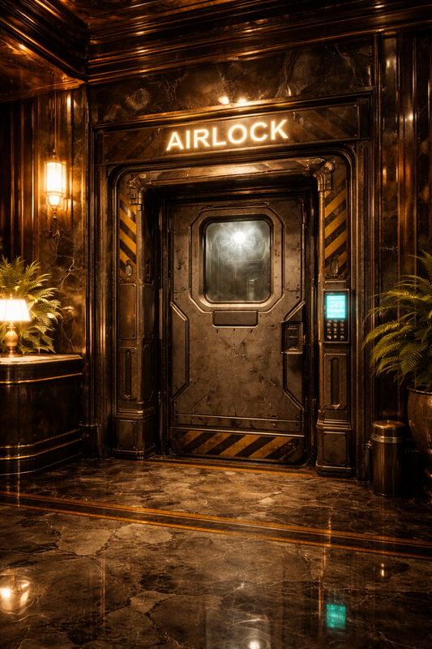
/// caption
Exit to Airlock
///

/// caption
Exit to Bathroom
///

## 25B Bathroom

- it's smashed up with porcelain shards in heaps
- graffiti: "The Minotaur extends beyond the Minotaur"
    - Noriko claps

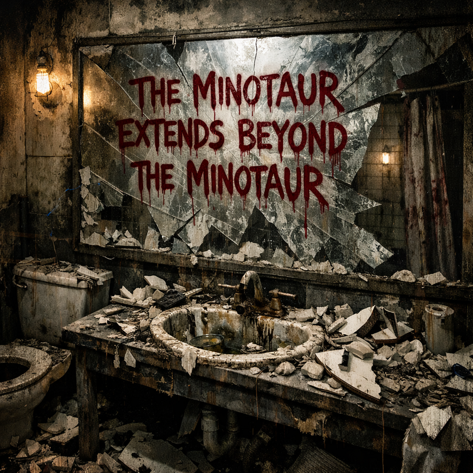
/// caption
graffiti in 25B Bathroom
///

- cybernetic diagnostic scanner on the ground
    - Ink tries to turn it on and it doesn't work
- screws on the ground
- ventilation shaft above, but screws in place there
- screwdriver next to the mirror
    - Dex gently removes the mirror
    - custom rigging gun
    - steel cord laced cable
    - seems to be charged
    - note next to a pair of eyes
    - "Ishmael sends their regards"
    - maybe the eyes are about opening our eyes to secrets
    - Dex takes it
- Murderbot helps Ink up to look at the vent
- Noriko says the eyes look shiny
    - Zeke thinks they are implants, like cyberware

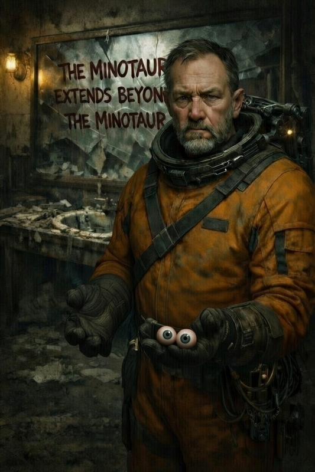
/// caption
[Dex](dex-miro.md), holding eye implants in **25B Bathroom**
///

- Dex sets up Zeke's encrypted radio transmitter while Ink explores
    - behind the mirror and then closes off the mirror

## 28A Mysterious Body

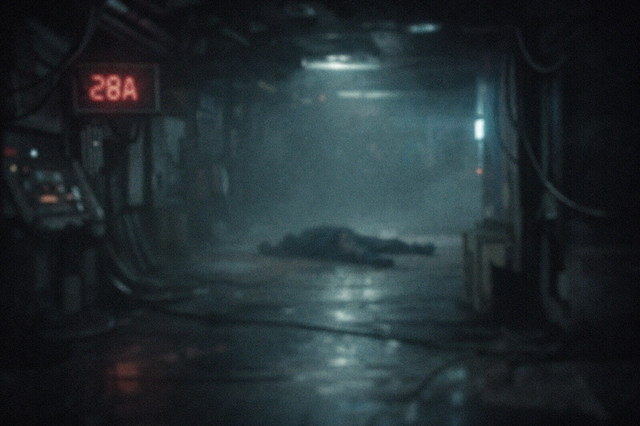
/// caption
Body in 28A
///

- Ink sees a body on the floor
    - its chest cavity is split open
    - something is inside the chest cavity
- small metallic chamber
- walls have analysis equipment
- no easy way to climb back up
- Ink jumps down
- inspects the body
    - removes 2 small black boxes with universal ports
    - keeps them for later analysis
- Ink feels like he's being watched
- Ink explores the sewer grate to 25C
    - pile of stinking filth blocks most of the shaft
    - goes back
- looks through door to 28B
- rest of the crew joins Ink

## 28B Body in the Gears

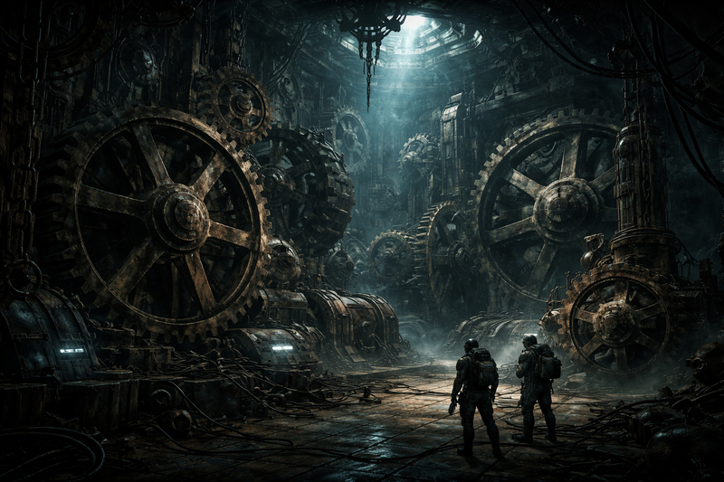
/// caption
28B Large room with gears and machinery
///

- gears and machinery scattered
- revolver
- electronic toolkit
- corpse is stuck in the gears
    - still not Jim
- Hank picks up the revolver
    - Murderbot knocks Hank down and takes the revolver
    - Murderbot zip ties Hank
    - Noriko tells Hank the Minotaur will bring him peace
- Murderbot takes the electronic toolkit
- Dex tries to remove the corpse from the gears
    - has a similar uniform to the hanged corpse
    - suit has a "verified human" patch
    - scan the corpse, the parts that are present seem human

## 28C Murals

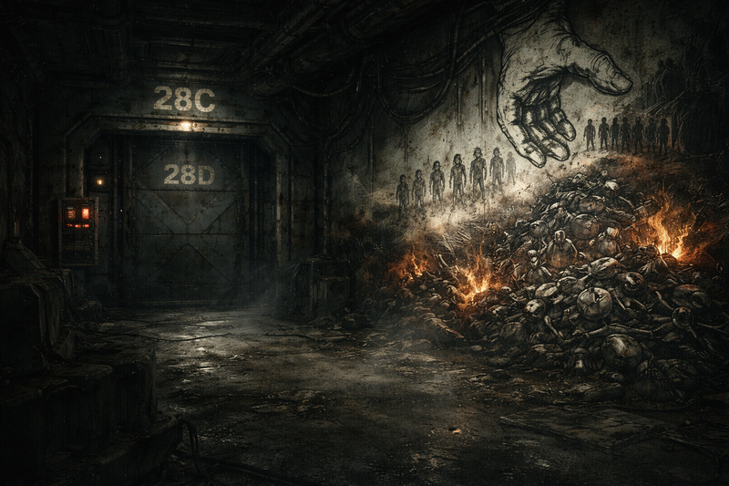
/// caption
28C murals depicting massacre and salvation
///

- series of tunnels open up
- small chamber leading to the tunnels
- bulkhead door to 28D
    - childish murals depict androids being torn to pieces
    - androids burn and shot by unseen assailants
    - people are led from a steel cave into tunnels by a benevolent steel hand
        - Noriko things the steel hand is the Minotaur

## 28D The Gutter

- 20 meter pit leads to shantytown of deposed androids
- dangling cables and corroded sheets of metal
- bunch of androids, damaged and crudely repaired
- androids are all bumping into each other

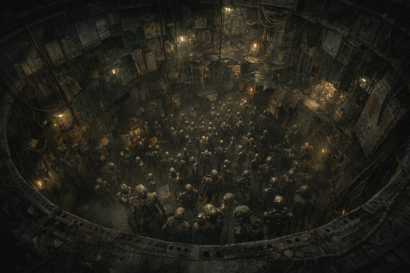
/// caption
Damaged androids in the pit, wandering and bumping into each other
///

## Tunnels

- head back to the tunnels
- walls appear to be covered in skin
- corridors of pipes and scaffolding
- walls are constantly shuddering and shifting in peristalsis
- don't react to Murderbot and Hank
- continue on

## 29A Labyrinth

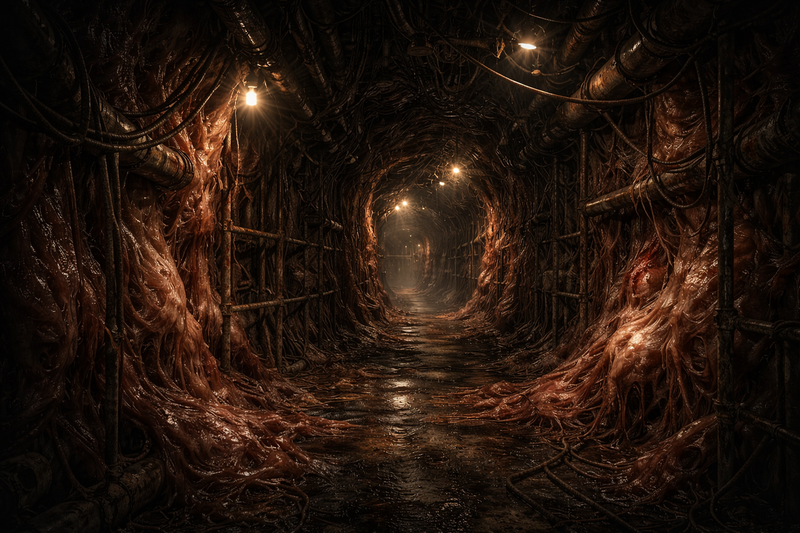
/// caption
Walls transition from pseudo flesh ...
///

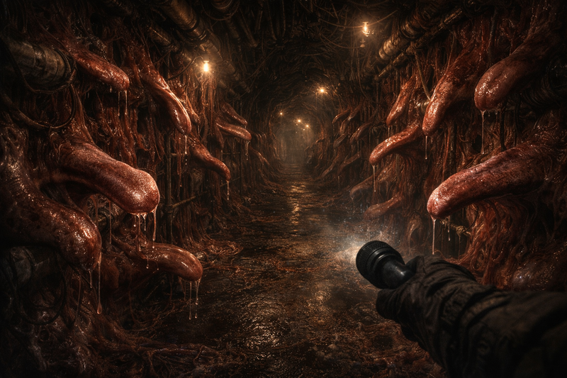
/// caption
... to glistening, dripping tongues
///

- walls become glistening, dripping tongues
    - reach out to lick us
- bright, open chamber
- covered in geometric designs
- 15 people here
    - run up to eagerly greet us
    - Noriko says they were touched by the Minotaur
    - "Look how happy they are"

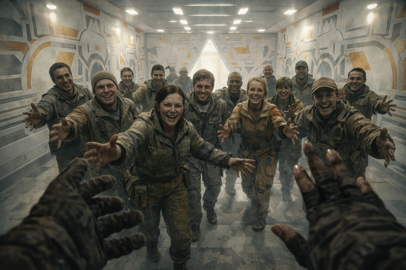
/// caption
15 people greet the crew eagerly
///

- hear a high-pitched roar
    - creature with mouths all over approaches

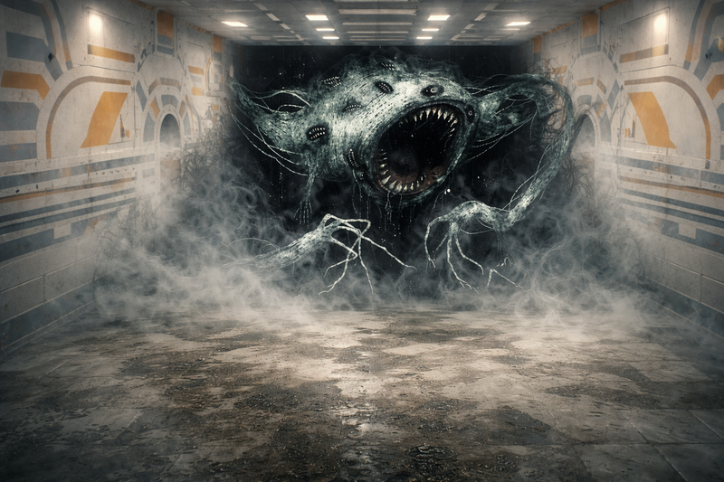
/// caption
A creature covered with mouths roars and appears
///

- the crew reacts in fear
    - Murderbot is overwhelmed
    - Carnoc panics
    - Zeke becomes jumpy

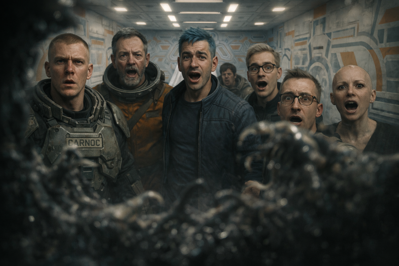
/// caption
The crew is afraid
///
