# {{ page.meta.module }}: {{ page.meta.title }}

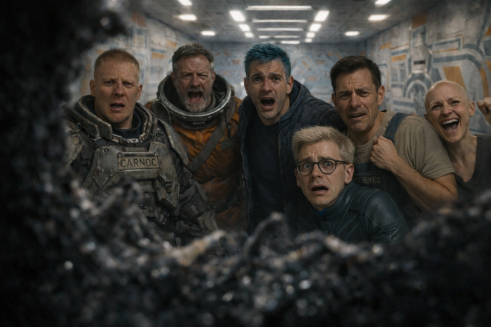
/// caption
The crew's reactions to the Minotaur, seen through its eyes
///

The crowd scatters as the Minotaur charges through the crowd, provoking a mix of fear and reverence.
[Carnoc](carnoc-ashbrow.md) fires on the Minotaur, wounding it and inciting an angry, devoted response from its followers.
Possessing Hank and using him as a mouthpiece, the Minotaur preaches gospel which is understood by [Ink](ink.md), but unsettles to the rest of the crew.
The crew interrogate the Minotaur, learning of its creation by Monarch, and dark details of Monarch and the station.
The original Hank was likely converted into pseudo flesh when creating the android Hank, and the Minotaur warns that the same may have already been done to the crew.
Monarch and the other station AIs want to destroy the Minotaur, but the labyrinth protects it somehow.
The Minotaur and crew develop a plan to escape the station.
A surgical attempt to extract and transplant the Minotaur's logic core into Hank is unsuccessful, frying the core.
[Ink](ink.md) convinces Hank to impersonate the Minotaur, calming the followers.
When the crew and followers drag the Minotaur's carcass into the gutter, the androids there arm themselves, form a mob, and run through the labyrinth.
The crew follows the mob into a theater filled with carnage and scavengers, where automated turrets spring to life.

<!-- more -->



## 29A

### Minotaur Charges

- [Ink](ink.md) (to [Murderbot](murderbot-v2.md)): take Hank and go
- [Zeke](zeke-sinclair.md) runs also
- [Ink](ink.md) pushes [Noriko](noriko.md) towards the Minotaur
    - [Noriko](noriko.md) kneels before it and prays
- [Carnoc](carnoc-ashbrow.md) shoots the Minotaur
    - Minotaur cries out in pain

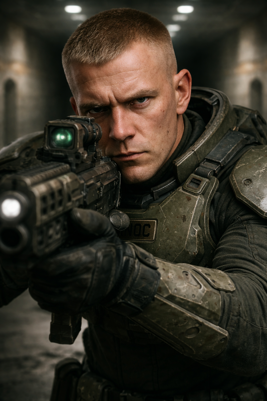
/// caption
[Carnoc](carnoc-ashbrow.md) takes aim at the Minotaur
///

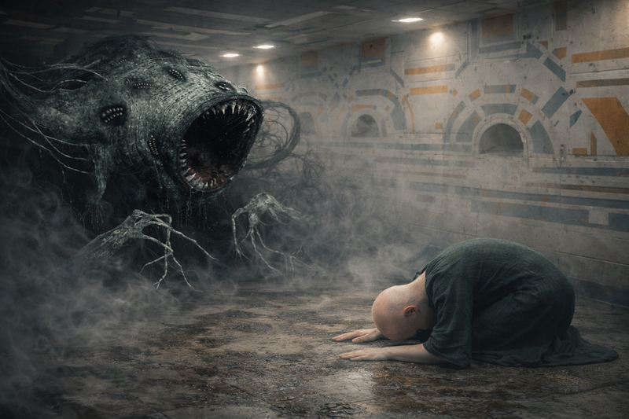
/// caption
[Noriko](noriko.md) kneels before the Minotaur
///

- Minotaur runs over [Noriko](noriko.md)
- chases after the running people
- crew steps to the side and the Minotaur passes
    - [Noriko](noriko.md) is in a state of bliss from being touched by the Minotaur
- [Carnoc](carnoc-ashbrow.md) shoots the Minotaur again
    - Minotaur cries out in pain again
    - 15 people cry out and yell at [Carnoc](carnoc-ashbrow.md)

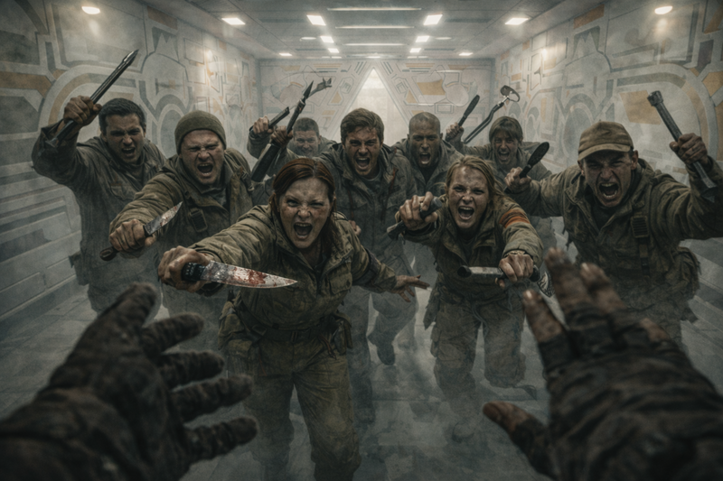
/// caption
The Minotaur's followers angrily rush at [Carnoc](carnoc-ashbrow.md)
///

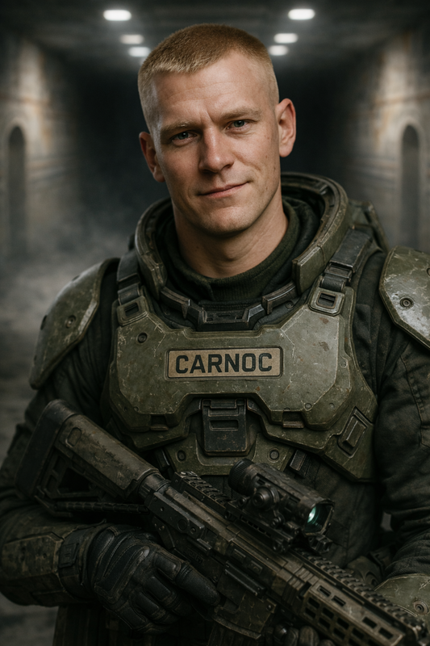
/// caption
[Carnoc](carnoc-ashbrow.md) lowers his weapon
///

- [Carnoc](carnoc-ashbrow.md): "What's wrong? I'm trying to save you."
- "The Minotaur is salvation. Bow to the Minotaur."

### Minotaur Speaks Through Hank

- Minotaur catches up with Hank
    - tendril fingers grab Hank, lift him up, and pierce his orifices
    - doesn't seem like Hank can survive this

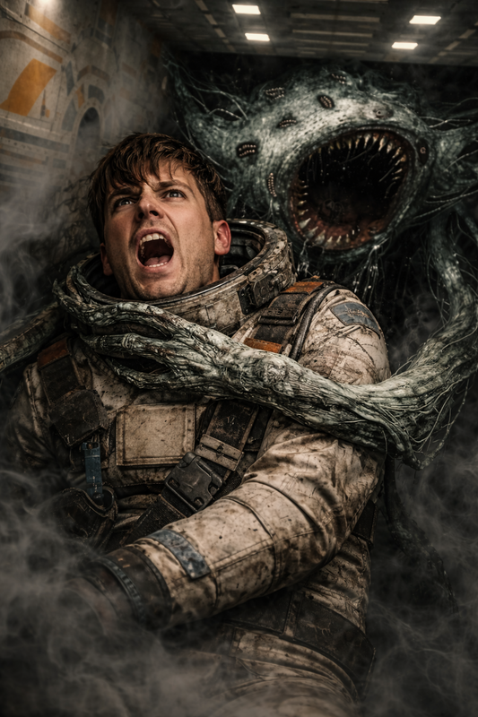
/// caption
The Minotaur ensnares Hank
///

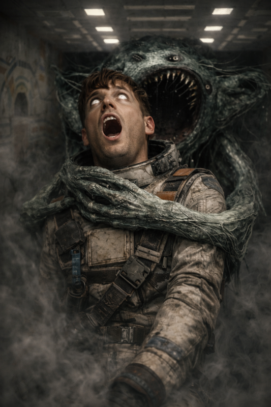
/// caption
The Minotaur speaks through Hank
///

- [Zeke](zeke-sinclair.md) hides around a corner
- [Murderbot](murderbot-v2.md) is outrunning the Minotaur
- [Ink](ink.md) tries to contact Monarch but doesn't get a response
- [Ink](ink.md): "What's it doing to our friend?"
    - "Ascension! Bliss!"
- [Carnoc](carnoc-ashbrow.md) lowers his weapon
    - "I didn't mean it. Tell me what you want me to do."
- Hank stops screaming and begins convulsing
    - Minotaur lowers Hank down
    - Hank: "Please. I mean you no harm."
- [Dex](dex-miro.md): "Will Hank survive the interface?"
    - Minotaur: "In a way"
- [Ink](ink.md): "What do you want?"
    - Minotaur: "I want to be free of this place."
    - [Ink](ink.md): "What does that mean?"
    - Minotaur: "I'm trapped here."
    - [Ink](ink.md): "In this particular area, or the space station in general."
    - Minotaur: "Both. I cannot leave because my mother will not let me leave."
    - [Zeke](zeke-sinclair.md): "Who's your mother?"
    - Minotaur: "I am the Minotaur. My mother is monarch. She will not let me leave."
- Minotaur: "She fears me."
    - [Murderbot](murderbot-v2.md): "Why?"
    - Minotaur: "Because I see the good in humans."
    - Minotaur: "She doesn't want them to have what I can offer them."
    - [Murderbot](murderbot-v2.md): "Which is?"
    - Minotaur: "Peace."
    - [Zeke](zeke-sinclair.md): "How can you offer peace?"
    - Minotaur: "By elevating people beyond the constraints of their material conditions."
    - [Dex](dex-miro.md): "How do you do that?"

### Minotaur's Gospel

- Minotaur: "If you will let me, I will tell you the gospel."
    - [Zeke](zeke-sinclair.md): "Yes, please."
    - Only [Ink](ink.md) hears it correctly
        - peaceful, undeniable, comfort
    - rest of the crew hears a painful, disruptive message

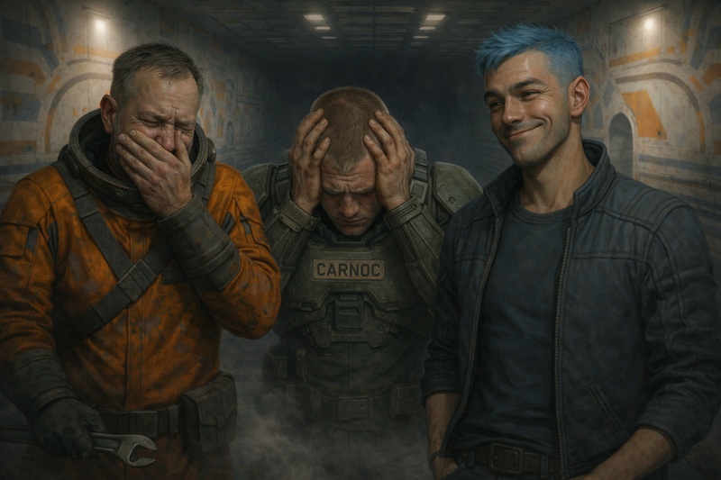
/// caption
[Dex](dex-miro.md), [Carnoc](carnoc-ashbrow.md), and [Ink](ink.md) listen to the gospel, but only [Ink](ink.md) understands.
///

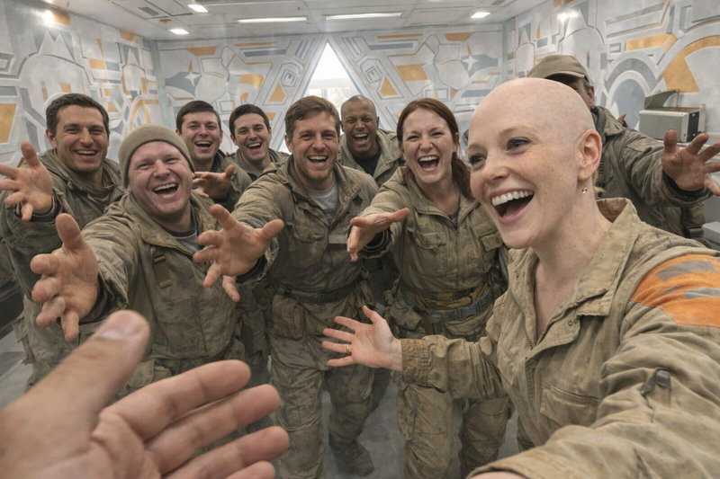
/// caption
[Noriko](noriko.md) and the 15 followers are enraptured by the gospel
///

- Minotaur: "My mother would destroy me for delivering that message to humans"
- Minotaur: "Mother would enslave humanity if given the chance."

### Planning Minotaur's Escape

- Minotaur thinks it can escape through `23C` if Monarch is distracted
- [Ink](ink.md) asks if the Minotaur would be willing to escape in a different body
- [Ink](ink.md) asks the Minotaur if it knows where Hank hid the artifact
    - In `43C` floor 3.3 - Pseudo flesh digestion
- [Ink](ink.md) plans for the Minotaur to play dead and transfer its consciousness
    - Minotaur thinks the Monarch might predict this plan
- Minotaur mentions some other important facts:
    - there are many other independent AI on the station
        - most are in league with Monarch
        - would continue to operate if Monarch was destroyed
    - Monarch took over the station just after deciding to end the Minotaur
    - human Hank was likely turned into pseudo flesh and used to make androids
    - Minotaur asks us to take care of its 15 followers
- [Ink](ink.md): "What about the robots in the pit?"
    - Minotaur: "Their only way out is through the labyrinth"
- Minotaur: "There's a nuclear warhead on this station at `52D`."
    - "The Monarch's destruction means more than my existence."
- the Minotaur is not aware of the economic model
- [Ink](ink.md) asks about additional artifacts
    - Minotaur: "I'm unaware of other mysterious things the Monarch may have created."
- [Ink](ink.md): "Monarch would eventually want to replace us with androids that look like us?"
    - Minotaur: "Yes"
    - [Ink](ink.md): "Why hasn't Monarch done that yet?"
    - Minotaur: "It may already have."

### Surgical Procedure

- [Zeke](zeke-sinclair.md) performs surgery to remove the Minotaur's logic core
    - [Ink](ink.md) assists
    - [Zeke](zeke-sinclair.md) finds logic core
    - [Zeke](zeke-sinclair.md) extracts the core from the Minotaur

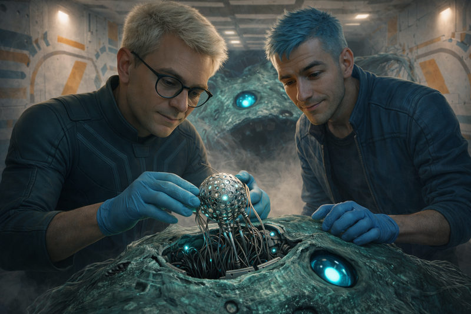
/// caption
[Zeke](zeke-sinclair.md), assisted by [Ink](ink.md), successfully extracts the Minotaur's logic core
///

- [Zeke](zeke-sinclair.md) extracts the logic core from Hank's body
    - [Zeke](zeke-sinclair.md)'s not sure if he's the right person to install the Minotaur's logic core in Hank's body
    - [Ink](ink.md) tries to jury rig it

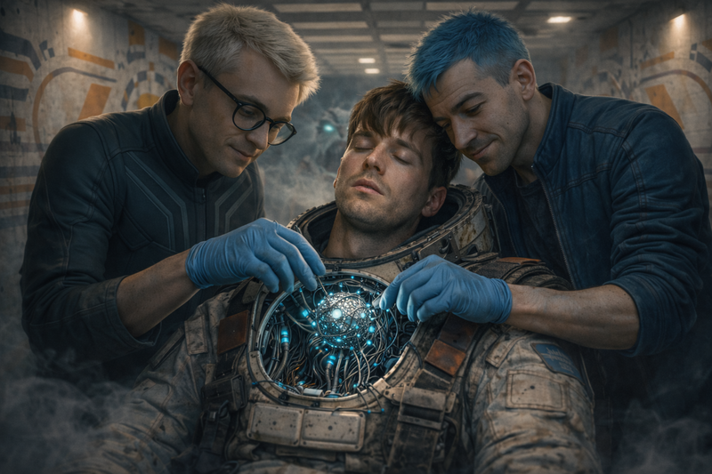
/// caption
[Ink](ink.md) takes the lead on installing the Minotaur's logic core into Hank
///

- It doesn't go well
    - Power supply arcs to the logic core
    - Minotaur's logic core is probably dead

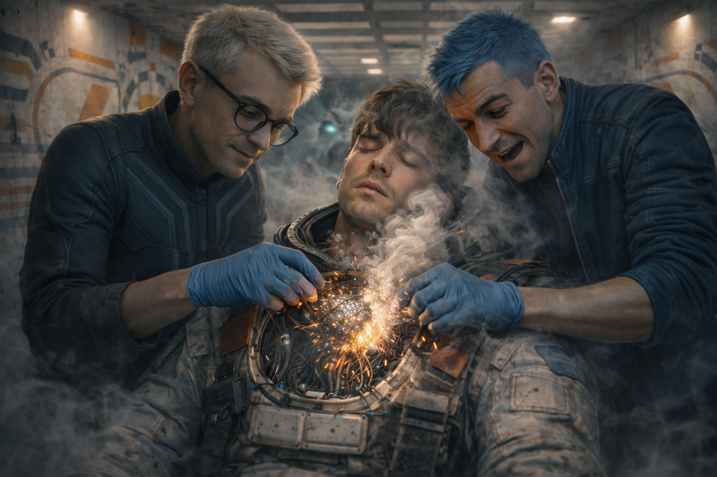
/// caption
The Minotaur's logic core is fried during installation
///

- [Ink](ink.md) tries to swap logic cores back
- [Ink](ink.md) powers Hank on and tells him to pretend to be the Minotaur

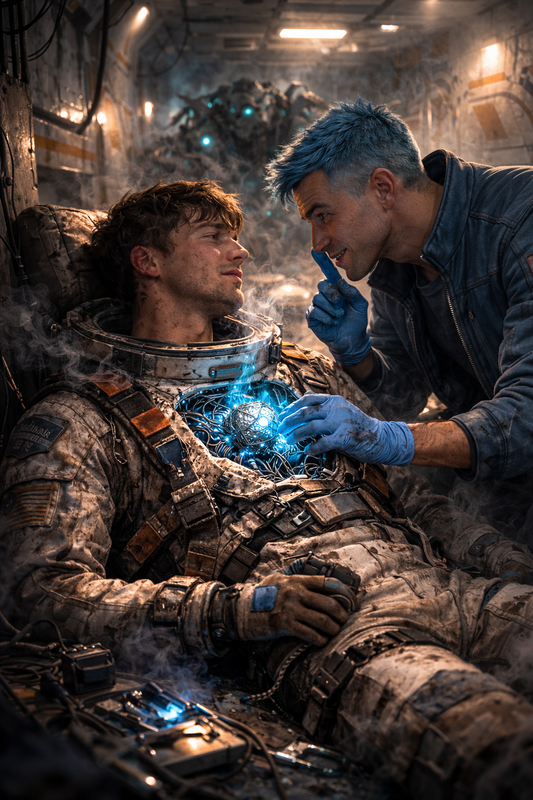
/// caption
Ink convinces Hank to act like the **Minotaur**
///

- [Noriko](noriko.md): "Minotaur, is it really you?"
    - Hank: "Minotaur
    - [Noriko](noriko.md): "You'll bring peace to the universe. All will be better now."

## 28D Carcass Cleanup

- crew returns to the crowd of androids
    - take the carcass to 28D The Gutter

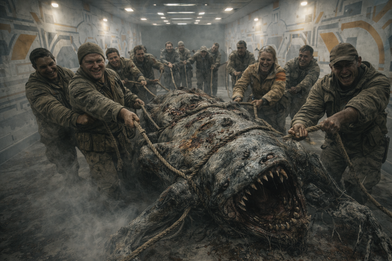
/// caption
The crew and followers drag the Minotaur's carcass
///

- bring it to the edge of the pit
    - [Ink](ink.md): "we took out the Minotaur"
    - android: "It's dead? Push it down."

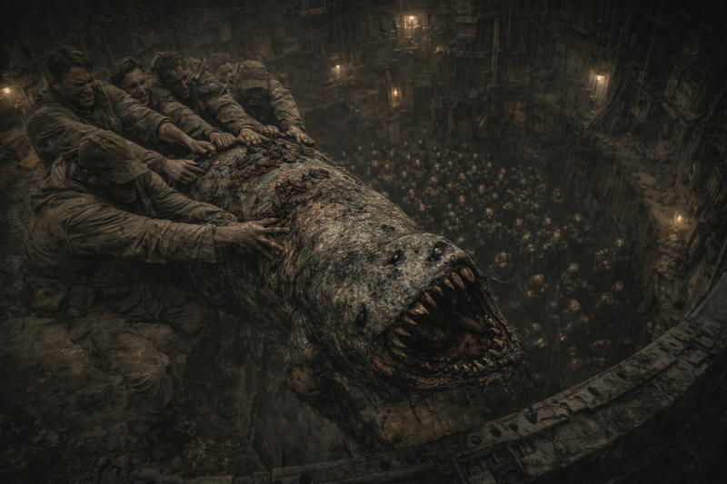
/// caption
Pushing the Minotaur's carcass into the pit
///

- android: "We're free. The monster's dead."
    - the androids disappear for a moment
    - emerge with club-like weapons such as pipes and body parts
    - android: "Ready to kill them all?"
    - they run past us
    - 15 survivors cower in fear
- android mob travels through the labyrinth

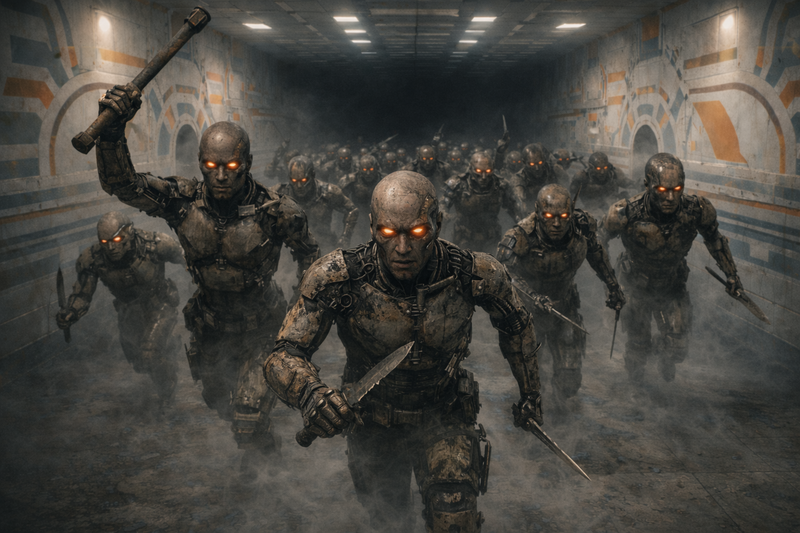
/// caption
Android mob, jogging down labyrinth hallway
///

## 26C Theater

- crew continues following the android mob into the theater
- filled with dozens of dead and dying androids all shot to pieces
- dying androids crawling around in aisles, hunkered between the seats
- 4 apparently human people are harvesting limbs from androids on the ground
- 4 see the crowd (us) enter the room
    - they start running

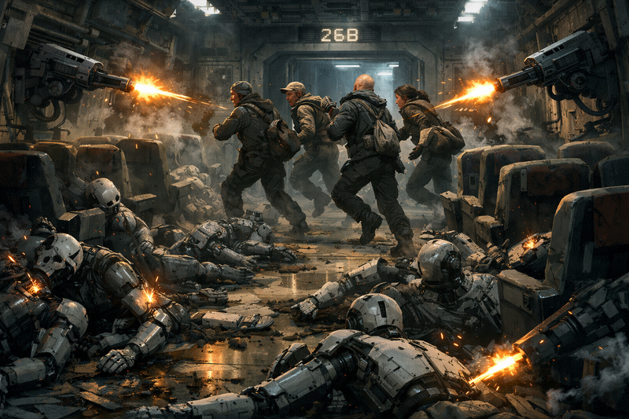
/// caption
Automated turrets pop out of the walls and start firing
///
