# {{ page.meta.module }}: {{ page.meta.title }}

The chosen retreat behind a locked door, which the fallen androids are slaughtered by automated machine guns.
[Ink](ink.md) miraculously avoids injury from a reckless test of changing gravity in an unusual corridor.
Hank follows and killed on impact, but [Ink](ink.md) quickly cleans up and hides the body.
Only [Dex](dex-miro.md) suspects Hank is dead.
A floating woman mutters about her lost toolbox and then attacks the crew.
After exploring a few more rooms, the crew find the toolbox which calms **Helen**.
[Zeke](zeke-sinclair.md) learns **Helen** wants to fix the station, but returning the toolbox causes her to disappear.
Inspecting the toolbox reveals many useful items, which are distributed amongst the crew.

<!-- more -->



- [Ink](ink.md) asks one of the fallen where they're going
    - to get revenge on the chosen
- androids in the gutter are known as the fallen
- 56 of the fallen charge forward to attack the turrets
- chosen retreat behind a locked door
- fallen are slaughtered by the turrets

## 27A

- 6 lockers, 5 empty
    - open locker contains
        - vac suit
        - combat shotgun with inscription "the buck starts here"

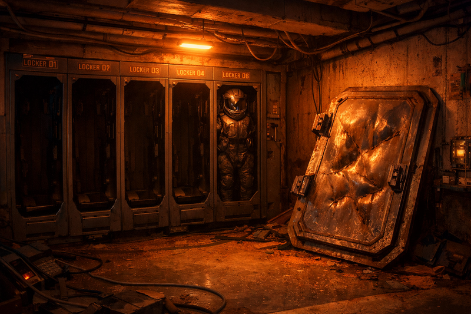
/// caption
Vac suit in lockers
///

- [Dex](dex-miro.md) takes the vac suit and shotgun

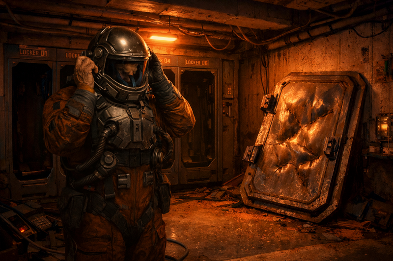
/// caption
[Dex](dex-miro.md) gets rid of his damaged hazard suit and dons a new vac suit
///

- hatch leading to 31A
    - ladder continues only for awhile
    - hallway continues much longer
    - [Dex](dex-miro.md) and [Ink](ink.md) suspect it's zero g after the ladder ends

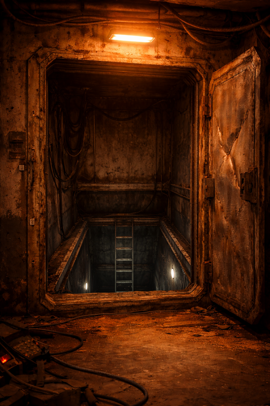
/// caption
Ladder down from hatch
///

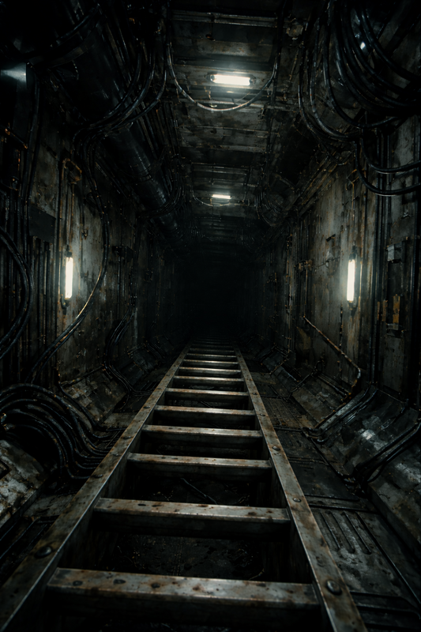
/// caption
Ladder ends partially down the shaft
///

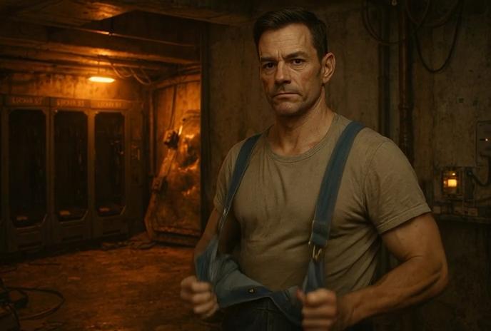
/// caption
[Murderbot](murderbot-v2.md) offers his overalls to test the gravity
///

- [Ink](ink.md) tosses [Dex](dex-miro.md)'s old vac suit
    - [Ink](ink.md) thinks he saw it stop accelerating around the bottom of the ladder
    - not easy to tell though
- [Ink](ink.md) jumps through the hatch
    - comes to a hard landing, but safely

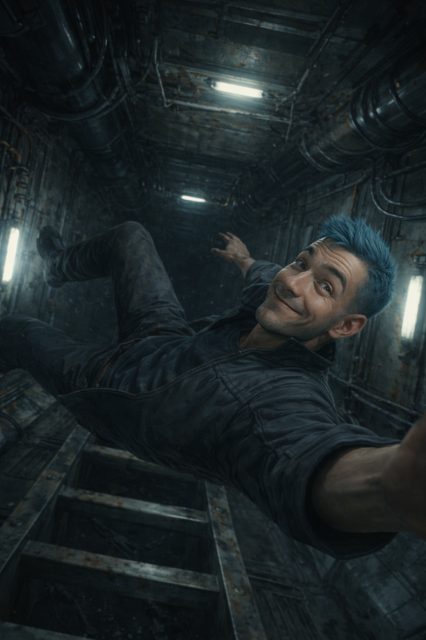
/// caption
[Ink](ink.md) dives down the hatch
///

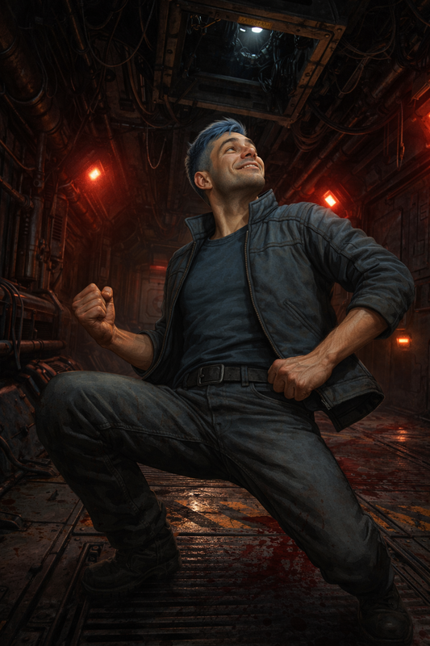
/// caption
[Ink](ink.md) lands in a superhero pose
///

- Hank thought [Ink](ink.md)'s acrobatics were pretty awesome
    - Hank moves to jump through the hatch
    - [Dex](dex-miro.md) tries to block him, but is too slow
- Hank jumps through the hatch
    - Hank: "How do you slow down?"

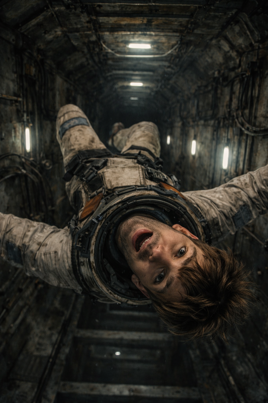
/// caption
Hank dives down the hatch
///

- Hank lands hard at the other end of the shaft
    - looks pretty dead
    - [Ink](ink.md) removes Hank's logic core and cleans up the mess

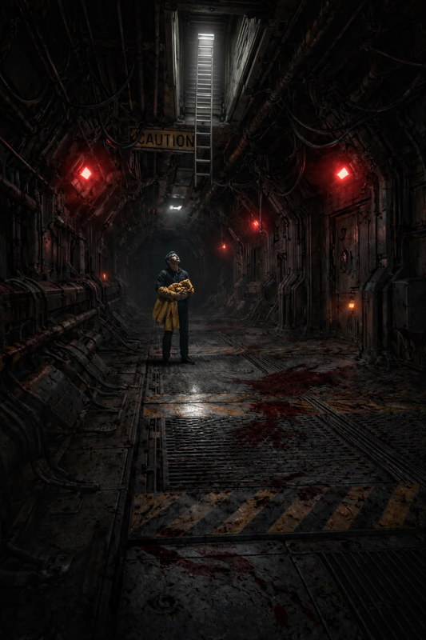
/// caption
[Ink](ink.md) (mostly) cleans up Hank's mess
///

- [Ink](ink.md) finds 4 lockers
    - stashes Hank's body inside one of them

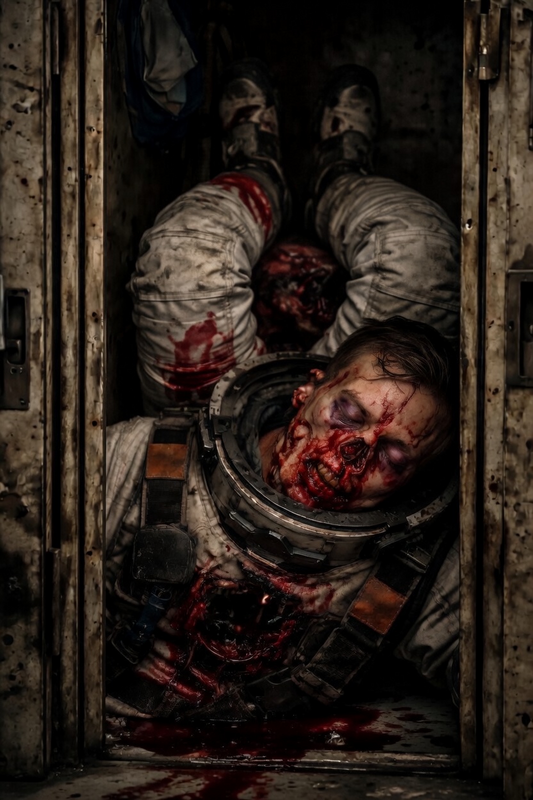
/// caption
[Ink](ink.md) stashes Hank's body in a locker
///

- [Ink](ink.md) investigates the remaining lockers
    - pin-up posters in the lockers
        - [Ink](ink.md) takes one
    - bullet holes in the lockers
    - some yellow stains
- [Dex](dex-miro.md) climbs down the ladder
    - slowly traverses the rest of the shaft
    - [Noriko](noriko.md) follows, eager to stay near the Minotaur

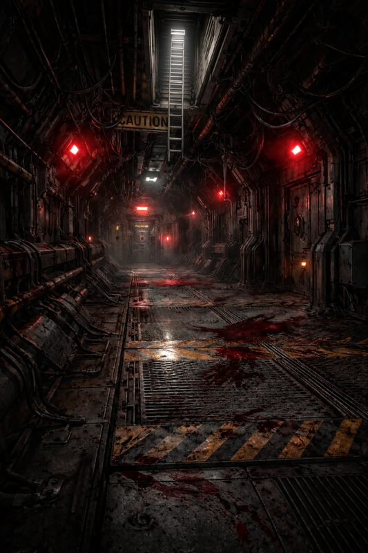
/// caption
What the rest of the crew sees when they arrive
///

## 31A

- [Noriko](noriko.md): "Where's the Minotaur?"
- [Ink](ink.md): "He went ahead to get things ready."
- [Noriko](noriko.md): "Which direction did he go?"
- [Ink](ink.md): "It's a surprise. He wants you to stay with us."

/// caption
[Noriko](noriko.md) asks about the Minotaur
///

- [Carnoc](carnoc-ashbrow.md) investigates the bullet holes in the lockers

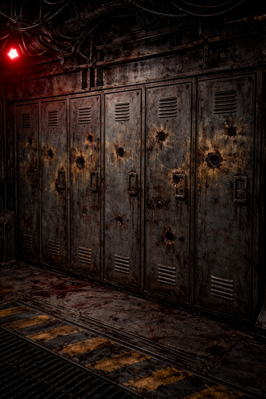
/// caption
Bullet holes in the lockers are from small arms file, probably from **31C**
///

- [Murderbot](murderbot-v2.md) identifies the yellow stains as pseudo milk (android blood)
- [Carnoc](carnoc-ashbrow.md) places the last radio transmitter in one of the lockers

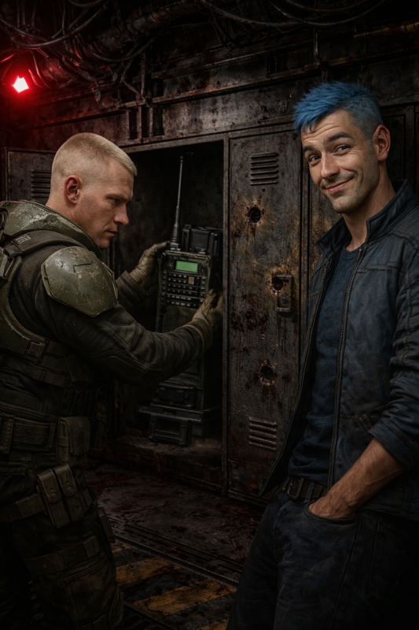
/// caption
[Carnoc](carnoc-ashbrow.md) installs the last radio transmitter
///

- crew discuss where to set up a defensive position for a few hours

## 31B Break Room

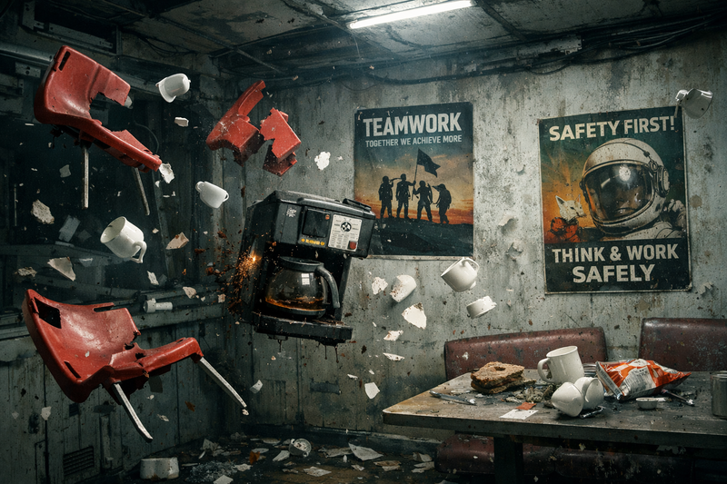
/// caption
Floating, smashed plastic chairs and porcelain fragments
///

- door to 31A isn't very substantial, like a standard office door
- [Ink](ink.md) tries to communicate with Monarch, but gets no response
    - not much power in this area
    - suspect communication is limited in this area

## 34A

- door is much heavier, but not an airlock
- heavily looted steel shelves
- floating nails and screws
- woman wearing stained white coveralls floating
    - woman: "Can't fix it. Need toolbox. No, No, No"

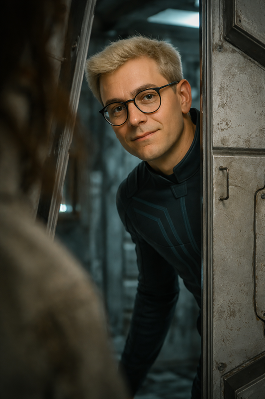
/// caption
Zeke opens the door, peeks into **34A** and ...
///

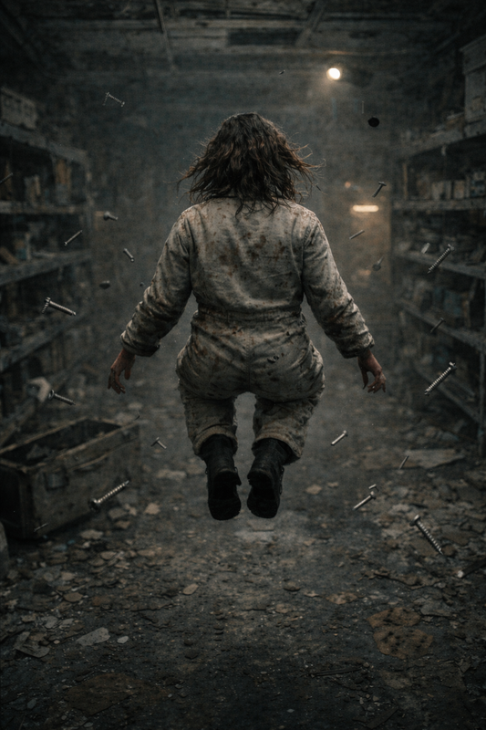
/// caption
sees a floating woman with screws and nails surrounding her
///

- [Zeke](zeke-sinclair.md): "What do you want to fix?"
- woman turns towards [Zeke](zeke-sinclair.md)
    - opens her mouth and screams
    - nails and screws start to align themselves with [Zeke](zeke-sinclair.md)
    - start glowing like they're heating up

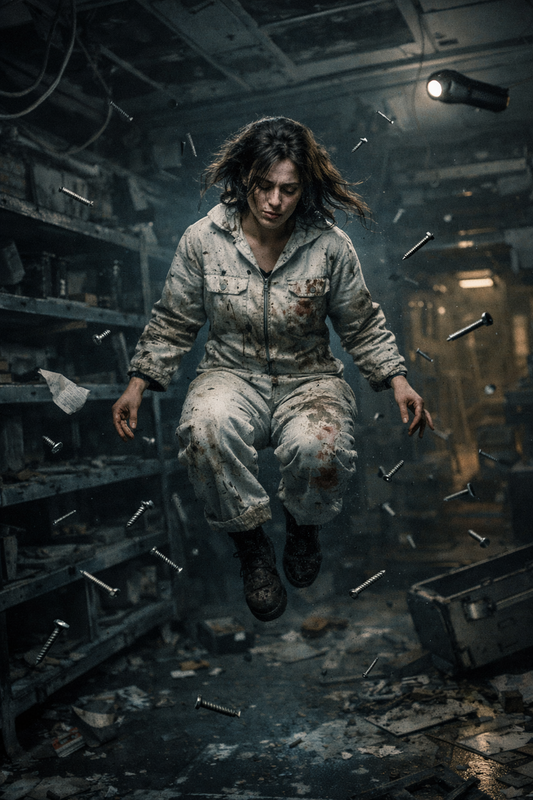
/// caption
The woman screams and attacks with screws and nails
///

- we close the door
    - hear sound of several nails and screws hitting the door
- woman: "I need my toolbox!"
    - [Zeke](zeke-sinclair.md): "I can't help you if you throw nails at me."

## 34B

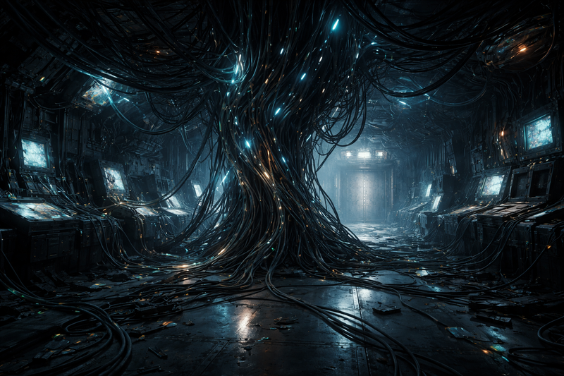
/// caption
34B
///

- computer terminals with panels burst open
- cables sway like seaweed in the zero g air currents
- central cluster of cables and terminal components woven in a giant lattice
- [Ink](ink.md) tosses some metallic trash at the cables
    - lattice doesn't react to it
- [Ink](ink.md), [Zeke](zeke-sinclair.md), and [Murderbot](murderbot-v2.md) go into the room
    - trying to avoid cables where possible
    - when they touch the lattice, it doesn't move to react
    - some lights shimmer in the cables

## 34C

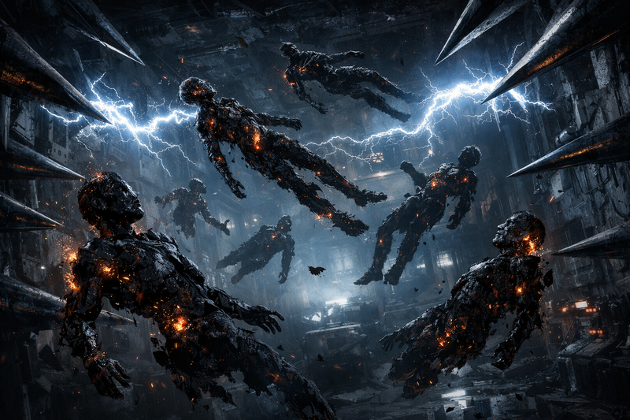
/// caption
34C
///

- burnt android shells float like cherry blossoms
- huge spikes protrude from the walls
- every 3.5 seconds, electricity arcs between the spikes
- close the door, and retreat back to the hallway
- [Noriko](noriko.md) asks how long the Minotaur is going to be away

## 34D

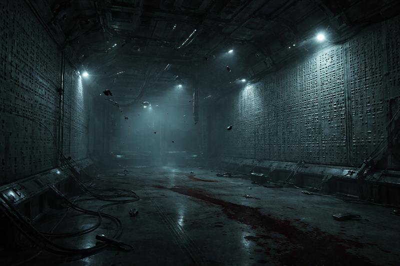
/// caption
34D
///

- straight chute with occasional handholds
- interesting texture on the walls
- [Murderbot](murderbot-v2.md) enters the room to inspect the texture
    - texture is a variation of braille
    - repeats "Born to Suffer" in many languages
    - reaches the other side
- crew follows
- turn a corner and head to 34E

## 34E

- immense vertical drop filled with chains
- slick with condensation
- cold water droplets drift and sparkle in the darkness
    - like a field of stars
- likely collecting condensations to regulate humidity
    - or collect water for drinking purposes

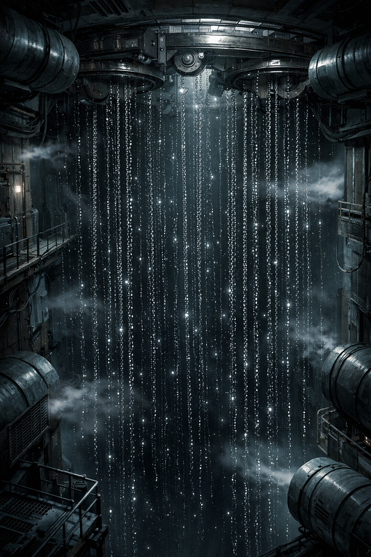
/// caption
Chamber filled with changes, covered in condensation
///

- discover an opaque metal cylinder with a power cable
    - fixed to a wall/floor
    - seems like a battery
    - slowly pulsing green light
    - [Dex](dex-miro.md) thinks he can free it with its spanner

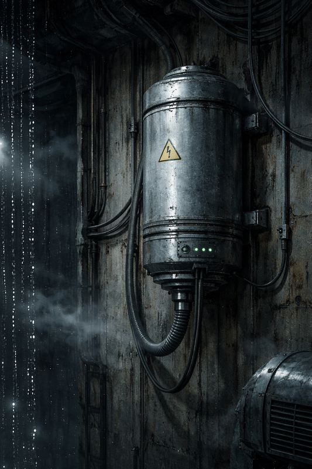
/// caption
Battery attached to the wall
///

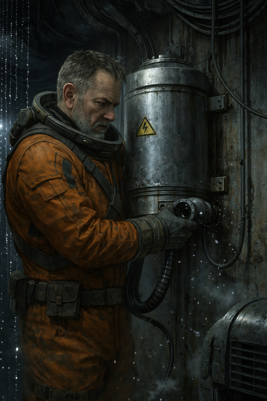
/// caption
[Dex](dex-miro.md) separates and takes the battery
///

- can pull it along with us in zero g
    - pretty unwieldy if gravity returns

## 33F

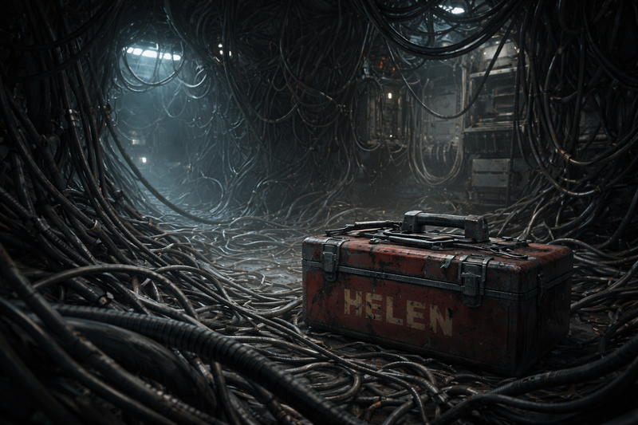
/// caption
A toolbox with **Helen** written on the side
///

- [Zeke](zeke-sinclair.md) opens the door to 34A with the floating woman
- Helen: "Oh, my toolbox, give it here. I can fix things."
    - [Zeke](zeke-sinclair.md): "What are you going to fix?"
    - Helen: "I'm going to fix the station. Make it just like it was."
    - [Zeke](zeke-sinclair.md): "What was it like before? What went wrong?"
    - Helen: "Plenty. The AI got out of control.
    - [Zeke](zeke-sinclair.md): "That it did. How can you fix that with this toolbox?"
    - Helen: "With my handy spanner, I can fix anything."
    - [Zeke](zeke-sinclair.md): "Can you show me how?"
    - Helen: "Sure, hand me my toolbox."
    - [Zeke](zeke-sinclair.md): "There you go."

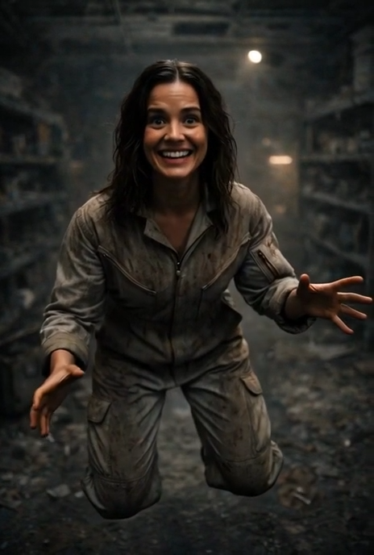
/// caption
[Zeke](zeke-sinclair.md) talks to Helen, calmed by the sight of her toolbox
///

- [Zeke](zeke-sinclair.md) pushes the toolbox to Helen
    - as it connects with her, her body distorts
    - winks out of existence

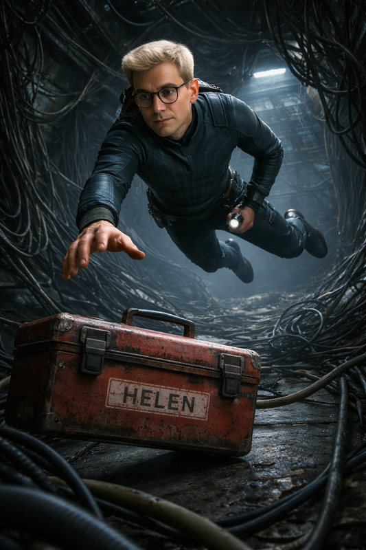
/// caption
[Zeke](zeke-sinclair.md) grabs Helen's toolbox
///

- heavy backpack system connected to a large emitter dish
    - looks similar to our radio transmitters, except for the dish
- Helen's toolbox contains other items
    - laser cutter
    - crowbar
    - hand welder
    - foam gun - crack sealing
    - 6 pairs of mag boots
    - 6 vac suits
    - 3 stimpacks
- everyone takes a vac suit and a pair of mag boots
- [Dex](dex-miro.md) takes the foam gun
