# {{ page.meta.module }}: {{ page.meta.title }}

The crew find an improvised cryo pod bay and wake the 4 occupants.
Bernice, an android researcher, is abruptly killed by the bounty hunter Chad.
The troubleshooter Tatiana also wants to contact Kilroy.
[Ink](ink.md) calls the station worker with amnesia "Steve".
The crew explore a few android manufacturing rooms, and [Ink](ink.md) scouts several more.
[Ink](ink.md) finds the "Turbo Sledge" and gifts it to [Dex](dex-miro.md).
[Ink](ink.md) jerry rigs a nuclear generator to go critical on command.
In a room with auto forges on rails, [Ink](ink.md) discovers, but is unable to rescue, his android doppelganger corpse.
Next to a room with a giant fan, the crew encounter a humanoid figure with blade fingers.
After damaging it with Espernetic Feedback Loop, the Turbo Sledge, and multiple weapons, it flies into and destroys the fan.
In the newly accessible break room, the crew discovers plans to wind down station operations over the next 6 months.

<!-- more -->



## 33E Electronics Networking

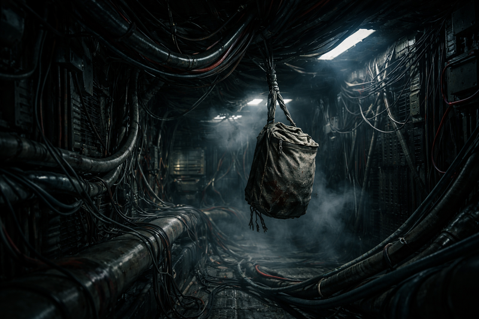
/// caption
33E
///

- room is full of electronics networking equipment
- loose pouch hanging from a cable, drifting in the air currents
- [Ink](ink.md) grabs the pouch and looks inside
    - it contains a medical scanner
    - [Zeke](zeke-sinclair.md) takes it since he's used one before

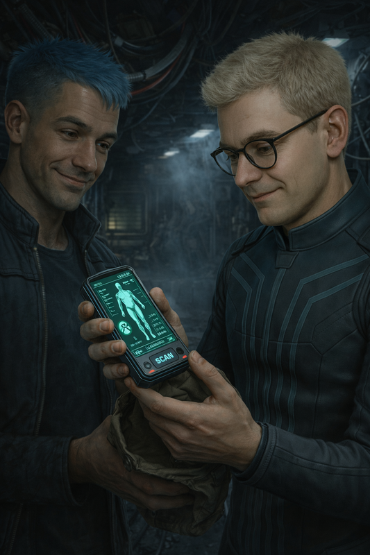
/// caption
[Ink](ink.md) and [Zeke](zeke-sinclair.md) examine the medical scanner
///

## 33B Gymnasium

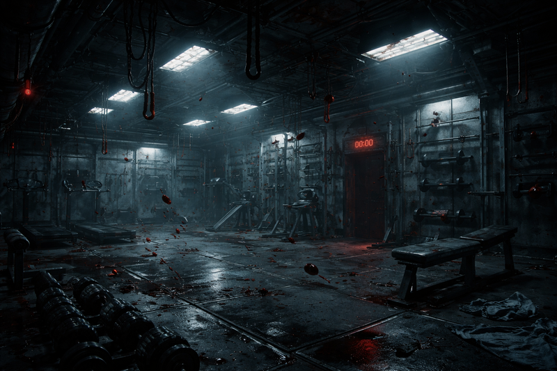
/// caption
33B
///

- empty, pristine room
- smells like wet iron
- walls covered with racks and handles
- [Carnoc](carnoc-ashbrow.md) says it looks like a gym
- we investigate but don't find anything

## 33C Improvised Cryo Pod Bay

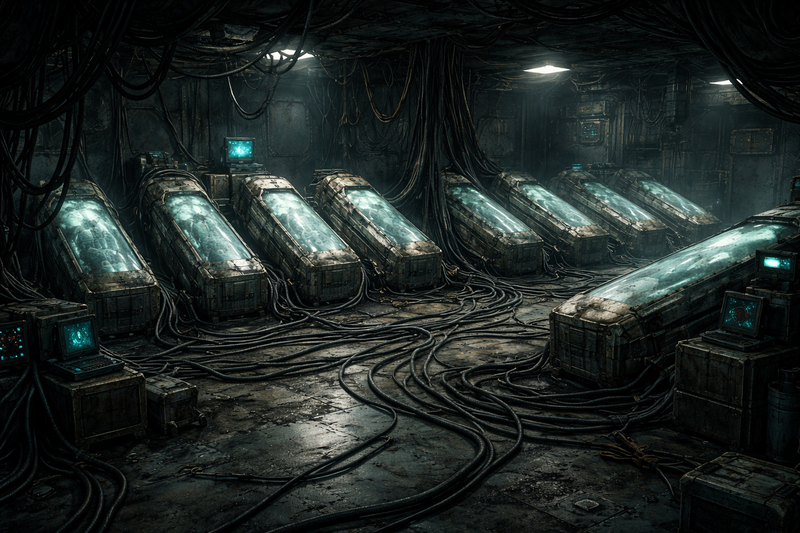
/// caption
33C - 10 jerry rigged cryo pods
///

- improvised cryo pod bay
- someone moved 10 pods and jerry rigged them
- 4 are occupied
    - all put in cryo sleep around the same time
        - after the AI took over the station
    - no identification
    - 2 women and 1 man in civilian clothing
    - 1 man in military fatigues

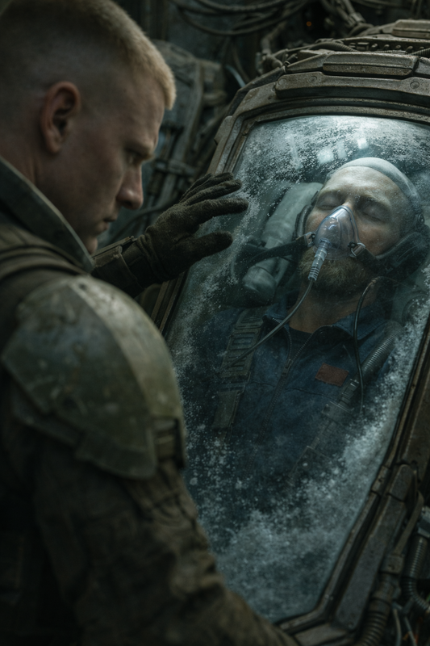
/// caption
[Carnoc](carnoc-ashbrow.md) and cryo pod with a male in civilian clothes
///

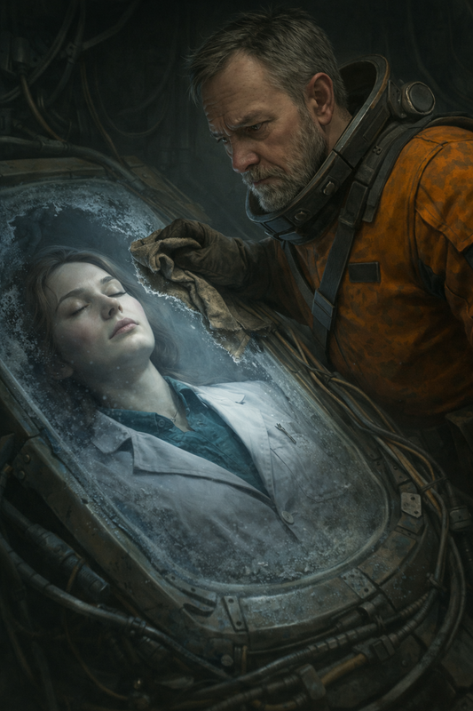
/// caption
[Dex](dex-miro.md) and cryo pod with a female in a lab coat
///

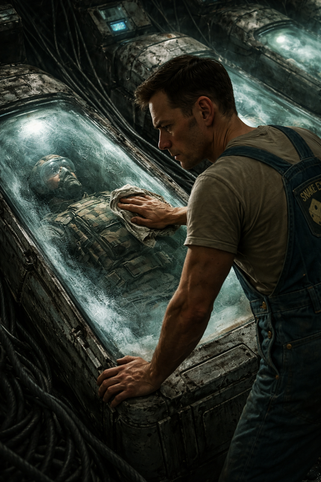
/// caption
[Murderbot](murderbot-v2.md) and cryo pod with a male in military uniform
///

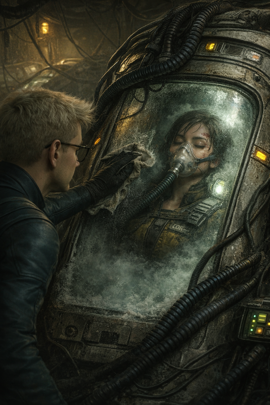
/// caption
[Zeke](zeke-sinclair.md) and cryo pod with a female in troubleshooter armor
///

- we don't see any warnings not to wake them
- thaw the civilian man first
    - station worker
    - scan him while thawing
    - he's an android
    - we put him back into cryo
- thaw a civilian woman
    - wearing lab coat, probably a researcher
    - also an android
- thaw the other civilian woman
    - dressed in troubleshooter armor
    - also an android
- thaw the military man
    - also an android
- wake the civilian woman in the lab coat
    - Bernice asks who we are
    - [Ink](ink.md): "We're divers"
    - She seems confused and asks if we know the diver she was with
    - put into cryo against her will by the diver she hired
        - diver Thelonius brought her here
- Bernice was researching androids
    - trying to determine if they had souls
    - see how androids/AI had evolved
    - knows [Murderbot](murderbot-v2.md) is a mark V
    - used to do android research for the company
    - went rogue to do her own research here

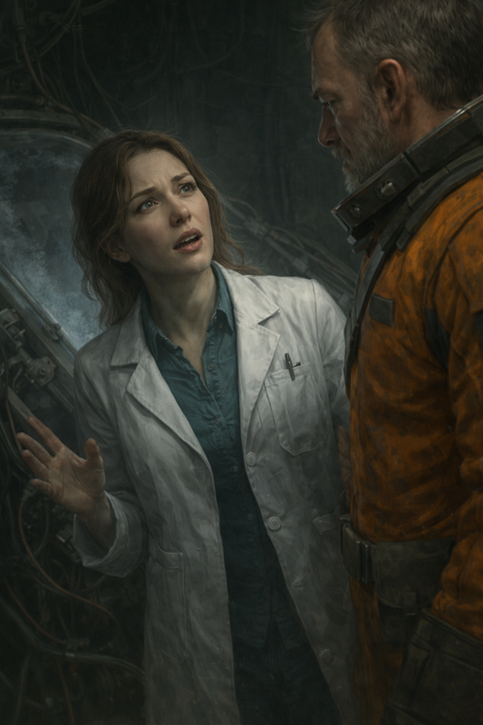
/// caption
[Dex](dex-miro.md) and Bernice, awakened from cryo sleep
///

- wake the male worker
    - has cryo sickness
    - vomit floats in zero G
    - [Ink](ink.md) gives him a stim pack
    - can't remember his name, or anything else
    - [Ink](ink.md) calls him Steve

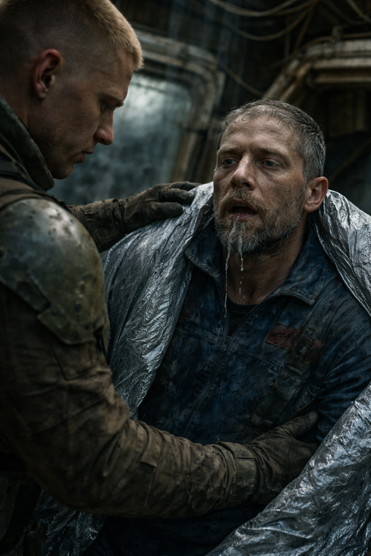
/// caption
[Carnoc](carnoc-ashbrow.md) and "Steve"
///

- wake the military guy
    - not cryo sick
    - Chad says he's a bounty hunter
    - asks where his weapons are
    - looking for a scientist
        - doesn't have a picture of her, memorized it
    - [Murderbot](murderbot-v2.md) asks if it's the researcher we just woke
- Chad dives at the researcher and snaps her neck
    - we're pretty annoyed about it
    - Chad shrugs: "Dead or alive"

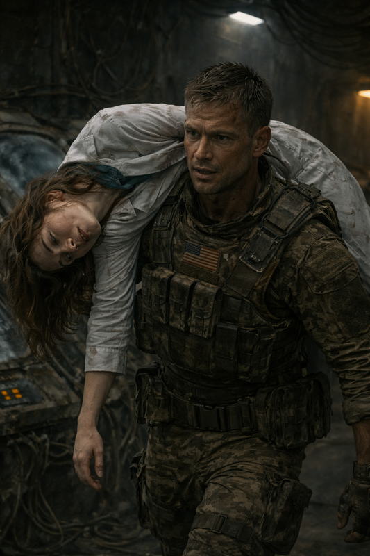
/// caption
Chad, with his bounty Bernice
///

- wake the troubleshooter woman
    - Tatiana wants to report to commander Kilroy
    - we tell her that we're about to contact Kilroy
    - she agrees to come with us
    - [Carnoc](carnoc-ashbrow.md) hands her a SMG
        - she checks to make sure it's loaded

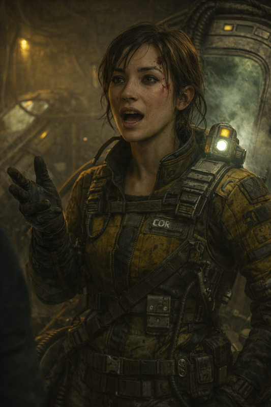
/// caption
Tatiana, a troubleshooter
///

- [Noriko](noriko.md) tells everyone about the Minotaur

## 36A Android Bone Fabrication

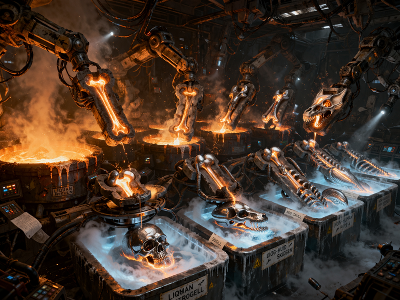
/// caption
36A
///

- mess of mechanical arms, molds, and chemical baths
- warmer than most rooms
- molds are shaped like human bones
- liquid metal dunked into chemical baths for cooling
    - [Zeke](zeke-sinclair.md) says the baths are liquid nitrogen
- also see non-human bones, one dog skull for example
- less sophisticated android, like security droids

## 36B Metallic Foam

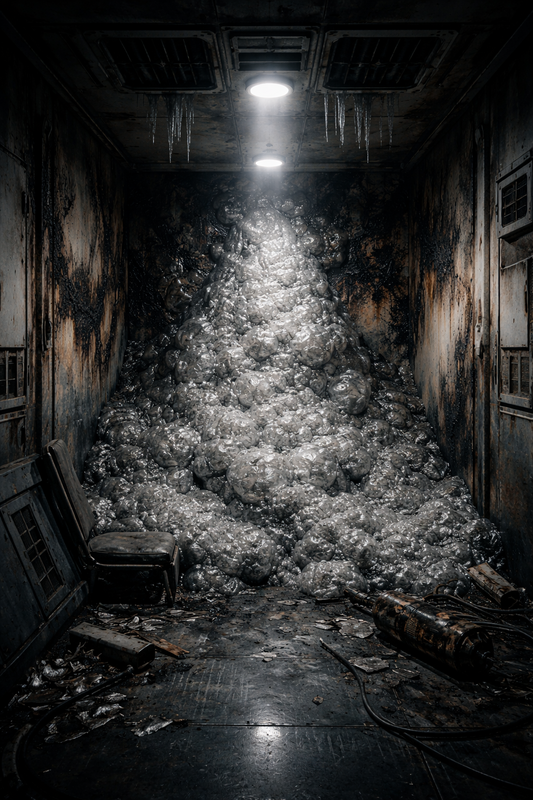
/// caption
36B
///

- smaller room
- smells of plastic and charred wood
- walls have scorch marks
    - [Carnoc](carnoc-ashbrow.md) says from a flamethrower
- coolant exhaust vents in the ceiling
- mound of metallic foam
    - probably fire suppression
- med scanner doesn't detect anything living in the foam
- Tatiana says she doesn't think this is the way out
    - wants us to look for another way
    - memorized most of the station layout
- door to 36C is locked
    - [Ink](ink.md) uses his welding torch to "unlock" it

## 36C Bone Parade

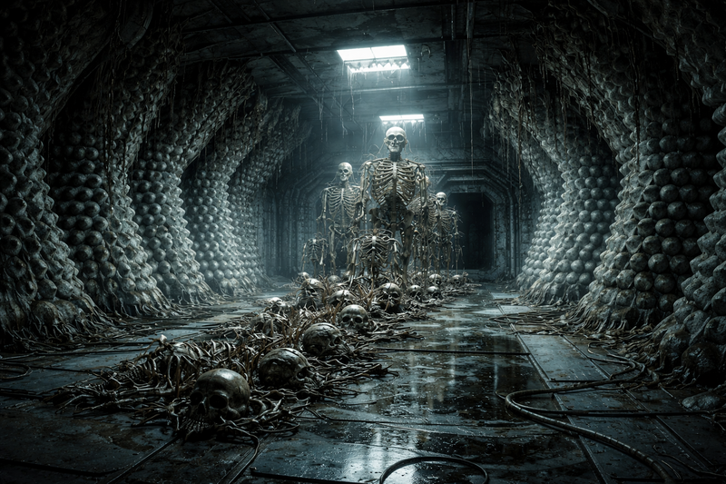
/// caption
36C
///

- large chamber
- strange foam cones on the walls
- surrounding a parade of metallic bones
- [Ink](ink.md) enters
    - hears all kinds of sounds playing
    - angelic choruses, gutteral roars, robotic blips
    - stresses [Ink](ink.md)
- everyone else plugs their ears when they enter

## 36D Razor Cables

- razor cables floating everywhere
- [Ink](ink.md) wants to build an electromagnet
    - bones in the previous chamber are aluminum, won't work

## 37B Polishing Wheel

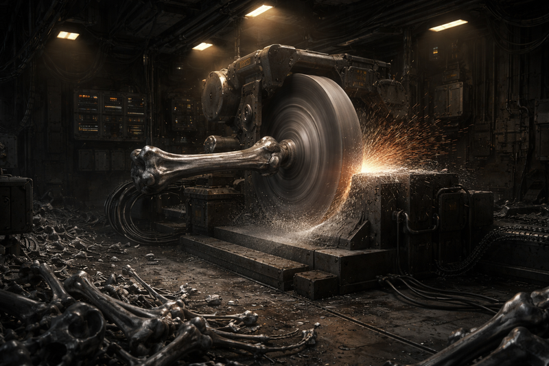
/// caption
37B
///

- [Ink](ink.md) arrives through cooling vents in 36B
- air shimmers and glimmers
- dust cloud of fine metal particles
- huge sanding wheel polishing metal bones
- back through the vent

## 37C Steam

- steamy in this room
- fogs up helmet
- hard for light to penetrate

## 38C Spider Drones

- frameworks loaded with metallic skeletons
- spider drones scuttle around
    - use webs to move skeletons around

## 37A Vent Sacs

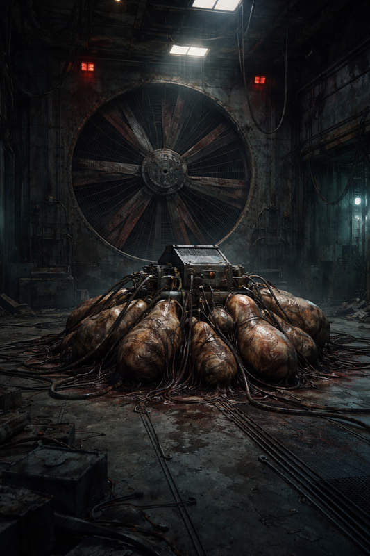
/// caption
37A
///

- huge vent dominates one of the walls (facing 37B)
- machine with many limp sacs like deflated lungs in the center
    - probably made of something similar to leather
- [Ink](ink.md) examines the sacs
    - many layers of material
    - can inflate like balloons

## 36F Cubicles

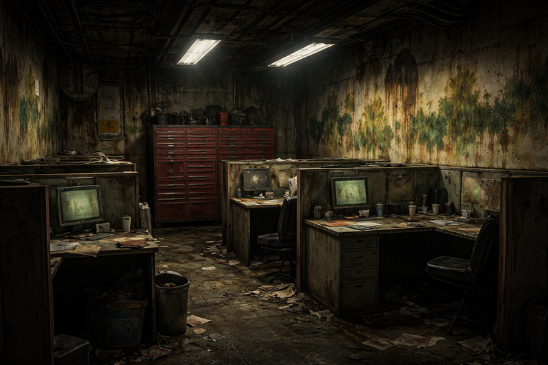
/// caption
36F
///

- small room full of dirty cubicles
- walls covered with watercolors
- large tool cabinet in the back
    - giant sledgehammer with "Turbo Sledge" written on it
        - heavy, awkward for [Ink](ink.md) to move with it
        - leaves it behind for now

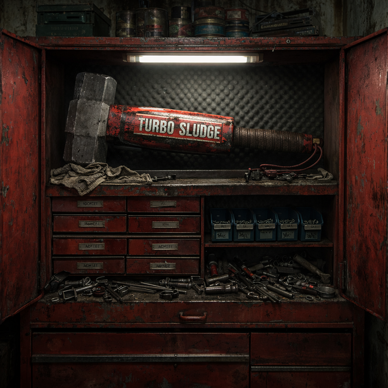
/// caption
Turbo Sledge
///

## 36E Nuclear Generator

- tight chamber ways above a massive turbine
- nuclear generator
- [Ink](ink.md) jerry rigs a mechanism to have the reactor go critical

## 38E Ink Look Alike

- maze of elevated rails
- glowing auto forges ride the rails
    - melting down collected materials
- android corpse floating in the room
    - looks like [Ink](ink.md)

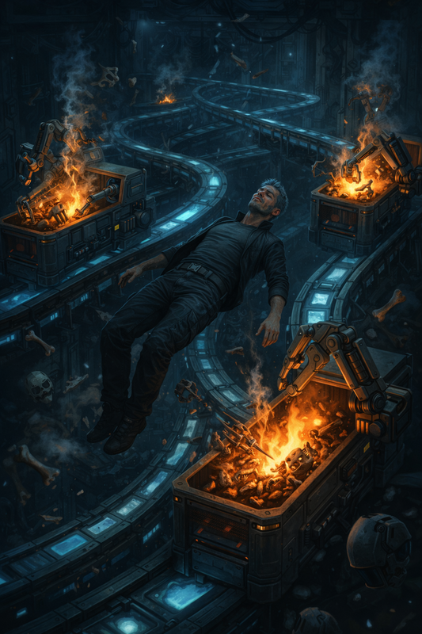
/// caption
Android corpse looks like [Ink](ink.md)
///

- [Ink](ink.md) tries to get to the corpse
    - one of the auto forges grabs him
        - he's able to escape
    - another auto forge grabs the corpse
        - unable to free it
        - forge melts the corpse down
- vent in the ceiling towards 38D

## 38D Bee Drones

- bones and lumps of titanium foam float around
- dominated by a pair of chutes
- hear buzzing from hundreds of "bee" drones
    - a little smaller than fist sized
    - inject something into the bones
    - throw the bones down a chute

## Regrouping in 36B

- [Ink](ink.md) grabs "Turbo Sledge" and heads back to 36B
    - [Ink](ink.md) fashions a bow and attaches it to the Turbo Sledge
    - [Dex](dex-miro.md) is pretty excited to see it

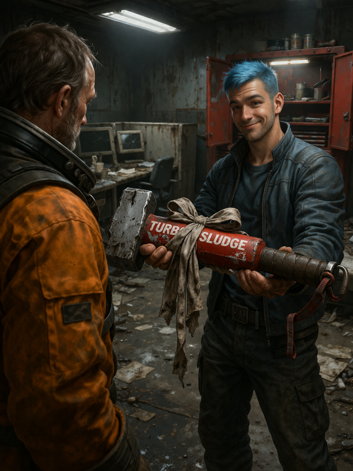
/// caption
[Ink](ink.md) gives [Dex](dex-miro.md) the Turbo Sledge
///

- Tatiana is getting impatient, wants to head to an exit

## 33A Hermetically Sealed

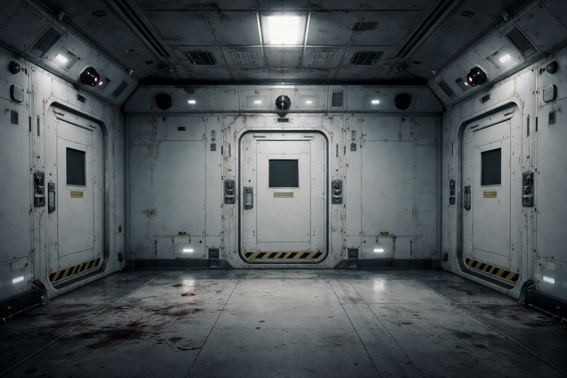
/// caption
33A
///

- set of three interlocking sterile white chambers
- all doors hermetically sealed
- access to 32F or 33D

## 33D Furnaces

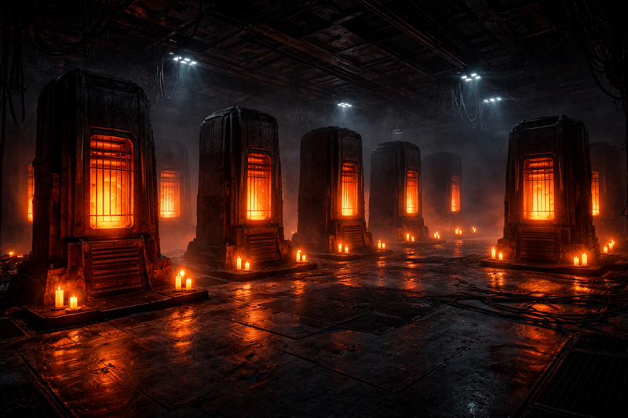
/// caption
33D
///

- 8 industrial furnaces glowing orange in the dark
    - each has a grease painting of a human figure suffering
- surrounded by electric candles
    - each is an android finger with an orange LED at the tip

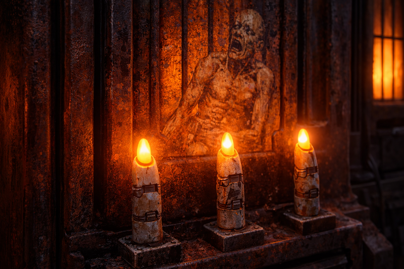
/// caption
Android finger candles illuminate paintings of human suffering on the furnaces
///

- [Ink](ink.md) is stressed out by this
- heavy material samples of metal alloys in sampling jars
    - possibly forged in the furnaces
    - [Ink](ink.md) takes them

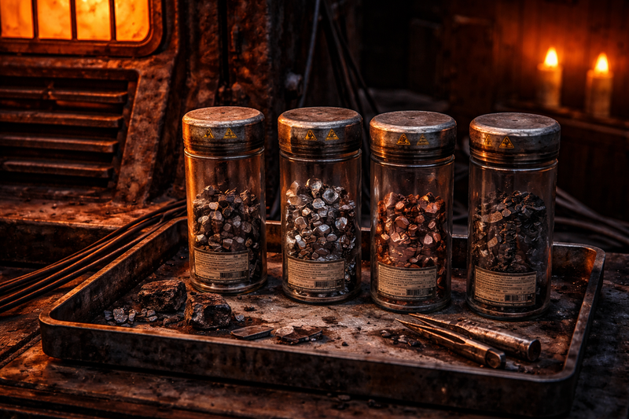
/// caption
Heavy material samples of metal alloys
///

## 31C Android Suicide Corpse

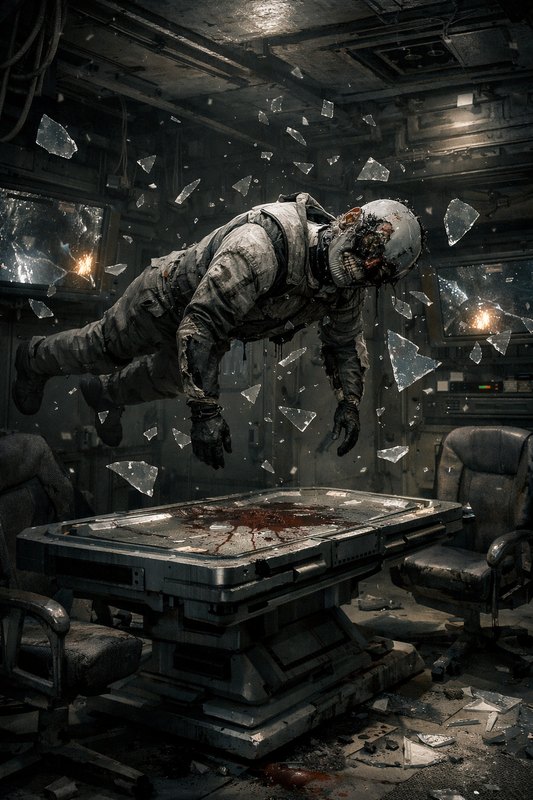
/// caption
31C
///

- floating glass splinters from computer monitors
- android corpse, smashed its own face in

## 31D Hydraulic Arms

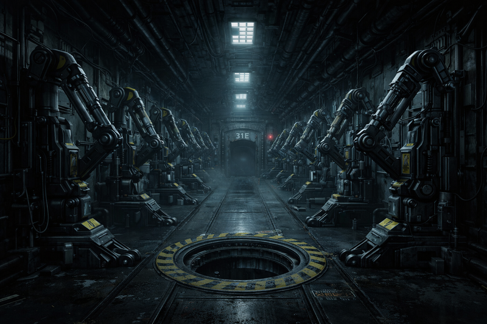
/// caption
31D
///

- long corridor with hydraulic arms pumping slowly and heavily
- arms are in great condition
- [Dex](dex-miro.md) sees signs of recent maintenance
- sewer grate with a tunnel to 31E

## 31E Sewer

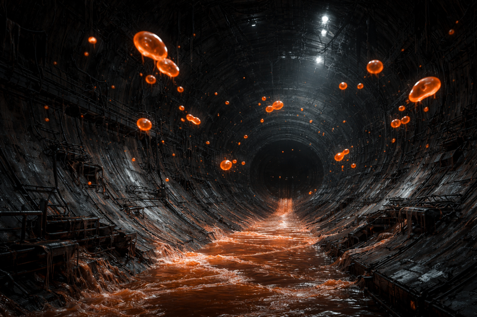
/// caption
31E
///

- gargantuan sewer sloping downwards towards the darkness
- free floating droplets of a violently orange fluid

## 31F Talking Heads

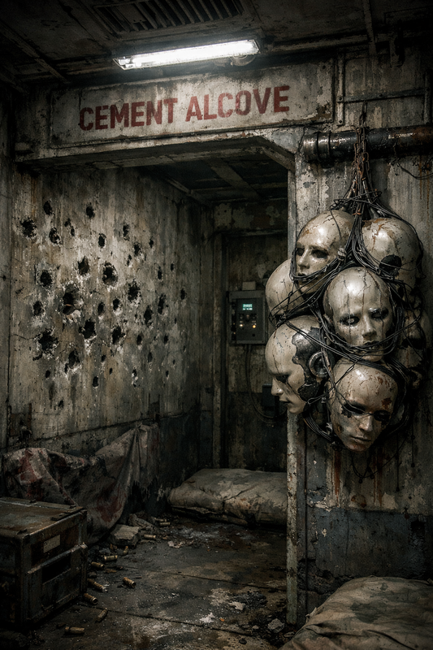
/// caption
31F
///

- bullet holes riddle the wall
- bundle of android heads bound by steel wire
    - low quality androids, not human-like
- [Ink](ink.md) opens the door to 31H
    - heads start screaming, begging, pleading, laughing, and singing
        - we're all afraid of them except [Murderbot](murderbot-v2.md)
        - [Murderbot](murderbot-v2.md): "This is an alarm. Something's coming!"

## 31H Fan

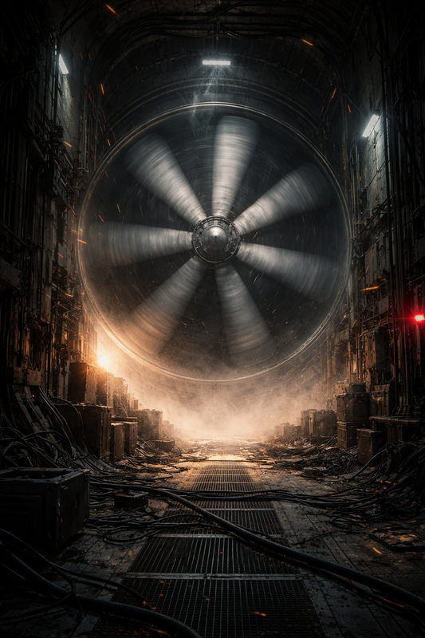
/// caption
31H
///

- tall, narrow space
- 90 meter fan spinning at 3000 RPM
- fan blocks access to 32A
- [Ink](ink.md) grabs the heads from 31F

### Encounter with bladed creature

- hear a noise of metal scraping metal
    - humanoid figure approaching quickly
        - fingers shaped like blades, a few feet long each

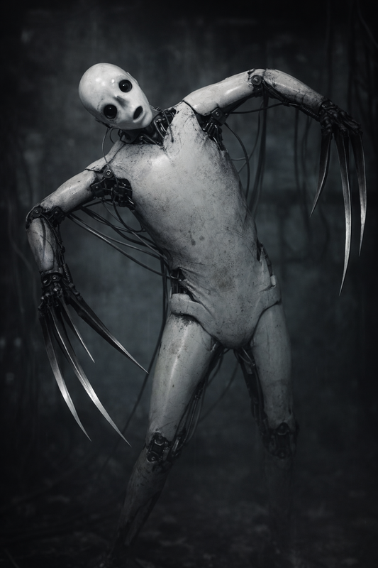
/// caption
Creature with finger blades approaches
///

- [Ink](ink.md) tosses an EMP grenade
    - figure puts up his fingers to shield
        - blast doesn't do much damage
- [Dex](dex-miro.md) hides around the corner, hoping to ambush it
- [Ink](ink.md) and [Zeke](zeke-sinclair.md) wait near the fan, hoping to lure it in
- [Noriko](noriko.md) goes into the fan room
    - she doesn't get sucked into the fan
    - [Noriko](noriko.md) starts screaming about her ankles

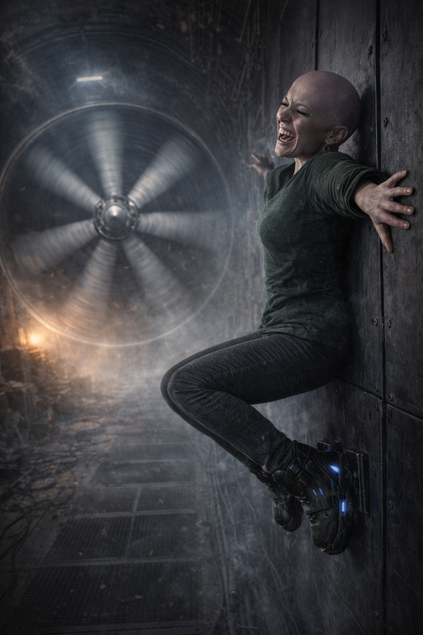
/// caption
[Noriko](noriko.md)'s ankles break as the mag boots hold while the fan pulls
///

- [Murderbot](murderbot-v2.md) uses Espernetic Feedback Loop
    - sparks shoot out the back of its head, but it doesn't stop
    - [Murderbot](murderbot-v2.md) retreats

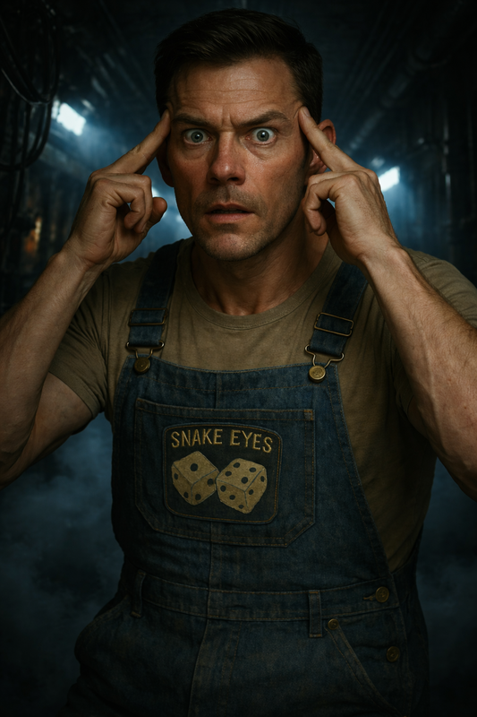
/// caption
[Murderbot](murderbot-v2.md) uses **Espernetic Feedback Loop**
///

- [Carnoc](carnoc-ashbrow.md) shoots his SMG
    - hits it in the chest
    - leaks white fluid
- [Dex](dex-miro.md) slams the Turbo Sledge into the back of its head
    - its skull cracks
    - it turns around and looks at [Dex](dex-miro.md)
    - tries to stab [Dex](dex-miro.md) with one of its blades
        - [Dex](dex-miro.md) is able to dodge
- [Dex](dex-miro.md) shoots it with his shotgun
    - wounds it but it doesn't seem to care
- [Ink](ink.md) and [Zeke](zeke-sinclair.md) pull at the legs
    - it's almost to the fan door
- [Murderbot](murderbot-v2.md) pulls but its blades cut into the wall to steady it
- [Carnoc](carnoc-ashbrow.md) shoots with his SMG
    - wounds it further
    - gun flies into the fan and is destroyed
- it swipes at [Carnoc](carnoc-ashbrow.md) and misses
- [Ink](ink.md) kicks it into the fan room
    - loud screeching sound as the fan violently shears off
    - part of the fan sets [Noriko](noriko.md)'s ankles

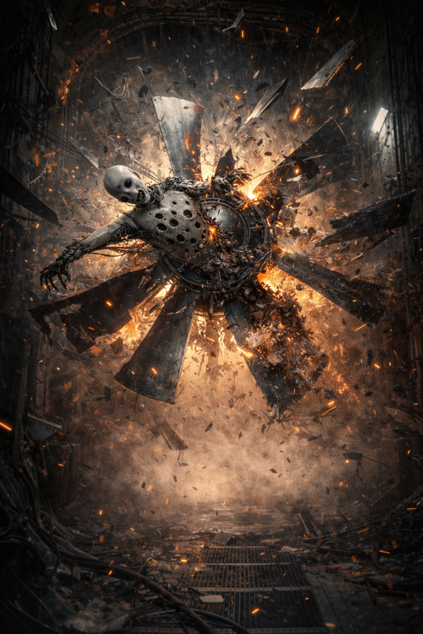
/// caption
Creature flies into the fan
///

## 32A Break Room

- cramped break room covered in schematics
- functioning terminal with a maintenance schedule
    - shows station is deliberately being wound down over the next 6 months
