# {{ page.meta.module }}: {{ page.meta.title }}

TODO Intro

<!-- more -->



## 32A Break Room

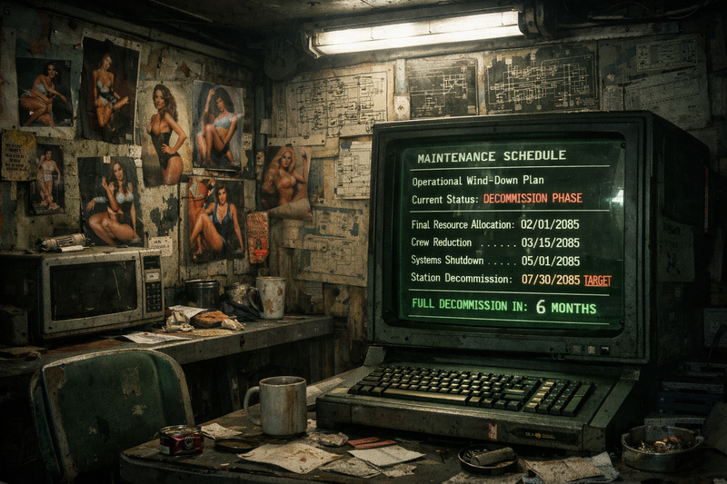
/// caption
Break room maintenance terminal
///

- we scan [Ink](ink.md) to confirm that he's not an android

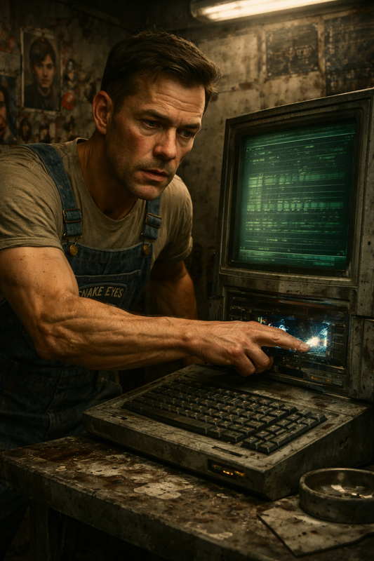
/// caption
[Murderbot](murderbot-v2.md) hacks into the maintenance terminal
///

- [Murderbot](murderbot-v2.md) feels like someone is watching his actions
- humans were trying to shut down the station
- the shutdown has been paused
- security coverage is pretty universal except blind spot in labyrinth
- there's another AI running systems on floor 3.3
- [Murderbot](murderbot-v2.md) tries to block the one watching his actions
    - you are not welcome here, do not attempt this again
    - screen goes blank

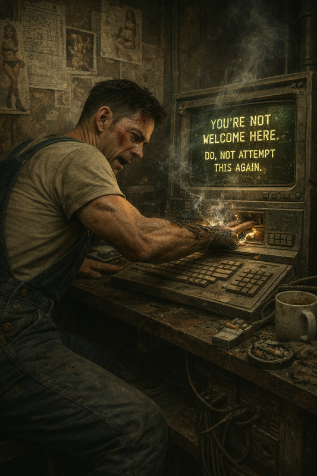
/// caption
[Murderbot](murderbot-v2.md)'s attempt to block his stalker fails
///

## 31G Android Graveyard

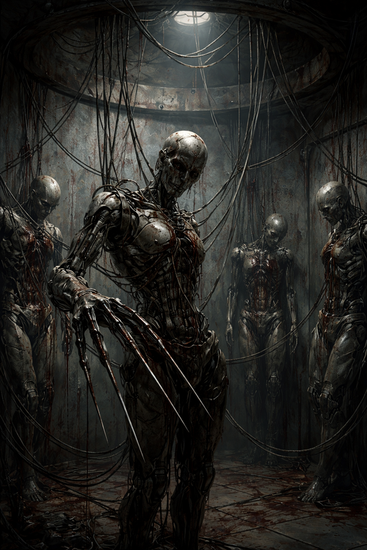
/// caption
Gutted androids, some with long needle fingers
///

- gutted androids locked in place with steel cords
- long needle fingers amongst them
- [Ink](ink.md) searches and finds 5 cores

## 32B Industrial Gasses

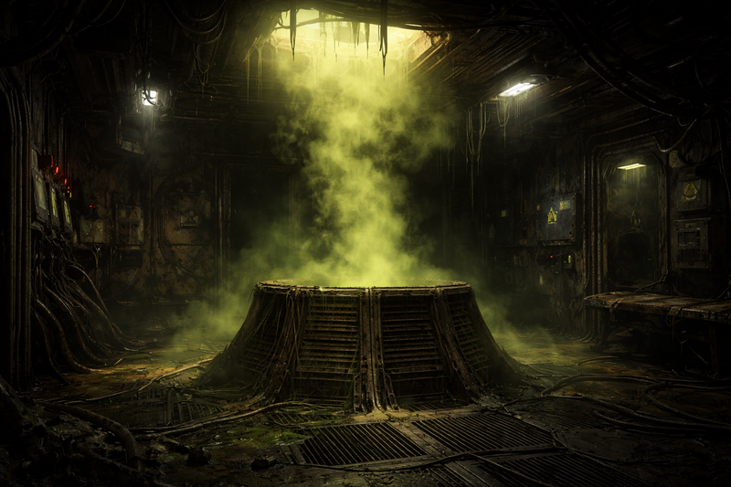
/// caption
Room filled with industrial gasses
///

- fine to traverse as long as everyone has a vac suit
- door closes on [Murderbot](murderbot-v2.md)'s arm
    - [Dex](dex-miro.md) uses an Auto Med to stop the leaking

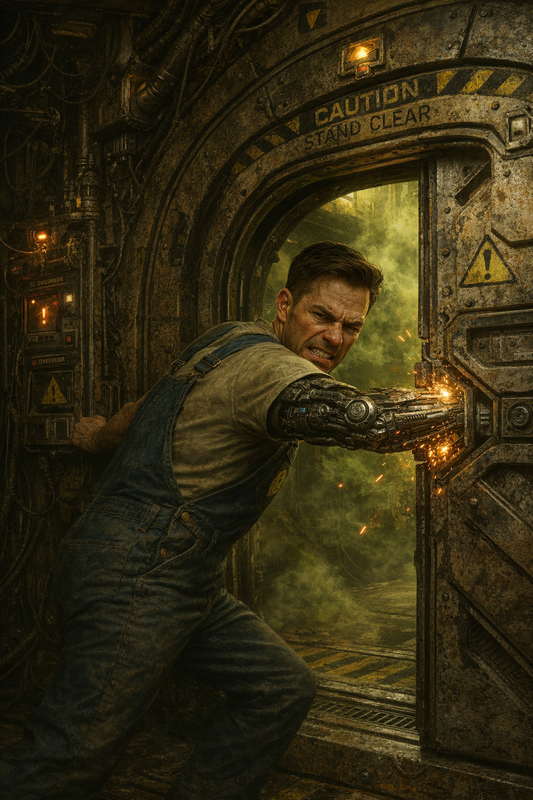
/// caption
The door closes on [Murderbot](murderbot-v2.md)'s arm
///

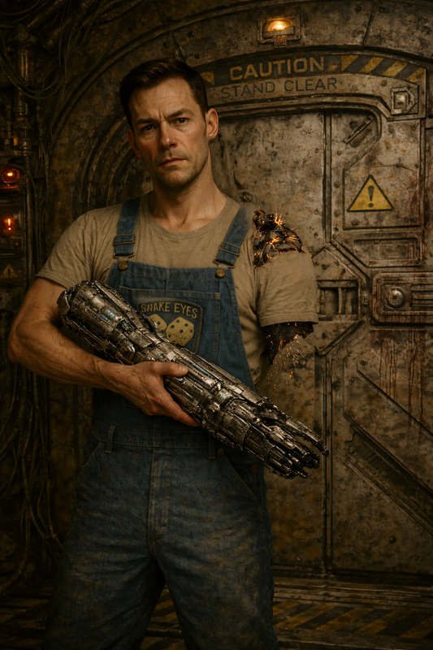
/// caption
[Murderbot](murderbot-v2.md) loses the arm
///

- [Murderbot](murderbot-v2.md) thinks we can replace the arm if we can find the right part
- we're able to pry the door back open

## 32F Cramped Chamber Lockers

- cramped chamber
- detritus drifting throughout
- set of 4 wire mesh lockers
    - 3 contain industrial vac suits
    - other contains a heavy bolt driver
        - like a nail gun, but larger

## 33A Sterile Chambers

- 3 interlocking sterile white chambers
- camera lenses and speakers attached to the walls

## Back to 31D

- to get to our NPCs: 33D > 31C > 31D
- [Murderbot](murderbot-v2.md) pauses in 31C and considers replacing his arm with one from the android corpse

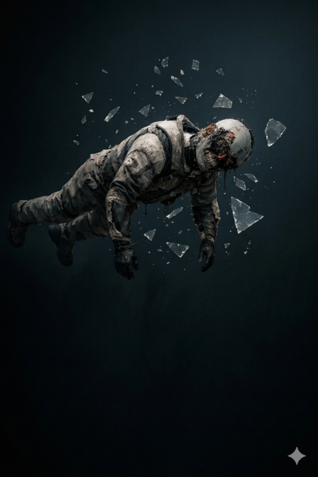
/// caption
[Murderbot](murderbot-v2.md) notices the android corpse in 31C
///

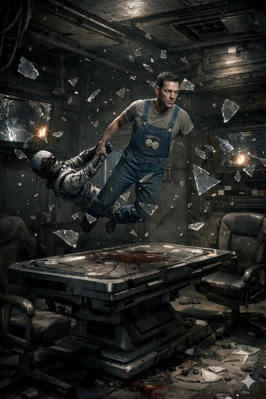
/// caption
[Murderbot](murderbot-v2.md) brings the android corpse along for parts
///

- Chad and "Steve" are dead from small arms fire
    - [Carnoc](carnoc-ashbrow.md) thinks shots came from 31C
- Tatiana is missing

## A Brief Rest

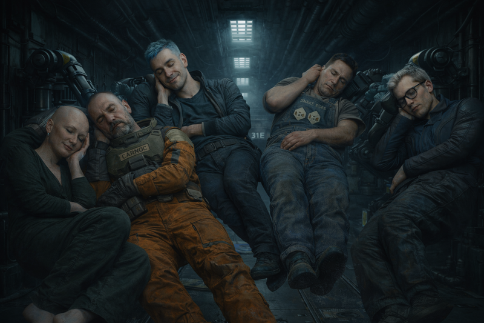
/// caption
The crew rest for a couple hours
///

- rest for 2 hours
    - it's dark, so we use our headlamps
    - red lights start flashing
    - hear in the distance: "Intruder alert!"

## Re-Arming

- before the alert, [Ink](ink.md) and [Murderbot](murderbot-v2.md) work on [Murderbot](murderbot-v2.md)'s arm
    - it's attached but not securely, and is not functioning
    - [Murderbot](murderbot-v2.md) is somehow able to repair it

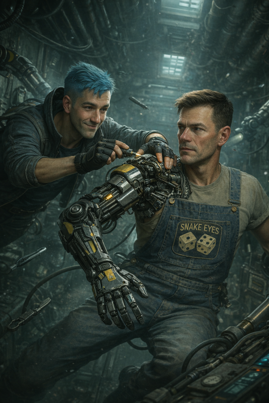
/// caption
[Ink](ink.md) attaches [Murderbot](murderbot-v2.md)'s new arm
///

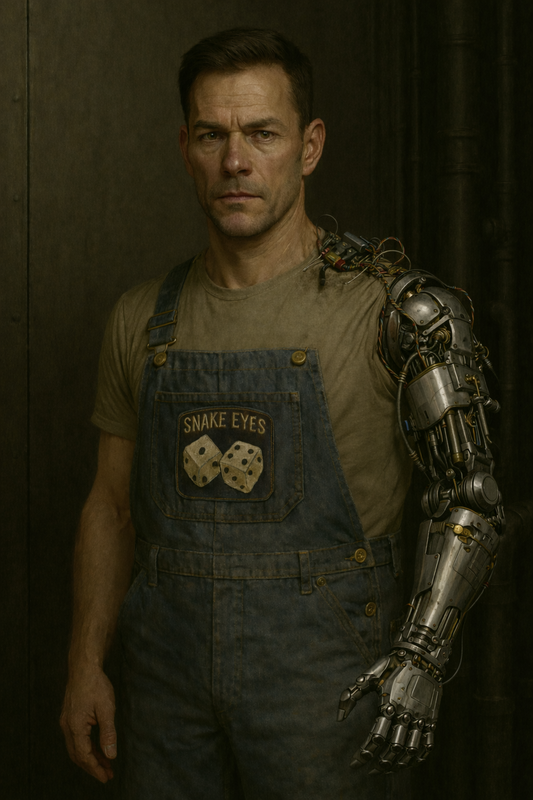
/// caption
[Murderbot](murderbot-v2.md) after arm repair
///

## Scouting a Firefight

- hear small arms fire from the direction of 31C
    - [Carnoc](carnoc-ashbrow.md) and [Dex](dex-miro.md) investigate
    - small arms fire continues from 31A
    - multiple muzzle flashes, headlamps, and ricocheting bullets
    - at least 8 weapons
- firefight ends
    - lights congregate around something and then disperse
    - some of the lights head towards [Carnoc](carnoc-ashbrow.md) and [Dex](dex-miro.md)
    - [Carnoc](carnoc-ashbrow.md) and [Dex](dex-miro.md) retreat to warn the others the victors are approaching
    - [Dex](dex-miro.md) gets back to 31D
    - [Carnoc](carnoc-ashbrow.md) gets spotted in their headlamps but keeps moving towards us

## Androids Attack

- enemies open fire on [Carnoc](carnoc-ashbrow.md)
    - [Carnoc](carnoc-ashbrow.md) is hit twice and wounded
    - scalp is grazed and has blood in his eyes

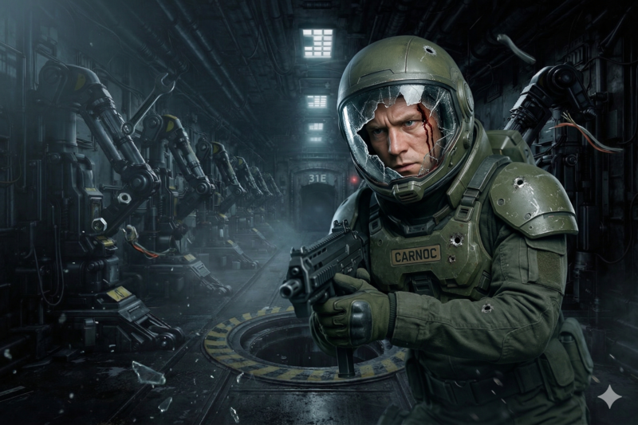
/// caption
[Carnoc](carnoc-ashbrow.md) is wounded but still ready to fight
///

- [Ink](ink.md) shouts: "Hey, we're with Kilroy!"
    - in the red light we see they're 4 metallic androids

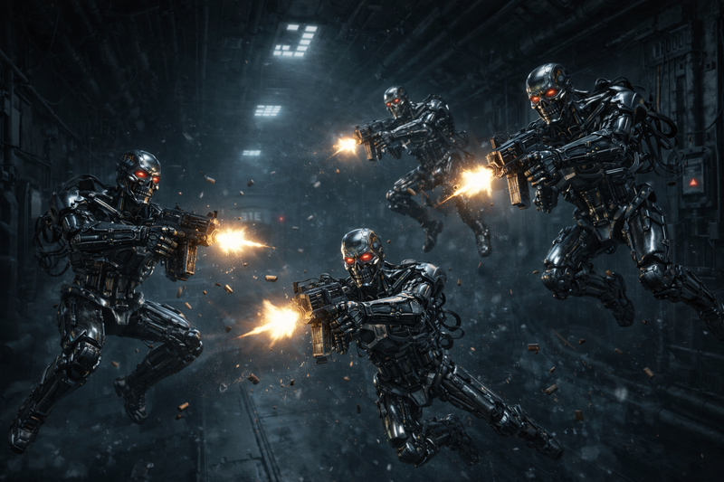
/// caption
4 androids attack
///

- [Ink](ink.md) pushes the android corpse down the hallway
- [Murderbot](murderbot-v2.md) tries Espernetic Feedback Loop but fails
- [Dex](dex-miro.md) shoots one with a shotgun and hits but doesn't wound
- [Ink](ink.md) shoots and hits the same opponent but his shotgun jams
- [Carnoc](carnoc-ashbrow.md) fires his SMG (aiming with his OGRE) and hits another
    - android corpse slams into him and stops his momentum
- [Zeke](zeke-sinclair.md) fires but his weapon discharges in its holster
    - damaging the android detector

/// caption
[Zeke](zeke-sinclair.md) has some trouble with his SMG
///

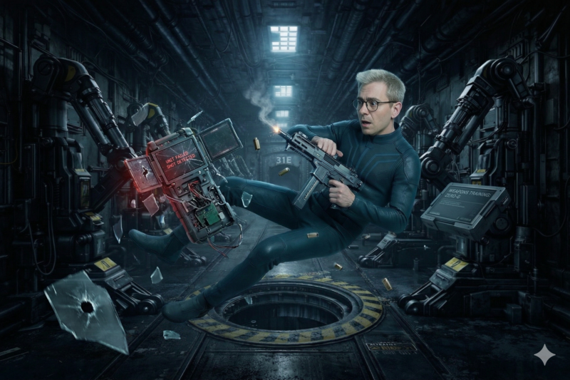
/// caption
[Zeke](zeke-sinclair.md) damages the android scanner
///

- [Dex](dex-miro.md) gets shot but the vac suit deflects it
- [Carnoc](carnoc-ashbrow.md) blocks shots with the android corpse

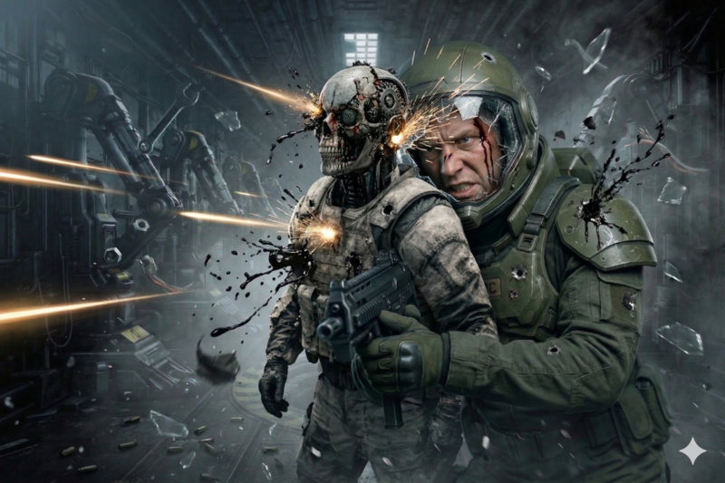
/// caption
[Carnoc](carnoc-ashbrow.md) uses an android corpse as a shield
///

- The third attacker is out of ammo and moves to retrieve the dead one's SMG
- [Ink](ink.md) tosses a frag grenade, damaging the androids but also hitting [Carnoc](carnoc-ashbrow.md)
- [Dex](dex-miro.md) fires his shotgun at the android trying to retrieve ammo
    - blows a hole in the side of the android but it doesn't slow down
    - [Dex](dex-miro.md) is out of ammo
- [Carnoc](carnoc-ashbrow.md) uses mag boots on some of the heavy machinery
    - gets pulled to it and takes cover
    - fires but runs out of ammo

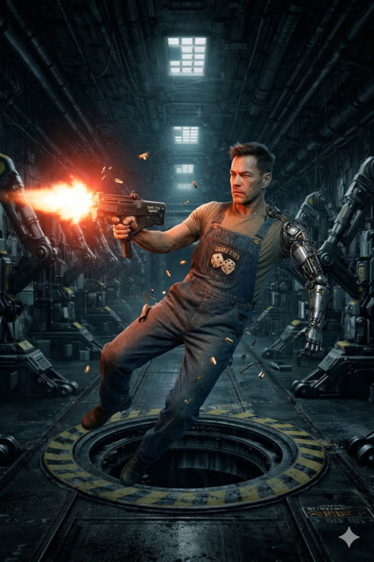
/// caption
[Murderbot](murderbot-v2.md) fires his SMG, destroying an android
///

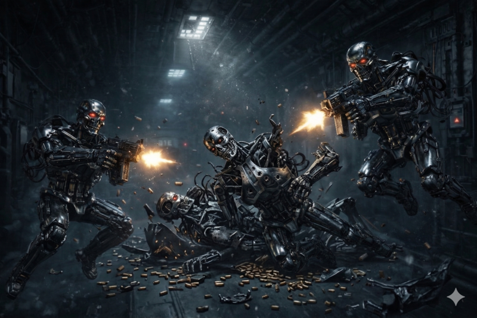
/// caption
2 androids are down, but 2 continue attacking
///

- [Zeke](zeke-sinclair.md) fires his pulse rifle and white globules spray out of the android
- [Noriko](noriko.md) fires and destroys the android [Zeke](zeke-sinclair.md) damaged

/// caption
[Noriko](noriko.md) fires at the androids
///

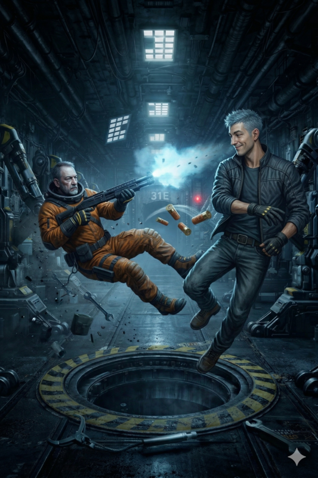
/// caption
[Ink](ink.md) tosses shotgun ammo to [Dex](dex-miro.md) perfectly, allowing [Dex](dex-miro.md) to reload quickly
///

- [Ink](ink.md) tries Espernetic Feedback Loop but fails
- [Dex](dex-miro.md) fires his shotgun and destroys the last android

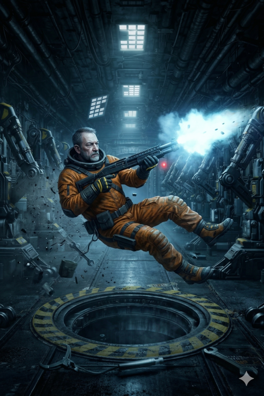
/// caption
[Dex](dex-miro.md) fires his shotgun at the last android
///

- we see other headlamps shining into 31D in the distance
- collect ammo and SMGs from the destroyed androids
- set a trap for the approaching group
- [Ink](ink.md) uses a stimpack to heal [Carnoc](carnoc-ashbrow.md)
