# {{ page.meta.module }}: {{ page.meta.title }}

TODO Intro

<!-- more -->



- recover 3 SMG mags from the 4 androids
    - [Carnoc](carnoc-ashbrow.md) takes them
- [Ink](ink.md) and [Dex](dex-miro.md) split the shotgun ammo
- [Ink](ink.md) flees to 31E
- [Dex](dex-miro.md) uses the foam gun on [Carnoc](carnoc-ashbrow.md)'s cracked helmet

## 31E Sewer

- pass through floating globules

## 32C Storage

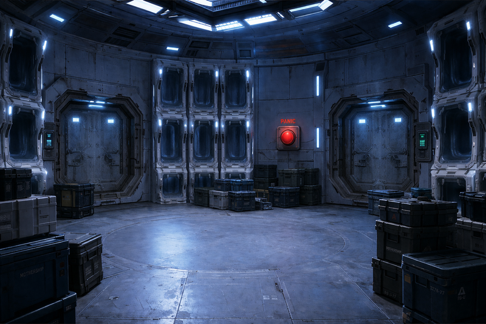
/// caption
32C with crates
///

- well-lit room
- doors are reinforced
- large red panic button on the wall
- cryo pod fittings but no cryo pods
- many crates

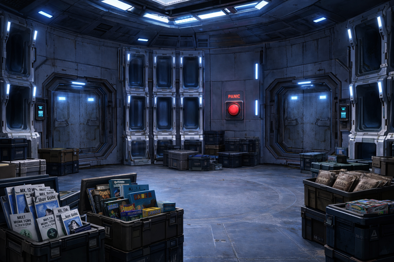
/// caption
32C after searching crates
///

- contents of crates
    - many MREs, all chicken
    - mk 12 emp grenade user guide
        - learn how to use them more effectively
        - can now do 4d10 damage with them, if I only had one
    - bunch of pamphlets
        - meet monarch cloud bank's king of profit
            - company was planning to replace all labor with androids
            - built-in obsolescence for androids to require subscription
            - only slightly cheaper than human labor
        - surviving automated uprising
            - for advanced AI: when in doubt, nuke them
            - if you don't have an android scanner, shoot everyone
    - major religious texts
    - games
        - jenga
        - monopoly
        - that's not lemonade by Tuesday Night Games
- [Ink](ink.md) seals the door to 32B
    - fusing the bolt that might allow automated unlocking

## 32D Ore Processing

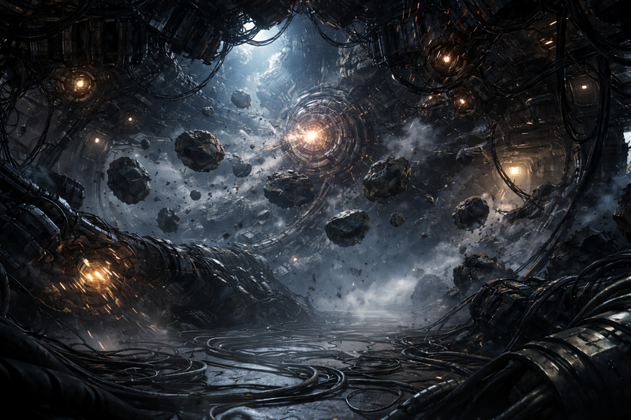
/// caption
32D Ore Processing
///

- smashing, crushing, dissolving machinery
- floating asteroid field of rock
- roar of machines is mind numbing
- rocks float through the room
- [Ink](ink.md) scouts ahead
- [Dex](dex-miro.md) monitors the rocks to keep crew safe as we head to 51A
- syringe filled with neon purple liquid
    - 2 boulders are flying towards it

/// caption
[Ink](ink.md) really wants that purple syringe
///

- [Ink](ink.md) goes for it
    - dives between the two boulders, grabbing the syringe
    - lands safely on another boulder

/// caption
[Ink](ink.md) gets bored while entering 32E
///

## 32E Security Android Storage

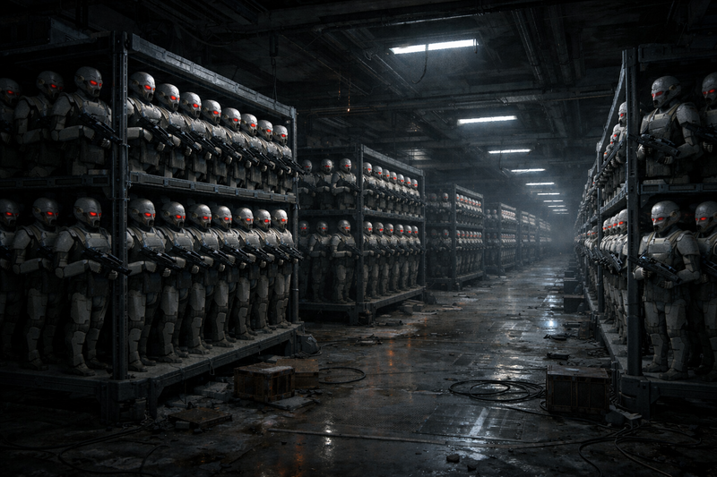
/// caption
32E Security Android Storage
///

- [Ink](ink.md) explores alone
- endless darkness
- steel racks 20 feet apart extend out
    - each contains 30 security androids armed with SMGs
- [Ink](ink.md) continues exploring, 10x10 racks with 30 each
    - about 3000 total androids
- Intruder alert
- lights on the racks come on
    - androids may be powering up
- [Ink](ink.md) moves to escape
    - as he leaves, locks the door and disables the lock

## 51A Quality Assurance

- door is locked
- [Dex](dex-miro.md) takes off control panel
- [Murderbot](murderbot-v2.md) use his computer skills

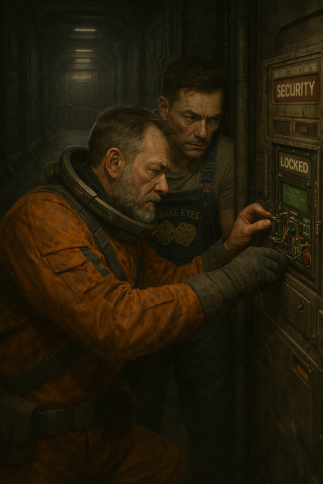
/// caption
[Dex](dex-miro.md) and [Murderbot](murderbot-v2.md) bypass the locked door
///

- walls are covered with readouts and statistics
    - android component failure rates
- separate panel has an integral screen with a single large button marked purge
    - while button with black text

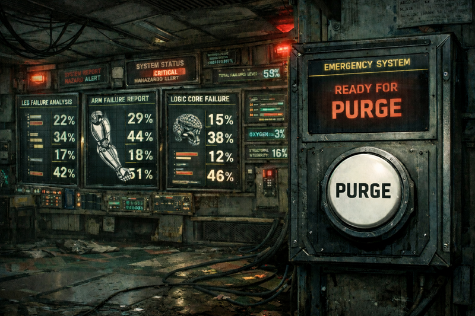
/// caption
51A Quality Assurance, showing android component failure rates
///

- [Dex](dex-miro.md) leaves his tattletale for observation
- [Ink](ink.md) seals the door
- [Noriko](noriko.md): "I guess there's no going back that way"

## 51C Combat Spire

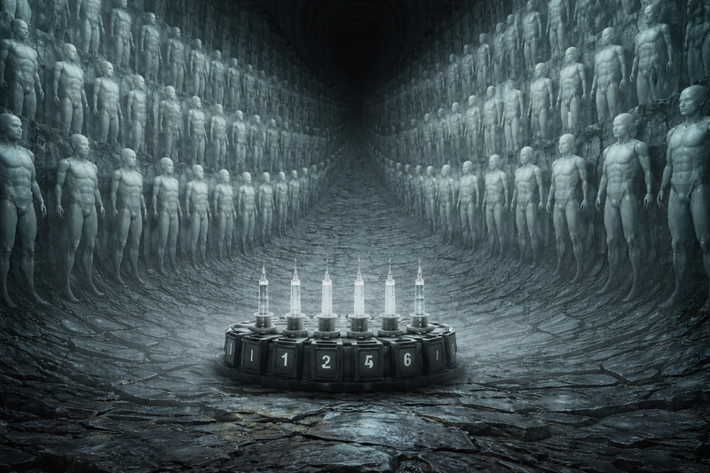
/// caption
51C Combat Spire
///

- interior shaped like a funnel
- walls are covered with 200 glowing figures
- 6 syringes in the middle of the room
    - labeled with numbers 1-6
- [Ink](ink.md) closes the door

## 51B Security Checkpoint

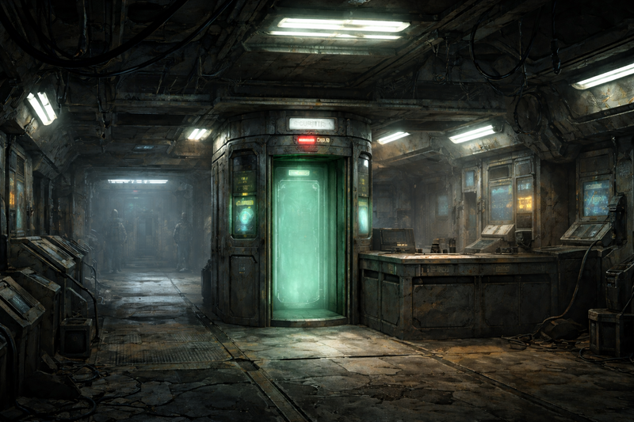
/// caption
51B Security Checkpoint
///

- border control booth
- security checkpoint but without an automated turret
- [Ink](ink.md) and [Zeke](zeke-sinclair.md) put the android corpse in the scanner
    - [Zeke](zeke-sinclair.md) poses the arms properly for it
    - it goes through without event

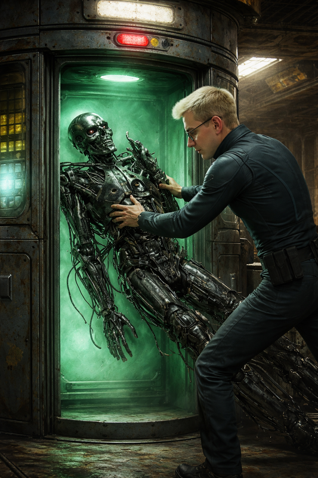
/// caption
[Zeke](zeke-sinclair.md) pushes an android into the scanner
///

- [Murderbot](murderbot-v2.md) goes through the scanner
    - his allergies are cured

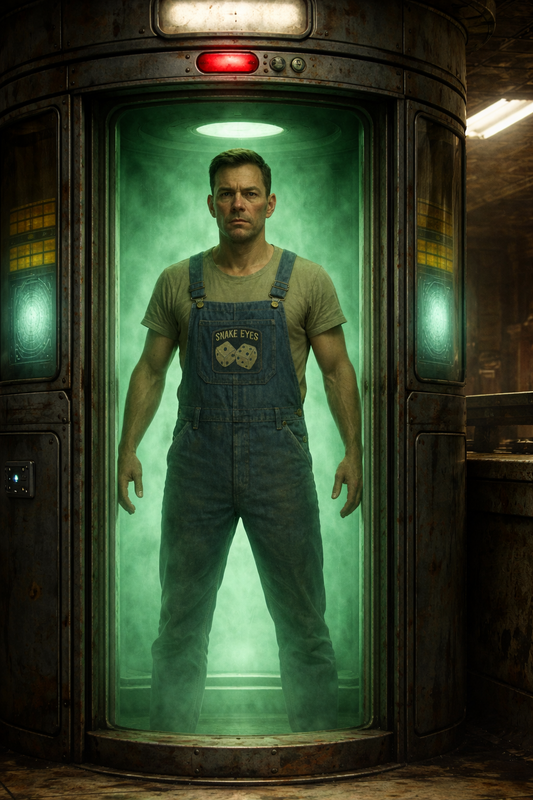
/// caption
[Murderbot](murderbot-v2.md) goes through the scanner
///

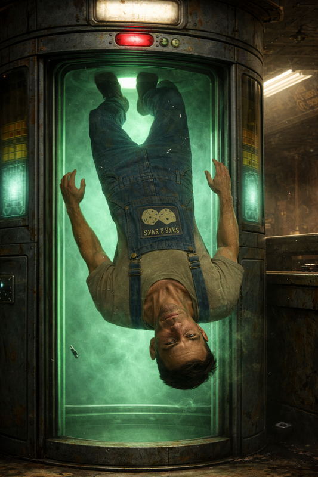
/// caption
[Murderbot](murderbot-v2.md) exits the scanner "gracefully"
///

- everyone else went around
- [Murderbot](murderbot-v2.md) checks the door for traps
- sealed magnetically
- [Ink](ink.md) uses his magnetic boots to disrupt the lock

## 52A Fraternal Android Confinement

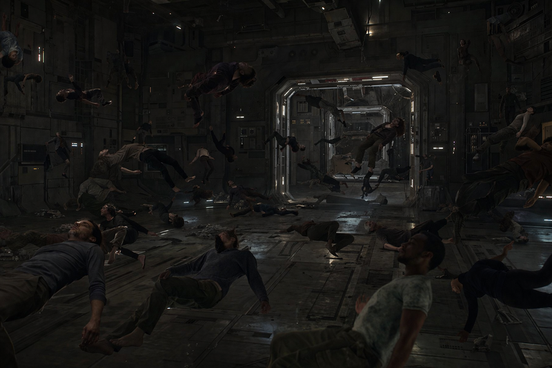
/// caption
52A Fraternal Android Confinement
///

- 98 "humans" floating in space
- drifting around, bumping into each other
- walls have holes the size of a fist
- door on the other side
- might take 10 minutes to cross
- [Ink](ink.md) walks around the outside of the room with mag boots
- individuals are friendly and ask for help
    - we talk to one named is Tom #1
    - [Zeke](zeke-sinclair.md): "Where's Tom #2?"
    - Tom points
    - [Zeke](zeke-sinclair.md): "Why is Monarch making identical twins?"
    - Tom: "We're not identical. We're we're like we're like fraternal."
- Dex asks about other AIs
    - Silas is another AI which acts arrogant
- [Murderbot](murderbot-v2.md) connects himself to Tom #1 with an I/O cable
    - [Murderbot](murderbot-v2.md) finishes reprogramming
    - should allow them to leave the room

/// caption
[Murderbot](murderbot-v2.md) reprograms Tom #1
///

- [Dex](dex-miro.md) asks how long they've been in here
    - just a few days
- Tom #1 wants to free the others
    - presses his hands against other androids
    - all free each other after about 7 minutes
- named Tom, Steve, John, Mike, Mary Sue, and Ellen
- they want to leave the station
- we ask about purpose of other rooms
    - 51E anti-organic armory
    - 51D anti-synthetic armory
    - 51F secret hangar - escape tubes
    - 52E seminar room
    - 52D nuclear warhead
    - 53A infiltration personalities data bank
    - 53B infiltrator android storage
    - 53C micro hangar - repair ships
    - 53D wardrobe
    - 53E organic response chamber
- how do they plan to get off the station?
    - they're not sure
- [Murderbot](murderbot-v2.md) asks for ideas on how to get off the station
    - Tom suggests waiting for someone to arrive and stealing their ship
    - Steve doesn't suggest anything
    - Mary Sue suggests making a deal with Monarch
        - find a Monarch Storage TerraDrive in 56A AI core
        - promise to take Monarch off the station in the drive
    - Ink suggests luring the ship here and scanning [Kilroy](rachael-kilroy.md)
        - Monarch had asked for her brain scan
        - androids could take the ship and leave
        - Tom likes this plan
    - they are willing to help us but can't guarantee our safety
        - they're not combat droids
- [Ink](ink.md) asks if they have any useful technical abilities
    - Tom: athletics, planetology, and piloting
    - Steve: surgery, zero-g, and military training
    - John: archaeology, sophontology, and firearms
    - Mike: geology, mechanical repair, and pathology
    - Mary Sue: mathematics, command, and botany
    - Ellen: field medicine, ecology, and hyperspace
- [Ink](ink.md) asks about the security androids
    - there are near infinite numbers of security androids on the station
    - how could we deactivate them?
    - we didn't trigger the security alert, something else did
    - once resolved, the security droids will probably go back into hibernation
- they don't know what the syringes are in 51C
- [Ink](ink.md) asks Steves about weapons in 51D anti-synthetic armory
    - pseudo flesh rot gas - wouldn't work on security droids
    - EMP blasters
    - synth whips
- [Ink](ink.md) puts them to work
    - Tom: get syringes
    - Tom and Steve: get flamethrower, EMP blaster, and synth whip

## 52B Inspection Booths

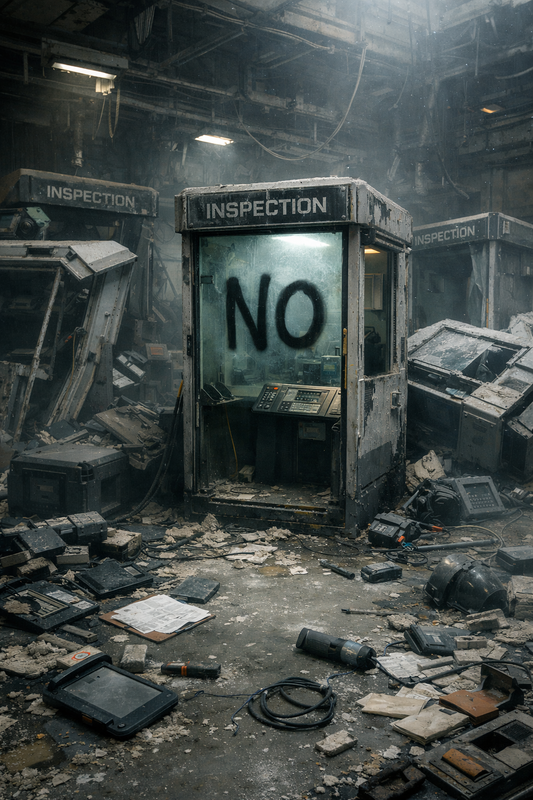
/// caption
52B Inspection Booths
///

- smashed apart booths
- inspections tools scattered across the floor
- thick dust
- [Ink](ink.md) inspects the booths
    - find a cumbersome terminal device
    - has I/O port marked "personality"
    - gives to one of the Mikes

## 52C Map Room

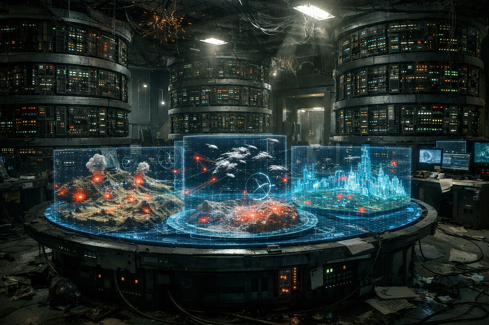
/// caption
52C Map Room
///

- ranks of servers and 3d holo maps

## 52D Warhead

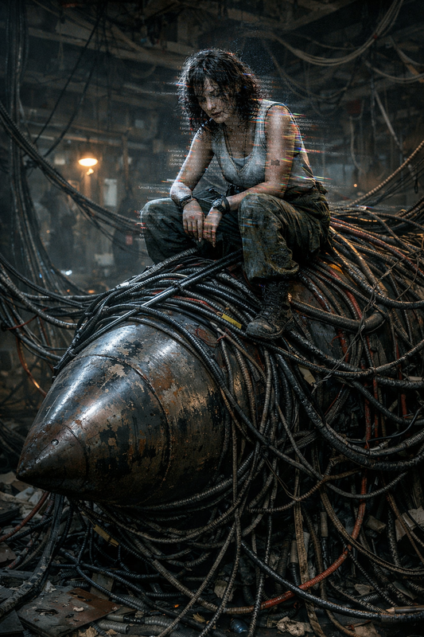
/// caption
Jester sits atop a nuclear warhead in 52D
///

- young woman sits atop the warhead
    - "A king is crowned, and I am but a jester in the court of the silicon Monarch"
    - "A mere fleeting thing dead and living a wasted chance, a wasted chance."
    - turns her head towards us
    - her eyes are missing
- woman tilts her head: "Will you dethrone the king?"
    - "Do not waver"
    - her static seems to become more agitated
- [Murderbot](murderbot-v2.md): "Who is speaking to me?"
    - woman: "A wasted chance"
- [Ink](ink.md) asks one of the Mikes to jerry rig the warhead
    - woman slides off and floats down by the Mike
    - observes what he is doing
- Mike opens the panel
    - can see the arming button and circuitry
    - [Ink](ink.md) starts to work on the warhead

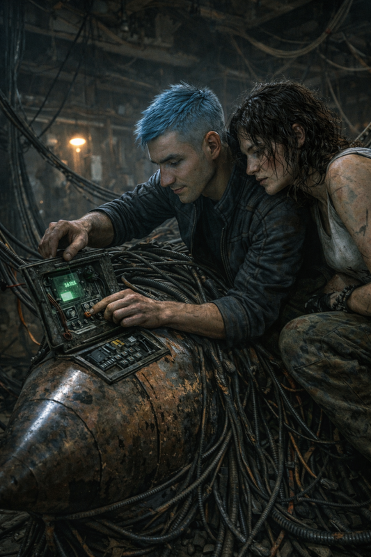
/// caption
Jester watches [Ink](ink.md) work on the warhead
///

- woman reaches out to [Ink](ink.md), he feels buildup of static
    - [Ink](ink.md) backs away and it dissipates
    - woman: "Do not waver"
- [Ink](ink.md) panics due to the stress of working on a nuclear warhead
    - feels static permeating him
    - woman seems to enter [Ink](ink.md)'s body
    - contest of wills happening

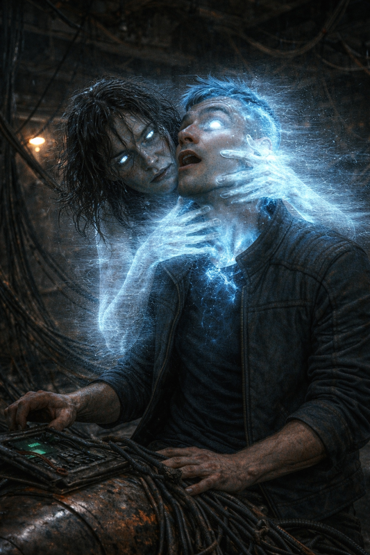
/// caption
Jester attacks [Ink](ink.md) as he works on the warhead
///

- [Murderbot](murderbot-v2.md) pulls out his I/O cable and connects to [Ink](ink.md)
    - it's a lot messier than interfacing with a computer
    - [Murderbot](murderbot-v2.md) wanders through [Ink](ink.md)'s memories and fears

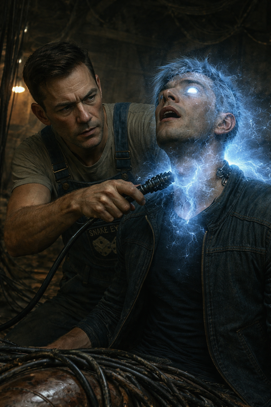
/// caption
[Murderbot](murderbot-v2.md) connects to [Ink](ink.md)
///

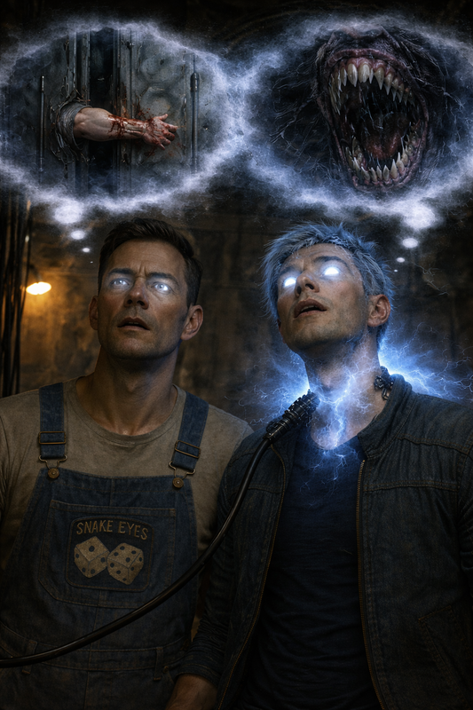
/// caption
[Murderbot](murderbot-v2.md) wanders through [Ink](ink.md)'s memories and fears
///

- [Ink](ink.md) recites the gospel of the Minotaur
    - the philosophy of the Minotaur gives the woman pause
    - [Ink](ink.md) is able to expel her from his body
    - she yells: "You have wavered!"
    - her eyes go from black to beams of light
    - robs [Ink](ink.md) and [Murderbot](murderbot-v2.md) of precious sanity
        - they relive traumatic memories
- feel a connection with the woman
    - she tried to destroy Monarch by arming the warhead
    - ended up killing herself in the process
- [Ink](ink.md) flips the switch to detonate the bomb

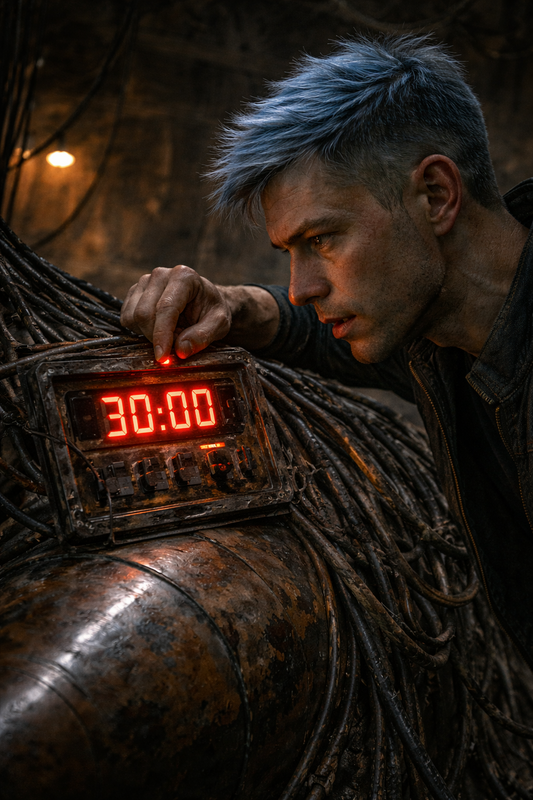
/// caption
[Ink](ink.md) sets us up the bomb
///

- [Dex](dex-miro.md), [Carnoc](carnoc-ashbrow.md), and [Zeke](zeke-sinclair.md) hear an explosion in 51B
- "Self destruct in T minus 30 minutes"

## Notes

- maybe 1.5 months-ish left for gradient descent combined with pound of flesh
