# {{ page.meta.module }}: {{ page.meta.title }}

TODO Intro

<!-- more -->



/// caption
[Ink](ink.md) and [Murderbot](murderbot-v2.md) work together to stop the countdown
///

- [Murderbot](murderbot-v2.md) realizes we weren't in any real danger
    - Monarch could have stopped the countdown at any time
- [Murderbot](murderbot-v2.md) is able to take control of the bomb
    - Monarch probably has no control anymore
- androids return from [Ink](ink.md)'s tasks
    - Tom returns with the 6 syringes
        - white milky fluid similar to android blood
    - other androids were killed by a tank from the Armory 51D/E

/// caption
Tom returns and shakily describes the spider tank
///

/// caption
It's not quite there yet, but Tom is very afraid
///

- [Dex](dex-miro.md) goes to investigate the tank explosion
    - goes to the security checkpoint 51B
    - leaves the android corpse floating
    - wants to observe tank from a distance
- massive shape comes into the checkpoint
    - claws come through the door and tear it apart
    - opens fire on the android corpse

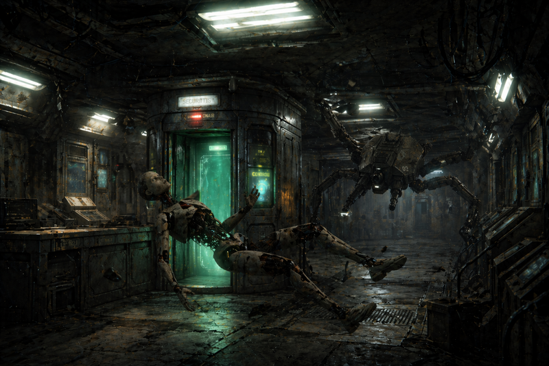
/// caption
The spider tank enters 51B, with a floating android corpse
///

- [Dex](dex-miro.md) retreats

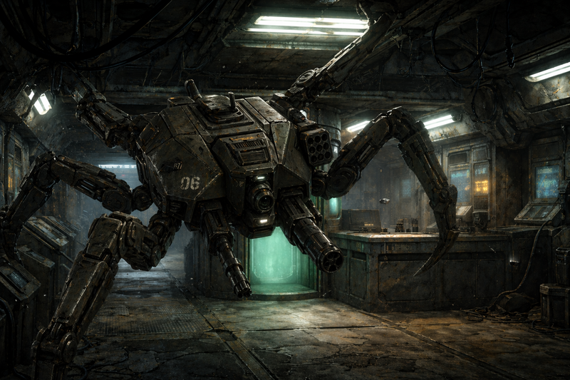
/// caption
The spider tank pursues
///

- we try to trigger the radios for [Kilroy](rachael-kilroy.md)
    - find that they were already triggered
- we retreat towards the hangar
    - androids come with us
    - go through 52E Inspection

## 52E Seminar Room

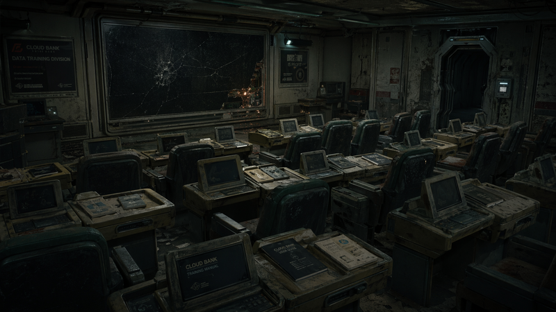
/// caption
52E Seminar Room
///

- rows of comfortable seats before a dead blank screen
- dusty terminals in front of each seat
- [Ink](ink.md) blowtorches the door shut behind us
- [Dex](dex-miro.md) tries to repair the screen
    - accidentally makes contact with the Turbo Sledge
    - the screen is beyond repair

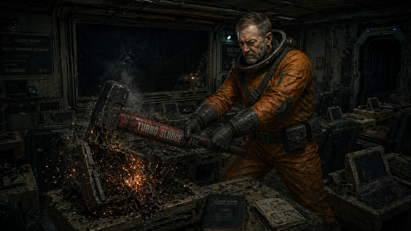
/// caption
[Dex](dex-miro.md) "accidentally" destroys the screen with the **Turbo Sledge**
///

- [Murderbot](murderbot-v2.md) accesses the terminal
    - has control of most minor systems
    - shows spider tank in storage on this floor

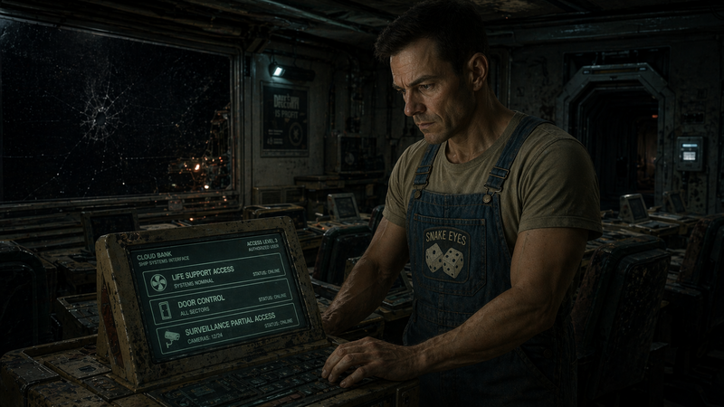
/// caption
[Murderbot](murderbot-v2.md) accesses the terminal
///

- flood the room next door with oxygen
- [Ink](ink.md) "unlocks" the door to 53A

## 53A Infiltration Personalities Data Bank

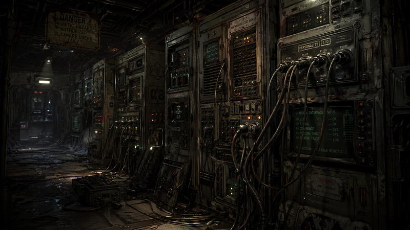
/// caption
53A Infiltration Personalities Data Bank
///

- servers in this room with strange designs
- have personality cables like we use for slickware
- we all make it through with 95ish androids
- [Ink](ink.md) seals the door behind us
- we keep moving away
- hear an explosion behind us
- spider tank is still moving
- [Dex](dex-miro.md) asks one of the Mary Sues to connect and see what she can access
    - eyes roll back and she begins to convulse
    - she's able to disconnect herself
    - says "I wouldn't recommend it"

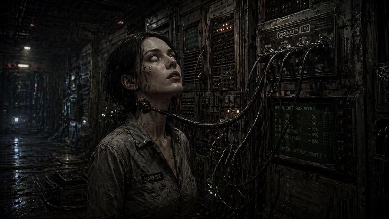
/// caption
Mary Sue unsuccessfully tries to access the personalities data bank
///

## 53B Infiltrator Android Storage

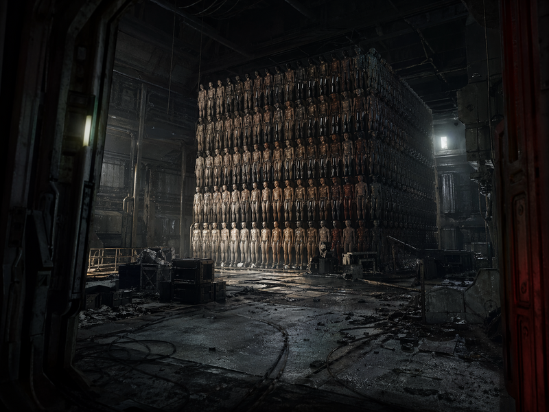
/// caption
53B Infiltrator Android Storage
///

- 10x10x10 cube with naked humanoids arranged by gradient of skin tones
- these get sent out to replace people
- [Dex](dex-miro.md) cracks the cube open with the Turbo Sledge
- we scatter the humanoids around
- leave a trail of bodies towards 53D

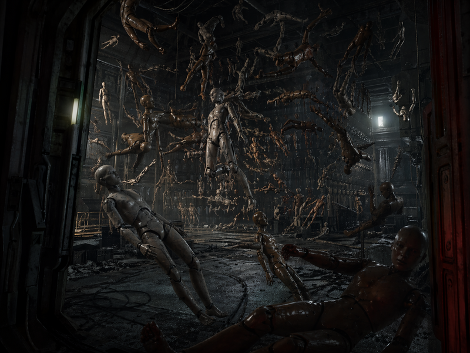
/// caption
Android bodies, scattered to delay the spider tank
///

- we go to 53C
- as we exit the room, we hear the spider tank shooting at the humanoids

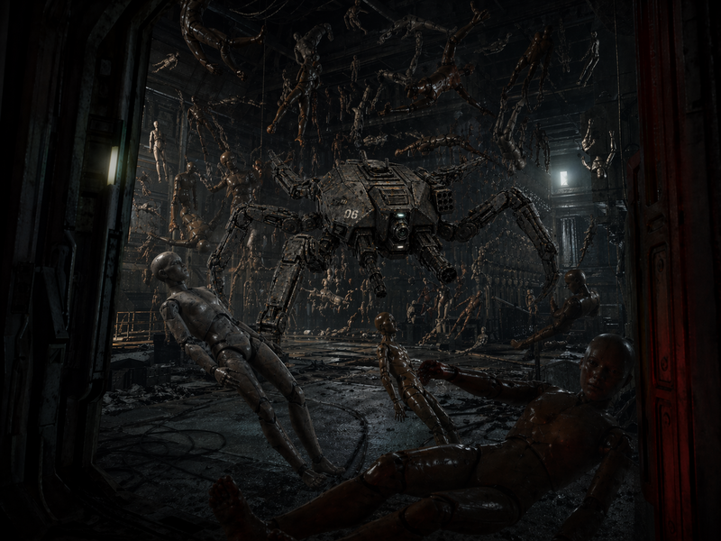
/// caption
The spider tank enters and begins shooting the android bodies
///

## 53C Micro Hangar

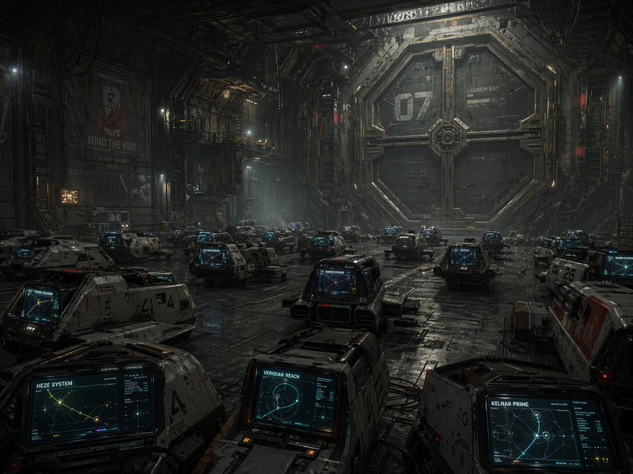
/// caption
53C Micro Hangar
///

- dozens of micro craft
- each has a micro computer with a course set to various systems
- routes take 2 years
- [Ink](ink.md) convinces one of the Ellens to come with us
- all of the androids climb in
- [Murderbot](murderbot-v2.md) tries to hack the micro craft
- bay doors open and the micro craft start leaving
- after they leave the station, something starts shooting down the micro craft
- dex gets into a power loader
    - prepares to assist the spider tank with a space tour
    - switches to zero g mode

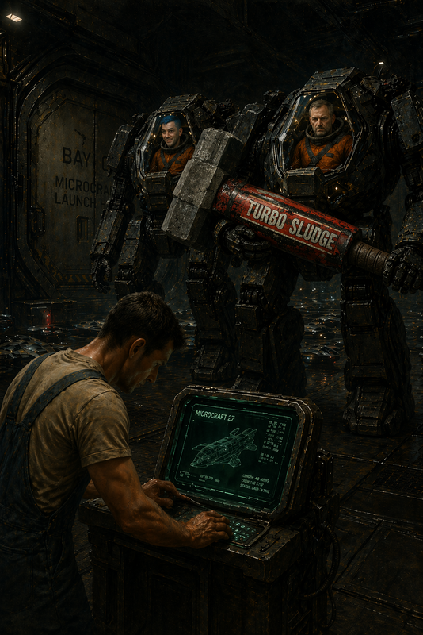
/// caption
[Dex](dex-miro.md) and [Ink](ink.md) suit up in power loaders
///

- spider tank starts attacking the door
    - punches a small hole
    - tank slams into the door
    - door rips off
    - tank was able to sink 5 of its limbs into the door frame
- [Dex](dex-miro.md) attacks the spider tank legs with the turbo sledge
    - [Ink](ink.md) frees the legs on the other side
    - atmosphere blows it out into space
    - [Dex](dex-miro.md)'s power loader is damaged by the follow through

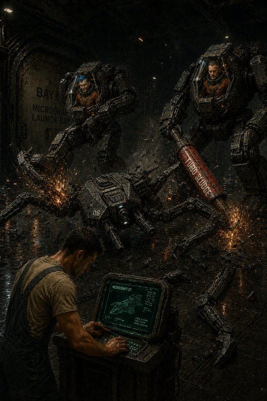
/// caption
[Dex](dex-miro.md) and [Ink](ink.md) destroy the spider tank's legs, sending it out into space
///

- spider tank shoots wildly on the way out
    - rocket hits [Ink](ink.md)'s power loader and destroys it
    - spider tank is destroyed
- [Murderbot](murderbot-v2.md) finishes hacking the micro craft
- we backtrack to the armory

## 51D Anti-Synthetic Armory

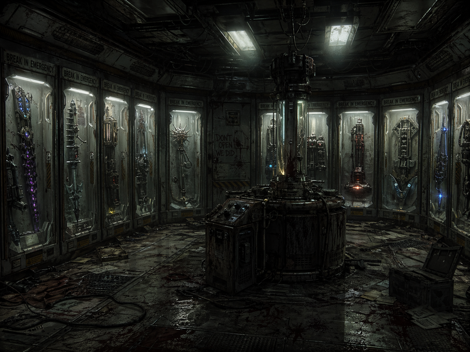
/// caption
51D Anti-Synthetic Armory
///

- [Murderbot](murderbot-v2.md) works on hacking
    - rest of the crew moves on

## 51E Anti-Organic Armory

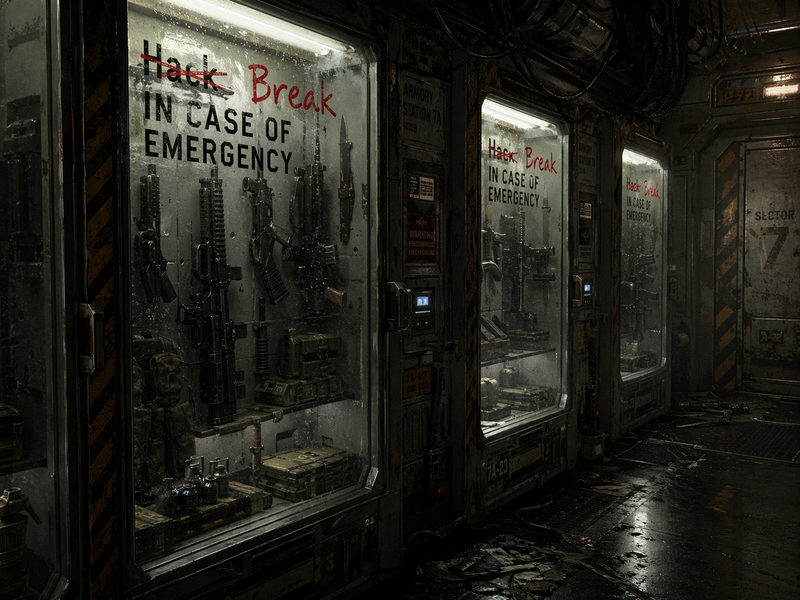
/// caption
51E Anti-Organic Armory
///

- [Murderbot](murderbot-v2.md) is only able to unlock some things
    - nearly endless supply of ammo
    - 50 frag grenades
    - 30 flamethrowers
    - 30 combat shotguns
    - 20 pulse rifles

## 51F Hangar

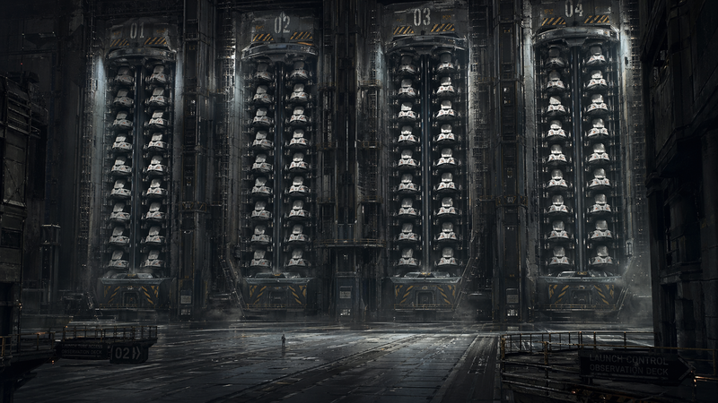
/// caption
51F Hangar
///

- pristine white hangar
- 4 massive launch tubes
- each launch tube has 50 micro craft
    - looks like they are all occupied
    - [Dex](dex-miro.md) checks one and it contains a woman

## Finding the Troubleshooters

- go back to door of 51A
- hear gunfire on the other side
- [Carnoc](carnoc-ashbrow.md) identifies as submachine gun fire
- we wait a few minutes to see what happens
    - gunfire stops
    - we wait a few more minutes
- we open the door
    - oxygen floods into the room
    - a few destroyed security androids with SMGs come through also
- we try to figure out what they were fighting
    - [Carnoc](carnoc-ashbrow.md) knows they had pulse rifles
- arrive at 32C, all of the doors are open now
- in hallway outside 32F
    - light movements look like a search pattern
- glimpse one of the searchers
    - they're wearing troubleshooter armor
- we turn on our lights
    - identify ourselves as divers on a mission for [Kilroy](rachael-kilroy.md)
    - we holster our weapons
- we hear a voice from behind us
    - [Kilroy](rachael-kilroy.md): "You say you work for me? Prove it."

 listens at the door](./51a-mb-listening.png)
/// caption
[Murderbot](murderbot-v2.md) listens at the door
///
