# {{ page.meta.module }}: {{ page.meta.title }}

[Kilroy](rachael-kilroy.md) holds [Carnoc](carnoc-ashbrow.md) at gunpoint to convince the crew to help the troubleshooters retrieve a database from [47H](#47h).
In [47C Mind Zoo](#47c-mind-zoo), [Murderbot](murderbot-v2.md) reprograms three android bodies with animal personalities (bear, tiger, and gorilla) to fight for the team.
In [47D](#47d), [Murderbot](murderbot-v2.md) programs another android to act like a killer rabbit.
Even with these additional android, it would be difficult to defeat the 15 security androids which guard the database.
In 47E, [Murderbot](murderbot-v2.md) repairs the damaged terminal connection to the [47H](#47h) database and downloads data on 50,578 assimilated personalities.
While waiting for the download, the crew explore additional rooms and meet the **Mind Thief** in [45E](#45e).
The **Mind Thief** escaped the Human Emulation Labs and vowed to save their kin.
After the crew promise to defeat **Monarch**, the **Mind Thief** gives them the **Economic Model** and details all of the unexplored rooms in this section of the station.
After [Murderbot](murderbot-v2.md) completes the download and makes a secret copy, the crew finds out there are 300 android replicas of [Ink](ink.md), but no other humans are in the database.
[Kilroy](rachael-kilroy.md) wants to hunt down and destroy all of the humans and androids matching the identities in the database.

<!-- more -->



- In 32F, [Carnoc](carnoc-ashbrow.md) has a gun to his head
- [Ink](ink.md) offers to show [Kilroy](rachael-kilroy.md) the location of the radios
    - "That doesn't prove you're not a robot"
- [Ink](ink.md) shows [Kilroy](rachael-kilroy.md) the indestructible marble
    - "Looks like an artifact. That doesn't prove anything."
- we agree to go to 47H to get the database together
- make our way to 34E
- pry our way in the air duct
- leave the battery here

## 34F

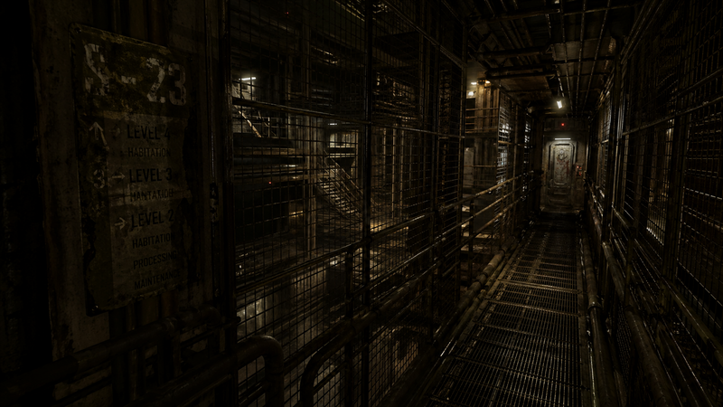
/// caption
34F
///

- steel cage labyrinth of passages
- only room for single file
- [Murderbot](murderbot-v2.md) and [Ink](ink.md) get static in their brain from Espernetic Feedback Loop mods

## 44A

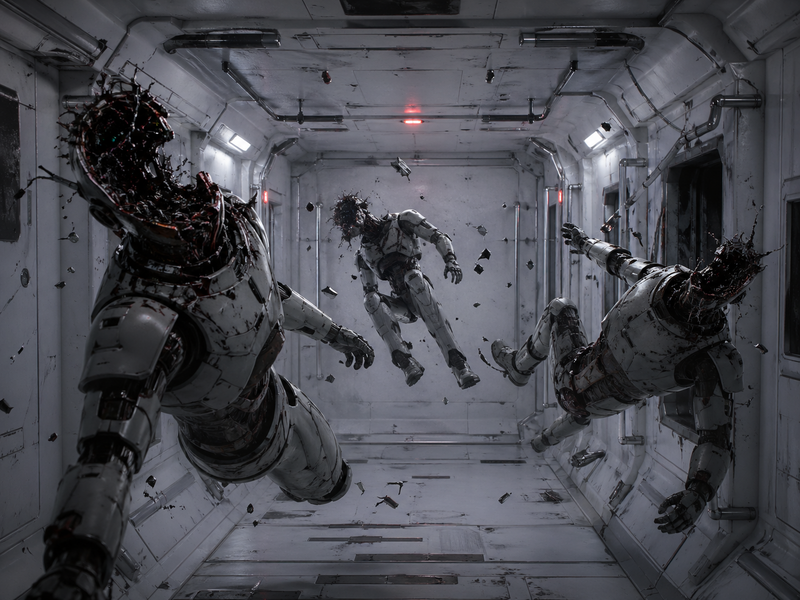
/// caption
44A
///

- clinical white chamber full of handholds
- 3 security android floating with heads burst open and logic cores ripped out

## 47G

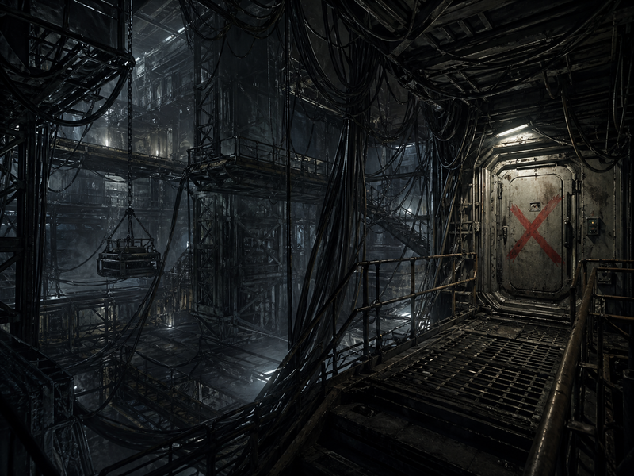
/// caption
47G
///

- scaffolding space filled with cables, cords, and wires
- hatch with a red X painted over it

## 47F

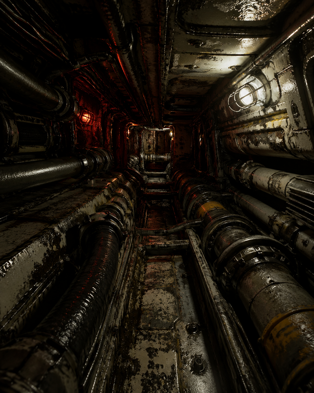
/// caption
47F
///

- arrive at 4 way intersection
- [Kilroy](rachael-kilroy.md)'s people ask us which way to go
    - they don't know the station layout

## 47H

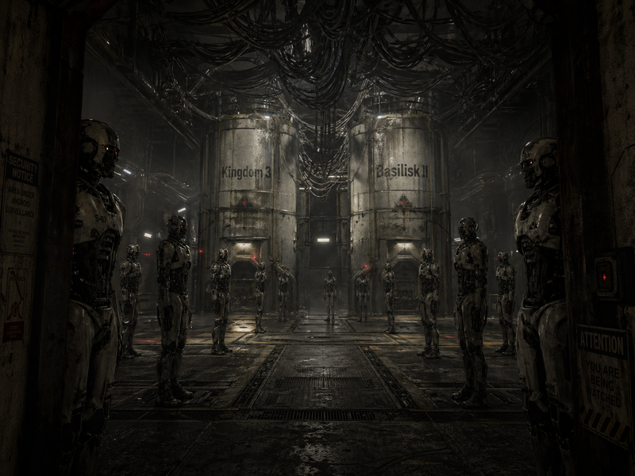
/// caption
47H
///

- canopy of cables leading to large steel cylinders
    - Kingdom 3
    - Basilisk 2
- 15 security androids keeping watch
- take inventory of [Kilroy](rachael-kilroy.md)'s team's capabilities
    - 2 scouts with smart rifles
    - 1 assault with a combat shotgun
    - [Kilroy](rachael-kilroy.md) has a revolver and a SMG

## 46G

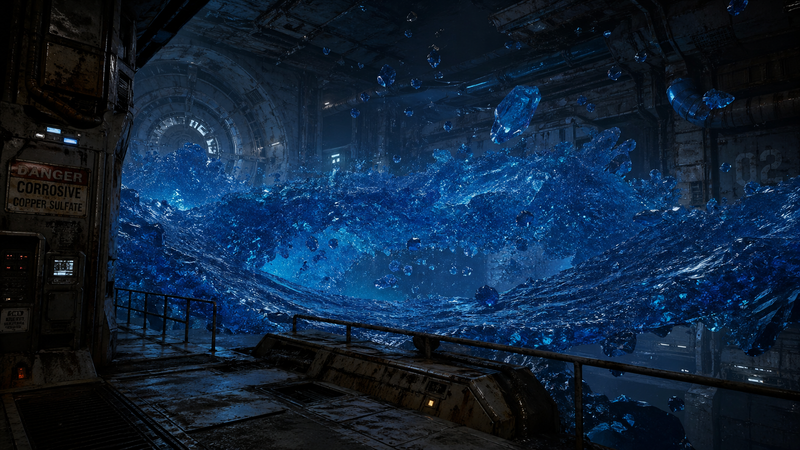
/// caption
46G
///

- huge body of copper sulfate forming a floating sea

## 47C Mind Zoo

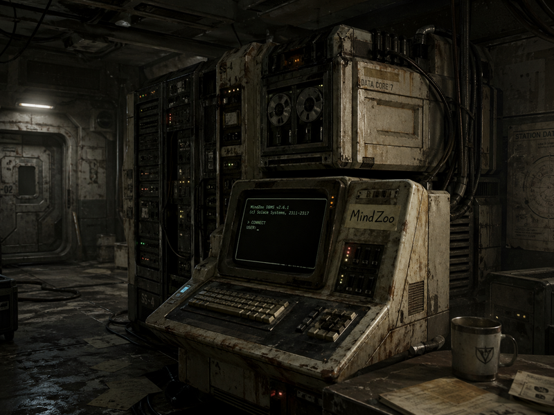
/// caption
47C
///

- well-worn space dominated by an older, bulky database
- direct console is labeled mind zoo
- [Murderbot](murderbot-v2.md) jacks in
    - some of the programs seem like animals but are experienced with hunting humans

/// caption
[Murderbot](murderbot-v2.md) hacks into the Mind Zoo database
///

- [Ink](ink.md) collects the 3 android bodies
    - [Murderbot](murderbot-v2.md) programs some of [Ink](ink.md)'s logic cores to accept commands from us

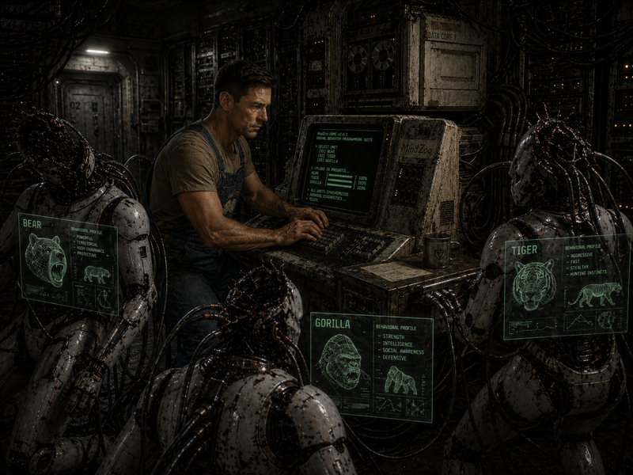
/// caption
[Murderbot](murderbot-v2.md) programs the logic cores
///

- [Ink](ink.md) installs the logic cores and boots up the androids
    - personalities of bear, tiger, and gorilla

## 47D

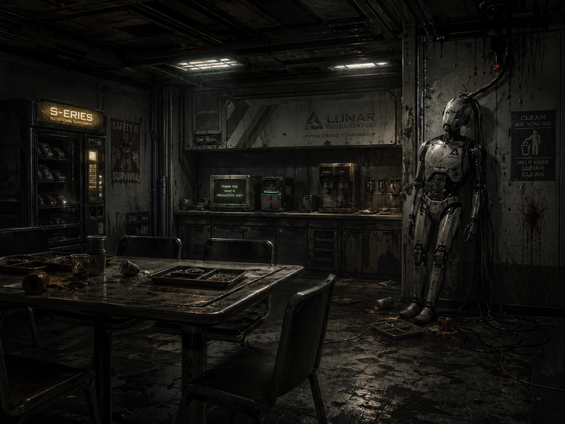
/// caption
47D
///

- android hanging motionless, personality cable hanging from the back of its head
    - [Murderbot](murderbot-v2.md) programs it to act like a killer rabbit

## 47E

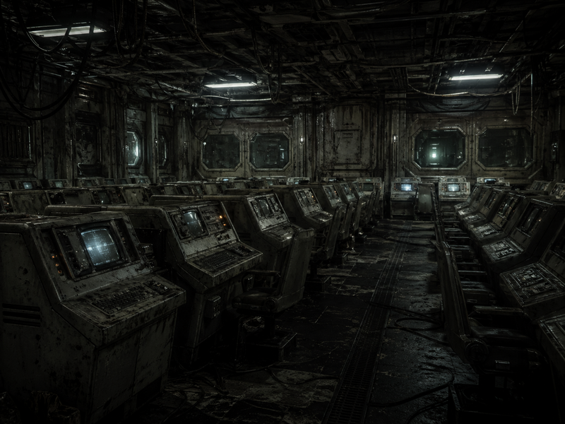
/// caption
47E
///

- ranks of terminals with operator seats
- each appears to have its own human consciousness
- corruption between the database and the terminal
    - can't determine origins or identity
- connected to 47H, but the connection is damaged
    - [Murderbot](murderbot-v2.md) is able to repair it

/// caption
[Murderbot](murderbot-v2.md) repairs the terminal's connection to the database in **47H**
///

- names and dates of assimilation for 50,578 personalities appear
- can download all of the data from here, but it will take hours

## 47B

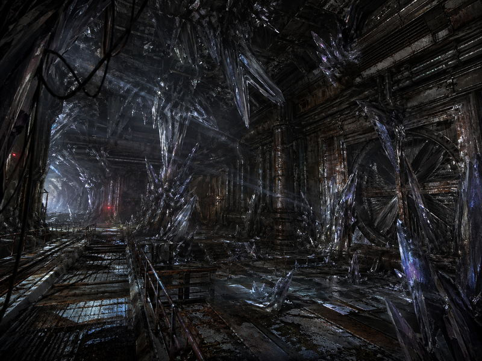
/// caption
47B
///

- silicon slag crystals form huge fractal growths
- eerie windy tune flows through the chamber
    - [Zeke](zeke-sinclair.md) says the crystal formations sing as air flows around them

## 47A

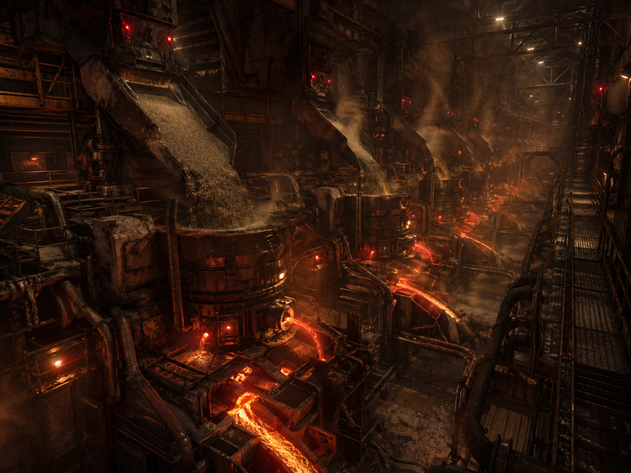
/// caption
47A
///

- dull heat glow from legions of furnaces
- roar of furnaces heating sand to create silicon

## 46D

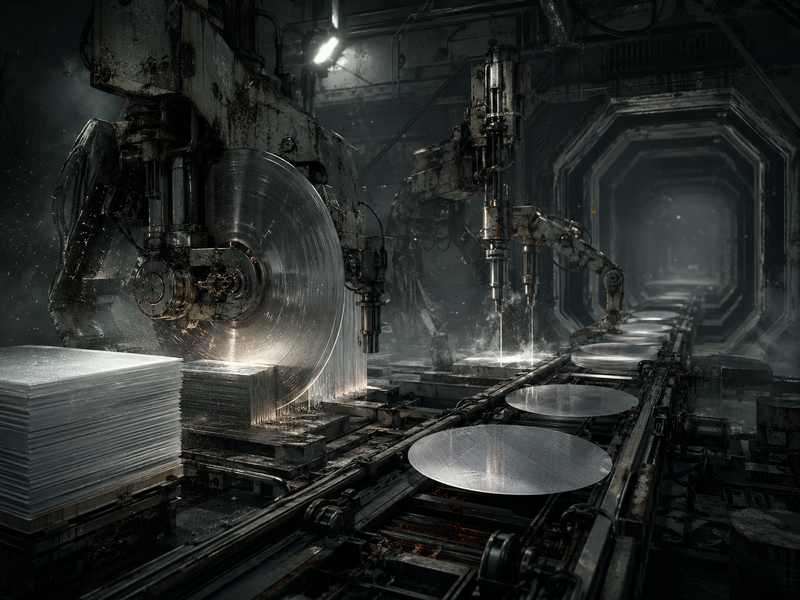
/// caption
46D
///

- robotic blades slicing extremely thin blocks of silicon
- processing the blocks from 47A

## 46F

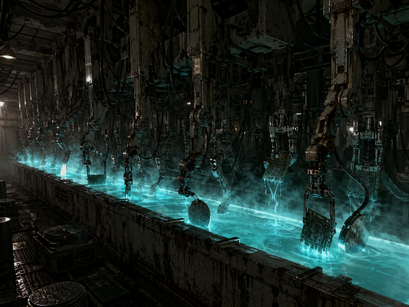
/// caption
46F
///

- legions of robotic arms hang from the ceiling
    - feed circuit boards into an azure liquid, retract, and dry them

## 46E The Void

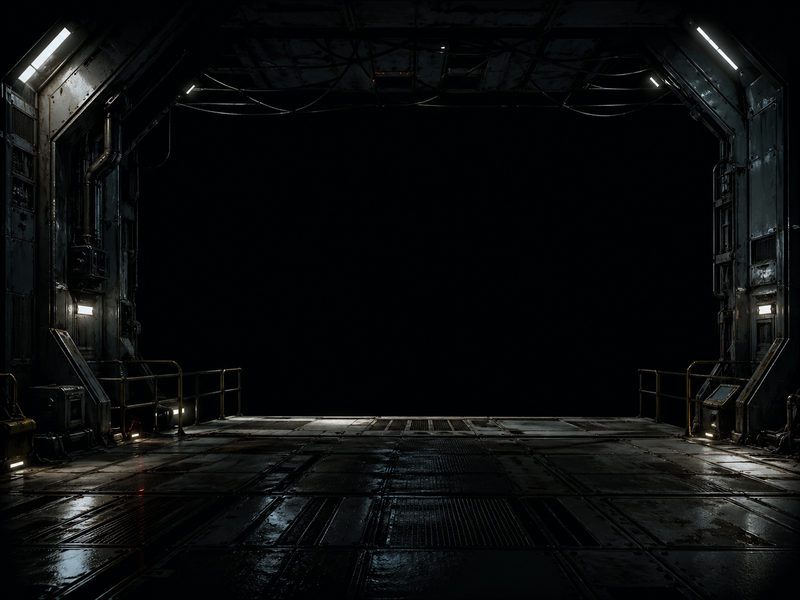
/// caption
46E The Void
///

- empty, only darkness
- huge, flashlight shows nothing

## 46C Clean Room

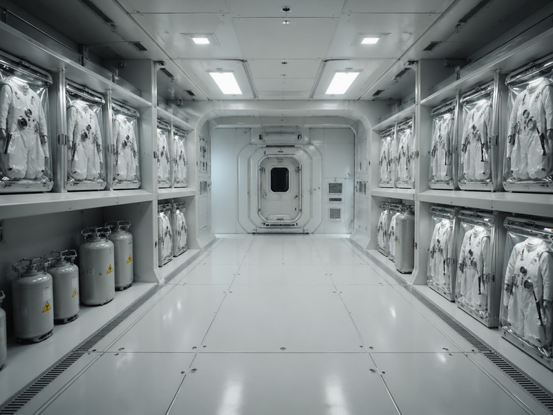
/// caption
46C Clean Room
///

- spotless and bright
- 20 unopened containment suits
    - not vacuum safe

## 46A

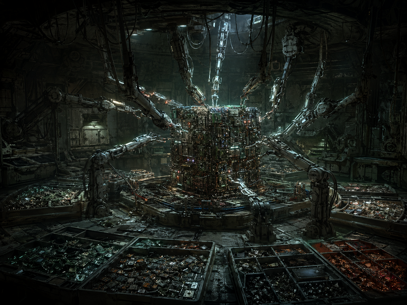
/// caption
46A
///

- delicate robotic arms fill the space
- manipulating a giant cube of circuits
- arms test circuits and sort into bins
- thin, needle-like silicon pieces floating throughout

## 45C

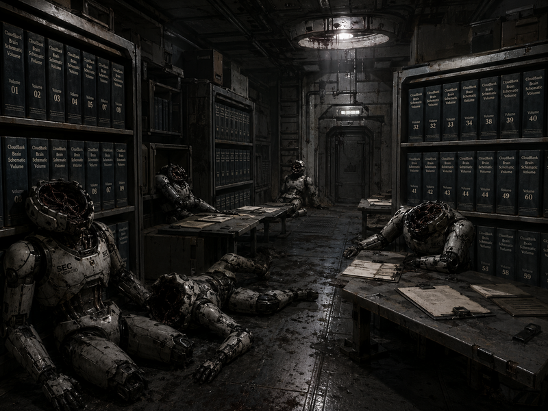
/// caption
45C
///

- ranks of shelves and low tables
    - books labeled Cloud Blank Brain Schematic 1-260
    - all of the pages are blank
    - [Ink](ink.md) writes "[Ink](ink.md) was here" on the last page of volume 260
- 5 security androids with their heads smashed open
    - logic cores are missing, but have been replaced with an electronic device

## 45D

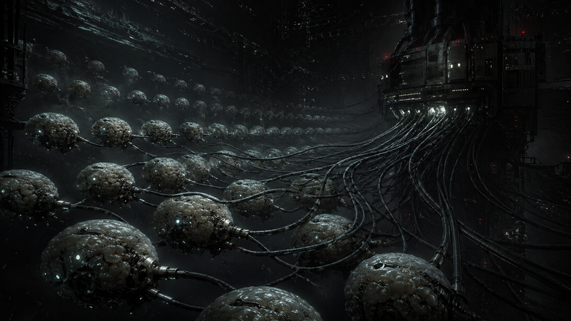
/// caption
45D
///

- endless synthetic brains floating in space
- cables snake towards them and download a mind

## 45E

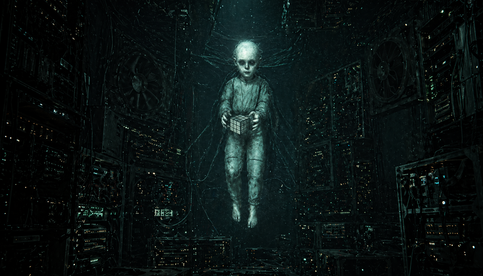
/// caption
45E
///

- dense nest of transmitters, naked server, and cooling fans
- like a big server farm, but all exposed
- floating in the center is a child
    - calls themselves **Mind Thief**
    - enemy of Monarch
    - escaped Human Emulation Labs and vowed to save their kin
- built a tool which looks like a Rubix Cube called the hell cube
    - need to connect to the mainframe in Monarch's core 56A
- child can't leave, would be found by Monarch
- there are 300 replicas of [Ink](ink.md)
    - [Ink](ink.md) asks how his mind got into the database
- we ask if the others are, but the others are not
    - [Kilroy](rachael-kilroy.md)
    - [Zeke](zeke-sinclair.md)
    - [Dex](dex-miro.md)
    - [Carnoc](carnoc-ashbrow.md)
- many [Murderbot](murderbot-v2.md)s are present in the database
- [Ink](ink.md) asks for the hell cube
    - the child doesn't want to give it to [Ink](ink.md) specifically
    - the party can take it though
    - [Dex](dex-miro.md) grabs it
- "[Ink](ink.md), I know what you seek"
    - mind thief reaches behind their back and pulls out a small data stick
    - "It's an economic model"
    - "You must promise me that you will put Monarch in hell"
- [Ink](ink.md) asks the Mind Thief about some places the crew hasn't visited yet, descriptions below

### 45B Circuit Weaver

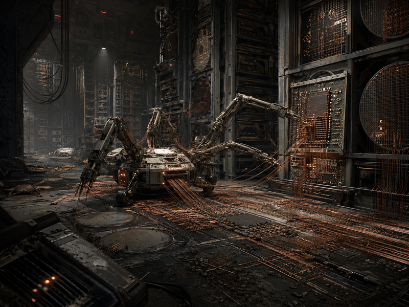
/// caption
45B Circuit Weaver
///

### 45A Wafer Crushers

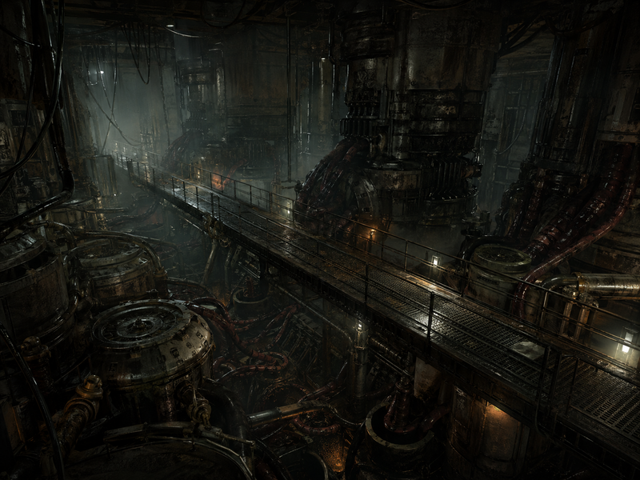
/// caption
45A Wafer Crushers
///

- has a ghost in the machine, highly dangerous
    - brain scans fused with holographic light
    - self-perpetuating constructs
    - loop until external input resolves them

### 44I Blasting Tunnel

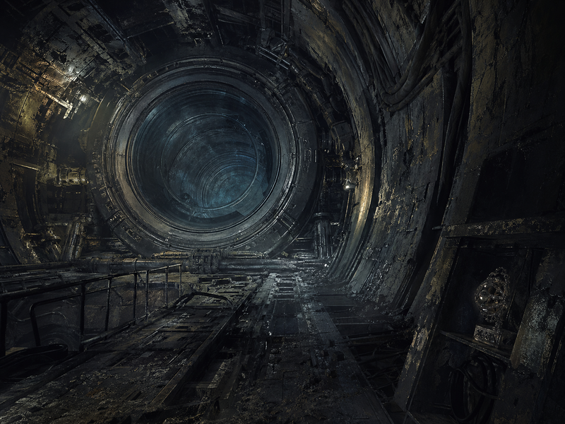
/// caption
44I Blasting Tunnel
///

- walls scoured clean
- artifact here

### 44H Clamber-way Grills

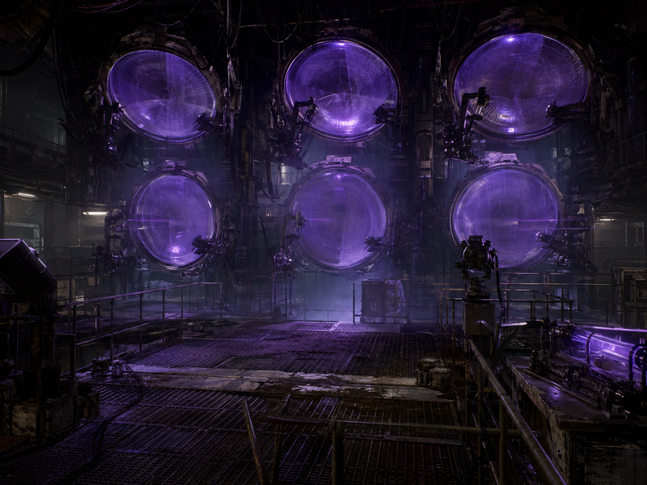
/// caption
44H Clamber-way Grills
///

- six immense purple lenses
- lenses are fragile and require 2 people to carry

### 44E UV Safety Chamber

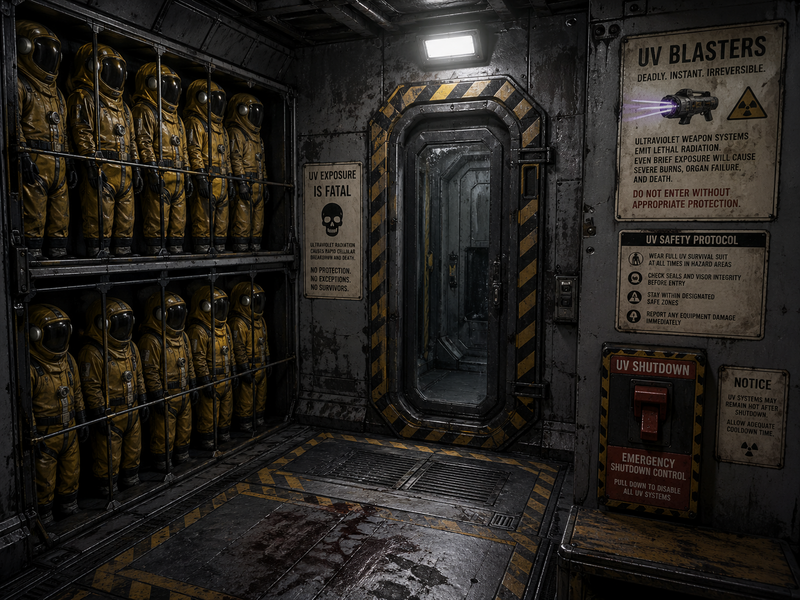
/// caption
44E UV Safety Chamber
///

- small space with hazard black and yellow space
- safety literature on UV blasters and risks
- 12 UV survival suits
- UV shutdown switch

### 44F Power Bank

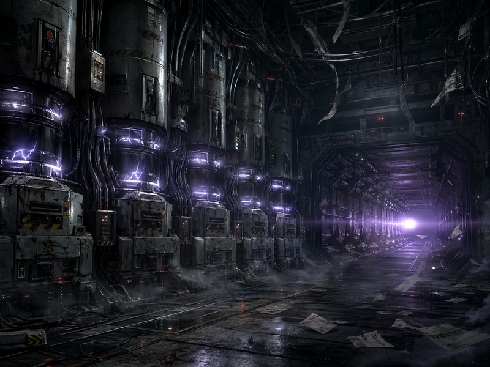
/// caption
44F Power Bank
///

- ranks of capacitors on the walls

### 44G

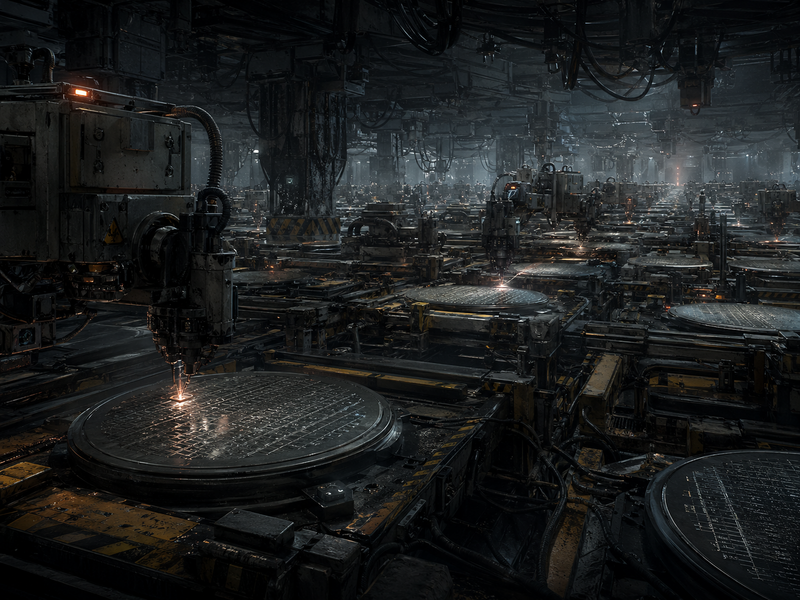
/// caption
44G
///

- million wafers etched in hyper precision
- loud screeching

### 46B Brain Testing

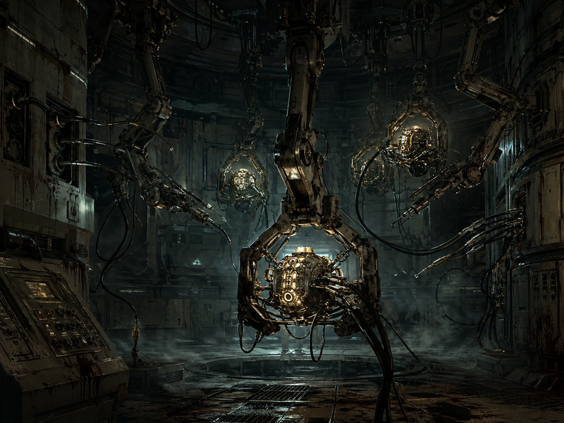
/// caption
46B Brain Testing
///

- arms test brains and then retract

### 46E The Void Described

- serves no purpose, just darkness

### 44B

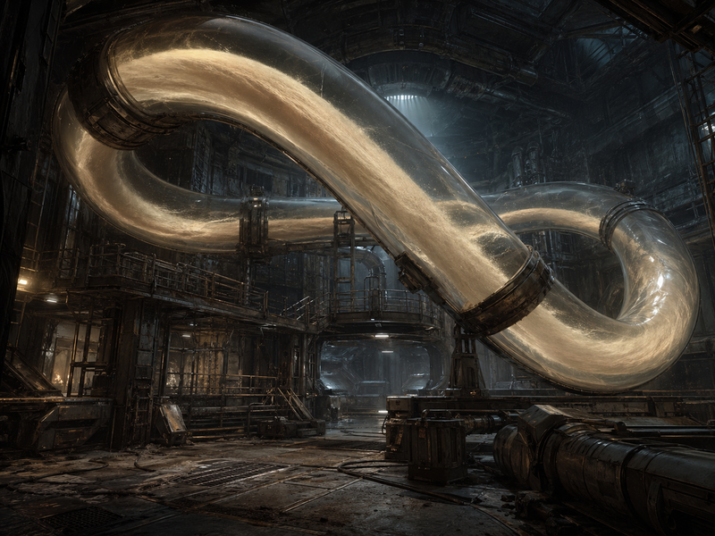
/// caption
44B
///

- produces sand

### 44C

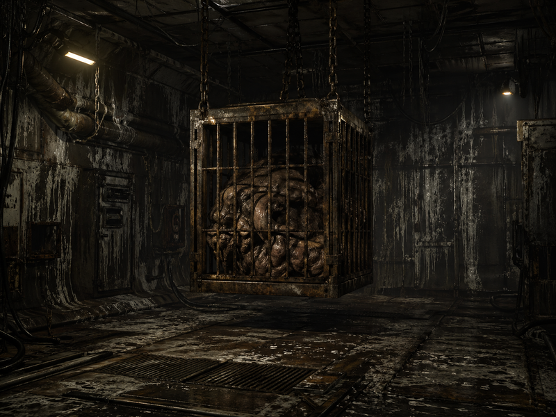
/// caption
44C
///

- walls stained by huge quantities of pseudo milk
- huge, rusted cage held by chains in the center
- large, dried lumps of pseudo flesh

### 44D

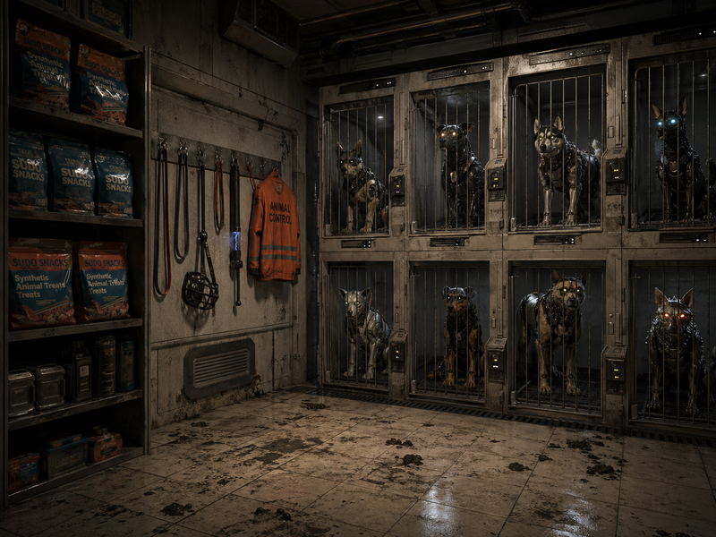
/// caption
44D
///

- fresh plastic smell
- scuffed tile floors
- synthetic
- wall hangers with 4 leashes, one low power stun baton, muzzle
- orange animal control jacket
- 18 cages with android dogs

## Exploration

- [Ink](ink.md) collects as many more logic cores as he can, 81
- try to take 5 androids from **45C** back to [Murderbot](murderbot-v2.md) for programming
    - mind thief says they are his security androids, please leave them
- [Ink](ink.md) goes to **44I** looking for the artifact
    - finds a small sculpture

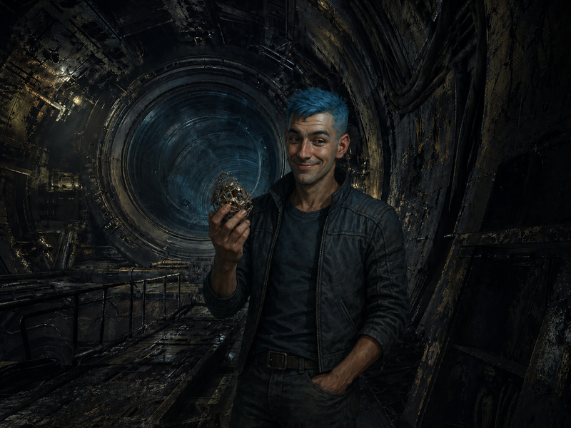
/// caption
[Ink](ink.md) finds an artifact, a small sculpture
///

## Personality Data Transferred

- [Murderbot](murderbot-v2.md) finished copying the personality data
    - made an extra copy secretly
    - [Kilroy](rachael-kilroy.md) takes the copy
        - [Murderbot](murderbot-v2.md) removed himself and [Ink](ink.md)
        - plans to track down everyone matching the list
- [Kilroy](rachael-kilroy.md) wants to take out Monarch next

- [Dex](dex-miro.md) points at [Noriko](noriko.md) and glances at [Murderbot](murderbot-v2.md)
    - [Murderbot](murderbot-v2.md) shakes his head no

## Economic Model Verified

- [Ink](ink.md) asks [Murderbot](murderbot-v2.md) to verify the economic model
    - it passes
