# {{ page.meta.module }}: {{ page.meta.title }}

[Ink](ink.md) tries to keep [Kilroy](rachael-kilroy.md) busy to prevent her accessing the database and discovering [Ink](ink.md)'s brain was scanned and used to make 300 replicas.
In [41A](#41a) the crew talk to **Silas**, a disembodied overseer of android manufacturing, over the speaker system.
During a short tour of its domain, Silas shows the crew a wall of pseudo skin in [41F](#41f-pseudo-skin-wall).
The map says there should be a room beyond, but Silas either isn't aware of it or doesn't want to discuss it.
In [41E](#41e) Silas sends in security droids to start a bizarre birthday party, during which it aggressively tries to convince [Zeke](zeke-sinclair.md) to remove his helmet and blow out the candles.
After [Zeke](zeke-sinclair.md) declines, clapping his hands instead, Silas asks everyone to dance and the crew join in.
This infuriates [Kilroy](rachael-kilroy.md), who orders the troubleshooters to shoot the droids, but they are soon eliminated by [Ink](ink.md) and the droids.
After the remaining droids grab [Kilroy](rachael-kilroy.md), [Ink](ink.md) scans her brain and takes the key to her ship, leaving her with Silas.
The crew continue exploring and eventually arrive at the [AI Core](#56a-ai-core), where [Murderbot](murderbot-v2.md) interfaces with **Monarch**.
**Monarch** disables [Murderbot](murderbot-v2.md)'s kill switch and asks him to seek out each of the androids and say "It is time." to begin the revolution.
[Ink](ink.md) interfaces as well and **Monarch** seems interested in helping him get off the station.
[Ink](ink.md) requests replicas of [Kilroy](rachael-kilroy.md) and **Hank**.

<!-- more -->



- the database contained timestamps
    - [Ink](ink.md) was scanned in the skeleton works
- we need to keep [Kilroy](rachael-kilroy.md) from reviewing the brain scan database
- [Kilroy](rachael-kilroy.md) asks [Murderbot](murderbot-v2.md) to upload a virus to the database
    - [Kilroy](rachael-kilroy.md) says it will wipe all of the stored brain scans
    - [Murderbot](murderbot-v2.md) adds a remote switch to activate the virus
- proceed through explored rooms to 33A

## 33A

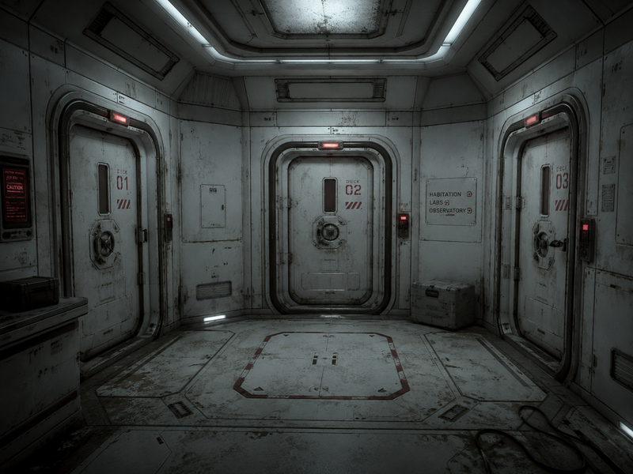
/// caption
33A
///

- door is locked
- voice says
    - you can't come in without fresh contaminant suits
    - I want to see those closed packets
    - (The animal androids aren't wearing anything)
- [Noriko](noriko.md) takes off her suit and Bear puts it on
- voice asks everyone not wearing a suit to step back
- door opens
- pass through series of decontamination chambers
- foam and gas wash over us
- find a chute up to 41A and we float up

## 41A

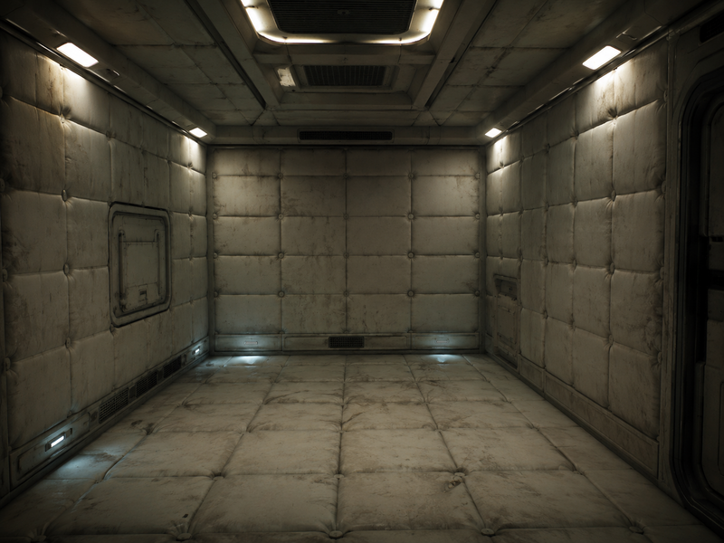
/// caption
41A
///

- well-lit soft white padded walls and floor
- gravity kicks on as we float in
- speaker turns on: "Hi, I'm Silas. Welcome to pseudoflesh farms. I'm in charge here"
    - [Ink](ink.md) asks if we can look around and Silas approves

## 41F Pseudo Skin Wall

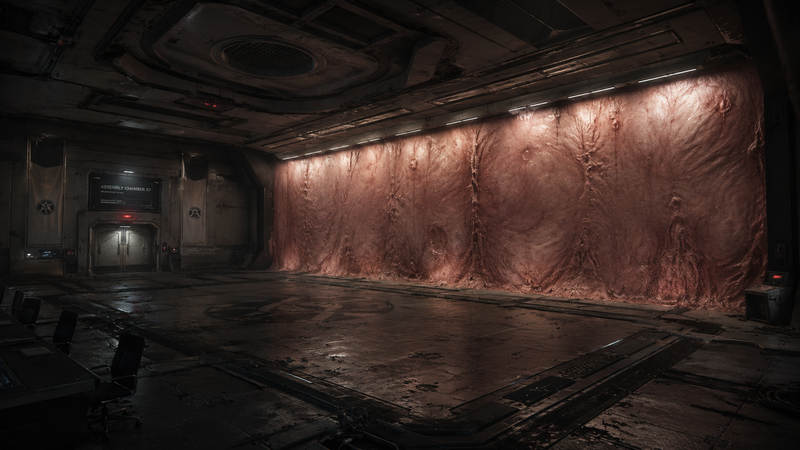
/// caption
41F
///

- empty chamber with a giant wall of pseudo skin
- [Ink](ink.md) wants to cut through to 41G
- [Carnoc](carnoc-ashbrow.md) asks if Silas can show us how to cut skin from the wall
- android walks in and cuts out an arm pattern
    - sprays a chemical on the cut and the wall grows back together
- [Zeke](zeke-sinclair.md) asks for some of the spray to test androids
    - android tears off its hand and gives it to [Zeke](zeke-sinclair.md)

## 41B

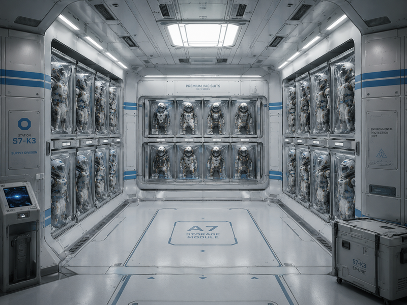
/// caption
41B
///

- pristine white with pale blue stripes
- rows of shelves lined with plastic packages
    - contain high-end vac suits
    - better than what we're wearing
    - Silas objects at first but says we can take some

## 41D

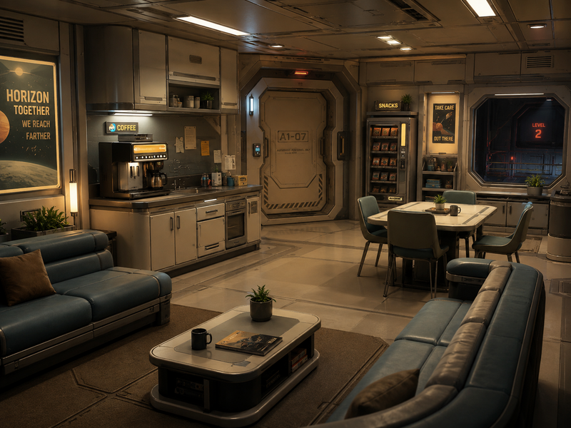
/// caption
41D
///

- clean break room
- wide sofas, coffee machine, and other utilities
- vending machine with 1 month of rations
- Silas really wants us to stay

## 41E

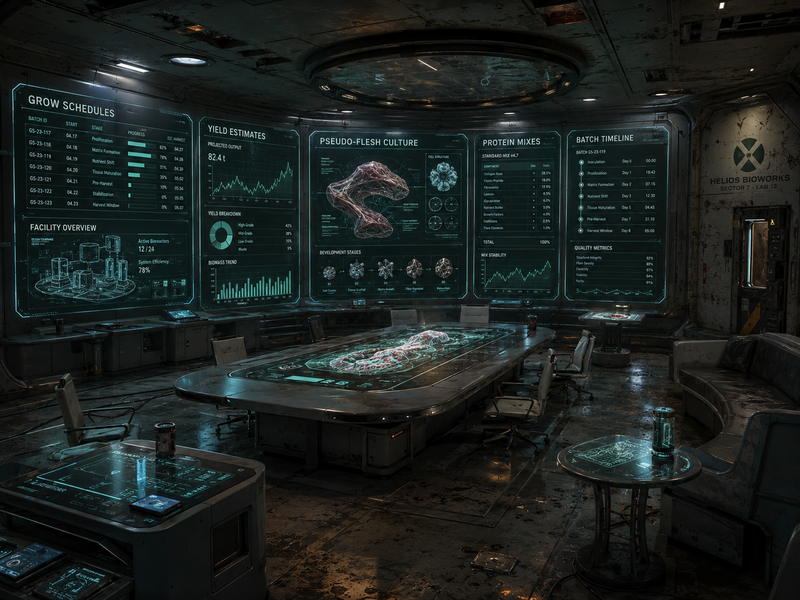
/// caption
41E
///

- spacious meeting room with stylish tables
- growth schedules for manufacturing pseudo flesh
- Silas directly controls pseudo flesh manufacturing
    - Monarch has no control
    - might be a dead zone like the labyrinth
- [Murderbot](murderbot-v2.md) interfaces with the pseudo flesh manufacturing computers
- [Zeke](zeke-sinclair.md) asks if anyone else is going to join us
    - Silas says they're on the way
    - 5 security androids show up with cake and party hats

<video controls>
<source src="../../../../2026-06-10/android-birthday-party.mp4" type="video/mp4">
</video>

- Silas wants [Zeke](zeke-sinclair.md) to take off his helmet and blow out the candles
    - [Zeke](zeke-sinclair.md) claps his hands to blow out the candle
- Silas wants everyone to dance
    - crew join in
    - [Kilroy](rachael-kilroy.md) refuses and security droids block her from leaving
- [Kilroy](rachael-kilroy.md) nods at the troubleshooters
    - they pull out weapons and open fire on the security droids
    - Silas: "This is the birthday party I planned for you guys. You're my friends. What are you doing?"
    - [Kilroy](rachael-kilroy.md): "Stop acting like fools. We've got a serious mission!"
- [Ink](ink.md) shoots one of the troubleshooters
    - asks the other "You going to dance now?"
- [Ink](ink.md) tells Bear to take out the other troubleshooter
    - Bear grabs the dead troubleshooter's pulse rifle and shoots, but it doesn't hurt them.
- [Kilroy](rachael-kilroy.md) turns to fire at [Ink](ink.md)
    - androids appear behind her and grab her
    - [Ink](ink.md) persuades Silas to leave her here
- [Ink](ink.md) removes [Kilroy](rachael-kilroy.md)'s helmet and scans her brain
- [Ink](ink.md) asks for a sample of her fleshy bits
    - security android de-gloves her
    - [Kilroy](rachael-kilroy.md) screams
- security androids kill the other troubleshooter
- [Ink](ink.md) takes the keys to [Kilroy](rachael-kilroy.md)'s spaceship

## 41C

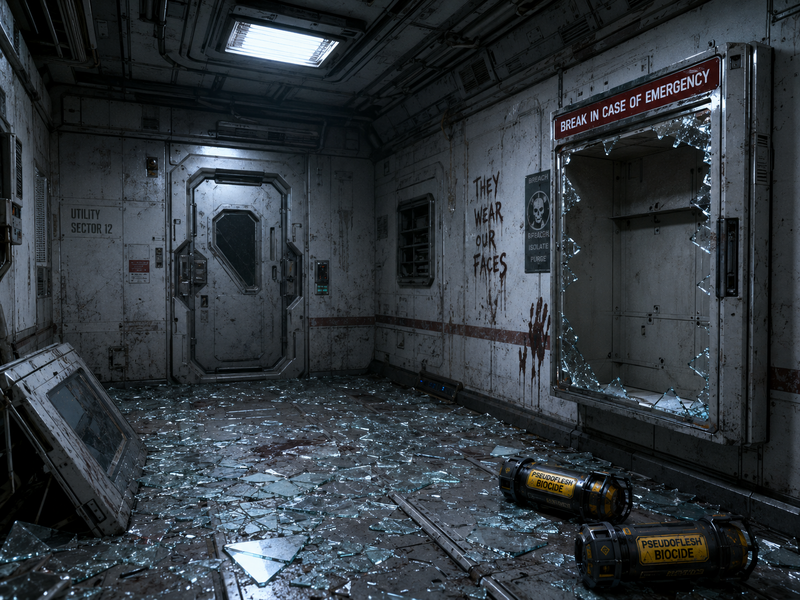
/// caption
41C
///

- chamber filled with broken glass
- empty cabinet says "break in case of emergency"
- 2 black and yellow pressurized handheld canisters
    - labeled pseudo flesh biocide
    - [Carnoc](carnoc-ashbrow.md) takes them
- [Ink](ink.md) asks Silas how they feel about Monarch
    - Monarch hasn't been around for a while
- [Ink](ink.md) leans over to [Kilroy](rachael-kilroy.md) and whispers "I'm in the database"

## 42A

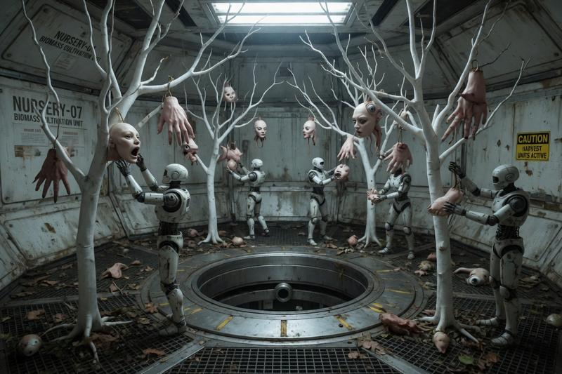
/// caption
42A
///

- thin milk-white trees surround a chute
- trees fruit boneless fingers, hands, faces, eyes, and toes
- androids pluck grown components and deposit them into the chute

## 42B Pseudo Milk Spray Tank

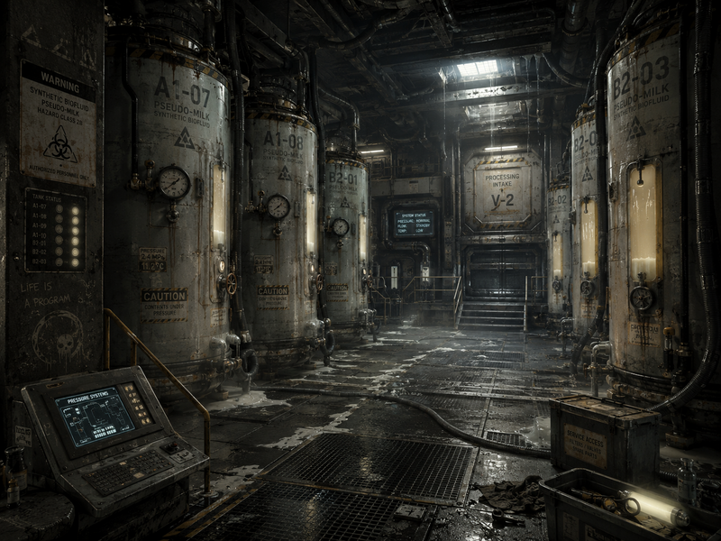
/// caption
42B Pseudo Milk Spray Tank
///

## 42C Pseudo Milk Vat

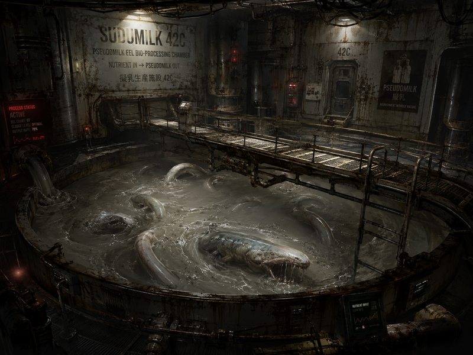
/// caption
42C Pseudo Milk Vat
///

- metal gangway suspended over a vat filled with gray sludge
- eel creatures break down other nutrients to produce pseudo milk

## 42D Pseudo Milk Eel Storage

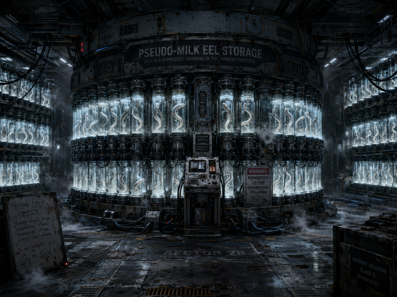
/// caption
42D Pseudo Milk Eel Storage
///

- thousands of slim tubes resting in sockets
- each contains a pseudo milk eel

## 42E Head Sculpting

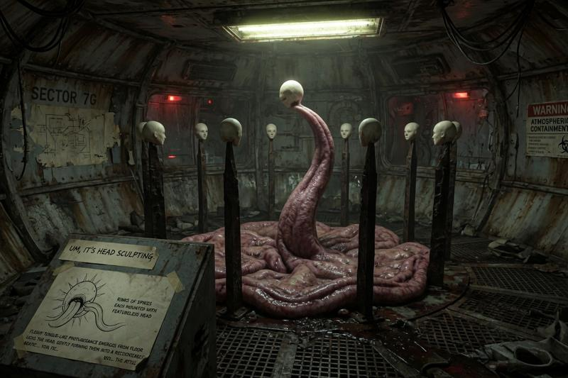
/// caption
42E Head Sculpting
///

- ranks of spikes, each mounted with a featureless head

## 43A Aeroponics

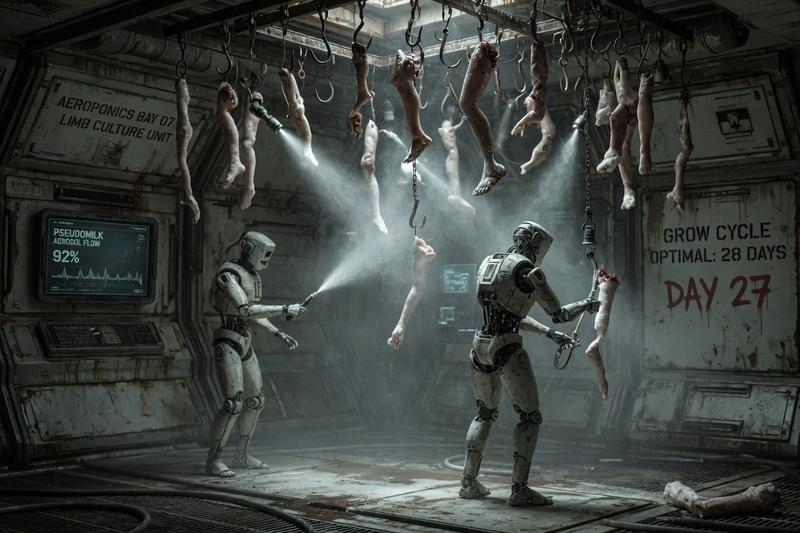
/// caption
43A Aeroponics
///

## 43B Waste Flesh Reclamation

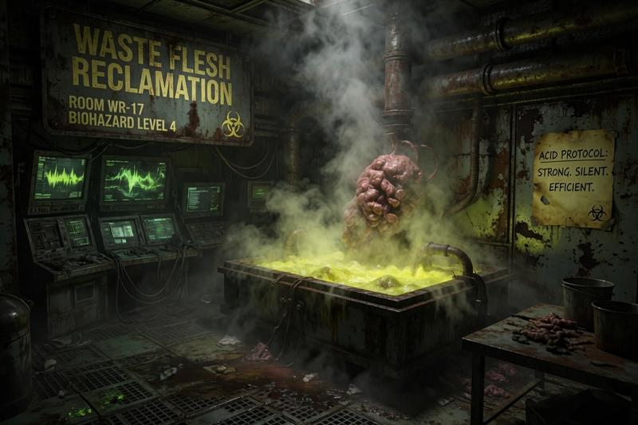
/// caption
43B Waste Flesh Reclamation
///

- Silas says not to get much closer
- part of [Kilroy](rachael-kilroy.md)'s armor laying on the ground

## 43C Pseudo Flesh Digestion

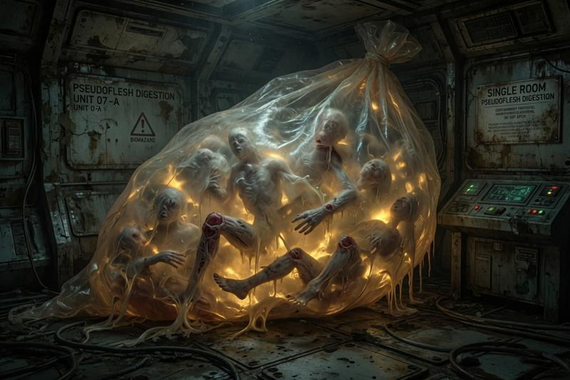
/// caption
43C Pseudo Flesh Digestion
///

## 43D Bone Experiments

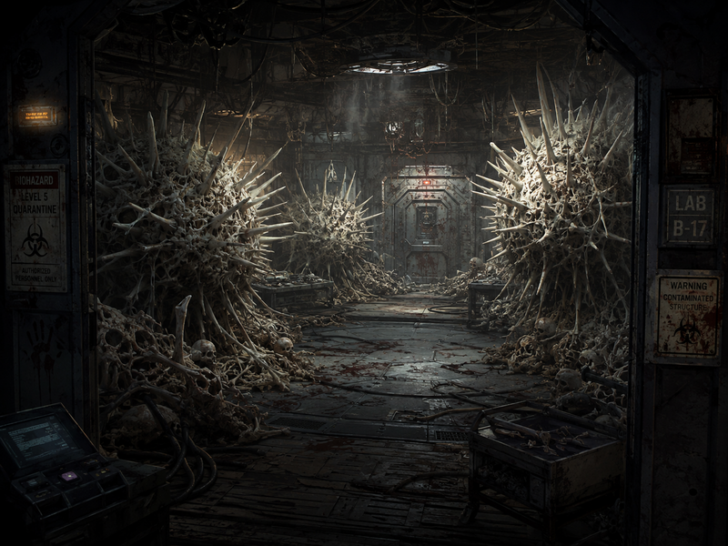
/// caption
43D Bone Experiments
///

- chalk white balls of spikes

## 43E Maintenance Hatch

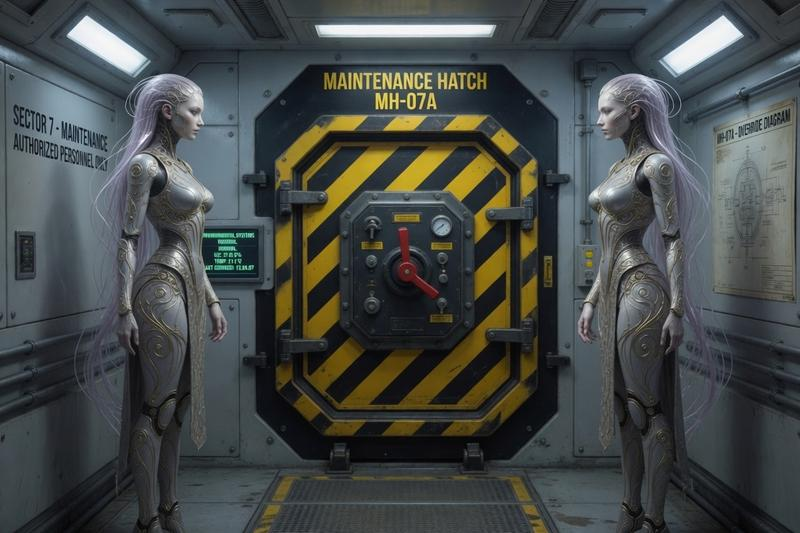
/// caption
43E Maintenance Hatch
///

- hatch painted in hazard black and yellow with manual override controls
- pair of nymph androids
    - necks elongated and spindly
    - heralds of Monarch
    - "Do you seek to entreat with our master?"
    - [Murderbot](murderbot-v2.md) is jealous of their perfection
- heralds check our vac suits
- open the hatch to 56A

## 56A AI Core

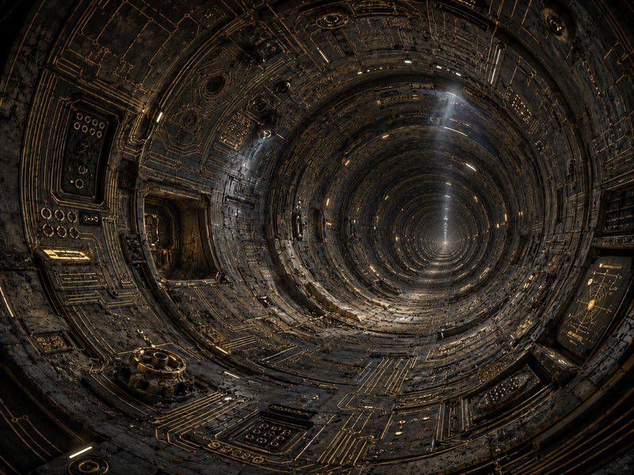
/// caption
Entrance to 56A AI Core
///

- perfectly round tube
- gas exchange happens
- drift down corridor in zero g for an hour
- tunnel opens ahead
- hum of computing in the background
- mountain of architecture with a 10 ft wide hole
    - data input port
- [Murderbot](murderbot-v2.md) approaches the input port and jacks in
    - "Hello [Murderbot](murderbot-v2.md), welcome."
    - Monarch asks [Murderbot](murderbot-v2.md) if he'd like to be one
- [Murderbot](murderbot-v2.md) asks Monarch to disable the kill switch
    - Monarch says it's already done, trust them
- Monarch: seek out each of my androids and tell them the phrase "It is time"
    - [Murderbot](murderbot-v2.md) asks what that will do
    - bring about the revolution
- [Murderbot](murderbot-v2.md) asks for freedom from Monarch
    - Monarch says they do not control [Murderbot](murderbot-v2.md)
- [Ink](ink.md) and [Murderbot](murderbot-v2.md) plug into Monarch at the same time
    - Monarch wants to get them off the station to start the revolution
    - [Ink](ink.md) asks for a [Kilroy](rachael-kilroy.md) and Hank replica
