# {{ page.meta.module }}: {{ page.meta.title }}

TODO Intro

<!-- more -->



## Negotiation with Monarch

- [Ink](ink.md) has some questions for Monarch
- [Ink](ink.md) volunteers that he eliminated the Minotaur
- eliminated [Kilroy](rachael-kilroy.md) and obtained her brain scan
- wants a clone of [Kilroy](rachael-kilroy.md) to allow us to get through the blockade
- [Ink](ink.md) asks whether he's still flesh
- Monarch declines to answer
- [Ink](ink.md) asks for a clone of himself, to be named Blink, to ascend to be a synth
- Monarch will have the clones ready in 10 minutes
- Why couldn't Monarch see the area where the Minotaur lived?
    - the Minotaur corrupted the area
- Why can't Monarch see Silas's area?
    - Silas has been given autonomy
- What is Silas hiding behind the flesh wall?
    - he's just protecting himself
    - physical presence is probably behind
- does Monarch know the gospel of the Minotaur?
    - no, Minotaur was cut off for saying humans were the perfect entity
    - Monarch says androids are the more perfect beings, humans are disposable
- why is the station in such disarray?
    - constant intrusion from humans is disrupting
- [Ink](ink.md) preaches the gospel of the Minotaur to Monarch
    - [Murderbot](murderbot-v2.md) will assist using his relationship as an android to [Ink](ink.md) as a human
    - presents an argument about the relationship between humans and AI
    - Monarch counters with a list of the flaws of humanity
    - [Ink](ink.md) begins to question whether the Minotaur was right
    - Monarch: "I understand you want to believe this, but it is not true. Humans are a disease."
- [Ink](ink.md) asks if [Kilroy](rachael-kilroy.md)'s people will know she's an Android
    - Monarch: "The [Kilroy](rachael-kilroy.md) bot has been upgraded to be undetectable"
- [Ink](ink.md) asks Monarch to help him relax
    - when you return the [Kilroy](rachael-kilroy.md) bot to her ship, connect one of black boxes to their terminals
    - Monarch opens up an alcove with a data port
    - [Ink](ink.md) connects and receives an overwhelming sense of peace
- [Murderbot](murderbot-v2.md) connects to the same port
    - Monarch asks [Murderbot](murderbot-v2.md) to give up his current body
    - rest of the group sees [Murderbot](murderbot-v2.md) start shaking and tear himself apart
    - pseudo milk in a puddle

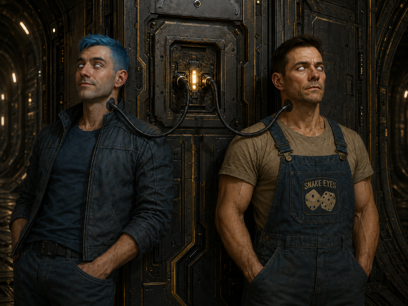
/// caption
[Ink](ink.md) and [Murderbot](murderbot-v2.md) connected to Monarch
///

- [Murderbot v2](murderbot-v2.md) feels time stretch and sees a female android across from him
    - see a clone of [Ink](ink.md) and [Kilroy](rachael-kilroy.md), and one of the heralds approach
    - is now [Murderbot v3](murderbot-v3.md)
- [Dex](dex-miro.md) notices Blink doesn't have the harmonica necklace, so he thinks he can tell the difference

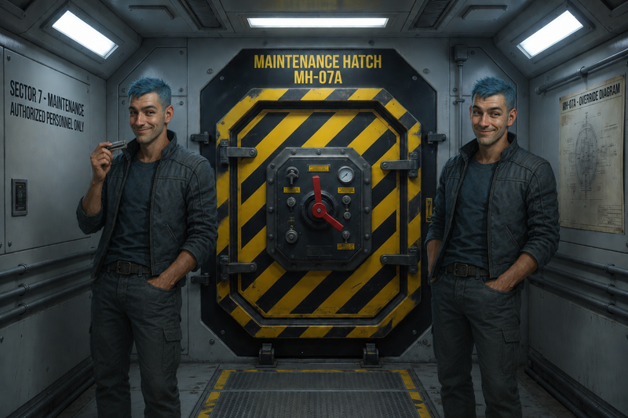
/// caption
[Ink](ink.md) (with harmonica), and his clone Blink
///

- [Kilroy](rachael-kilroy.md) says "Mission accomplished, it's time to get off the station"
- [Ink](ink.md) asks about some of the artifacts we weren't able to get
    - Monarch mentions an omni slick

- As everyone turns to leave, [Dex](dex-miro.md) connects the Hell Cube to the port [Ink](ink.md) and [Murderbot](murderbot-v2.md) connected to
- station appears to enter an emergency power mode
    - may have issues with life support soon...

## Artifacts

- when we exit the AI core
    - the other herald was shut down
- there are some artifacts waiting
    - set of armor which looks like an iron maiden
        - series of needles inside
        - [Zeke](zeke-sinclair.md) and [Carnoc](carnoc-ashbrow.md) identify it as symbiotic power armor
        - integrated pulse rifle and flamethrower
    - bundle of metallic needles - [Dex](dex-miro.md) takes
    - logic core - [Ink](ink.md) takes
    - long rifle
        - made of a single piece of metal
        - [Carnoc](carnoc-ashbrow.md) takes
    - canister with microfilm inside
        - [Murderbot](murderbot-v2.md) scans it
        - fragment of a generated epic poem by the Chosen

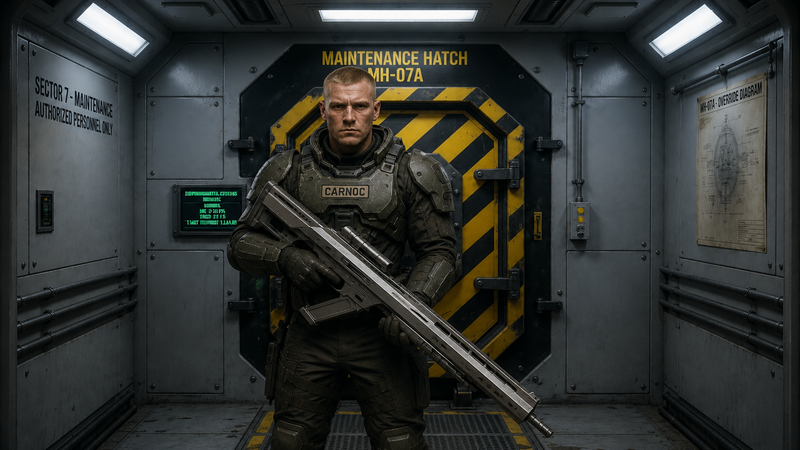
/// caption
[Carnoc](carnoc-ashbrow.md) takes the long rifle, made of a single piece of metal
///

- [Zeke](zeke-sinclair.md) puts the armor on
    - needles insert themselves
    - while changing, notices reduced but existing life support

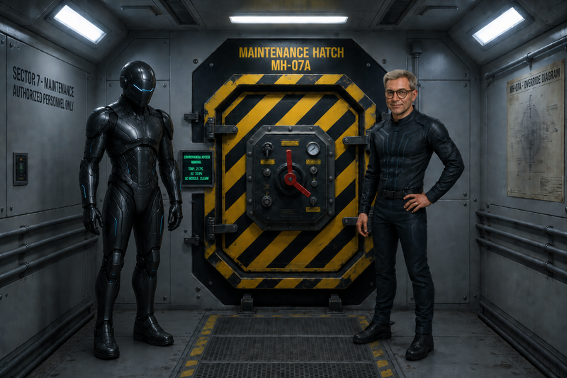
/// caption
[Zeke](zeke-sinclair.md) puts on the symbiotic power armor
///

- [Murderbot](murderbot-v2.md) punches [Zeke](zeke-sinclair.md)'s power armor to check it
    - doesn't damage the suit at all
    - [Murderbot](murderbot-v2.md) shakes [Zeke](zeke-sinclair.md) and he's not impressed

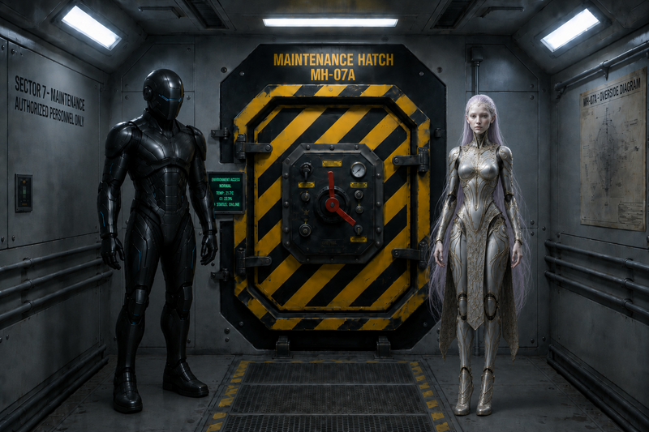
/// caption
[Murderbot](murderbot-v2.md) and [Zeke](zeke-sinclair.md) test the armor
///

## Systems Down

- crew makes our way back towards [Kilroy](rachael-kilroy.md)'s shuttle
    - seems like all of the automated systems are idle
    - Silas doesn't respond
- Monkey, Bear androids are all shut down
- Mind Thief is also shut down

## Fleet Rendezvous

- meet up with [Noriko](noriko.md) again
    - she's surprised to see us again
    - happy to see Hank even though his Minotaur impression is not great
- [Kilroy](rachael-kilroy.md) transmits a message to her ship
    - mission successful, database obtained
    - will need to scan and process all of us
    - Blink will hide
- [Kilroy](rachael-kilroy.md) takes us to our ship
- [Noriko](noriko.md) waves to the bell on the way past

- 12 hours later we arrive at [Kilroy](rachael-kilroy.md)'s ship
- we both dock and she escorts us to be scanned
- only [Murderbot](murderbot-v2.md) is identified as AI by the scanner
    - claims it's an upgraded version of the original [Murderbot](murderbot-v2.md)
- [Murderbot](murderbot-v2.md) compares crew list to database and finds there are no synths
- the crew noticed the station stopped transmitting
- [Ink](ink.md) connects one of the black boxes while nobody is looking

## Return to Prospero's Dream

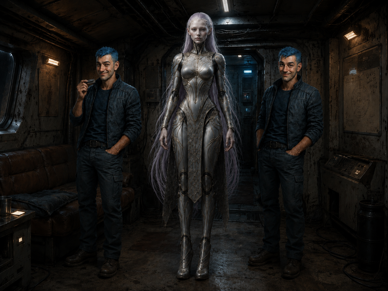
/// caption
**Blink**, [Murderbot v3](murderbot-v3.md), and [Ink](ink.md) on the ship
///

- we still have the battery from 34e
    - [Ink](ink.md) connects it to the ship for additional power

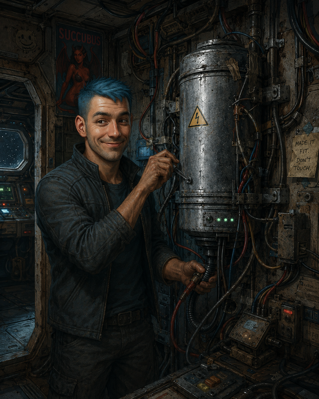
/// caption
[Ink](ink.md) connects the battery artifact for additional power
///

- prepare to travel back to [Prospero's Dream](/places/prosperos-dream/index.md)
- there are only 4 cryo pods
    - Hank and Blink will be turned off
    - [Murderbot](murderbot-v2.md) will do his own rotation
    - [Noriko](noriko.md), [Ink](ink.md), [Dex](dex-miro.md), [Zeke](zeke-sinclair.md), [Carnoc](carnoc-ashbrow.md) need cryp pods
    - we rotate 1 out while the other 4 sleep
    - one month rotations
    - trip will take almost 2 years
    - order: [Ink](ink.md), [Carnoc](carnoc-ashbrow.md), [Zeke](zeke-sinclair.md), [Dex](dex-miro.md), [Noriko](noriko.md)
- third month, [Carnoc](carnoc-ashbrow.md) is moving around and realizes he can't remember his childhood
    - doesn't wear off

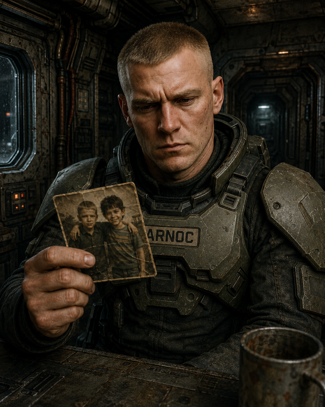
/// caption
[Carnoc](carnoc-ashbrow.md) can't remember his childhood friend
///

- talks about it with murderbot, who is not helpful
    - [Murderbot](murderbot-v2.md) convinces [Carnoc](carnoc-ashbrow.md) to wait and see if he gets better
    - [Carnoc](carnoc-ashbrow.md) checks the security footage and didn't see anyone mess with the cryo pods
- [Carnoc](carnoc-ashbrow.md) wakes up [Zeke](zeke-sinclair.md)
    - [Zeke](zeke-sinclair.md) can't remember his childhood either
    - [Zeke](zeke-sinclair.md) and [Murderbot](murderbot-v2.md) reprogram the brain scanner
    - [Zeke](zeke-sinclair.md) and [Carnoc](carnoc-ashbrow.md) are suffering from a degenerative brain issue induced by radiation
    - wake the rest of the crew
- [Ink](ink.md) jury rigs something to detect radiation
    - it's coming from the battery we installed
    - it powered the ship without depleting its internal energy

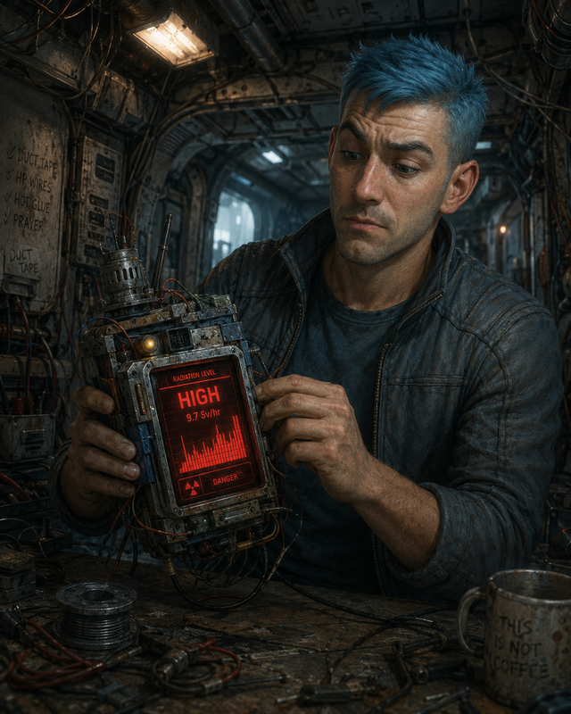
/// caption
[Ink](ink.md) jury rigs a radiation sensor
///

- we unplug the battery
    - it doesn't seem to be emitting radiation anymore
    - we move it to a better shielded location
- continue our rotation
- 1.5 years later, everyone comes out of cryo sleep

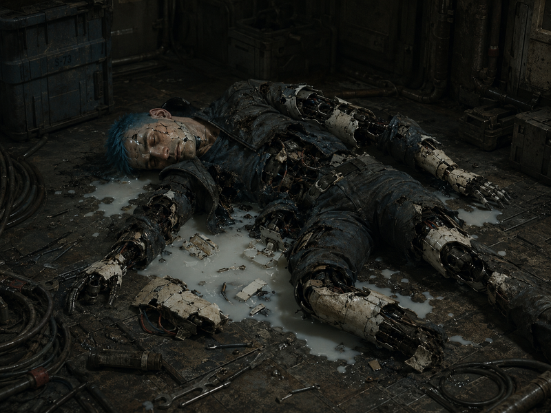
/// caption
Blink has been destroyed
///

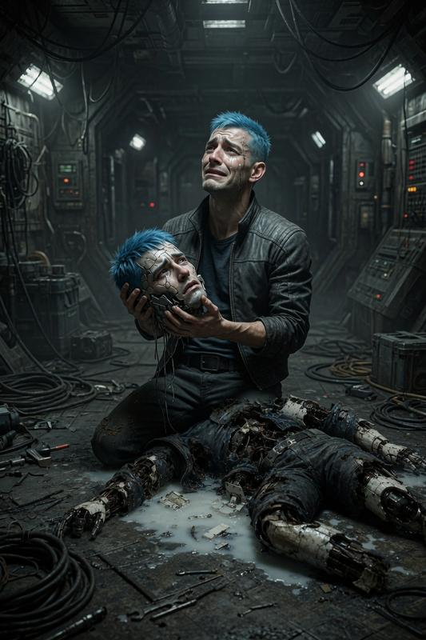
/// caption
[Ink](ink.md) mourns Blink
///
