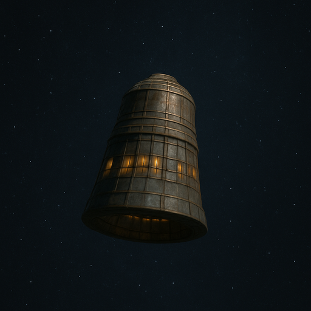
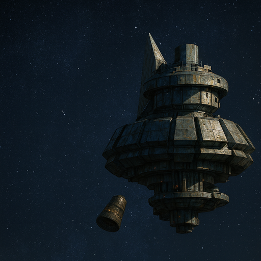

# The Bell

[The Deep](./the-deep.md)'s thruster, intentionally separated to immobilize it.
Also known as **Asheron**.

/// caption
**The Bell**, alone in space.
///

/// caption
**The Bell**, next to [The Deep](./the-deep.md).
///

