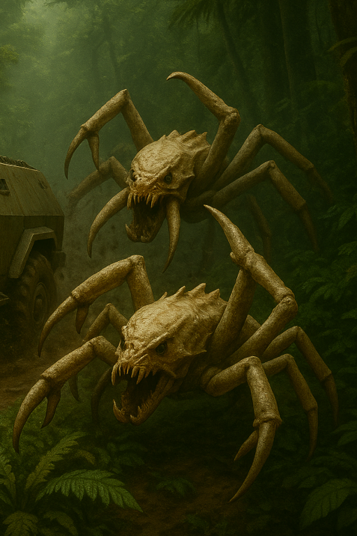

# Carcinids (Carcs)

A crab-like alien species discovered on [Samsa 6](../places/samsa-6/index.md).
Informally known as the **Carcs**.
Adults have a hard carapace that can deflect projectile impacts.

/// caption
Young Carcinid erupting from human host
///

/// caption
Adult Carcinids in jungle on [Samsa 6](../places/samsa-6/index.md)
///

